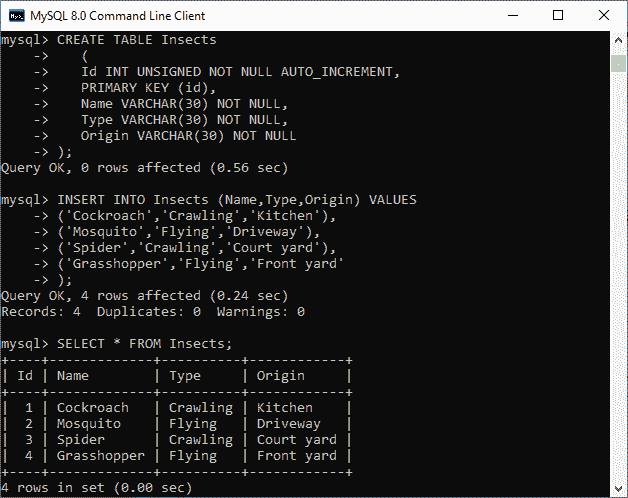
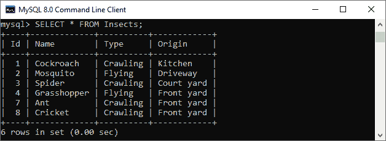
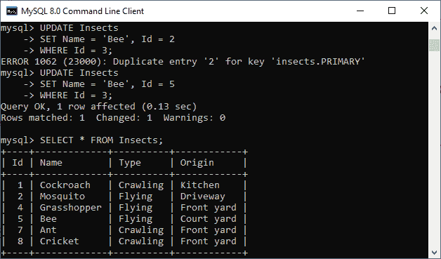

# MySQL SERVER

> 原文：<https://www.javatpoint.com/mysql-sequence>

MySQL 中的序列是根据特定需求以升序 (1、2、3 等)生成的整数的**排列。数据库中使用序列来生成唯一的数字。许多应用程序要求表中的每一行都包含不同的值，例如 student_table 中的学生人数、HR 中的员工人数、CRM 中的客户 ID 等。为了实现这种类型的排列，我们使用提供简单方法来生成它们的序列。**

MySQL 不提供任何内置函数来为表的行或列创建序列。但是我们可以通过 [SQL](https://www.javatpoint.com/sql-tutorial) 查询生成。在本文中，我们将描述如何使用 SQL 查询在 MySQL 中创建一个序列。

### 使用自动增量创建序列

在 [MySQL](https://www.javatpoint.com/mysql-tutorial) 中创建序列最简单的方法是在创建表时将列定义为 **AUTO_INCREMENT** ，应该是**主键**列。

当我们对列使用 AUTO_INCREMENT 属性时，应该考虑以下规则:

*   我们在每个表中只能创建一个 AUTO_INCREMENT 列，这个列的数据类型是整数。
*   自动增量列也应该有主键或唯一键索引。
*   AUTO_INCREMENT 列必须包含 **NOT NULL** 但是，当我们将该列设置为 AUTO_INCREMENT 属性时，MySQL 会自动将 NOT NULL 约束隐式添加到该列中。

**示例:**

让我们借助下面的例子来理解它。首先，我们需要创建一个新表，并确保有一列带有 AUTO_INCREMENT 属性，并且该列也是主键。

执行以下查询创建一个表:

```sql

mysql> CREATE TABLE Insects (
   Id INT UNSIGNED NOT NULL AUTO_INCREMENT,
   PRIMARY KEY (id),
   Name VARCHAR(30) NOT NULL, 
   Type VARCHAR(30) NOT NULL,
   Origin VARCHAR(30) NOT NULL 
);

```

接下来，我们将在这个表中插入几行，其中不需要为每一行提供 id，因为它是由 MySQL 自动递增的。

```sql

mysql> INSERT INTO Insects (Name, Type, Origin) VALUES
	('Cockroach', 'Crawling', 'Kitchen'),
	('Mosquito', 'Flying', 'Driveway'),
	('Spider' ,'Crawling', 'Court yard'),
	('Grasshopper', 'Flying', 'Front yard');

```

现在执行 **SELECT 语句**验证记录:

```sql

mysql> SELECT * FROM Insects;

```

我们可以在下图中看到结果。



在上图中，我们定义了带有主键和自动增量选项的标识列，该选项会自动增加该列，并始终在其中存储唯一的值。

当我们执行 [**INSERT 查询**](https://www.javatpoint.com/mysql-insert) 时，我们不为 Id 列提供值，但是 MySQL 会自动为它生成一个序列。

### MySQL 序列是如何工作的？

MySQL 中的 AUTO_INCREMENT 列包含以下属性:

*   自动增量列的起始值为 1。当我们在 INSERT 语句中省略该列的值或插入一个**空值**时，该列总是递增 1
*   我们可以使用 **LAST_INSERT_ID()** 函数获取最后生成的序列号。但是，我们也可以将最后一个插入标识用于后续语句，这些语句在会话之间应该是唯一的。
*   如果我们在为序列列指定一个值的同时向表中插入一个新行，那么 MySQL 首先会检查指定的值是否已经存在。如果不存在，则在列中插入序号；否则，发出错误。同样，如果我们插入一个大于下一个序列号的值，MySQL 将使用它作为起始序列号。现在，MySQL 将根据当前序列号生成下一个排序值。需要注意的是，它会在我们的序列中产生间隙。
*   如果我们使用 **UPDATE** 语句更新 AUTO_INCREMENT 列已经存在的值，如果该列只存储不同的值，MySQL 将发出一个重复键错误。如果我们用大于现有值的值更新 AUTO_INCREMENT 列，MySQL 会为下一行插入最后一个序列号的下一个值。例如，AUTO_INCREMENT 列的最后一个序列值是 3，我们想用 10 来更新它，那么下一行的序列号应该是 4。
*   如果我们想使用 **DELETE** 语句删除最后插入的行，MySQL 就没有必要再次重用删除的序列号，因为它依赖于表的存储引擎。例如，如果我们使用 **MyISAM** 表并删除最后一个插入标识 5，MySQL 仍然为新行插入下一个序列号 6。

让我们看一些更多的例子来更好地理解 MySQL 序列的使用。

在表格中插入两条新记录。

```sql

mysql> INSERT INTO Insects (Id, Name, Type, Origin) VALUES
(6, 'Bee', 'Flying', 'Court yard'),
(7, 'Ant', 'Crawling', 'Front yard');

```

并执行 SELECT 语句来验证输出:


接下来，我们将使用以下查询来删除 id 为 6 的昆虫:

```sql

mysql> DELETE FROM Insects WHERE Id = 6;

```

同样，我们将使用下面的语句在表中插入一个新行:

```sql

mysql> INSERT INTO Insects (Name, Type, Origin) VALUES
('Cricket', 'Crawling', 'Front yard');

```

我们将再次执行 SELECT 语句来查看输出:



在上图中，我们可以看到 MySQL 没有重用删除的序列号。因为昆虫表的存储引擎是 **InnoDB** 。因此，插入查询将在昆虫表中添加新的序列，如 8。

现在，我们将把一只 **Id 为 3 的现有昆虫更新为 Id = 2:**

```sql

mysql> UPDATE Insects SET Name = 'Bee', Id = 2 WHERE Id = 3;

```

MySQL 发出错误:**关键“昆虫”重复条目“2”。主'栏**。让我们解决它

```sql

mysql> UPDATE Insects SET Name = 'Bee', Id = 5 WHERE Id = 3;

```

见下图。



* * *