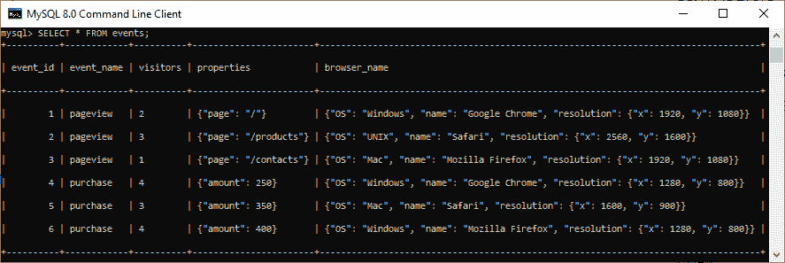

# MySQL JSON

> 原文：<https://www.javatpoint.com/mysql-json>

JSON 缩写为 **JavaScript 对象符号**。这是一种类似于其他数据类型的**轻量级数据交换格式**，人类可以轻松读写。它也可以很容易地被机器解析和生成。

一般来说， [JSON](https://www.javatpoint.com/json-tutorial) 数据类型支持两种结构:

*   名称/值对链的集合，充当数据数组。
*   有序的值列表。

因为它管理作为数据数组的**名称-值对链**中的单个值，所以我们可以使用一个命令检索整个字段。这个有用的特性允许我们快速检索大型系统中的数据。

[MySQL](https://www.javatpoint.com/mysql-tutorial) 支持来自**5 . 7 . 8 版**的原生 JSON 数据类型，该版本以内部格式存储 JSON 文档，可以快速高效地读取文档对象。这种数据类型可以比我们过去使用的 [JSON](https://www.javatpoint.com/what-is-json) 文本格式 [MySQL 版本](https://www.javatpoint.com/mysql-versions)更准确地存储 JSON 文档。

以下是 JSON 数据类型相对于存储 JSON 格式字符串的优势:

*   JSON 列允许我们存储 JSON 文档的自动验证。否则，我们会得到一个错误。
*   优化/快速存储格式意味着当服务器读取以二进制格式存储的 JSON 值时，它不需要从文本表示中解析。二进制格式允许直接使用键或数组索引在 JSON 文档中搜索值，而无需读取整数值。

JSON 文档所需的存储空间与 **LONGBLOB** 和**龙腾**的存储要求大致相同。

我们可以使用以下索引在 MySQL 表中定义 JSON 数据类型列:

```sql

CREATE TABLE table_name (
    ...
    json_column_name JSON,
    ... 
);

```

#### 注意:需要注意的是，我们不能在 JSON 列中存储非空的默认值。此外，JSON 列不能被直接索引，因为它通过从 JSON 列中提取标量值来创建索引。如果我们想从 JSON 列中检索数据，MySQL 优化器会搜索与 JSON 表达式匹配的兼容索引。

### 我们为什么使用 JSON？

我们将在 MySQL 中使用 JSON 数据类型，因为它的**用例**，在这里我们可以使用一种弥补的方法。让我们借助一个例子来理解它。

假设我们正在创建一个 web 应用程序，并希望在表中保存用户的配置或首选项。通常，我们会创建一个包含 user_id、key 和值字段的单独的表，或者将其保存为格式化的字符串，以便在运行时进行解析。这种方法对有限的用户是很好的。如果用户列表会比较大，配置/首选项键比较多，这种方法不好。

为了克服这些问题，MySQL 允许我们使用 JSON 数据类型字段来存储用户的配置或首选项，这节省了表的空间，并单独存储记录，这将与访问网站的访问者数量相同。

### MySQL JSON 数据类型示例

假设我们想跟踪访问我们网站的用户及其行为，例如一些用户只看到页面，而其他用户会访问页面并购买产品。让我们创建一个名为“**事件**”的新表，该表将使用以下语句存储这些信息:

```sql

CREATE TABLE events( 
  event_id INT AUTO_INCREMENT PRIMARY KEY, 
  event_name varchar(75), 
  visitors varchar(25), 
  properties json, 
  browser_name json
);

```

事件 id 用于唯一标识事件表中的每个事件。事件名称存储事件的名称，如页面浏览、购买等。访问者列存储访问网站的用户信息，**属性**和**浏览器 _ 名称列**用于保存 JSON 值。Browser_name 列存储浏览器的规格，如浏览器名称、操作系统、分辨率等。访问者用来浏览网站。

接下来，我们将使用下面给出的 [INSERT 语句](https://www.javatpoint.com/mysql-insert)将数据插入到该表中:

```sql

INSERT INTO events (event_name, visitors, properties, browser_name) 
VALUES (
  'page-view', 
   '2',
   '{"page": "/"}',
   '{ "name": "Google Chrome", "OS": "Windows", "resolution": {"x": 1920, "y": 1080} }'
),
('page-view', 
  '3',
  '{"page": "/products"}',
  '{ "name": "Safari", "OS": "UNIX", "resolution": {"x": 2560, "y": 1600} }'
),
(
  'page-view', 
  '1',
  '{"page": "/contacts"}',
  '{ "name": "Mozilla Firefox", "OS": "Mac", "resolution": {"x": 1920, "y": 1080} }'
),
(
  'purchase', 
   '4',
  '{"amount": 250}',
  '{ "name": "Google Chrome", "OS": "Windows", "resolution": {"x": 1280, "y": 800} }'
),
(
  'purchase', 
   '3',
  '{"amount": 350}',
  '{ "name": "Safari", "OS": "Mac", "resolution": {"x": 1600, "y": 900} }'
),
(
  'purchase', 
  '4',
  '{"amount": 400}',
  '{ "name": "Mozilla Firefox", "OS": "Windows", "resolution": {"x": 1280, "y": 800} }'
);

```

现在，我们可以验证该表，执行如下的 [SELECT 语句](https://www.javatpoint.com/mysql-select):

```sql

mysql> SELECT * FROM events;

```

我们将看到如下输出:



假设我们想要从 JSON 列中检索任何特定的值，例如浏览器名称。我们可以通过使用列**路径运算符(- >)来过滤这些类型的结果。**见下图查询:

```sql

mysql> SELECT event_id, browser_name->'$.name' AS browser FROM events;

```

它将返回以下输出:


在此图像中，您会注意到浏览器列的数据周围有双引号。如果要获取浏览器列的数据而不加任何引号，我们需要使用**内联路径运算符(- > > )** 如下:

```sql

mysql> SELECT event_id, browser_name->>'$.name' AS browser FROM events;

```

在下面的输出中，我们可以看到引号已被成功移除。


如果我们想**检索浏览器使用情况**，我们可以使用如下语句:

```sql

mysql> SELECT browser_name->>'$.name' AS browser, count(browser_name)
    FROM events GROUP BY browser_name->>'$.name';

```

我们将得到以下结果:


如果要**计算访客总收入**，可以使用如下查询:

```sql

mysql> SELECT visitors, SUM(properties->>'$.amount') As total_revenue
FROM events WHERE properties->>'$.amount' > 0 GROUP BY visitors;

```

我们将得到如下结果:


* * *