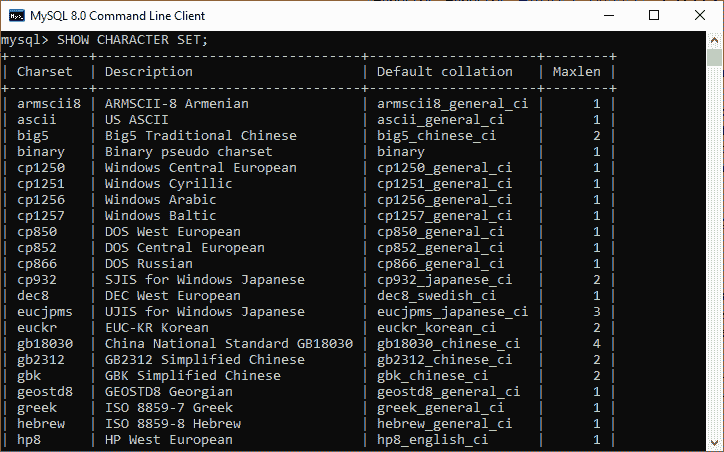

# MySQL 排序规则

> 原文：<https://www.javatpoint.com/mysql-collation>

MySQL 中的排序规则是一组用于比较特定字符集内字符的规则。它是任何特定集合的顺序。MySQL 支持各种字符集，每个字符集总是使用一个或多个排序规则，至少一个默认排序规则。MySQL 不允许我们让任何两个字符集使用相同的排序规则。

我们可以使用下面的语句来查看 MySQL 数据库服务器中可用的所有默认字符集排序规则:

```

SHOW CHARACTER SET;

```

它将返回以下输出:



在此图像中，**默认排序规则**列值指定每个字符集的默认排序规则名称。

需要注意的是，任何字符集的排序规则总是以字符集名称开头，以 ***_cs(区分大小写)、_ci(不区分大小写)或 _bin(二进制)*** 结尾。

默认情况下，上述语句(SHOW CHARACTER SET)会在 [MySQL](https://www.javatpoint.com/mysql-tutorial) 中生成所有可用的排序规则。如果我们想要获取任何特定字符集的所有排序规则名称，请使用可选的 **LIKE 或 [WHERE 子句](https://www.javatpoint.com/mysql-where)** 以及返回匹配字符集名称的 SHOW 排序规则语句。

以下是用于查找特定字符集的排序规则名称的语法:

```

SHOW COLLATION LIKE 'character_set_name%';

```

以下语句显示 MySQL 中 latin1 字符集的所有排序规则名称:

```

SHOW COLLATION LIKE 'latin1%';

```

我们可以看到如下输出，其中每个字符集都有默认的排序规则，例如**latin1 _ 丹麦语 _ci** 是 **latin1** 字符集的默认排序规则:


排序规则还为我们提供了字符串排序。它根据权重对字符进行排序。字符串中的每个可用字符都映射到一个权重。如果字符比较的权重相同，则称为相等。同样，如果字符的权重不同，它会根据其权重的相对大小进行比较。

MySQL 提供了 **WEIGHT_STRING()** 函数来查找字符串字符的权重。此函数返回以二进制字符串形式表示权重的值。因此，我们需要使用 **HEX(WEIGHT_STRING(str))** 函数以可打印的形式显示权重。

让我们借助一个例子来理解它。以下语句采用不区分大小写的非二进制字符串**‘AaBbCc’**，并返回给定字母之间没有差异的权重:

```

SELECT HEX(WEIGHT_STRING('AaBbCc' COLLATE latin1_swedish_ci)) AS Weight;

```

参见以下输出，其中权重 A=41=a，B=42=b，C=43=c 相等:


如果我们取一个二进制字符串**‘AaBbCc’**，那么对于给定的字母，它的权重可以不同:

```

SELECT HEX(WEIGHT_STRING(BINARY 'AaBbCc')) AS Weight;

```

它将给出如下输出，其中权重 A=41、a=61、B=42、b=62、C=43 和 c=63 不同:


### 设置字符集和排序规则

MySQL 允许我们以四种方式配置字符集和排序规则，如下所示:

1.  服务器级别的设置
2.  数据库级别的设置
3.  在表级别设置
4.  列级设置

**在服务器级设置字符集和排序规则**

我们知道 MySQL 使用 latin1 作为默认字符集，默认排序规则为 latin1 _ 瑞典语 _ci。MySQL 还允许我们在服务器启动时更改这些默认设置。

如果我们在服务器启动时只设置一个字符集，MySQL 将使用指定字符集的默认排序规则。如果我们显式设置字符集和排序规则，MySQL 将对数据库服务器中创建的所有数据库使用这些设置。参见下面的语句，该语句通过命令行工具将 **utf8** 指定为字符集，将 **utf8_unicode_cs** 指定为服务器的排序规则:

```

mysqld --character-set-server = utf8 --collation-server = utf8_unicode_ci

```

**在数据库级设置字符集和排序规则**

在 MySQL 中创建数据库时，不需要设置字符集和排序规则。这是因为 MySQL 将使用服务器的默认字符集和排序规则来创建数据库。

使用 [CREATE DATABASE](https://www.javatpoint.com/mysql-create-database) 或 ALTER DATABASE 语句创建数据库时，我们可以在数据库级别修改默认设置。

下面是使用 CREATE DATABASE 语句创建数据库的语法:

```

CREATE DATABASE database_name
CHARACTER SET character_set_name;
COLLATE collation_name

```

下面是使用 ALTER DATABASE 语句创建数据库的语法:

```

ALTER DATABASE database_name
CHARACTER SET character_set_name
COLLATE collation_name;

```

当我们在数据库级别指定字符集和排序规则时，MySQL 将它用于在数据库中创建的所有表。

**例**

此示例说明如何在数据库级别设置字符集和排序规则。

```

CREATE DATABASE demo_db
CHARACTER SET utf8
COLLATE utf8_unicode_ci;

```

在上面的语句中，我们明确指定了数据库的字符集和排序规则。因此，它不使用服务器级别的默认设置。

**在表级设置字符集和排序**

数据库将包含带有字符集和排序规则的表。这些字符集和排序规则不同于默认设置。当使用 [CREATE TABLE](https://www.javatpoint.com/mysql-create-table) 语句创建表或使用 [ALTER TABLE](https://www.javatpoint.com/mysql-alter-table) 语句更改表的结构时，我们可以为特定的表指定默认字符集和排序规则。

下面是使用 ALTER TABLE 语句创建数据库的语法。

```

CREATE TABLE table_name(
   ...
)
CHARACTER SET character_set_name
COLLATE collation_name

```

以下是使用 ALTER TABLE 语句创建数据库的语法:

```

ALTER TABLE table_name(
  ...
)
CHARACTER SET character_set_name
COLLATE collation_name

```

### 例子

此示例说明如何在表级别设置字符集和排序规则。

```

USE demodb; 
CREATE TABLE demotable1(
Column1 char(25)
);

```

在上面的示例中，我们没有在表级别指定字符集和排序规则。因此，它使用数据库字符集和排序规则。这里，table deployment able 1 使用 utf8 作为字符集，utf8_unicode_ci 作为排序规则。

如果我们想要将上表的字符集更改为 latin1，并将排序规则更改为 latin1_german1_ci，请使用下面的语句:

```

ALTER TABLE demptable1
CHARACTER SET latin1
COLLATE latin1_german1_ci;

```

**在列级设置字符集和排序规则**

一个列可以有不同的类型，例如***【CHAR】【VARCHAR】或***【TEXT】。它可以有自己的字符集和排序规则，这不同于表的默认设置。

我们可以使用 CREATE TABLE 或 ALTER TABLE 语句更改列定义中该列的字符集和排序规则设置，如下所示:

```

column_name [column_type] (length)
CHARACTER SET character_set_name
COLLATE collation_name

```

### 例子

此示例说明如何在列级别设置字符集和排序规则。

```

ALTER TABLE demotable1
MODIFY column1 VARCHAR(25)
CHARACTER SET utf8mb4
COLLATION utf8mb4_0900_ai_ci;

```

在上面的示例中，我们在表创建中确定的列级别更改了字符集和排序规则。因此使用 **utf8mb4** 作为字符集， **utf8mb4_0900_ai_ci** 作为校勘。

### 设置字符集和校对的要点

以下是设置字符集和排序规则的要点或规则:

*   如果我们显式地设置字符集和排序规则，我们可以在 MySQL 中同时使用它们。
*   如果我们设置了唯一的字符集而没有指定排序规则，MySQL 将使用该字符集的默认排序规则。
*   如果我们只设置一个排序规则，而不指定字符集，MySQL 将使用与排序规则相关联的字符集。
*   如果我们不同时指定字符集和排序规则，MySQL 将使用默认的字符集和排序规则。

* * *