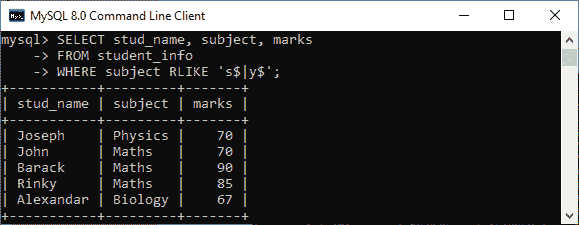
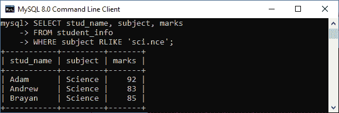
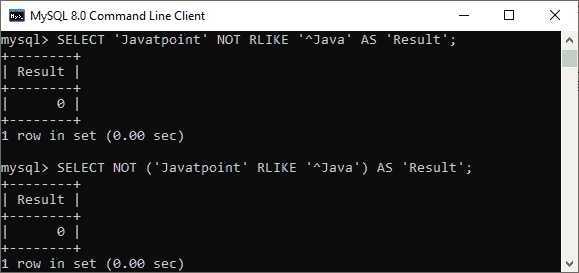
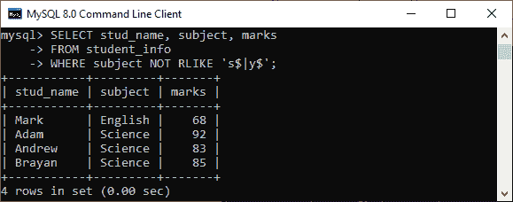
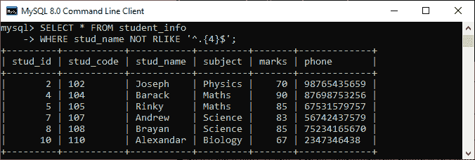

# MySQL RLIKE 运算符

> 原文：<https://www.javatpoint.com/mysql-rlike-operator>

MySQL 中的 RLIKE 运算符用于模式匹配。用于**判断给定字符串是否匹配正则表达式**。如果字符串与正则表达式匹配，则返回 1；如果未找到匹配，则返回 0。该运算符返回与 [**REGEXP_LIKE()** 函数](https://www.javatpoint.com/mysql-regexp-like-function)类似的结果。因此，RLIKE 运算符是 REGEXP _ LIKE()函数的同义词。

### 句法

以下是在 MySQL 中使用该运算符的基本语法:

```sql

expression RLIKE pattern

```

在这个语法中，**表达式**是一个输入字符串，我们将对其执行搜索以匹配正则表达式。而**模式**代表我们正在测试字符串的[正则表达式](mysql-regular-expressions)。

**该语法通常与 [SELECT 语句](https://www.javatpoint.com/mysql-select)一起使用，如下所示:**

```sql

SELECT column_list FROM table_name WHERE column_name RLIKE 'pattern';  

```

让我们通过例子来了解这个操作符在 [MySQL](https://www.javatpoint.com/mysql-tutorial) 中是如何工作的。

### 例子

下面的语句是 RLIKE 运算符最基本的例子。在这里，我们刚刚使用了一个字符串，并比较输入字符串的任何部分是否与模式匹配，以获得结果。

```sql

mysql> SELECT 'Javatpoint' RLIKE '^Java' AS 'Result';

```

结果如下:


假设我们有一个名为 **student_info** 的表，其中包含以下数据。我们将基于此表数据演示各种示例。


如果我们想得到**学生的姓名、科目以及科目以“s”或“y”字母**结尾的标记，我们可以通过使用如下语句得到这些详细信息:

```sql

mysql> SELECT stud_name, subject, marks
FROM student_info 
WHERE subject RLIKE 's$|y$';

```

执行该语句，我们将获得期望的结果。请参见以下输出:



下面的语句是我们使用正则表达式字符**点(。)**指定不能有字符、一个字符或多个字符来代替:

```sql

mysql> SELECT stud_name, subject, marks
FROM student_info 
WHERE subject RLIKE 'sci.nce';

```

执行该语句，我们将获得期望的结果。请参见以下输出:



## MySQL 不是 RLIKE 运算符

是用于模式匹配的 RLIKE 算子的**否定。该运算符**确定输入字符串**中是否不存在模式。如果字符串与正则表达式不匹配，则返回 0；如果找到匹配，则返回 1。我们可以如下使用该运算符:**

```sql

expression NOT RLIKE pattern

```

上面的运算符相当于下面的语法:

```sql

NOT (expression RLIKE pattern) 

```

在这个语法中，**表达式**是一个输入字符串，我们将对其执行搜索以匹配正则表达式。**模式**代表我们正在测试字符串的正则表达式。

该语法通常与 **SELECT** 语句一起使用，如下所示:

```sql

SELECT column_list FROM table_name WHERE column_name NOT RLIKE 'pattern';  

```

让我们通过例子来了解这个操作符在 MySQL 中是如何工作的。

### 例子

以下语句是 NOT RLIKE 运算符的最基本示例。这里我们刚刚使用了一个字符串，并比较输入字符串的任何部分是否与模式不匹配。

```sql

mysql> SELECT 'Javatpoint' NOT RLIKE '^Java' AS 'Result';

```

我们将得到以下结果。**这里模式匹配是因为输入字符串以 Java** 开头。因为我们使用了 NOT RLIKE 运算符，所以它返回负结果(0)。

上面的陈述相当于这样做:

```sql

mysql> SELECT NOT ('Javatpoint' RLIKE '^Java') AS 'Result';

```



这是另一个给出结果 1 的例子。它表示字符串与给定的模式不匹配。

```sql

mysql> SELECT 
  'Javatpoint' RLIKE '^C | e$' AS 'RLIKE',
  'Javatpoint' NOT RLIKE '^C | e$' AS 'NOT RLIKE';

```

以下是输出:


**让我们看看基于上表 student_info** 的其他一些例子。

下面的语句返回**学生的姓名、科目和不以“s”或“y”字母**结尾的标记:

```sql

mysql> SELECT stud_name, subject, marks
FROM student_info 
WHERE subject NOT RLIKE 's$|y$';

```

执行该语句，我们将获得期望的结果。请参见以下输出:



以下语句返回名称不包含四个字符的**学生详细信息:**

```sql

mysql> SELECT * FROM student_info 
WHERE stud_name NOT RLIKE '^.{4}$';

```

在这里，我们使用了 **'^'和“$ meta-characters”**，它们与学生姓名的**开头**和**结尾**相匹配，并且重复{4}次任意字符。介于两者之间。请参见以下输出:



* * *