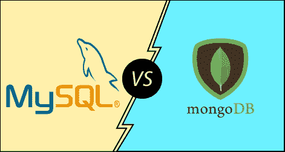

# MySQL 和 MongoDB 的区别

> 原文：<https://www.javatpoint.com/mysql-vs-mongodb>

MySQL 和 MongoDB 是用于企业应用程序的两种最流行的数据库。尽管这两个数据库都是免费和开源的，但它们也有很多不同之处。在本节中，我们将基于各种参数来比较 MySQL 和 MongoDB 数据库系统之间的差异。

## 什么是 MySQL？

MySQL 是用于管理关系数据库的流行数据库管理系统。是开源数据库软件，[甲骨文](https://www.javatpoint.com/what-is-oracle)公司支持。与微软 [SQL](https://www.javatpoint.com/sql-tutorial) 服务器和甲骨文数据库相比，它是一个快速、可扩展、易于使用的数据库管理系统。它通常与 [PHP](https://www.javatpoint.com/php-tutorial) 脚本一起使用，用于创建强大且动态的服务器端或基于网络的企业应用程序。

由瑞典公司 **MySQL AB** 开发支持，用 [C](https://www.javatpoint.com/c-programming-language-tutorial) 和 C++编程语言编写。很多大小公司都用 MySQL。MySQL 支持很多操作系统，比如 Windows、Linux、MacOS 等。用 C、 [C++](https://www.javatpoint.com/cpp-tutorial) 和 Java 语言。

## 什么是 MongoDB？

MongoDB 是一个开源的、跨平台的、面向文档的 NoSQL 数据库，它提供了高性能、大容量的数据存储、丰富的查询语言和自动伸缩。用 C++编写，由名为 **10gen** 的公司开发维护。它简单，易于开发人员使用和学习。它以类似 **JSON 的**格式存储数据。MongoDB 旨在研究集合和文档的概念。

MongoDB 支持很多操作系统，比如 Windows、Linux、MacOS 等。用 C、C++、PHP、Node.js、 [Python](https://www.javatpoint.com/python-tutorial) 、 [Java](https://www.javatpoint.com/java-tutorial) 和 Ruby 语言。使用 MongoDB 数据库的主要目的是其快速开发特性、大数据支持、灵活部署和易于使用。

让我们看下面的对比图，了解一下 MySQL 和 [MongoDB](https://www.javatpoint.com/mongodb-tutorial) 的本质区别。

## MySQL vs MongoDB

| 比较基础 | 关系型数据库 | MongoDB |
| **定义** | 它是一个开源的、跨平台的关系数据库管理系统，由瑞典 MYSQL AB 公司构建，目前由 Oracle 提供支持。 | 这是一个流行的开源 NoSQL 数据库管理系统，由 MongoDB Inc .开发和拥有，以类似 JSON 的格式存储数据。 |
| **释放** | 它于 1995 年 5 月 23 日被释放。 | 它于 2009 年 2 月 11 日发布。 |
| **写成** | 它是用 C 和 C++编写的。 | 它是用 C、C++和 Java 编写的。 |
| **数据库结构** | MySQL 将每个单独的记录存储在表中，并且可以通过使用 SQL 查询来访问它。 | MongoDB 将每个单独的记录存储在类似 JSON 的文档中，这些文档的结构可能会有所不同。 |
| **SQL 或 NoSQL** | MySQL 使用结构化查询语言来处理和访问数据库。我们不能改变它的模式。输入只能通过已定义的模式输入。SQL 不允许处理非结构化和半结构化数据。 | MongoDB 是一个 NoSQL 数据库系统。这意味着我们可以定义和遵守输入数据的预定义结构。NoSQL 允许处理非结构化和半结构化数据，这在关系数据库管理系统中是不可能的。它的模式可以改变。 |
| **查询差异** | 要选择所有记录，使用:

*   Select * from the table _ name;

插入记录:

*   Insert the table name (stud_id, branch, state) value ('Joel01',' MTech',' Cape Town')

 | 选择所有记录，使用:

*   db。顾客。find()；

插入记录:

*   db。表名。插入({
    stud _ id:【Joel 01】，
    分支:【MTech】，
    状态:【开普敦】
    })

 |
| **需要的指标** | 如果找不到索引，数据库引擎将搜索整个表来查找行。 | 如果找不到索引，数据库引擎将搜索每个文档，包括集合，以选择完全匹配的文档。 |
| **功能** | MySQL 支持以下特性:

*   It's safe.
*   It is extensible.
*   It follows the client-server architecture.
*   It provides high performance.
*   It allows transaction rollback, commit and crash recovery.
*   It is flexible.
*   Support schema structure.
*   trigger
*   支持统一码

 | MongoDB 支持以下功能:

*   It supports ad hoc queries.
*   It provides duplicate data running on multiple servers.
*   Master-slave replication is supported.
*   With automatic load balancing.
*   It has no pattern.
*   It replaces the stored procedure with JavaScript.
*   Support JSON-like data model.
*   Support rich query languages.

 |
| **模式设计的灵活性** | 一旦定义了模式设计，就不能对其进行更改。 | 它的模式设计可以更改，这意味着它支持动态模式。 |
| **架构** | MySQL 并不基于分布式系统架构。但是，MySQL 集群具有分布式数据库架构。 | MongoDB 完全建立在分布式系统架构之上。 |
| **术语差异** | 它使用:

*   table
*   line
*   row
*   connect

 | 使用:

*   gather
*   document
*   field
*   Embedded documents, links

 |
| **谁用？** | 以下组织使用的 MySQL:

 | 以下组织使用的 MongoDB:

 |
| **缩放** | 它垂直伸缩 | 它水平缩放。 |
| **最新发布版本** | MySQL 8 . 0 . 21(2020 年 2 月) | MongoDB 4.2(2020 年 2 月) |

* * *