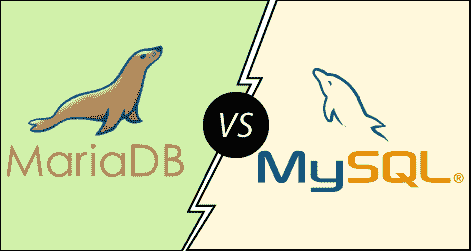

# MariaDB 和 MySQL 的区别

> 原文：<https://www.javatpoint.com/mariadb-vs-mysql>

MariaDB 和 MySQL 都是关系数据库管理系统(RDBMS)的类型，是免费的开源软件。2009 年，MySQL 的创始人 Michael Monty Widenius 决定开发 MySQL 的一个分叉，并将其命名为 MariaDB。MariaDB 为 MySQL 提供商业支持。

这两种 RDBMS 软件都是用来在数据库中以表格形式存储数据的，都有各自的好处，所以组织更好的选择取决于具体的需求和目标。让我们在以下基础上理解 MariaDB 和 MySQL 之间的本质区别:



让我们在以下基础上理解 MariaDB 和 MySQL 的区别:

### 1)初始释放和稳定释放

MariaDB 最初于 2009 年 10 月 29 日发布。它于 2020 年 5 月 12 日稳定发行。相比之下，MySQL 最初于 1995 年 5 月 23 日发布。它于 2020 年 4 月 27 日稳定发布。

### 2)开发人员

MariaDB 是由 MariaDB 公司 AB，MariaDB 基金会开发的。相比之下，MySQL 最初是由一家瑞典公司 MySQL AB 在 1994 年创立的。2008 年，太阳微系统公司收购了 MySQL AB。后来，在 2010 年，太阳微系统公司由 Oracle 公司领导。因此，Oracle 公司目前正在开发和维护 MySQL。

### 3)使用的编程语言

MariaDB 是用 C、 [C++](https://www.javatpoint.com/cpp-tutorial) 、 [Perl](https://www.javatpoint.com/perl-tutorial) 和 [Bash 编程语言](https://www.javatpoint.com/bash)编写的。相比之下，MySQL 是用 [C](https://www.javatpoint.com/c-programming-language-tutorial) 和 C++编程语言编写的。

### 4)用户

MariaDB 的突出客户有 DBS、红帽、谷歌、Ubuntu、维基百科、SuSE 等。而 MySQL 的突出用户则是 YouTube、Twitter、脸书、网飞、NASA、特斯拉等。

### 5)兼容性

MySQL 是一个开源的 [RDBMS](https://www.javatpoint.com/what-is-rdbms) ，它以表、触发器、视图或存储过程的形式存储数据。它使用不同的键，如唯一键、主键、外键等。以保持数据完整性和冗余性。另一方面，MariaDB 是 MySQL 的扩展版本(fork)，具有新的广泛特性，如带参数的游标、INVISIBLE 列、new 语句等。这些额外的特性使它非常出色，帮助我们用 MariaDB 替换 MySQL。它具有与 MySQL 相似的数据库结构和索引。因此，将我们的应用程序从 MySQL 导入/导出到 MariaDB 是兼容的，无需任何更改和修改。

### 6)版本

在 MySQL 中，5.1 和 5.5 之间存在版本差距。MySQL 的最新版本是 5.8。而 MariaDB 有 5.2、5.3 等连续版本。MariaDB 版本搭载了 [MySQL 版本](https://www.javatpoint.com/mysql-versions) 5.5 的所有功能。MariaDB 的最新版本是 v10.4。

### 7)存储引擎

在 MySQL、BLACKHOLE、MyISAM、MERGE、InnoDB、CSV 等。数据存储包括存储引擎。另一方面，MariaDB 包括 12 个新的附加存储引擎，具有 MariaDB 源和二进制包。

### 8)加密

MariaDB 提供对临时表加密以及二进制日志加密的支持。另一方面，MySQL 不支持临时表的加密和二进制日志加密。但是，当配置撤销/重做日志时，它会对它们进行加密。

### 9)密码验证

MySQL 包含一个默认功能，即通过验证和测试密码来提高安全性。而 MariaDB 不提供这样的功能。

### 10)性能

由于 MariaDB 由更多的存储引擎组成，它提供了不同操作的快速执行，例如对数据的插入、更新和删除。MariaDB 的性能比 MySQL 快 4 倍。相比之下，MySQL 的执行速度不如 MariaDB 快。

### 11)复制

不同版本的 MariaDB 允许我们将数据从 MySQL Server 复制到 MariaDB 服务器。相比之下，MySQL 版本不允许数据从 MariaDB 服务器复制到它。MySQL 提供主从复制，而 MariaDB 提供数据的主从和主从复制。

### 12)云平台

MySQL 在谷歌云平台上作为托管服务提供，在[亚马逊网络服务(AWS)](https://www.javatpoint.com/aws-tutorial) 、Rackspace Cloud 和微软 Azure 上作为服务提供。另一方面，MariaDB 仅在 Rackspace Cloud、[微软 Azure](https://www.javatpoint.com/microsoft-azure) 和 AWS 上作为服务提供。

### 13)许可证

MariaDB 仅包含一个 GPLv2 许可证(用于社区服务器)。而 MySQL 提供了两个许可证:GPLv2(用于社区服务器)和 Enterprise 许可证。

### 14)语法

虽然[MariaDB](https://www.javatpoint.com/mariadb-tutorial)和 [MySQL](https://www.javatpoint.com/mysql-tutorial) 有很多不同，但是两者的句法结构是一样的。

让我们看看如何:

要从“学生”表中选择所有记录:

```sql

MariaDB: SELECT * FROM STUDENT;
MySQL: SELECT * FROM STUDENT;

```

要从学生表中删除记录:

```sql

MariaDB: DELETE FROM STUDENT <where condition>;
MySQL: DELETE FROM STUDENT <where condition>;

```

## MariaDB 诉 MySQL

让我们用表格的形式总结一下上面的差异。

| 因素 | 关系型数据库 | MariaDB DB |
| 定义 | 这是一个开源的、跨平台的关系数据库管理系统，由瑞典 MYSQL AB 公司构建。Oracle 公司目前正在开发和维护。 | 它是 MySQL 数据库管理系统的一个分支，具有针对小型和企业任务的数据处理能力。分叉意味着保证 MySQL 代码库永远免费。它是 MySQL 的改进和高级版本。 |
| 初始版本 | MySQL 的第一次发布是在 1995 年 5 月。 | MariaDB 的第一次发布是在 2009 年 10 月。 |
| 当前版本 | MySQL 的最新版本是 2020 年 4 月 27 日的 8.0.20。 | MariaDB 的最新版本是 2020 年 5 月 12 日的 10.4.13。 |
| 协议 | 关系型数据库 | MySQL 和 MariaDB |
| 源代码 | 开源和专有 | 开源的 |
| 分身术 | MySQL 版本不允许数据从 MariaDB 服务器复制到它。MySQL 提供主从复制。 | 不同版本的 MariaDB 允许我们将数据从 MySQL Server 复制到 MariaDB 服务器。MariaDB 提供数据的主从复制。 |
| 存储引擎 | 它有有限的存储引擎:
InnoDB
my isam
black hole
CSV
MEMORY
ARCHIVE
MERGE | 它有大量的存储引擎:
MyISAM
black hole
CSV
MEMORY
ARCHIVE
MERGE
column store
MyRocks
Aria
SphinxSE
TokuDB
CONNECT
SEQUENCE
Spider
Cassandra |
| 检查约束 | 它没有检查约束。 | 它支持检查约束。 |
| 速度 | 与 MariaDB 相比，它的速度较慢。 | 它提供了更快的速度，因为它是 MySQL 的高级版本。 |
| 连接池 | MySQL 线程池每次可以支持不到 20 万个连接。 | MariaDB 有一个高级线程池，可以提供更快的执行速度，每次可以支持 20 多万个连接。 |
| 发展 | 关闭的 | 打开 |
| 文档维护 | Oracle 公司维护该文档。 | MariaDB 基金会和其他开发者也可以参与开发和维护。 |
| 选择途径 | 它有 MySQL 路由器。 | 它有一个 MariaDB MaxScale。 |
| 数据屏蔽 | 它不允许数据屏蔽。 | 它允许数据屏蔽。 |
| 图像使用者界面 | 它提供了 MySQL 工作台。 | 它提供了 SQLyog。 |
| 公司使用 | GitHub、美国海军、NASA、特斯拉、网飞、微信、脸书、推特、YouTube 和 Spotify。 | 谷歌、Craigslist、维基百科、archlinux、红帽、CentOS 和 Fedora。 |

### MySQL 的特性

MySQL 数据库的基本特性如下:

*   MySQL 是一个关系数据库管理系统，使用方便。我们可以只使用几条简单的 SQL 语句来构建 MySQL 并与之交互。
*   它是安全的，因为密码在 MySQL 中是加密的。
*   它遵循客户机/服务器模式。
*   它是免费和开源的。
*   它易于扩展，并提供高性能、高灵活性和高生产率。
*   它具有强大的事务支持，允许事务回滚、提交和崩溃恢复。

### MariaDB 的特点

MariaDB 的基本特征如下:

*   它是免费的，开源的，并在 GPL，LGPL 或 BSD 下获得许可。
*   它提供了向后兼容性。
*   它基于 MySQL 社区版本。这是因为 MariaDB 是 MySQL 的改进版本。
*   它为许多存储引擎(包括高性能存储引擎)提供了与其他 RDBMS 数据源一起工作的能力。
*   它可以在各种操作系统上运行，并支持各种编程语言。
*   它支持 PHP，这是一种流行的网络开发语言。
*   它提供了 Galera 集群技术。

* * *