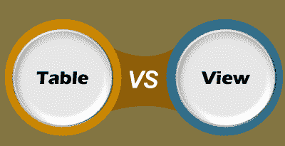

# 表和视图的区别

> 原文：<https://www.javatpoint.com/table-vs-view>

表和视图是关系数据库环境中使用的两个基本术语。表和视图之间的区别在初学者和数据库管理员(DBA)之间存在争议，因为两者有一些共同的相似之处。它们之间的主要区别在于**表是一个由行和列组成的对象，用于在用户需要时存储和检索数据**。相比之下，**视图是一个基于 SQL 语句结果集**的虚拟表，当当前会话关闭时，该视图将消失。在本文中，我们将讨论基于各个方面的表和视图之间的比较。



## 什么是桌子？

表格**由行和列组成，用于组织数据**以结构化格式存储和显示记录。它类似于电子表格应用程序中的工作表。它占据了我们系统的空间。我们需要三样东西来创建一个表:

*   表名
*   列/字段名称
*   每个字段的定义

我们可以使用以下语法在 [MySQL](https://www.javatpoint.com/mysql-tutorial) 中创建一个表:

```sql

CREATE TABLE [IF NOT EXISTS] table_name (  
    column_definition1,  
    column_definition2,  
    ........,  
    table_constraints  
);

```

**下表主要优点:**

1.  它提供了一种有效的方法，将给定的信息总结成一个结构化的形式，有助于快速找到信息。
2.  它允许我们以一种特定的方式添加数据，而不是在一个段落中添加数据，从而使数据更容易理解。
3.  它使**能够快速搜索**我们需要的数据。
4.  它有助于使用**参照约束**引入各种数据之间的关系。
5.  它可以与只允许授权人员访问数据的数据安全相关联。

## 什么是观点？

视图是一个**虚拟/逻辑表**，作为查询的结果形成，用于查看或操作表的部分内容。我们可以从一个或多个表中创建视图的列。其内容基于**基表**。

视图是一个没有值的数据库对象，包含与真实表相同的行和列。它不占用我们系统上的空间。

我们可以使用以下语法在 MySQL 中创建一个视图:

```sql

CREATE VIEW view_name AS    
SELECT columns    
FROM tables    
[WHERE conditions]; 

```

**以下是查看** **的主要优势:**

1.  视图通常是虚拟的，不占用系统空间。
2.  视图使我们能够隐藏表中的一些列。
3.  它简化了复杂的查询，因为它可以从多个表中提取数据，并将其呈现为单个表。
4.  它有助于**数据安全**，只向用户显示授权信息。
5.  即使源表被重命名、拆分或重组，它也呈现出数据库结构的一致的、未改变的映像。

## 表和视图的主要区别

以下几点解释了表和视图之间的区别:

*   表是保存应用程序和报告中使用的信息的数据库对象。另一方面，视图也是用作表的数据库对象，也可以链接到其他表。
*   表由行和列组成，以结构化格式存储和组织数据，而视图是 SQL 语句的结果集。
*   表是由列和行构成的**，而视图是从数据库中提取的**虚拟表**。**
*   表是一个独立的数据对象，而视图通常依赖于表。
*   该表是存在于物理位置的**实际或真实表**。另一方面，视图是不存在于任何物理位置的**虚拟或逻辑表**。
*   表允许对存储的数据执行添加、更新或删除操作。另一方面，我们不能对视图中的任何数据执行添加、更新或删除操作。如果我们想对视图进行任何更改，我们需要更新源表中的数据。
*   我们不能**直接替换**表对象，因为它是作为物理条目存储的。相比之下，我们可以轻松地使用 replace 选项来重新创建视图，因为它是数据库服务器上运行的 SQL 语句的伪名称。

## 表与视图比较图

下面的对比图快速解释了它们的主要区别:

| 塞内加尔 | 桌子 | 视角 |
| 1. | 表格用于以行和列的形式组织数据，并以结构化格式显示它们。它使存储的信息更容易被人类理解。 | 视图被视为虚拟/逻辑表，用于查看或操作部分表。它是一个数据库对象，包含与真实表相同的行和列。 |
| 2. | 表是一个物理实体，这意味着数据实际上存储在表中。 | 视图是一个虚拟实体，这意味着数据实际上并没有存储在表中。 |
| 3. | 它用于存储数据。 | 它用于从表中提取数据。 |
| 4. | 它产生一个快速的结果。 | 视图生成的结果很慢，因为每次我们查询它时，它都会呈现表中的信息。 |
| 5. | 它是一个独立的数据对象。 | 这取决于桌子。因此，我们不能在不使用表的情况下创建视图。 |
| 6. | 表允许我们执行 DML 操作。 | 该视图将使我们能够执行 DML 操作。 |
| 7. | 由于表的物理存储，直接替换它并不是一件容易的事情。 | 替换视图并在需要时重新创建它是一项简单的任务。 |
| 8. | 它占据了系统的空间。 | 它不占用系统空间。 |

### 结论

在本文中，我们对表和视图这两个数据库对象进行了比较。用户不能创建不使用表的视图，因为它依赖于表。

* * *