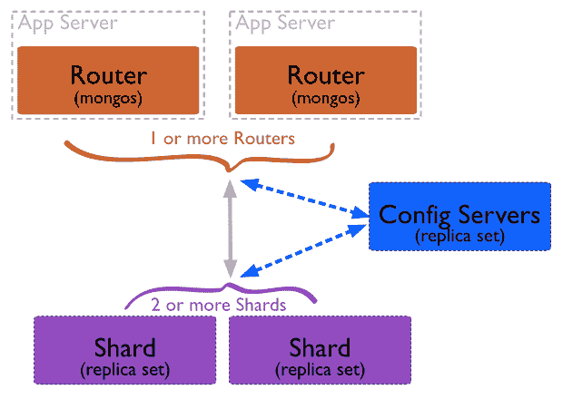
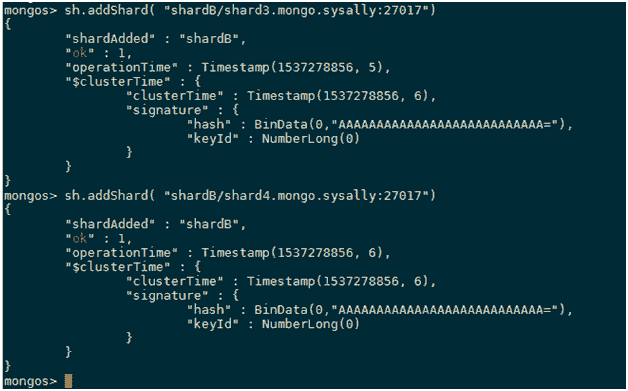
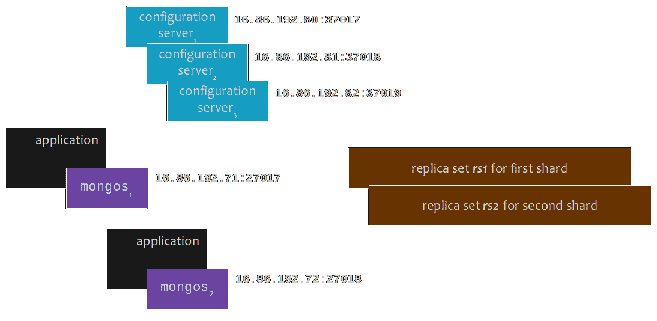

# 蒙古数据库分片命令

> 原文：<https://www.javatpoint.com/mongodb-sharding-commands>

分片是一种在不同机器上分发数据的方法。MongoDB 可以使用分片来支持在非常大规模的数据集上部署和高吞吐量操作。



### MongoDB sh.addShard( <url>)命令</url>

使用此命令将碎片副本集添加到碎片群集中。如果我们将它添加到集群的碎片中，它会影响碎片的平衡。它开始传输数据块来平衡集群。

<replica_set>/ <hostname><:port>、 <hostname><:port>、...</hostname></hostname></replica_set>

**语法:**

```

sh.addShard("<replica_set>/<hostname><:port>")

```

**示例:**

```

sh.addShard("repl0/mongodb3.example.net:27327")

```

**输出:**



它将添加一个分片来指定副本集的名称和副本集至少一个成员的主机名。

### MongoDB sh.addShardTag()命令

该命令由分片中的标签或标识符支持。 [MongoDB](https://www.javatpoint.com/mongodb-tutorial) 使用这些标识符将标记范围内的线程发送到指定的碎片。

**示例:**

```

sh.addShardTag("shard0000", "NYC")
sh.addShardTag("shard0001", "LAX")
sh.addShardTag("shard0002", "NRT")

```

它将向三个不同的碎片添加三个标签。



### mongob sh . addshardtozone(shard 地区)

该命令将指定的碎片添加到指定的区域。该命令在 3.4 版中引入。只有那些区块被分配给该区域覆盖的碎片。

**示例:**

```

sh.addShardToZone("shard0000", "JFK")
sh.addShardToZone("shard0001", "LAX")
sh.addShardToZone("shard0002", "NRT")

```

//将 LGA 与 shard0000 联系起来:

```

sh.addShardToZone("shard0000", "LGA")

```

// shard0000 与 LGA 区和 JFK 区都有关联。

### mongodb sh . addtagrange(命名空间、min、max、tag)命令

使用此命令，一系列碎片键值将被附加到碎片标签。区域范围总是排除上限并包括下限。

**示例:**

我们有一个{state: 1，zip: 1}的分片密钥，

下面的示例生成了一个覆盖加利福尼亚州邮政编码的特定标签范围:

```

sh.addTagRange( "statedb.collection",
                { state: "CA", zip: MinKey },
                { state: "CA", zip: MaxKey },
                "NY"
              )

```

### MongoDB sh . disablebalancing(name _ space)命令

将使用此命令禁用参数中指定碎片的平衡器。它对区块的平衡没有任何影响，但对同一集群中的其他分片集合有影响。

### MongoDB sh.enableBalancing(命名空间)命令

该命令为参数中指定的分片启用平衡器。它对区块的平衡没有任何影响，但对同一集群中的其他分片集合有影响。

### mongob sh . disabled autosplit command(禁用自动拆分命令)

此命令删除配置设置集合中的 autosplit 标志。当分片集群启用自动拆分选项时，它会根据分片键值由 MongoDB 自动拆分成块。

只能从连接到指定 mongos 实例的 mongo shell 中执行 sh.disableAutoSplit()。如果在 mongod 实例上运行，sh.disableAutoSplit()命令会返回错误

### mongodb updatezonekeyrange 命令

碎片键值范围和区域之间的关系将在此命令的帮助下创建或删除。使用 db.runCommand( { <command></command>})方法运行 updateZoneKeyRange。您必须在管理数据库上运行 addShardToZone。

**语法:**

```

{
  updateZoneKeyRange: <string>,
  min: <document>,
  max: <document>,
  zone: <string> | <null>
}

```

**示例:**

以下示例在 alpha 区域上创建一个下限为 1、上限为 10 的范围:

```

admin = db.getSiblingDB("admin")
admin.runCommand(
   {
      updateZoneKeyRange : "exampledb.collection",
      min : { a : 1 },
      max : { a : 10 },
      zone : "alpha"
   }
)

```

下面的查询通过向区域字段传递 null 来删除以前创建的范围。

```

admin = db.getSiblingDB("admin")
admin.runCommand(
   {
      updateZoneKeyRange : "exampledb.collection",
      min : { a : 1 },
      max : { a : 10 },
      zone : null
   }
)

```

现在检查碎片的状态:


* * *