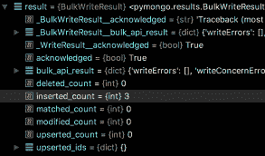
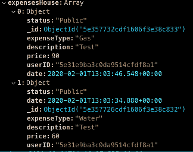
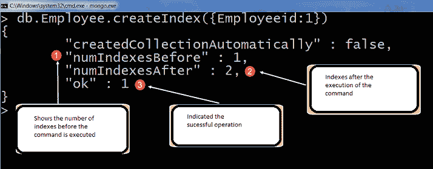
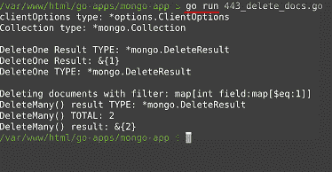

# 蒙古数据库外壳收集方法

> 原文：<https://www.javatpoint.com/mongodb-shell-collection-methods>

以下是在不同场景中使用的 MongoDB 收集方法。

### #1: db.collection.aggregate(管道，选项)

聚合方法计算集合/表或视图中数据的质量值。

**流水线:**是海量数据操作或阶段的数组。它可以接受管道作为单独的参数，而不是数组中的元素。如果管道未指定为数组，则不会指定第二个参数。

**选项:**传递聚合命令的文档。仅当您将管道指定为数组时，它才可用。

**命令字段:**

| 田 | 类型 | 描述 |
| 解释 | 布尔 | 解释字段指定返回有关管道处理的信息。 |
| allowDiskUse | 布尔 | “允许磁盘使用”字段允许您写入临时文件。 |
| 光标 | 文件 | 光标的初始批次大小由该字段指定。该字段中的值是带有 batchSize 字段的文档。 |
| maxTimeMS | 非负整数 | 使用此字段指定游标上处理操作的时间限制。 |
| bypassDocument | 确认 | boolean 可以使用此字段指定$out 或$merge 聚合阶段。它允许聚合收集方法在操作过程中绕过文档验证。 |
| read 关注 | 文件 | 您可以使用此字段指定读取关注级别。 |
| 校对 | 文件 | 排序规则字段指定字符串比较的语言特定规则。 |

**例**

这些示例使用包含以下文档的集合库:

```

{ _id: 1, book_id: "Java", ord_date: ISODate("2012-11-02T17:04:11.102Z"), status: "A", amount: 50 }
{ _id: 0, book_id: "MongoDB", ord_date: ISODate("2013-10-01T17:04:11.102Z"), status: "A", amount: 100 }
{ _id: 0.01, book_id: "DBMS", ord_date: ISODate("2013-10-12T17:04:11.102Z"), status: "D", amount: 25 }
{ _id: 2, book_id: "Python", ord_date: ISODate("2013-10-11T17:04:11.102Z"), status: "D", amount: 125 }
{ _id: 0.02, book_id: "SQL", ord_date: ISODate("2013-11-12T17:04:11.102Z"), status: "A", amount: 25 }

```

**计算总和**

```

db.library.aggregate([
                     { $match: { status: "A" } },
                     { $group: { _id: "$book_id", total: { $count: "$amount" } } },
                     { $sort: { total: -1 } }
                   ])

```

**输出:**


**指定排序**

```

db.library.aggregate(
   [ { $match: { status: "A" } }, { $group: { _id: "$ord_date", count: { $count: 1 } } } ],
   { library: { locale: "fr", strength: 1 } } );

```

### #2 db.collection.bulkWrite()

bulkWrite()方法按照执行控制的顺序执行多个写操作。数组的写操作由这个操作执行。默认情况下，操作以特定的顺序执行。

**语法:**

```

db.collection.bulkWrite(
   [ <op. 1>, <op. 2>, .. ],
   {
      writeConcern : <document>,
      ordered: <boolean>
   }
)

```

**输出:**



### 操作的执行

**insertOne:** 它只向集合中插入一个文档。

```

db.collection.bulkWrite( [
   { insertOne : { "document" : <document> } }
] )

```


**更新一个:**它只更新一个与集合中的过滤器匹配的文档。

```

db.collection.bulkWrite( [
   { updateOne :
      {
         "filter": <document>,
         "update": <document or pipeline>,
         "upsert": <boolean>,
         "collation": <document>,
         "arrayFilters": [ <filterdocument1>, ... ],
         "hint": <document|string>
      }
   }
] )

```

**输出:**



**更新多张:**更新集合中所有过滤匹配的单据。

```

db.collection.bulkWrite( [
   { updateMany :{
         "filter" : <doc.>,
         "update" : <document or pipeline>,          
         "upsert" : <Boolean>,
         "collation": <document>,           
         "arrayFilters": [ <filterdocument1>, ... ], 
         "hint": <document|string>                   // Available starting in 4.2.1
      }
   }
] )

```

**replaceOne:** 它替换集合中与过滤器匹配的单个文档。

```

db.collection.bulkWrite([
{ replaceOne :
 {
    "filter" : <doc.>,
     "replacement" : <doc.>,
     "upsert" : <boolean>,
     "collation": <document>,
     "hint": <document|string>
   }
 }
] )

```

### # 3.db.collection.count(查询，选项)

count()方法返回与集合或视图的查找方法查询相匹配的文档数。

**示例:**

我们将使用以下操作对 javaTpoint 集合中的所有文档进行计数:

```

db.javaTpoint.count()

```

现在，我们将统计 javaTpoint 集合中字段 tut_dt 大于新日期(' 01/01/2015 ')的所有匹配查询的文档

```

db.javaTpoint.count( { tut_dt: { $gt: new Date('01/01/2015') } } )

```

**输出:**


### #4.Db.collection.countDocuments(查询，选项)

countDocument()方法返回与集合或视图的查询相匹配的文档数。它不使用元数据来返回计数。

**语法:**

```

db.collection.countDocuments( <query>, <options> )

```

**示例:**

下面的示例将计算 javaTpoint 集合中所有文档的数量。

```

db.javaTpoint.countDocuments({})

```

现在，我们将统计 javaTpoint 集合中字段 tut_dt 大于新日期(' 01/01/2015 ')的所有匹配查询的文档

```

db.javaTpoint.countDocuments( { tut_dt: { $gt: new Date('01/01/2015') } } )

```

### 5 号。db . collection . estimated document count()

方法对集合或视图中的所有文档进行计数。此方法包装计数命令。

**语法:**

```

db.collection.estimatedDocumentCount( <options> )

```

**例**

以下示例将检索[JavaPoint](https://www.javatpoint.com/)集合中所有文档的计数:

```

db.javaTpoint.estimatedDocumentCount({})

```

### #6.db.collection.createIndex()

它可以在集合上创建索引

**语法:**

```

db.collection.createIndex(keys, options)

```

*键:*对于字段的升序索引，我们需要指定值 1，对于降序索引，我们需要指定值-1。

**例**

下面的示例在字段 tut_Date 上创建了一个升序索引。

```

db.collection.createIndex( { tut_Date: 1 } )

```

以下示例显示了在图坦卡蒙日期字段和图坦卡蒙代码字段上创建的复合索引。

```

db.collection.createIndex( { tut_Date: 1, tut_code: -1 } )

```

下面的示例将创建一个名为 category_tutorial 的索引。该示例使用指定区域 fr 和比较强度的排序规则创建索引。

```

db.collection.createIndex(
   { category: 1 },
   { name: "category_tutorial", collation: { locale: "fr", strength: 2 } }
)

```

### #7.db.collection.createIndexes()

createIndexes()方法在集合上创建一个或多个索引。

**语法:**

```

db.collection.createIndexes( [keyPatterns, ]options)

```

*关键模式*:包含索引特定文档的数组。所有文档都有字段值对。对于字段的升序索引，我们需要指定值 1，对于降序索引，我们需要指定值-1

**例**

在下面的示例中，我们考虑了一个员工集合，其中包含类似以下内容的文档:

```

{
   location: {
      type: "Point",
      coordinates: [-73.8577, 40.8447]
   },
   name: "Employee",
   company: "Amazon",
   borough: "CA",
}

```

**输出:**



下面的示例在 products 集合上创建了两个索引:

*   制造商字段的索引以升序排列。
*   按升序对类别字段进行索引。

上述索引使用的排序规则将基本 fr 和比较强度指定为 2。

```

db.products.createIndexes( [ { "manufacturer": 1}, { "category": 1 } ],
   { collation: { locale: "fr", strength: 2 } })

```

### #8.db.collection.dataSize()

数据大小方法在 collStats(即 db.collection.stats())命令的输出周围有一个覆盖。

### #9.db.collection.deleteOne()

deleteOne()方法从集合中删除一个文档。它将替换第一个与过滤器相似的文档。您需要使用与唯一索引(如 id)相关的字段来实现完美删除。

**语法:**

```

db.collection.deleteOne(
   <filter>,
   {
      writeConcern: <document>,
      collation: <document>
   }
)

```

**例**

订单集合包含具有以下结构的文档:

```

{
   _id: objectId("563237a41a4d6859da"),
   book: "",
   qty: 2,
   type: "buy-limit",
   limit: 10,
   creationts: ISODate("2015-11-01T2:30:15Z"),
   expiryts: ISODate("2015-11-01T2:35:15Z"),
   client: "JavaTpoint"
}

```

以下操作删除了具有 _ id:ObjectID(" 563237 a41 a4 d 6858 2da ")的订单:

```

try {
   db.orders.deleteOne( { "_id" : objectId("563237a41a4d68582da") } );
} catch (e) {
   print(e);
}

```

**输出:**



* * *