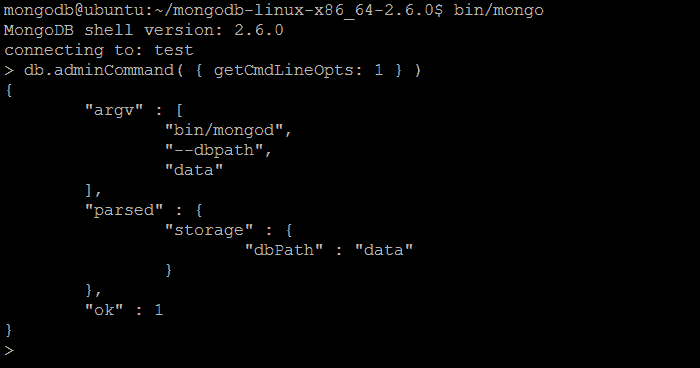
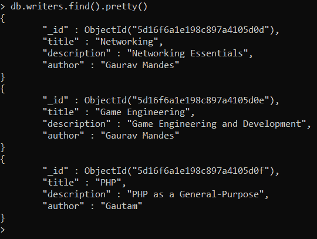
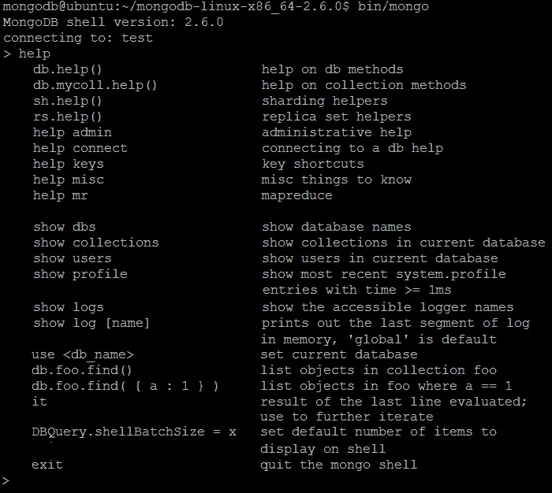
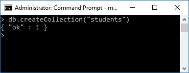
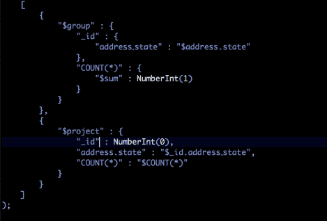

# MongoDB 命令

> 原文：<https://www.javatpoint.com/mongodb-database-commands>

MongoDB 数据库命令用于创建、修改和更新数据库。

### #1.db.adminCommand（cmd）

admin 命令方法针对 admin 数据库运行，通过提供帮助程序来运行指定的数据库命令。

命令:该参数是以文档形式或字符串形式指定的。如果命令被定义为字符串，它不能包含任何参数。

**示例:**

在管理数据库上创建一个名为 JavaTpoint 的具有数据库所有者角色的用户。

```js

db.adminCommand(
  {
    createUser: "JavaTpoint",
    pwd: passwordPrompt(),
    roles: [
      { role: "dbOwner", db: "admin" }
    ]
  }
)

```

**输出:**



### #2.db.aggregate()

聚合方法初始化特定的诊断或管理管道，这不需要底层收集。

**语法:**

```js

db.aggregate( [ <pipeline> ], { <options> } )

```

管道参数不需要任何基础集合，并且总是以兼容的阶段开始，例如$ currentOp 或$listLocalSessions。它是将要执行的一系列阶段。

**示例:**

以下示例运行具有两个阶段的管道。第一个是$ currentOp 操作，第二个将过滤结果。

```js

use admin
db.aggregate( [ {
   $currentOp : { allUsers: true, idleConnections: true } }, 
{
   $match : { shard: "shardDemo" }
   }
] )

```

**输出:**



### #3.数据库.克隆数据库(“主机名”)

clonedatabase 方法将指定的数据库复制到当前数据库，并假设远程位置的数据库与当前数据库同名。

hostname 参数包含我们要复制的数据库的主机名。

**示例:**

数据库.克隆数据库(“客户”)

**输出:**


### #4.db.commandHelp(命令)

我们使用 commandHelp 方法为指定的数据库命令提供了帮助选项。命令参数包含数据库命令的名称。



### #5.db.createCollection(名称，选项)

将使用此方法创建新的集合或视图。createCollection 方法主要用于在命令中首次引用集合时创建使用特定选项的新集合。

**例如** -我们将使用 [JSON](https://www.javatpoint.com/json-tutorial) 模式验证器创建一个 [javaTpoint](https://www.javatpoint.com/) 集合:

```js

db.createCollection( "student", {
   validator: { $jsonSchema: {
      bsonType: "object",
      required: [ "phone" ],
      properties: {
         phone: {
            bsonType: "string",
            description: "must be a string and is required"
         },
         email: {
            bsonType : "string",
            pattern: "@mongodb\.com$",
            description: "must be a string and match the regular expression pattern"
         },
         status: {
            enum: [ "Unknown", "Incomplete" ],
            description: "can only be one of the enum values"
         }
      }
   } }
} )

```



### #6.db.createView()

当我们将指定的聚合管道应用于集合时，createView 方法会为集合创建一个新视图。该方法可以在读取操作期间计算，并作为只读操作。这些视图可以在源集合的同一个数据库中创建，作为基础聚合管道的一部分执行读取操作。

**语法:**

```js

db.createView(<view>, <source>, <pipeline>, <options>)

```

以下示例使用 _id、学生.管理和部门字段创建学生反馈视图:

```js

db.createView(
   "StudentFeedback",
   "survey",
   [ { $project: { "management": "$Student.management", department: 1 } } ]
)

```

**输出:**



### #7.db.dropDatabase( <writeconcern>)</writeconcern>

drop 方法移除指定的数据库和关联的数据文件。

**例如-**

我们使用<database>操作将当前数据库切换到临时数据库。我们使用 db.dropDatabase()方法删除临时数据库</database>

```js

use temp
db.dropDatabase()

```

### #8.db.getLogComponents（）

getLog 方法返回当前生硬的设置。该方法为每个日志消息组件确定由 [MongoDB](https://www.javatpoint.com/mongodb-tutorial) 产生的日志消息的数量。

**示例:**

```js

{
   "verbosity" : 0,
   "accessControl" : {
      "verbosity" : -1
   },
   "command" : {
      "verbosity" : -1
   },
   "control" : {
      "verbosity" : -1
   },
   "geo" : {
      "verbosity" : -1
   },
   "index" : {
      "verbosity" : -1
   },
   "network" : {
      "verbosity" : -1
   },
   "query" : {
      "verbosity" : 2
   },
   "replication" : {
      "verbosity" : -1,
      "election" : {
         "verbosity" : -1
      },
      "heartbeats" : {
         "verbosity" : -1
      },
      "initialSync" : {
         "verbosity" : -1
      },
      "rollback" : {
         "verbosity" : -1
      }
   },
   "sharding" : {
      "verbosity" : -1
   },
   "storage" : {
      "verbosity" : 2,
      "recovery" : {
         "verbosity" : -1
      },
      "journal" : {
         "verbosity" : -1
      }
   },
   "write" : {
      "verbosity" : -1
   }
}

```

* * *