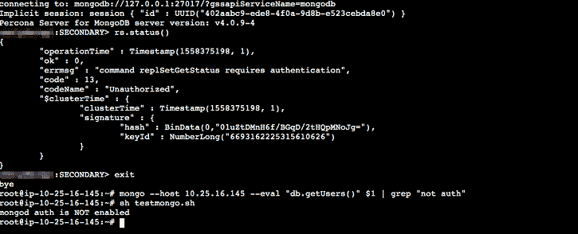
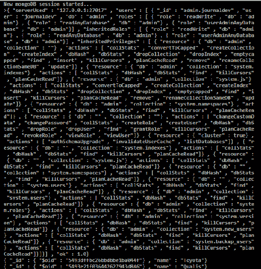
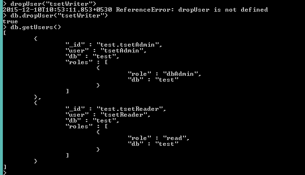
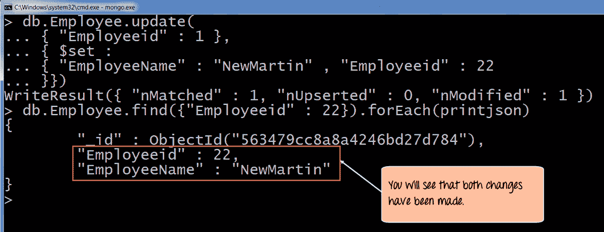

# 蒙古数据库用户管理方法

> 原文：<https://www.javatpoint.com/mongodb-user-management-methods>

MongoDB 用户管理方法用于管理数据库的用户。

### 第一个。db.auth()

auth 方法允许 shell 中的用户向数据库提供身份验证。它可以接受用户名和密码，即 db.auth( <username>、passwordPrompt())或 db.auth( <username>、<password>)。</password></username></username>

我们可以定义一个包含用户名、密码、机制和摘要密码标志的用户集合。

```

db.auth( {
   user: <name>,
   pwd: "<cleartext password>",
   mechanism: <auth. mechanism>,
   digestPassword: <boolean>
} )

```

**示例:**

连接 mongo shell 后，如果要进行身份验证，必须在用户的身份验证数据库中发出 db.auth():

```

use test
db.auth( "javaTpoint", passwordPrompt() )

```



### #2\. db.changeUserPassword(用户名、密码)

更新用户的密码。在定义用户的数据库中运行该方法，即创建用户的数据库。

**例**

以下操作将产品数据库中名为 accountUser 的用户的密码更改为 SOh3TbYhx8ypJPxmt1oOfL:

```

use products
db.changeUserPassword("accountUser", passwordPrompt())

```

您也可以将新密码直接传递给 db.changeUserPassword():

```

use products
db.changeUserPassword("accountUser", "SOh3TbYhx8ypJPxmt1oOfL")

```

**输出:**



### 3 号。db . create user(<writeconcern>、</writeconcern>

此方法为当前运行该方法的当前数据库创建一个在参数中指定的新用户。如果用户已经存在于指定的数据库中，该方法将返回重复错误。

使用 createUser 方法定义数据库用户的语法:

```

{
  user: "<name>",
  pwd: "<cleartext password>",
  customData: { <any info.> },
  roles: [
    { role: "<role>", db: "<database>" } | "<role>",
    ...
  ],
  authenticationRestrictions: [
     {
       clientSource: ["<IP>" | "<CIDR range>", ...],
       serverAddress: ["<IP>" | "<CIDR range>", ...]
     } ]
  mechanisms: [ "<SCRAM-SHA-1|SCRAM-SHA-256>", ... ],
  passwordDigestor: "<server|client>"
}

```

**示例:**

以下示例将在学生数据库上创建 accountJTP 用户。

```

use EmployeeAdmin
db.createUser( { user: "accountJTP",
           pwd: "<cleartext password>",
           customData: { Employee: 12345 },
            roles: [ { role: "clusterAdmin", db: "admin" },
                 { role: "readAnyDatabase", db: "admin" },
                   "readWrite"] },
           w: "majority" , wtimeout: 5000 } )

```

**输出:**


### # 4 . db . drop user(“t0”、“T1”)

db.dropUser()方法包装 dropUser 命令，并在删除具有用户管理任何数据库角色的用户之前，从当前数据库中删除该用户。您必须明确表示，您至少有一个具有用户管理权限的附加用户。

**示例:**

以下操作使用 db.dropUser()删除 studnet 数据库中的 jtpAdmin 用户。

```

use testwriter
db.dropUser("testwriter", {w: "majority", wtimeout: 4000})

```



### # 5 . db . remove user(“t0”)

这个方法没有更多的用途。您可以使用此方法从当前数据库中删除指定的用户名。

### 6 号。db .更新用户(<username>、<update>、</update></username>

updateUser 方法用于更新指定数据库的用户配置文件。使用此方法将完全替换旧字段的值。此方法向用户的角色数组添加更新。

**语法:**

```

db.updateUser(
   "<username>",
   {
     customData : { <any info.> },
     roles : [
       { role: "<role>", db: "<database>" } | "<role>",
       ...
     ],
     pwd: "<cleartext password>",
     authenticationRestrictions: [
        {
          clientSource: ["<IP>" | "<CIDR range>", ...],
          serverAddress: ["<IP>", | "<CIDR range>", ...]
        },
        ...
     ],
     mechanisms: [ "<SCRAM-SHA-1|SCRAM-SHA-256>", ... ],
     passwordDigestor: "<server|client>"
   },
   writeConcern: { <write concern> }
)

```

**示例:**

以下示例将使用 db.updateUser()方法完全替换用户的 customData 和 roles 数据:

```

use Employee
db.updateUser( "NewMartin",
{
   customData : { employeeId : "001" },
   roles : [
      { role : "read", db : "assets"  }
   ]
} )

```

**输出:**



* * *