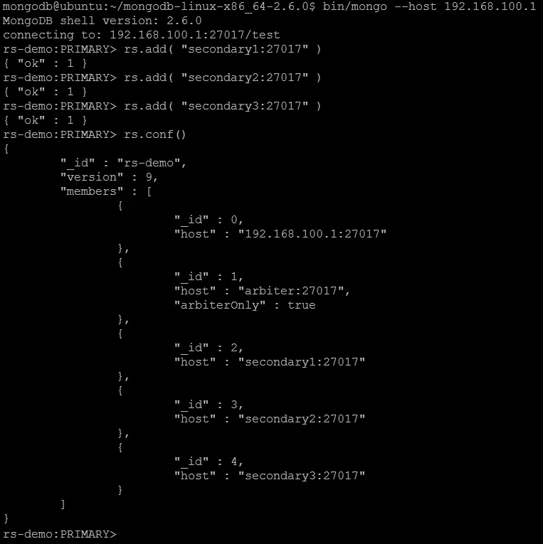
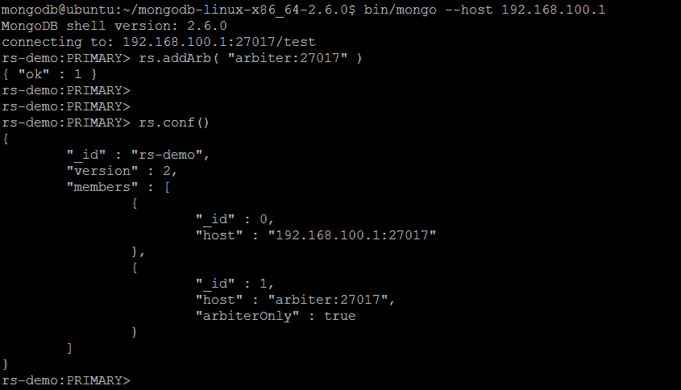

# MongoDB 复制方法

> 原文：<https://www.javatpoint.com/mongodb-replication-methods>

MongoDB 复制方法用于将成员复制到副本集。

### #1.rs.add(主机，仲裁)

add 方法向指定的副本集添加一个成员。我们需要将复制集的主集连接到此方法。如果该方法将触发主服务器的选举，则与 shell 的连接将被终止。例如，如果我们试图添加一个优先级高于主成员的新成员。即使操作成功，mongo shell 也会反映一个错误。

**示例:**

在下面的示例中，我们将添加一个默认投票的新辅助成员。

```js

rs.add( { host: "mongodbd4.example.net:27017" } )

```

*主机名*

```js

rs.add( "mongodbd4.example.net:27017" )

```



### #2.rs.addArb(主机)

我们可以向指定主机上的现有副本集添加新的仲裁器。

**例**

向关联主机名添加仲裁器

```js

mongod --bind_ip localhost,My-Example-<Associated-Hostname>

```

如果要连接到此实例，远程客户端必须指定主机名或其关联的 IP 地址 198.52.100.2:

```js

mongo --host My-Example-<Associated-Hostname>
mongo --host 198.52.100.2

```



### 3 号。rs.conf()

conf 方法用于获取包含当前副本集配置的文档。

rs.conf()包装了 replSetGetConfig 命令配置。

**例**

以下脚本显示了包含这些设置子集的副本集的配置文档:

```js

{
  _id: <string>,
  version: <int>,
  protocolVersion: <number>,
  writeConcernMajorityJournalDefault: <boolean>,
  configsvr: <boolean>,
  members: [
    {
      _id: <int>,
      host: <string>,
      arbiterOnly: <boolean>,
      buildIndexes: <boolean>,
      hidden: <boolean>,
      priority: <number>,
      tags: <document>,
      slaveDelay: <int>,
      votes: <number>
    					}, ], settings: {
    chainingAllowed : <boolean>,
    heartbeatIntervalMillis : <int>,
    heartbeatTimeoutSecs: <int>,
    electionTimeoutMillis : <int>,
    catchUpTimeoutMillis : <int>,
    getLastErrorModes : <document>,
    getLastErrorDefaults : <document>,
    replicaSetId: <ObjectId>
  }
}

```

**输出:**


### #4.rs.initiate(配置)

该方法启动一个副本集。保存副本集 rs.initiate()配置的文档可以用这种方法考虑，但这是可选的。

**例**

以下示例使用三个不同的成员启动一个新的副本集。

```js

   {
      _id: "JTPReplSet",
      version: 1,
      members: [
         { _id: 0, host : "mongodb0.example.net:27017" },
         { _id: 1, host : "mongodb1.example.net:27017" },
         { _id: 2, host : "mongodb2.example.net:27017" }
      ]
   }
)

```

**输出:**


### #5.rs.reconfig(配置、力)

顾名思义，该方法用于重新配置现有的副本集。它将覆盖所有现有的副本集配置。我们必须连接到主复制集才能运行此方法。

**示例**

名为 rs0 的副本集具有以下配置:

```js

{
   "_id" : "rs0",
   "version" : 1,
   "protocolVersion" : NumberLong(1),
   "members" : [
      {
         "_id" : 0,
         "host" : "mongodb0.example.net:27017",
         "arbiterOnly" : false,
         "buildIndexes" : true,
         "hidden" : false,
         "priority" : 1,
         "tags" : {

         },
         "slaveDelay" : NumberLong(0),
         "votes" : 1
      },
      {
         "_id" : 1,
         "host" : "mongodb1.example.net:27017",
         "arbiterOnly" : false,
         "buildIndexes" : true,
         "hidden" : false,
         "priority" : 1,
         "tags" : {

         },
         "slaveDelay" : NumberLong(0),
         "votes" : 1
      },
      {
         "_id" : 2,
         "host" : "mongodb2.example.net:27017",
         "arbiterOnly" : false,
         "buildIndexes" : true,
         "hidden" : false,
         "priority" : 1,
         "tags" : {

         },
         "slaveDelay" : NumberLong(0),
         "votes" : 1
      }
   ],
   "settings" : {
      "chainingAllowed" : true,
      "heartbeatIntervalMillis" : 2000,
      "heartbeatTimeoutSecs" : 10,
      "electionTimeoutMillis" : 10000,
      "catchUpTimeoutMillis" : 2000,
      "getLastErrorModes" : {

      },
      "getLastErrorDefaults" : {
         "w" : 1,
         "wtimeout" : 0
      },
      "replicaSetId" : ObjectId("58858acc1f5609ed986b641b")
   }
}

```

* * *