# MongoDB 地图集

> 哎哎哎:# t0]https://www . javatppoint . com/monodb-atlas

MongoDB Atlas 是 MongoDB 提供的云服务。它是为那些宁愿花时间构建应用程序也不愿管理数据库的开发人员而构建的。这项服务在 AWS、Azure 和 GCP 上提供。

它是面向现代应用程序的全球云数据库服务，提供了一流的自动化和经验证的实践，保证了可用性、可扩展性，并符合最苛刻的数据安全和隐私标准。我们可以使用 MongoDB 强大的驱动程序、集成和工具生态系统来更快地创建数据库，并减少管理数据库的时间。

## MongoDB 地图集的优势

*   **世界级应用的全球集群:**使用 MongoDB Atlas，我们可以自由选择符合我们业务战略的云合作伙伴和生态系统。
*   **保护敏感数据:**它为我们所有的数据提供内置的安全控制。它使企业级功能能够与我们现有的安全协议和合规标准相集成。
*   **专为开发人员的工作效率而设计:** MongoDB Atlas 使用通用工具处理我们的数据时速度更快，并且有一个服务平台，可以轻松构建、保护和扩展在 MongoDB 上运行的应用程序。
*   **任务关键型工作负载可靠:**内置分布式容错和自动化数据恢复。
*   **专为实现最佳性能而打造:**它可以轻松地在任何方向扩展我们的数据库。借助性能优化工具和数据库指标的实时可见性，我们可以更好地利用现有资源。
*   **为运营效率而管理:**它带有内置的运营最佳实践，因此我们可以专注于交付业务价值和加速应用程序开发，而不是管理数据库。

## 创建一个阿特拉斯账户并部署一个自由层集群

**第一步:**去[https://www.mongodb.com/cloud/atlas](https://www.mongodb.com/cloud/atlas)注册一个 Atlas 账号托管你的数据。

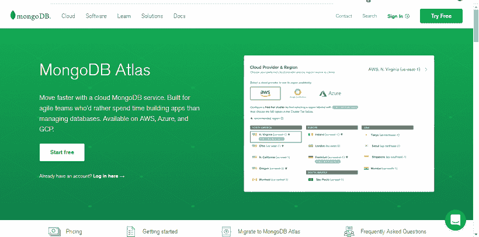

**第 2 步:**当您点击开始免费时，您将被重定向到 MongoDB 地图集上的帐户登记表。

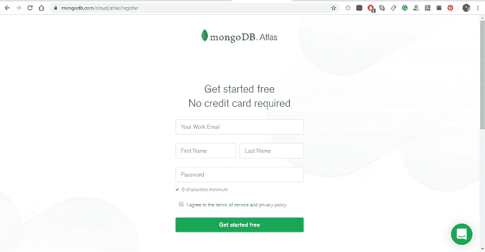

**步骤 3:** 选择起始集群，然后单击创建集群。入门群集包括 M0、M2 和 M5 群集层。这些低成本集群适合正在学习 MongoDB 或开发小型概念验证应用程序的用户。

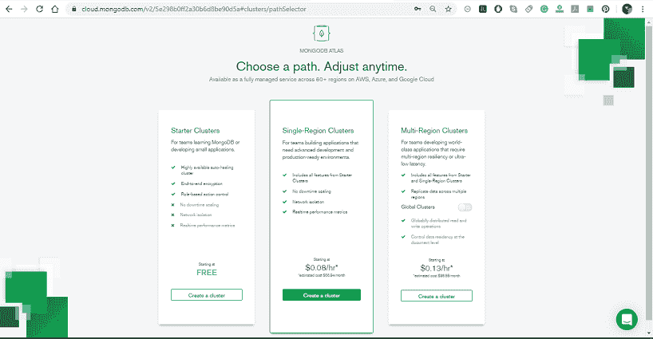

**步骤 4:** 选择您首选的云提供商&地区。它支持亚马逊网络服务(AWS)、谷歌云平台(GCP)和微软 Azure 上的 M0 自由层集群。支持 M0 自由层集群的地区标有 ***【自由层可用】*** 标签。

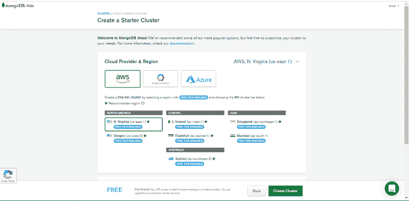

**第五步:**集群层选择 **M0 沙盒**:选择 M0 自动锁定剩余配置选项。如果您无法选择 M0 集群层，请返回上一步，选择支持 M0 自由层集群的云提供商&地区。


**步骤 6:** 在集群名称字段中输入集群的名称；您可以为集群输入任何名称。群集名称包含 ASCII 字母、数字和连字符。

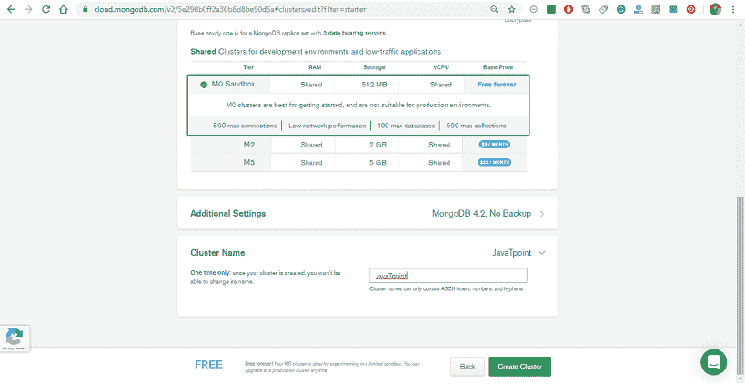

**第 7 步:**点击创建集群部署集群。一旦您部署了群集，您的群集可能需要 5-10 分钟来进行资源调配并准备就绪。

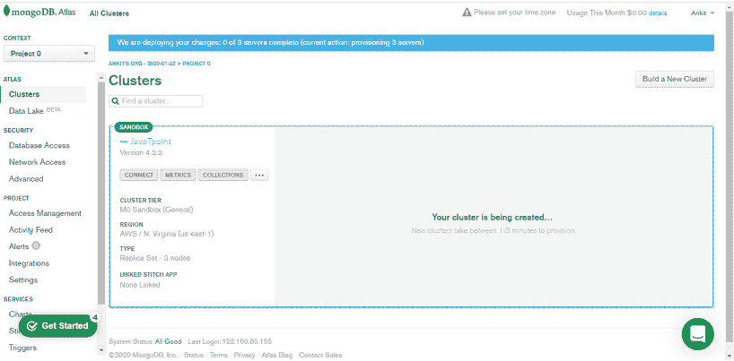

**步骤 8:** 一旦我们注册，Atlas 会自动创建一个默认的组织和项目，我们可以在其中部署我们的第一个集群。我们可以稍后添加其他组织和项目。


## 如何将您的连接 IP 地址列入白名单

IP 地址是连接到网络的设备的唯一数字标识符。在 Atlas 中，我们只能从受信任的 IP 地址连接到集群。在阿特拉斯系统中，我们可以创建一个可信的 IP 地址清单，称为白名单，它可以用来连接到我们的集群并访问我们的数据。

在连接到我们的集群之前，我们必须将我们的 IP 地址添加到白名单中——我们应该采取以下步骤将我们的连接 IP 地址列入白名单。

**步骤 1:** 首先，从我们的集群视图中点击连接按钮。


**步骤 2:** 配置您的白名单条目。在“将您的连接 IP 地址列入白名单”步骤中，单击“添加我们的当前 IP 地址”。


**第三步:**点击添加 IP 地址。

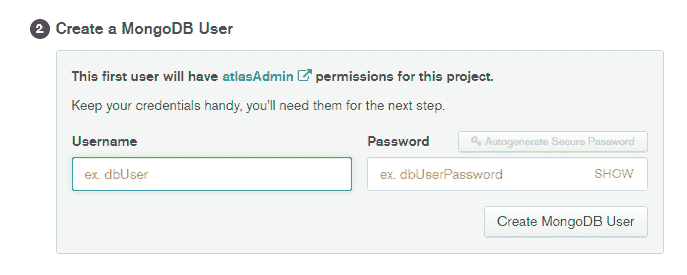

## 为我们的集群创建 MongoDB 用户

出于安全目的，Atlas 要求客户端以 MongoDB 用户身份进行身份验证才能访问集群。我们必须创建一个 MongoDB 用户来访问我们的集群。MongoDB 用户与阿特拉斯用户是分开的:

*   MongoDB 用户可以访问 Atlas 中托管的数据库。
*   阿特拉斯用户可以登录阿特拉斯系统，但不能访问 MongoDB。

**步骤 1:** 从我们的集群视图中打开连接对话框。

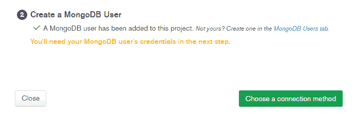

**步骤 2:** 在对话框的 ***创建 MongoDB 用户*** 步骤中，输入我们的 MongoDB 用户的用户名和密码。

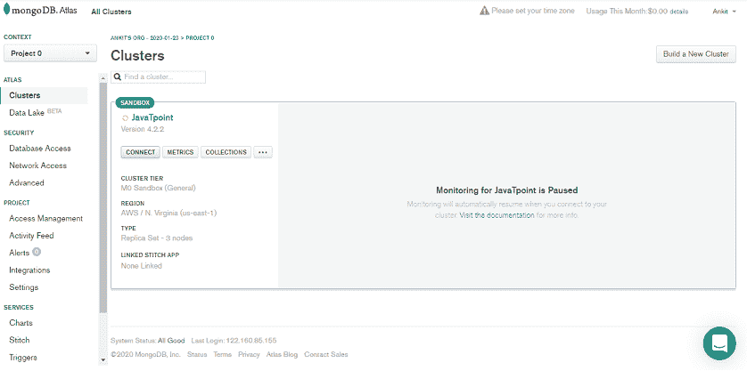

**第三步:**最后点击 ***创建 MongoDB 用户*** 按钮。

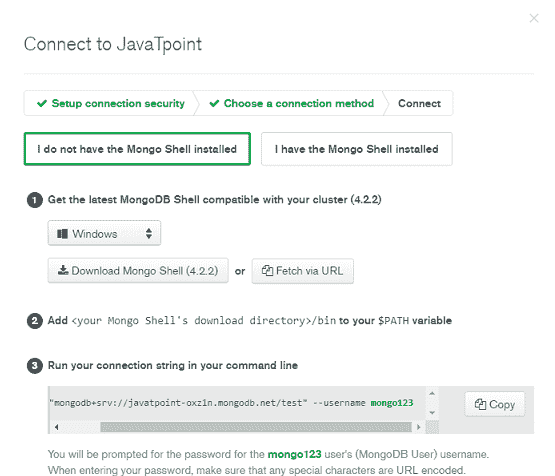

## 连接到群集

我们可以通过几种方式连接到集群。我们将看到如何使用 mongo shell 驱动程序连接我们的集群。

以下是下载和安装 mongo shell 驱动程序的步骤。

**步骤 1:** 从集群中打开连接对话框。

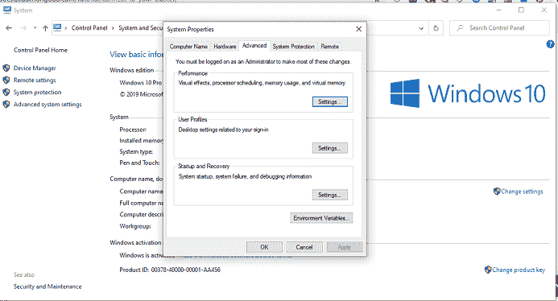

**第二步:**点击连接 Mongo Shell。

**第三步:**点击 ***“我没有安装 Mongo Shell”***，从下拉菜单中选择你的操作系统。

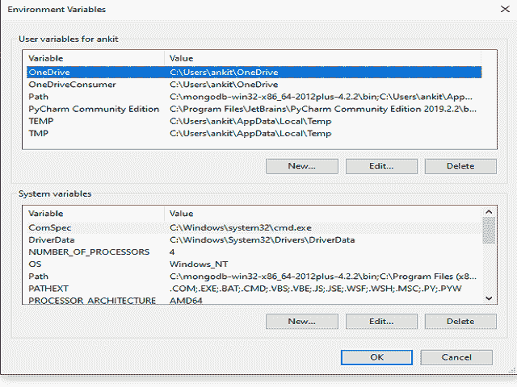

**第四步:**点击下载 Mongo Shell。

**第 5 步:**要从 PC 运行 Mongo Shell，需要将 Shell 添加到系统路径中。

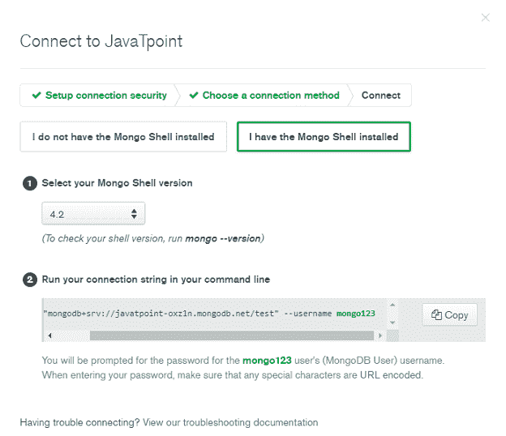

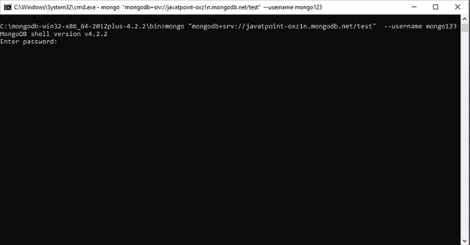

**步骤 6:** 要查看您是否已将 Mongo Shell 正确添加到您的系统路径中，请在您的终端中运行以下命令。

```

mongo - - version

```

## 连接到您的阿特拉斯集群

**第七步:**点击 ***“我已经安装了 Mongo Shell”***，从下拉菜单中选择你的 Mongo Shell 版本。


**步骤 9:** 现在，将提供的连接字符串复制到剪贴板，然后在终端中粘贴并运行您的连接字符串。


**步骤 10:** 现在，系统将提示您输入在 Atlas 中创建 MongoDB 用户时指定的密码。

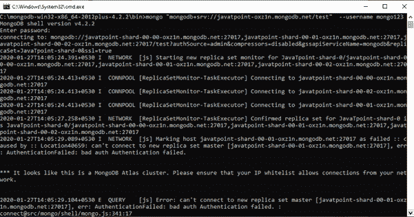

你现在将被连接到你在 MongoDB 外壳内的阿特拉斯集群。

* * *