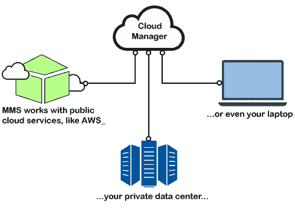
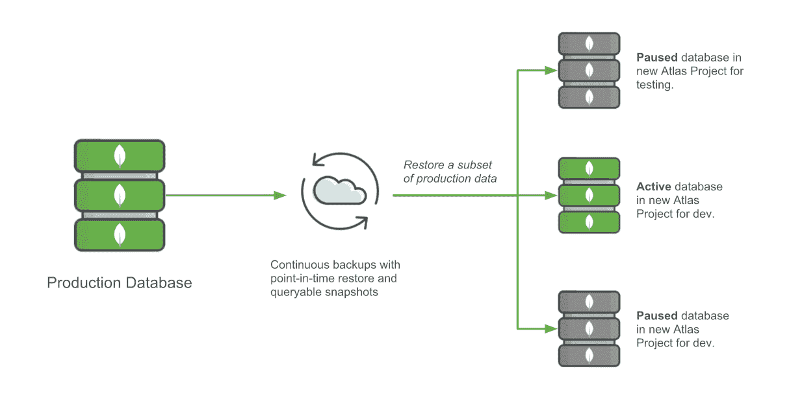
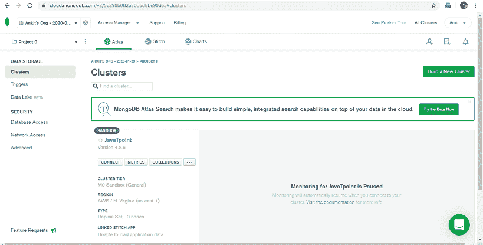
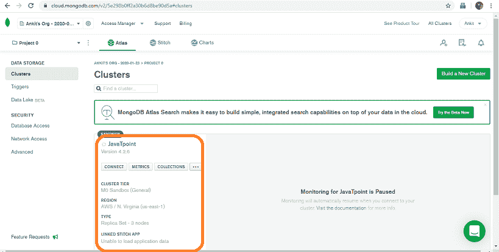
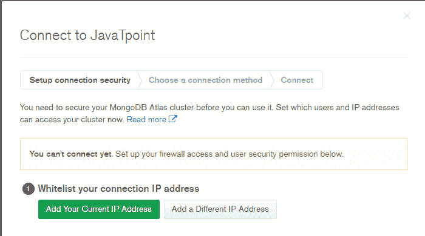
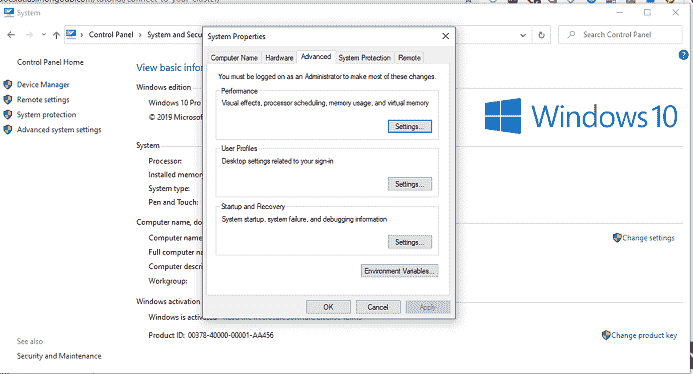
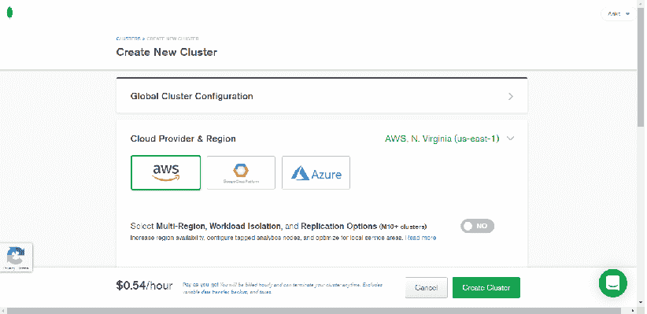
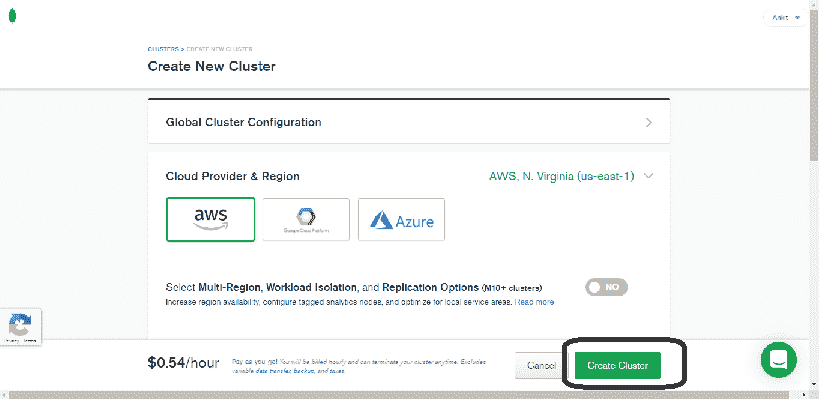
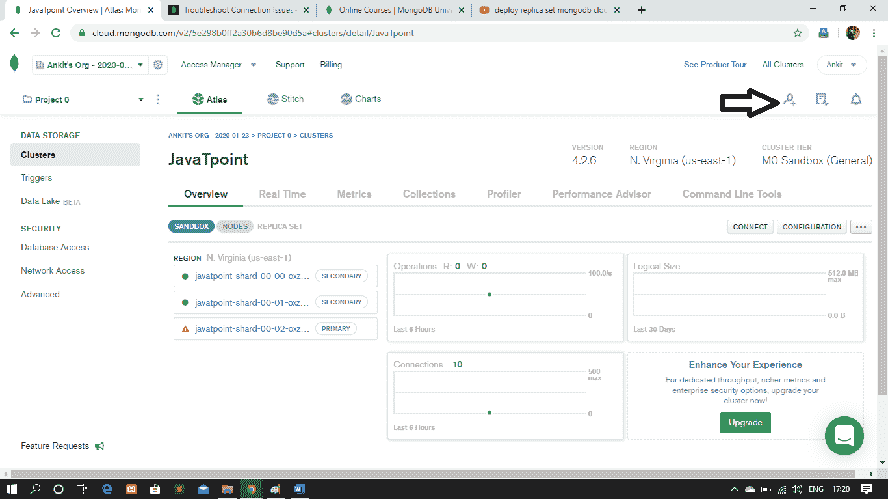

# 蒙古数据库云管理器

> 原文：<https://www.javatpoint.com/mongodb-cloud-manager>

MongoDB 云管理器用于通过自动化、监控和备份来管理我们的基础架构。

*   **自动化:** MongoDB 节点和集群将在自动化的帮助下进行配置和维护。如果我们在每个 MongoDB 主机上使用自动化，我们可以维护我们的 MongoDB 部署。
*   **监控:**它提供关键数据库和硬件指标的实时报告、警报和虚拟化。
*   **备份:**我们的 MongoDB 分片集群和副本集的计划快照和时间点恢复由云管理器的备份工具提供。

### 备份工作原理

当我们为 MongoDB 部署激活备份时，云管理器会为我们指定要备份的数据拍摄快照。首先，创建复制集的一个不可见成员，并执行部署数据和的初始同步。然后，备份跟踪所有副本集的操作日志，以持续更新备份。根据用户定义的快照保留策略，它获取并存储快照。

### 数据恢复

我们可以从完整的计划快照或图片之间的选定点恢复数据。

*   我们可以从分片集群的快照之间的检查点进行恢复
*   我们可以从选定的时间点恢复副本集。

当我们从存储中恢复数据时，云管理器直接从存储的数据克隆(称为快照)中读取数据。

## 云管理器入门

云管理器允许我们创建、管理、监控和备份 MongoDB 部署。我们可以使用云管理器设计和管理新部署。我们可以将云管理器代理下载到我们的部署服务器，以管理现有的部署。为了访问一组不同的 MongoDB 进程和用户，我们需要创建一个云管理器项目来使用云管理器。

如果您有，请登录 MongoDB 帐户，或者您可以创建一个新帐户来开始使用云管理器。

### 创建蒙古数据库帐户

**第一步:**前往[https://www.mongodb.com/cloud/cloud-manager](https://www.mongodb.com/cloud/cloud-manager)

**第二步:**现在，在 MongoDB 网站上，点击开始您的 30 天免费试用，开始免费试用。

**第三步:**点击注册创建 [MongoDB](https://www.javatpoint.com/mongodb-tutorial) 账户

*   您可以使用您的谷歌帐户或任何其他电子邮件地址注册。

**第 4 步:**注册设置云管理器。

**步骤 5:** 创建第一个云管理器项目后，设置第一个部署。

您可以使用相同的凭据登录云管理器

毕竟，下一步你要做的是:

*   将您的 MongoDB 部署连接到服务器，开始创建数据库。

*   现在，将服务器添加到您的 MongoDB 部署中

### 创建和导入部署

系统需求

*   您需要至少 10 GB 的可用磁盘空间和保存 MongoDB 数据所需的空间。
*   需要 4 GB 内存
*   如果您正在使用 AWS EC2 实例，那么您必须至少使用 m3 介质。
*   可以在 64 位架构上安装。

### 安装选项

如果在安装 MongoDB 之前将 MongoDB 代理部署到您希望实现自动化的主机上。您必须确保所有者系统用户 MongoDB 代理对您想要使用的 MongoDB 数据和日志目录具有读写权限。

**已经运行 MongoDB:** 如果要将 MongoDB 代理安装到自动化管理进程的主机上，代理的系统用户必须具有以下权限。

1.  代理使用自己的一组 MongoDB 二进制文件，重新启动进程以停止 MongoDB 进程。您必须使用已经安装的同一个软件包管理器。它将 MongoDB 代理分配为与 MongoDB 相同的所有者。
2.  对 MongoDB 数据和日志目录执行读写操作。

### 设置供应服务器

对于云管理器自动化或监控，我们必须设置供应服务器。我们必须添加一个服务器，以便在其上部署托管 MongoDB 部署。

您必须在所有想要运行云管理器的服务器上安装自动化。遵循以下程序:

**步骤 1:** 单击云管理器中的部署，然后单击代理选项卡，然后单击下载和设置选项。

**第 2 步:**点击操作，按照弹出窗口安装并自动运行代理。

代理成功安装到服务器后，您可以部署副本集、集群或独立副本集。

*   **向云管理器添加 MongoDB 流程**
*   **步骤 1:** 点击部署选项。
*   **步骤 2:** 单击添加新项并选择现有 MongoDB 部署选项。
*   **步骤 3:** 现在，按照提示添加部署的步骤进行操作。

### 将副本集部署到云管理器

副本集是所有生产部署体系结构的基本功能。它是一组具有相同数据集的 MongoDB 部署。按照下面给出的步骤部署副本集。

**步骤 1:** 点击云管理器的部署选项。

**步骤 2:** 现在，单击集群创建视图。然后系统会提示您进入新的弹出窗口。

**步骤 3:** 转到部署页面的右上角，单击添加新箭头按钮。

**步骤 4:** 现在，要打开创建新副本集视图，请从下拉菜单中选择新副本集选项。

**步骤 5:** 选择副本集配置以配置群集范围的设置。您需要至少配置那些标有星号*的设置。

**步骤 6:** 之后，需要配置每个副本集成员。

**步骤 7:** 配置复制集成员后，配置您的复制设置。

**第 8 步:**最后，点击创建副本集选项。现在，您可以从“部署”视图中监视集群部署的进度。

### 在云管理器中部署分片集群

分片集群将数据集分布在一组服务器上，为大型数据集提供水平扩展，并支持高吞吐量操作。

**部署分片集群的步骤:**

**第一步:**首先登录你的云管理器账号，在首页点击部署选项。

**步骤 2:** 现在，单击集群创建视图。然后系统会提示您进入新的弹出窗口。

**步骤 3:** 点击部署页面右上角的添加新箭头按钮。

**步骤 4:** 现在，要打开创建新集群菜单，请从下拉菜单中选择新集群。

**步骤 5:** 选择集群配置以配置集群范围的设置。您需要至少配置那些标有星号*的设置。

**步骤 6:** 现在，点击碎片设置，从成员配置中打开碎片配置选项。

**步骤 7:** 之后，配置集群中的每个配置服务器和 mongos。

**步骤 8:** 现在，从复制设置中，配置群集中的每个复制副本集。

**步骤 9:** 最后，点击创建集群按钮。

**步骤 10:** 您现在可以查看和部署您的更改。

### 将独立的蒙古数据库实例部署到云管理器中

我们可以使用该实例进行测试和开发，为云管理器部署一个独立的 MongoDB 实例。我们不能将这些部署系统用于生产系统，因为它们缺乏复制和开发。

**第一步:**首先登录你的云管理器账号，在首页点击部署选项。

**步骤 2:** 现在，单击新建独立。然后系统会提示您进入新的弹出窗口。

**第三步:**点击部署页面右上角的新增按钮。

**步骤 4:** 现在，要打开创建新独立菜单，请从下拉菜单中选择新建独立。

**步骤 5:** 选择独立配置以配置独立设置。您需要至少配置那些标有星号*的设置。

**步骤 6:** 现在，点击碎片设置，从成员配置中打开碎片配置选项。

**步骤 7:** 之后，配置集群中的每个配置服务器和 mongos。

**步骤 8:** 现在，从复制设置中，配置群集中的每个复制副本集。

**第 9 步:**最后，点击创建独立按钮。

**步骤 10:** 您现在可以查看和部署您的更改。

* * *