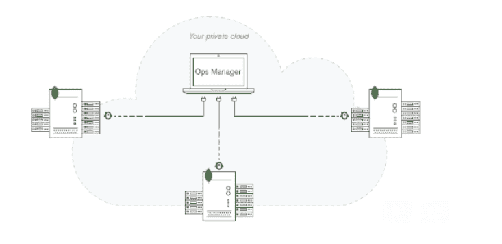
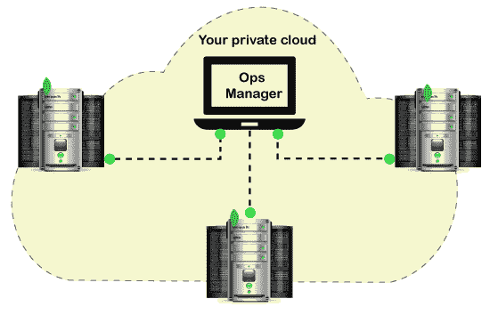
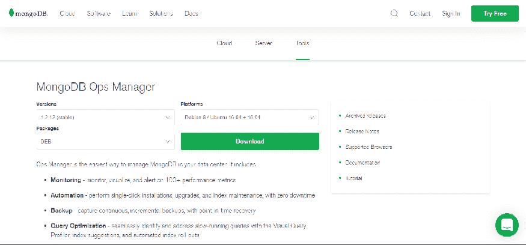

# 蒙古数据库操作管理器

> 原文：<https://www.javatpoint.com/mongodb-ops-manager>

使用操作管理器，我们可以监控、自动化和备份我们的 MongoDB 基础设施。

*   **自动化:**我们可以使用 Ops Manager 配置和维护 MongoDB 的节点和集群。
*   **监控:**我们可以使用运营管理器 monit 实时报告、可视化和获取警报
*   or 特征。
*   **备份:**我们的 MongoDB 分片集群和副本集的计划快照和时间点恢复由 Ops 管理器的备份工具提供。

### 运营管理器的服务器池

使用操作管理器服务器池，我们可以获得管理权限，即已经安装了由操作管理器管理员维护的自动化的调配服务器池。当我们想要创建新部署时，我们可以从服务器池中请求服务器来托管部署。

### 在微软视窗系统上安装操作管理器

**第 1 步:**以管理权限登录您的电脑，规划您的配置，部署满足 Ops Manager 系统要求的主机，并安装 Ops Manager 应用程序数据库和其他可选的备份数据库。

**步骤 2:** 现在，打开电脑上的任何可用浏览器，然后从 MongoDB 下载中心下载最新版本的 Ops Manager。

**步骤 3:** 下载完成后，在您用于操作管理器的所有服务器上安装操作管理器包。

**步骤 4:** 现在，使用管理员访问权限，在运行操作管理器的服务器上打开<配置日志路径>\服务器\配置\配置-彩信.属性。

**步骤 5:** 通过单击开始按钮→管理工具→服务→在列表中右键单击 MongoDB 操作管理器 [HTTP](https://www.javatpoint.com/http-full-form) 服务，启动操作管理器实例，最后，单击开始按钮。

**步骤 6:** 现在，在 Ops Manager 主页上注册第一个用户。

*   在浏览器中输入网址(http:// <host>:8080)打开运营管理器主页。</host>
*   之后，点击注册链接并按照提示操作。
*   第一个用户将被自动分配为全局所有者。

### 如何更新蒙古数据库操作管理器

您必须按照以下步骤升级运行在 Windows 操作系统上的操作管理器。

**第 1 步:**点击*开始*按钮→ *管理工具* → *服务* →然后右键点击 MongoDB 操作管理器 [HTTP](https://www.javatpoint.com/http-tutorial) 服务并选择停止，关闭您正在运行的操作管理器实例。

**步骤 2:** 现在，通过点击开始按钮→ *控制面板* → *程序和功能* →然后右键单击 MongoDB 操作管理器并选择卸载，卸载当前版本的操作管理器。

**步骤 3:** 卸载旧版本后，必须下载最新版本的 Ops Manager 包。

**步骤 4:** 在要升级的主机上，安装操作管理器。

**步骤 5:** 安装后，在升级后的主机上启动 Ops Manager。*启动* → *管理工具* → *服务* → *右键单击 MongoDB 运营管理器 HTTP 服务上的*，选择*启动*。

**步骤 6:** 现在，对部署中的所有其他 Ops Manager 主机重复该过程。

**第七步:**最后，升级完成后更新所有代理。

### 将副本集部署到操作管理器

副本集是所有生产部署体系结构的基本功能。是一组 [MongoDB](https://www.javatpoint.com/mongodb-tutorial) 部署，拥有相同的数据集。按照下面给出的步骤部署副本集。

**步骤 1:** 点击运营管理器的部署选项。

**步骤 2:** 现在，单击集群创建视图。然后系统会提示您进入新的弹出窗口。

**步骤 3:** 点击部署页面右上角的添加新箭头按钮。

**步骤 4:** 现在，要打开创建新副本集视图，请从下拉菜单中选择新副本集选项。

**步骤 5:** 选择副本集配置以配置群集范围的设置。您需要至少配置那些标有星号*的设置。

**步骤 6:** 之后，需要配置每个副本集成员。

**步骤 7:** 配置复制集成员后，配置您的复制设置。

**第 8 步:**最后，点击创建副本集选项。现在，您可以从“部署”视图中监视集群部署的进度。

### 在操作管理器中部署分片集群

分片集群将数据集分布在一组服务器上，为大型数据集提供水平扩展，并支持高吞吐量操作。

**部署分片集群的步骤:**

**第一步:**首先登录你的云管理器账号，在首页点击部署选项。

**步骤 2:** 现在，单击集群创建视图。然后系统会提示您进入新的弹出窗口。

**步骤 3:** 点击部署页面右上角的添加新箭头按钮。

**步骤 4:** 现在，要打开创建新集群菜单，请从下拉菜单中选择新集群。

**步骤 5:** 选择集群配置以配置集群范围的设置。您需要至少配置那些标有星号*的设置。

**步骤 6:** 现在，点击碎片设置，从成员配置中打开碎片配置选项。

**步骤 7:** 之后，配置集群中的每个配置服务器和 mongos。

**步骤 8:** 现在，从复制设置中，配置群集中的每个复制副本集。

**步骤 9:** 最后，点击创建集群按钮。

**步骤 10:** 您现在可以查看和部署您的更改。

### 将独立的蒙古数据库实例部署到操作管理器中

我们可以使用该实例进行测试和开发，为操作管理器部署一个独立的 MongoDB 实例。我们不能将这些部署系统用于生产系统，因为它们缺乏复制和开发。

**第一步:**首先登录你的云管理器账号，在首页点击部署选项。

**步骤 2:** 现在，单击新建独立。然后系统会提示您进入新的弹出窗口。

**第三步:**点击部署页面右上角的新增按钮。

**步骤 4:** 现在，要打开创建新独立菜单，请从下拉菜单中选择新建独立。

**步骤 5:** 选择独立配置以配置独立设置。您需要至少配置那些标有星号*的设置。

**步骤 6:** 现在，点击碎片设置，从成员配置中打开碎片配置选项。

**步骤 7:** 之后，配置集群中的每个配置服务器和 mongos。

**步骤 8:** 现在，从复制设置中，配置群集中的每个复制副本集。

**第 9 步:**最后，点击创建独立按钮。

**步骤 10:** 您现在可以查看和部署您的更改。

* * *