# MongoDB 罗盘

> 原文：<https://www.javatpoint.com/mongodb-compass>

MongoDB 指南针是 MongoDB 的一个图形用户界面。它也被称为 MongoDB 图形用户界面。MongoDB 允许用户在没有任何 MongoDB 查询语法的先验知识的情况下分析他们存储的数据的内容。当我们在可视化环境中探索数据时，我们可以使用 Compass GUI 来优化性能、管理索引和实现文档验证。

[MongoDB](https://www.javatpoint.com/mongodb-tutorial) Compass 的所有版本都是开源的(即我们可以自由部署和查看所有 MongoDB GUI 版本的存储库)。MongoDB compass 的源存储库可以在 GitHub 的以下链接中找到

[https://github . com/mongbd-js/compass/](https://github.com/mongodb-js/compass/)

## 可用指南针版本

MongoDB [GUI](https://www.javatpoint.com/gui-full-form) 有以下四个版本:

*   Compass 社区:这个版本是为 MongoDB 开发而设计的，包含了 Compass 的一部分特性。
*   指南针:它作为 MongoDB 指南针的完整版本发布。它包括了 MongoDB 提供的所有特性和功能。
*   随机罗盘:它仅限于读取操作，所有更新和删除功能都被移除。
*   compass Isolated:MongoDB compass 的隔离版除了向 MongoDB GUI 连接的 MongoDB 服务器发出请求外，不启动任何网络请求。它设计用于高度安全的环境。

## 如何下载和安装 MongoDB 指南针

**第一步:**下载 MongoDB Compass，可以使用自己喜欢的网页浏览器，打开[https://www.mongodb.com/download-center/compass?jmp=docs 页面](https://www.mongodb.com/download-center/compass?jmp=docs)。

**第二步:**需要选择自己喜欢的安装程序和版本。图形用户界面安装程序可作为. exe 或。msi 包或. zip 存档。

**第三步:**最后，点击下载按钮。

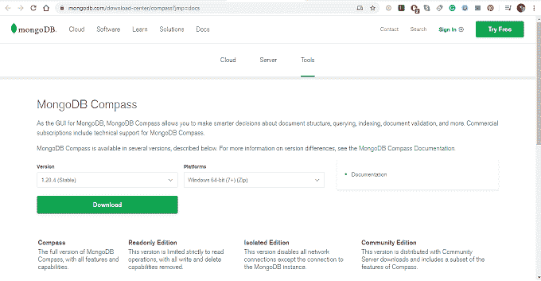

**步骤 4:** 下载完成后点击安装程序文件。

**第五步:**按照弹出窗口安装 MongoDB Compass GUI。

**第六步:**安装完成后，它会启动并要求您配置隐私设置和指定更新首选项。

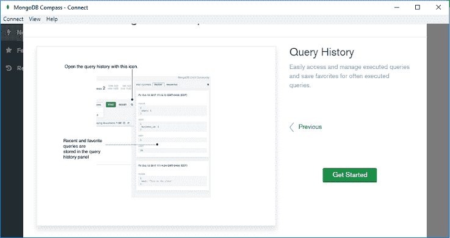

## 更新 MongoDB 罗盘

我们有两种方法可以使用 MongoDB Compass 的更新版本

1.我们可以随时从 MongoDB 官网下载安装最新发布的 MongoDB GUI 版本。我们需要检查我们的操作系统和所需版本的 MongoDB 指南针的软件和硬件要求，以确保指南针图形用户界面与我们的系统兼容。

2.我们可以从帮助->隐私设置中启用自动更新来更新指南针，如下所示。

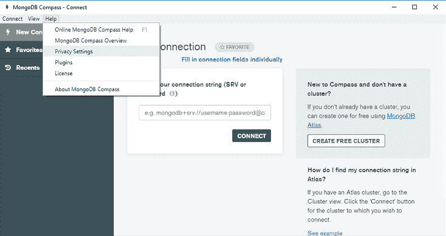 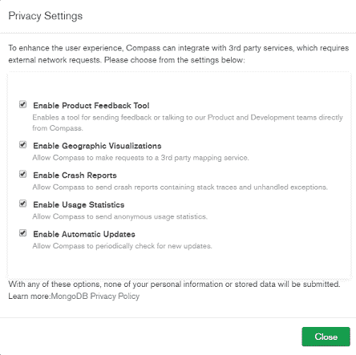

## 正在与 MongoDB 指南针建立连接。

在 MongoDB compass 中连接我们的部署有两种方法，要么我们可以使用 [MongoDB Atlas](https://www.javatpoint.com/mongodb-atlas) 上提供的连接字符串，要么我们可以在指定的字段中填充我们的部署信息。

**通过粘贴连接字符串。**

**第一步:**登录指南针后，会出现初始对话。

**步骤 2:** 要获取 Atlas 集群的部署连接字符串，请转到您的 Atlas 集群视图。

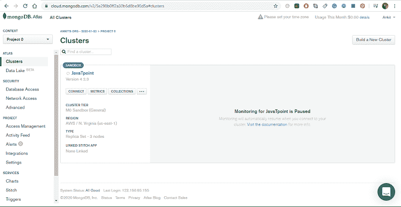

**步骤 3:** 单击要连接的集群的连接。

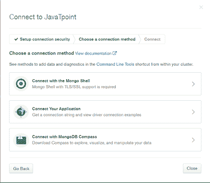

**第 4 步:**之后，点击“用 MongoDB Compass 连接”，复制提供的连接字符串。

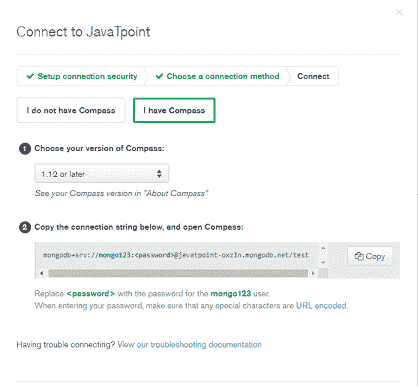

**第五步:**点击连接按钮，连接并导航至指南针图形用户界面主页。

Compass 主页屏幕显示 Compass 所连接的 MongoDB 实例的详细信息，包括连接名称、部署类型、主机名和端口、MongoDB 版本、性能统计信息以及实例数据库列表。

## 使用指南针创建和管理数据库

当您连接到 MongoDB 地图集或 MongoDB 外壳时，将出现以下窗口。在此窗口中，您可以看到数据库选项卡。“数据库”窗口显示您的 MongoDB 部署的所有现有数据库的列表。

在上面的窗口中，当您从给定列表中选择一个数据库以查看其集合时。当您在左侧导航窗格中单击所需的数据库时，可以查看数据库集合。

## 在指南针中创建数据库

**步骤 1:** 点击数据库选项卡中的创建数据库按钮。它将带您进入**创建数据库**弹出对话框。

**第二步:**在出现的弹出窗口中，填写数据库和集合名称，新建一个数据库。

**第三步:**最后点击 ***创建数据库*** 按钮，创建数据库和集合。

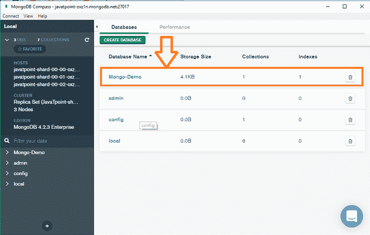

**在指南针中放置数据库**

**步骤 1:** 单击当您将鼠标悬停在数据库名称上时出现的垃圾桶图标，之后会出现一个确认对话框。

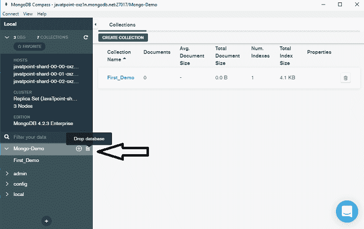

**步骤 2:** 在弹出窗口中，输入要删除的数据库的名称。

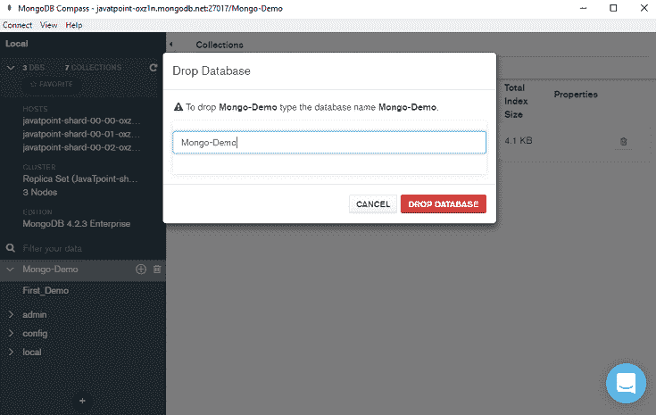

**第三步:**最后，点击删除数据库按钮，删除选中的数据库。

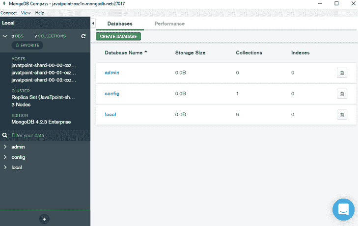

## MongoDB 罗盘中的集合

“集合”窗口显示您选择的数据库中所有现有集合和视图的列表。它包括所选集合或视图的所有名称和其他相关信息。

如果要访问数据库集合，请单击主数据库视图中的数据库名称，或单击左侧导航窗格中的数据库。

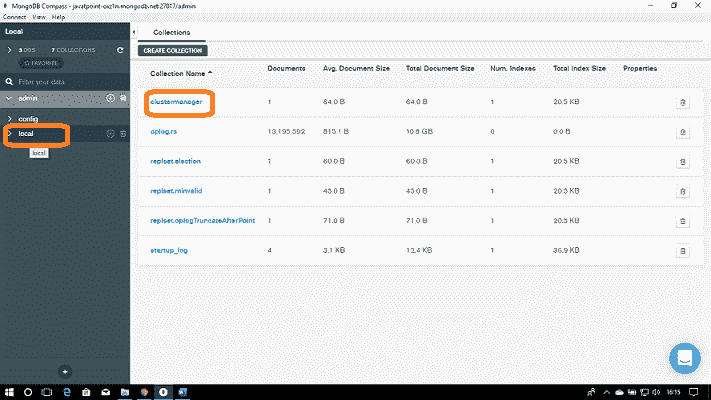

集合窗口显示集合名称、文档数、大小、索引数、索引大小和集合的排序规则属性等信息。

## 在 MongoDB 罗盘中创建集合

**第一步:**点击 ***创建收藏*** 按钮。

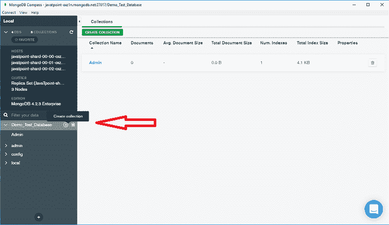

**第二步:**之后，在 ***创建收藏*** 对话框中填写收藏详情。

**第三步:**现在，点击 ***创建收藏*** 创建收藏

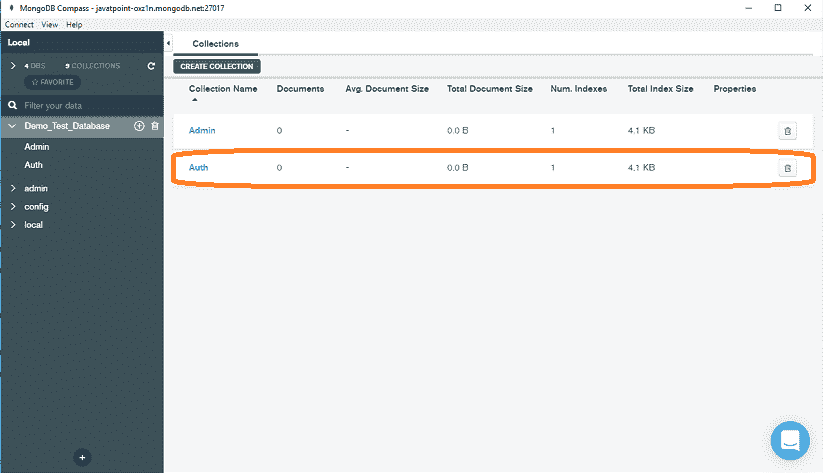

## 删除收藏

**第一步:**在收藏窗口中，点击要删除的收藏的 bin 图标。当您单击垃圾桶图标时，会出现一个对话框要求您确认。

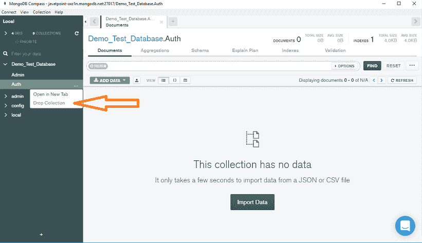

**第二步:**在出现的弹出对话框中，输入要从数据库中删除的收藏名称。

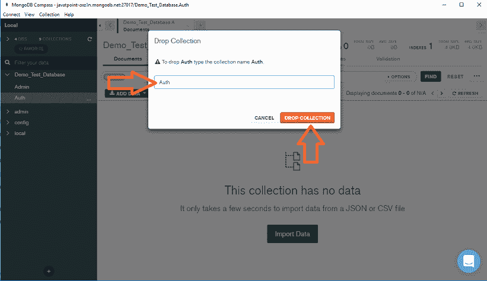

**第三步:**最后，点击删除收藏按钮，删除收藏。

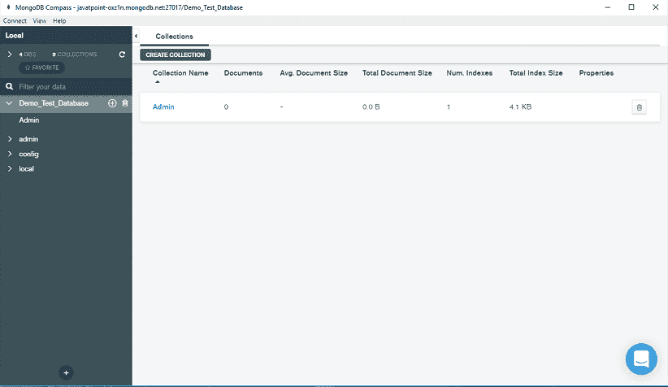

## 管理 MongoDB 罗盘中的文档

文档是 MongoDB 集合中的记录。文档是 MongoDB 中数据的基本单位。使用文档选项卡，我们可以在选定的集合或视图中执行以下任务:

*   **查看文档:**文档选项卡提供了三种方式来访问 MongoDB Compass 中的文档。
    我们可以使用视图按钮选择我们想要使用的视图:
    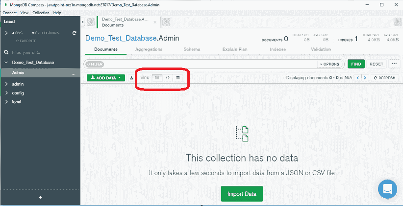
    *   **列表视图** -是 MongoDB 指南针中数据库的默认视图。文档将显示为列表中的单个成员。在列表视图中，您可以轻松扩展嵌入的对象和数组。
    *   **JSON 视图** -在该视图中，文档将显示为完全格式化的 JSON 对象。在这个视图中，MongoDB Compass 使用扩展的 JSON 来显示使用正确数据类型的字段的数据类型。
    *   **表格视图** -表格视图将文档显示为表格行。文档字段在表中显示为一列。当我们使用表视图时，我们可以很容易地找到包含特定字段值的文档。We can use View buttons to select which view we want to use:
*   **插入文档:**我们有两种方法可以将文档插入到我们的收藏中:

    *   **JSON 模式:**允许在编辑器中编写或粘贴 JSON 文档。您可以使用此模式在数据库中一次插入一个或多个文档作为数组。
    *   **逐字段编辑器:**使用该编辑器可以以更具交互性的方式创建文档。它允许您选择所有字段值和类型。它一次只支持插入一个文档。
*   **修改文档:**可以更新集合中已有的文档。当您对文档进行更改时，MongoDB Compass 会执行查找和修改操作来更新现有文档。
*   **克隆文档:**您可以通过克隆(即制作文档的完全相同的副本)来插入新文件和文档。您可以复制集合中现有文档/文件的架构和值。
*   **删除文档:**我们可以删除文档/文件，具体取决于我们是在列表视图、JSON 视图还是表格视图中查看我们的文档。

* * *