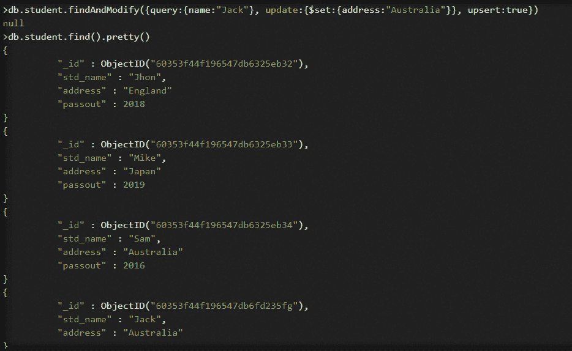
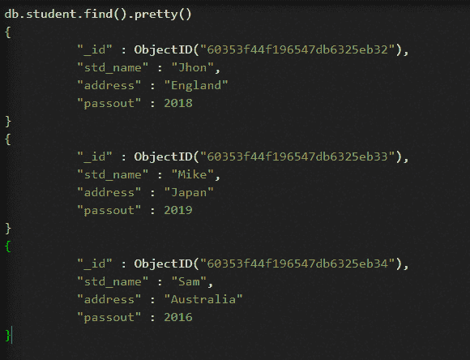
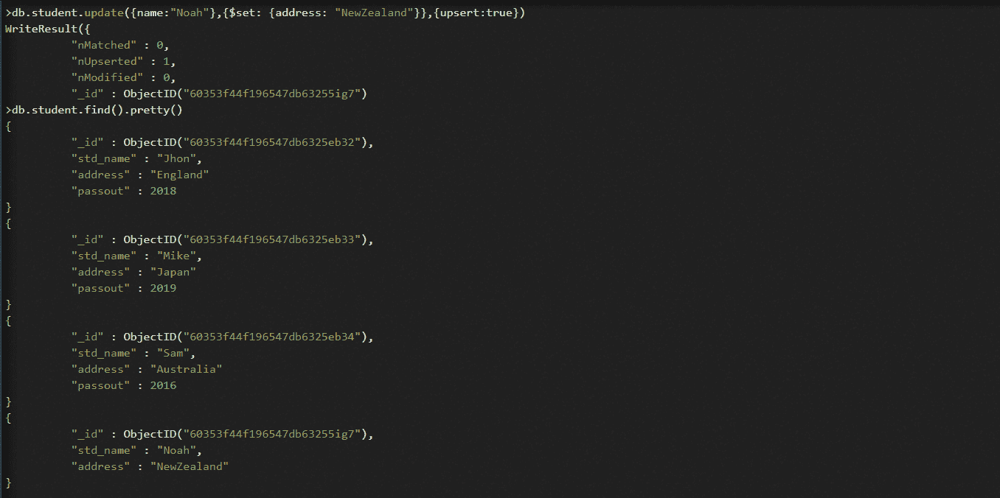
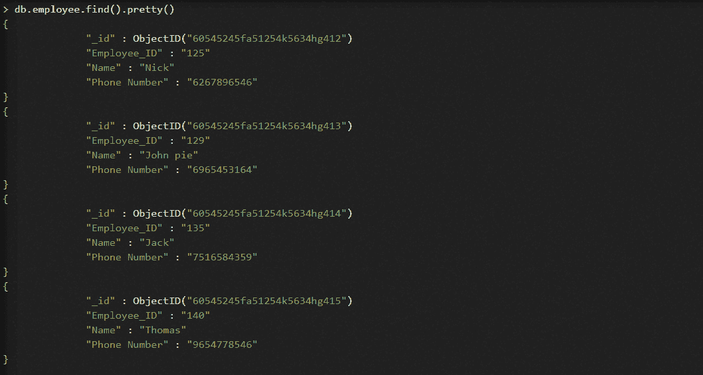
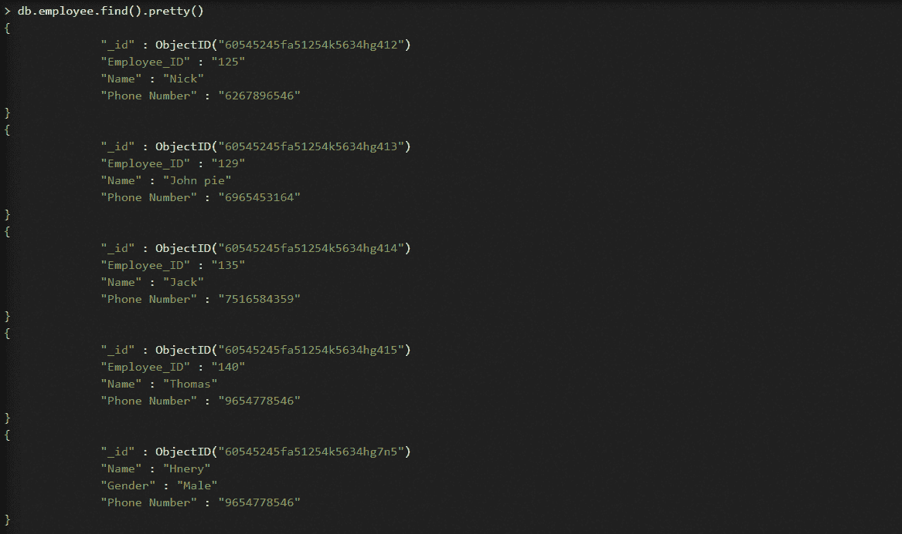

# MongoDB Upsert

> 原文：<https://www.javatpoint.com/mongodb-upsert>

## 介绍

在 MongoDB 中，upsert 是一种用于在任何操作中插入和更新值的方法。换句话说，MongoDB 向上插入方法是插入和更新的组合(插入+更新=向上插入)。默认情况下，upsert 方法的值始终为 false。如果文档与指定的查询匹配，并且方法的值设置为 true，则更新操作将更新匹配的文档。如果文档与指定的查询不匹配，并且方法的值设置为 true，则此方法会在集合中插入一个新文档。这个新文档包含指示操作的字段。

### 语法:

```

upsert: <boolean>

```

upsert 选项的值将为真或假。

## 使用 with 和 Modify()函数进行追加:

用户可以结合 find 和 Modify()函数使用 upsert 选项。在此函数中，选项的默认值为 false。如果该选项的值设置为 true，该函数将执行以下操作之一:

1.  如果找到符合给定查询条件的文档，findAndModify()函数将更新该文档。
2.  如果没有符合给定查询条件的文档，findAndModify()函数会将新文档插入集合中。

**语法:**

```

db.Collection_name.findAndModify(
{
    selection_criteria:<document>,
    sort: <document>,
    remove: <boolean>,
    update: <document>,
    new: <boolean>,
    fields: <document>,
    upsert: <boolean>,
    bypassDocumentValidation: <boolean>,
    writeConcern: <document>,
    collation: <document>,
    arrayFilters: [ <filterdocument1>, ? ]
})

```

**例如:**

在这个例子中，我们使用

```

Database: javatpoint
Collection: student
Database: three documents that contain details of students

```

```

db.student.find().pretty()
{
          "_id" : ObjectID("60353f44f196547db6325eb32"),
          "std_name" : "Jhon",
          "address" : "England"
          "passout" : 2018
}
{
          "_id" : ObjectID("60353f44f196547db6325eb33"),
          "std_name" : "Mike",
          "address" : "Japan"
          "passout" : 2019
}
{
          "_id" : ObjectID("60353f44f196547db6325eb34"),
          "std_name" : "Sam",
          "address" : "Australia"
          "passout" : 2016
}

```


现在，我们将通过将 upsert 选项设置为 true，在学生集合中插入一个新文档。

```

db.student.findAndModify({query:{name:"Jack"}, 
                            update:{$set:{address:"Australia"}},
                            upsert:true})

```

在这里，没有数据与名称“jack”匹配，因此 findAndModify()函数会插入一个包含两个字段(即“名称”和“地址”)的新文档，因为 upsert 方法的值设置为 true。



## 带有 update()功能的升级:

您可以将 upsert 选项与 update()函数结合使用。在此函数中，选项的默认值为 false。如果该选项的值设置为 true，该函数将执行以下操作之一:

1.  如果找到符合给定查询条件的文档，update()函数将更新该文档。
2.  如果没有符合给定查询条件的文档，update()函数会将新文档插入集合中。

**语法:**

```

db.Collection_name.update({Selection_criteria}, {$set : {Update_data}}, {
     upsert : <boolean>,
     multi : <boolean>,
     writeConcern : <document>,
     collation : <document>,
     arrayFilters : [ <filterdocument1>, . . . ? ],
     hint :  <document|string>        
   })

```

**例如:**

在这个例子中，我们使用

```

Database: javatpoint
Collection: student
Database: three documents that contain details of students

```

```

db.student.find().pretty()
{
          "_id" : ObjectID("60353f44f196547db6325eb32"),
          "std_name" : "Jhon",
          "address" : "England"
          "passout" : 2018
}
{
          "_id" : ObjectID("60353f44f196547db6325eb33"),
          "std_name" : "Mike",
          "address" : "Japan"
          "passout" : 2019
}
{
          "_id" : ObjectID("60353f44f196547db6325eb34"),
          "std_name" : "Sam",
          "address" : "Australia"
          "passout" : 2016
}

```



现在，我们将通过将 upsert 选项设置为 true，在学生集合中插入一个新文档。

```

db.employee.update({name:"Priya"}, {$set: {department: "HR"}},{upsert:true})

```

在这里，没有数据与名称“诺亚”匹配，因此 update()函数插入一个包含两个字段(即“名称”和“地址”)的新文档，因为 upsert 方法的值设置为 true。



## 用运算符表达式追加:

如果文档与给定的数据不匹配，并且 upsert 选项的值设置为 true，则更新操作将根据给定查询参数中的相似性子句创建新文档，并应用更新参数中的表达式。

**例如:**

在这个例子中，我们使用

```

Database: javatpoint
Collection: employee
Database: four documents that contain details of employees

```

```

> db.employee.find().pretty()
{
              "_id" : ObjectID("60545245fa51254k5634hg412")
              "Employee_ID" : "125"
              "Name" : "Nick"
              "Phone Number" : "6267896546"
}
{
              "_id" : ObjectID("60545245fa51254k5634hg413")
              "Employee_ID" : "129"
              "Name" : "John pie"
              "Phone Number" : "6965453164"
}
{
              "_id" : ObjectID("60545245fa51254k5634hg414")
              "Employee_ID" : "135"
              "Name" : "Jack"
              "Phone Number" : "7516584359"
}
{
              "_id" : ObjectID("60545245fa51254k5634hg415")
              "Employee_ID" : "140"
              "Name" : "Thomas"
              "Phone Number" : "9654778546"
}

```



现在，我们将通过将 upsert 选项的值设置为 true，在 Employees 集合中插入一个新文档。

```

db.employee.update({Name: "Hnery"},   // Query parameter  
                  {$set: {Phone Number: '9654785423 '}, // Update document
                   $setOnInsert: {Gender: 'Male'}},
                  {upsert: true})

```

这里，update()方法根据查询条件创建一个字段为“Name : Hnery”的新文档，然后对该文档应用$set 和$ setOnInsert 操作。



* * *