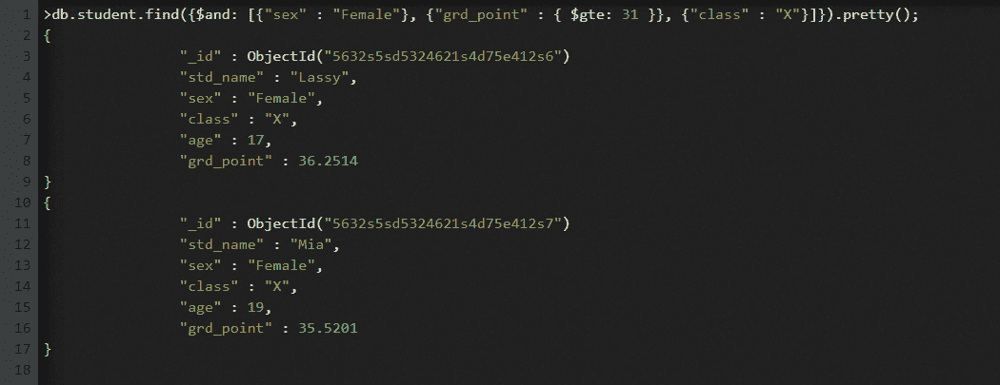

# MongoDB $和运算符

> 原文：<https://www.javatpoint.com/mongodb-and-operator>

## 介绍

MongoDB 提供了多种逻辑查询操作符。$and 运算符就是其中之一。$and 运算符用于对一个或多个表达式的数组执行逻辑与运算。用户可以在 find()、update()等方法中使用该运算符。，按照他们的要求。

用户也可以在逗号(，)的帮助下使用“与运算”。$and 运算符使用短路评估。当用户在多个表达式中指定相同的字段或运算符时，用户可以使用“$AND”操作。

例如，假设两个表达式(e1 和 e2)。如果第一个表达式(e1)被评估为假，那么第二个表达式(e2)将不被评估。

### 语法:

```js

{ $and: [ { Expression 1 }, { Expression 2 }, { Expression 3 }, ..., { Expression N } ] }
or
{ { Expression 1 }, { Expression 2 }, { Expression 3 },..., { Expression N }}

```

### 示例:

在以下示例中，我们正在使用:

```js

Database: JavaTpoint
Collection: Student
Document: Six documents that contain the details of the students

```

```js

[
        {
                "std_name" : "Jack",
                "sex" : "Male",
                "class" : "VI",
                "age" : 11,
                "grd_point" : 33
        },
        {
                "std_name" : "Jenny",
                "sex" : "Female",
                "class" : "VI",
                "age" : 13,
                "grd_point" : 30
        },
        {
                "std_name" : "Thomas",
                "sex" : "Male",
                "class" : "V",
                "age" : 11,
                "grd_point" : 35.1257
        },
        {
                "std_name" : "Lassy",
                "sex" : "Female",
                "class" : "X",
                "age" : 17,
                "grd_point" : 36.2514
        },
        {
                "std_name" : "Mia",
                "sex" : "Female",
                "class" : "X",
                "age" : 19,
                "grd_point" : 35.5201
        }
       {
                "std_name" : "Mike,
                "sex" : "Male",
                "class" : "V",
                "age" : 16,
                "grd_point" : 35.5201
        }
]

```

**使用$和运算符匹配两个条件值:**

在本例中，我们只从符合以下条件的学生那里获取文档:

1.  这个学生的“班级”是六年级。
2.  学生的“性别”是女性。

```js

>db.student.find({$and: [{"sex" : "Female"}, {"class" : "VI"}]}).pretty();

```

**SQL 等效命令:**

```js

SELECT * 
FROM student 
WHERE sex = "Female" AND class = "VI";

```

**输出:**


#### 注意:find()方法以非结构化的格式显示文档，因此它使用漂亮的()方法以格式化的方式显示结果。

**使用$和运算符**匹配多个条件值:

在本例中，我们只从符合以下条件的学生那里获取文档:

1.  学生的“年龄”是 17 岁。
2.  学生的“性别”是女性。
3.  学生的“班级”是 x。

```js

>db.student.find({$and: [{"sex" : "Female"}, {"grd_point" : { $gte: 31 }}, {"class" : "X"}]}).pretty();

```

**SQL 等效命令:**

```js

SELECT * 
FROM student 
WHERE sex = "Female" AND grd_point >= 31 AND class = "X";

```

**输出:**



* * *