# 在 Windows 上安装 PostgreSQL

> 原文：<https://www.javatpoint.com/install-postgresql>

PostgreSQL 是当今行业广泛使用的最流行的关系数据库管理软件之一。它通过各种存储引擎提供多用户访问支持。

本章我们将学习初学者如何在 [Windows](https://www.javatpoint.com/windows) 平台上下载安装 PostgreSQL。

**先决条件**

以下是在我们的计算机系统中下载最新版本的 [PostgreSQL](https://www.javatpoint.com/postgresql-tutorial) 所需的系统要求:

*   PostgreSQL 安装软件
*   内存 2GB(推荐 4 GB)
*   64 位微软视窗 10

## 下载 PostgreSQL

按照以下步骤下载 PostgreSQL:

**第一步**

*   前往 PostgreSQL 官方网站([https://www.postgresql.org/](https://www.postgresql.org/))点击**下载**

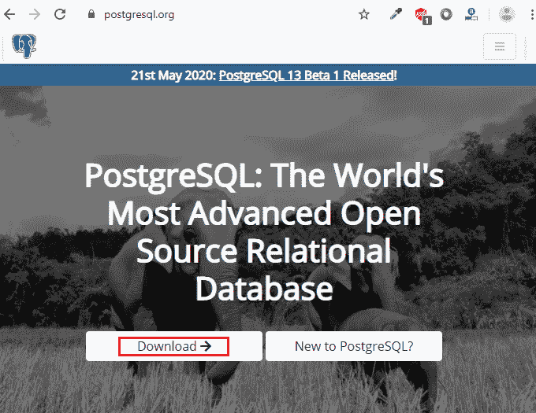

**第二步**

*   一旦我们点击下载按钮，我们将看到选择操作系统的选项，如窗口。

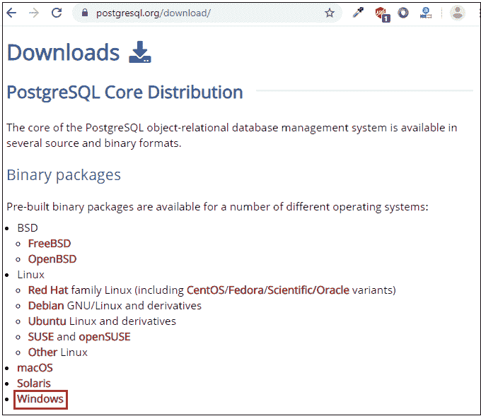

**第三步**

*   一旦我们选择了操作系统，下面的窗口就会打开，在这里我们点击**下载安装程序链接**。

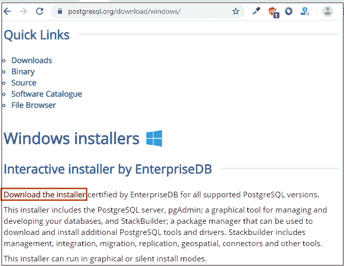

**第四步**

*   之后，我们将根据自己的需求选择 PostgreSQL 的**最新版本(12.3)** ，以及操作系统 **(Windowsx86-64 位)**，点击**下载**按钮。

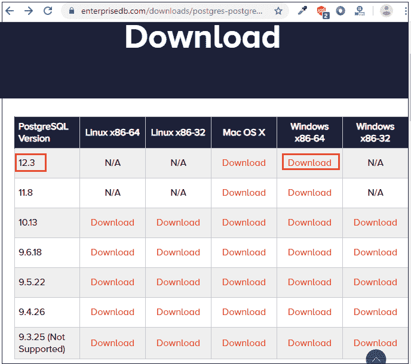

#### 注意:如果下载过程没有通过单击下载按钮开始，请单击立即开始下载链接，如下图所示:

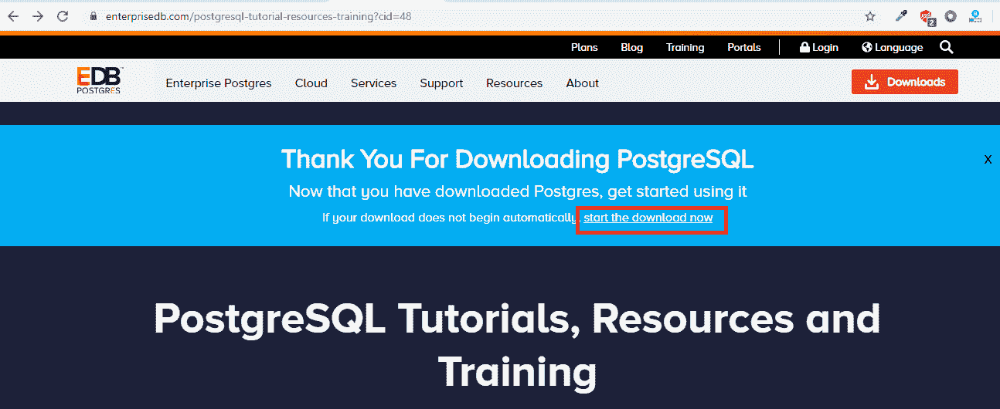

**第五步**

*   并且，它将开始下载**Postgresql-12.3-1-windows-x64**exe 文件，如下图所示:

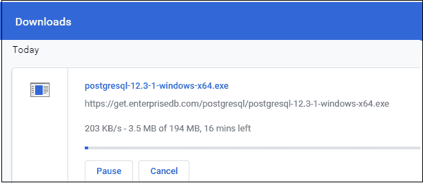

#### 注意:在我们开始安装 PostgreSQL 之前，请确保我们的本地系统中有活动的互联网连接，并且在安装时应该关闭第三方防病毒软件。

## 在 Windows 上安装 PostgreSQL

在我们可以使用 PostgreSQL 之前，我们需要安装它。要安装 PostgreSQL，请执行以下步骤:

**第一步**

*   下载设置后，在任何地方解压，以管理员身份双击**Postgresql-12.3-1-windows-x64.exe 文件**安装 PostgreSQL。
*   点击**设置**窗口中的**下一步**按钮，开始安装过程，如下图所示:

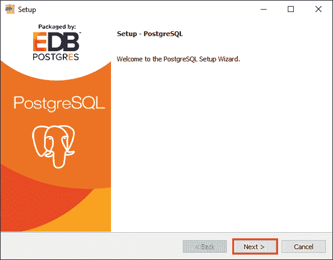

**第二步**

*   之后点击浏览器按钮选择**安装目录**，然后点击**下一步**按钮进行下一步操作:

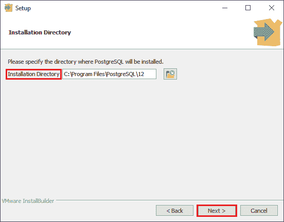

**第三步**

*   然后我们可以**选择我们想要安装在我们系统中的组件**，点击**下一步**按钮查看更多过程，如下图所示:

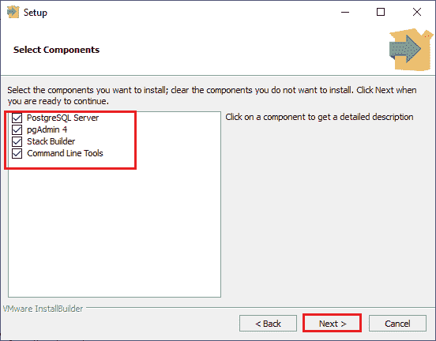

**第四步**

*   一旦我们选择了组件，我们就要去**选择一个目录**来存储数据。默认情况下，它存储在**数据目录**下。然后点击**下一步**按钮。

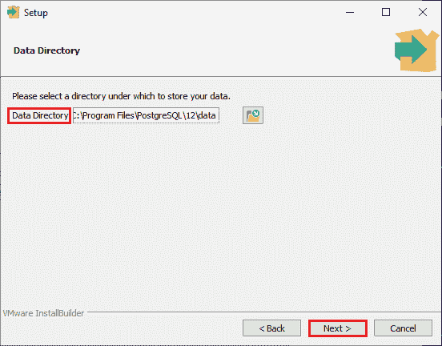

**第五步**

*   在设置窗口的下一步，我们需要为超级用户(postgre)提供一个**密码**。因此，我们设置自己选择的密码，点击**下一步**按钮进入下一步。

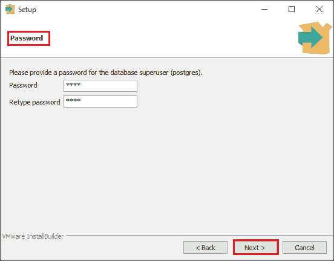

**第六步**

*   提供密码后，屏幕上会出现**端口**窗口，保持**端口**为默认(**5432)**，点击**下一步**按钮，如下图截图所示:

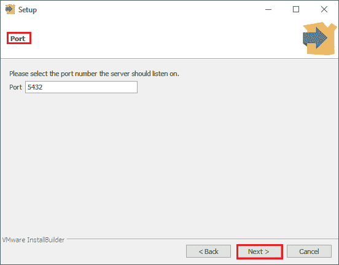

**第七步**

*   下一步，我们需要在给定的下拉列表中选择新数据库集群使用的 **Locale** 。在这里，我们选择**英语，印度**，然后点击**下一步**按钮，如下图所示:

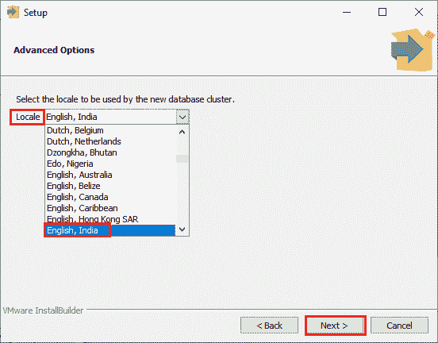

**第八步**

*   在下一个窗口中，将打开**预安装摘要**窗口，我们可以在其中验证我们在上面所做的修改，并点击**下一步**按钮进行进一步处理。

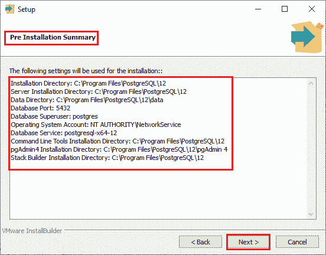

**第九步**

*   完成以上所有步骤后，我们就**准备在我们的计算机系统中安装**PostgreSQL 了。然后我们点击**下一步**按钮开始安装。

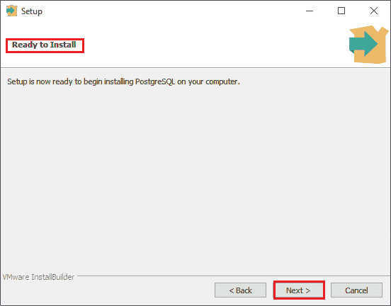

**第 10 步**

*   一旦我们点击下一步按钮，**安装过程开始**，如下图截图所示:

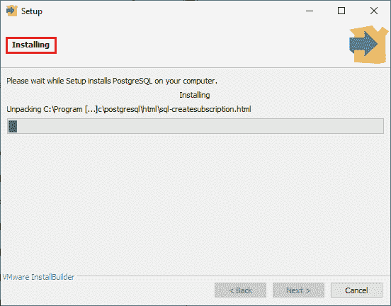

**第 11 步**

*   安装过程完成后，我们将看到**堆栈生成器**提示屏幕，在该屏幕中，我们取消选中复选框并单击**完成**按钮。

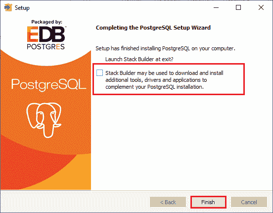

**第 12 步**

*   安装完成后，我们将在系统中启动 PostgreSQL。为此，我们将进入**开始菜单**并搜索 **pgAdmin 4、**并点击**以管理员身份运行**以打开 pgAdmin 4。

#### 注意:在 PostgreSQL 中，pgAdmin4 是一个管理工具，它是从作为企业数据库的 e DB 高级服务器的关系数据库中派生出来的。它用于执行 web 应用程序或桌面应用程序。它支持各种浏览器，我们可以在其中执行查询，支持的浏览器有 Edge 44+、Chrome 72+、Safari 12+、Firefox 65+。

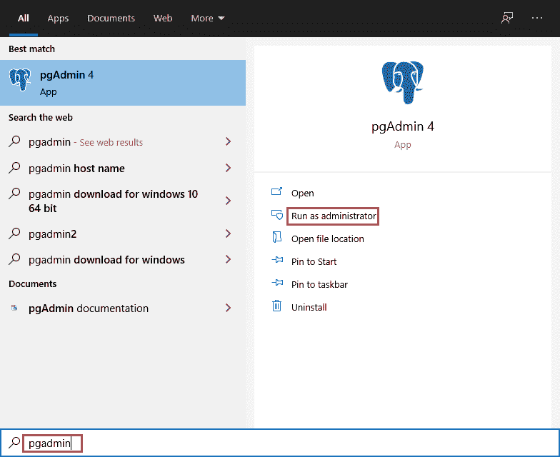

**第 13 步**

*   PgAdmin4 一旦打开，出于安全考虑，会要求**设置主密码**。提供主密码后，点击**确定**按钮，如下图所示:

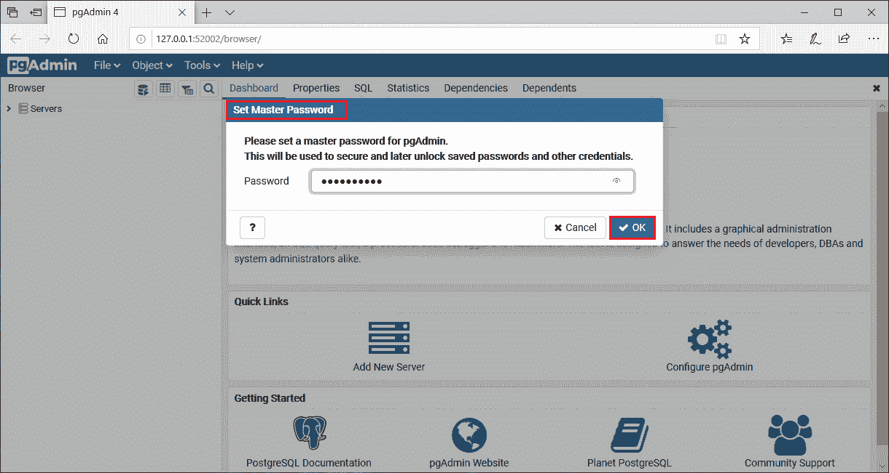

**第 14 步**

*   之后可以看到 pgAdmin4 的**主页。然后，我们要去**连接服务器**。为此，我们将点击左侧的**服务器→ PostgreSQL12.3** 。**
*   要连接服务器，我们需要给出**超级用户密码**，这是我们在安装过程中设置的，然后点击**确定**按钮。

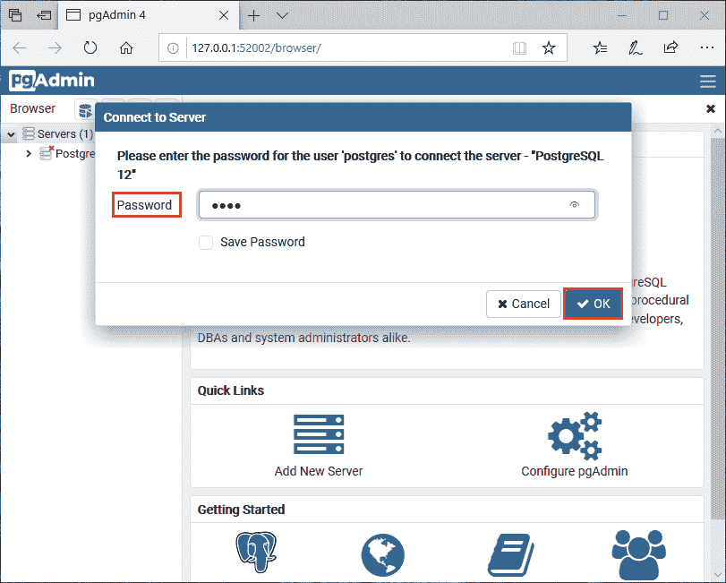

**第 15 步**

*   之后，我们可以在电脑屏幕上看到**仪表盘**，如下图所示:

现在，我们已经为 PostgreSQL 数据库编程做好了环境准备。

* * *