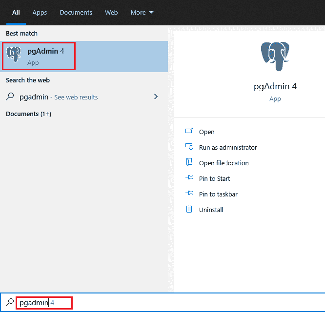
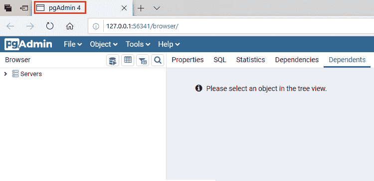
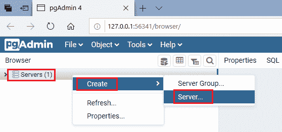
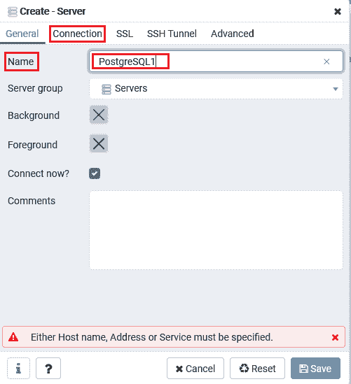
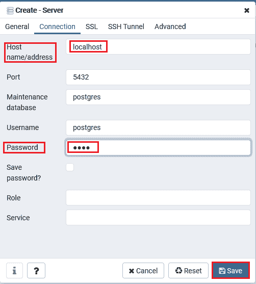
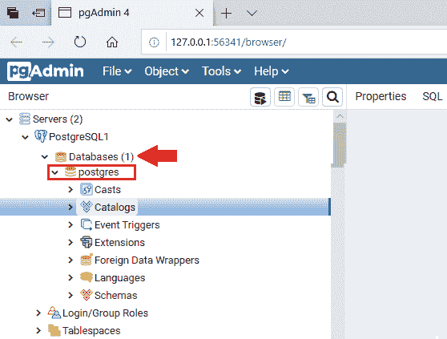
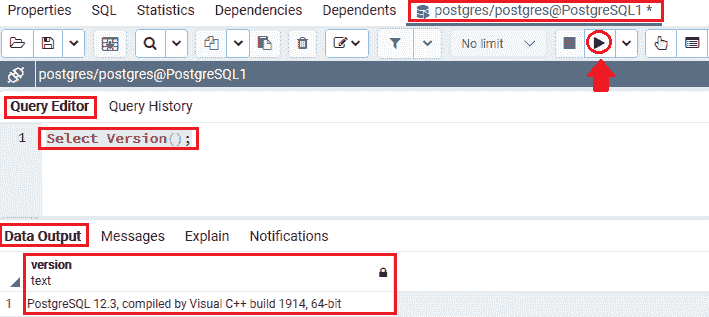
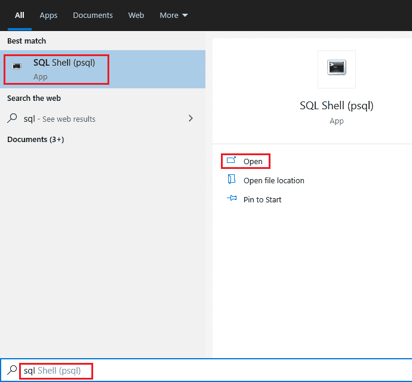
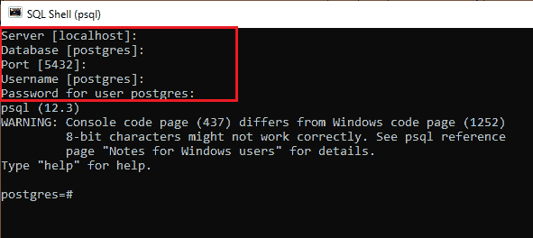
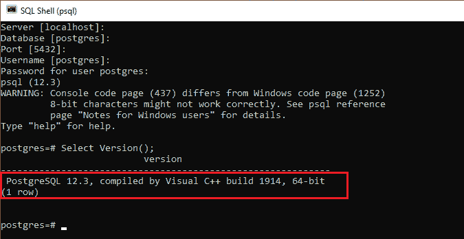

# 连接到 PostgreSQL 数据库服务器

> 原文：<https://www.javatpoint.com/connect-to-a-postgresql-database-server>

在本节中，我们将了解如何通过名为 **pgAdmin** 的交互式终端软件连接 **PostgreSQL 数据库服务器和 **SQL Shell(psql)** 应用程序。**

如果我们安装了 PostgreSQL 数据库服务器，那么 PostgreSQL 安装程序还会连接一些有益的工具来通过 PostgreSQL 数据库服务器工作。

在这里，我们将讨论如何通过以下工具连接 PostgreSQL 数据库服务器:

*   **PgAdmin**
*   **SQL Shell (PSQL)**

**PgAdmin:** 是一款基于 web 的 [PostgreSQL](https://www.javatpoint.com/postgresql-tutorial) 前端管理工具，帮助我们连接 **PostgreSQL 数据库服务器。**

**SQL shell(psql):** 是一个基于终端的前端应用，我们也可以用这个应用连接 **PostgreSQL 数据库服务器**。

我们现在将借助 **pgAdmin** 连接 PostgreSQL 数据库服务器。

*   **使用 pgAdmin** 连接到 PostgreSQL 数据库服务器

首先，我们将了解如何借助 pgAdmin 应用程序连接到数据库。

pgAdmin 工具允许我们通过**内置用户界面**与 PostgreSQL 数据库服务器建立联系。这里，我们使用 **pgadmin4 版本**来连接数据库。

我们将按照以下步骤使用 **pgAdmin GUI 工具连接 PostgreSQL 数据库服务器:**

**步骤 1:启动 pgAdmin 应用程序**

首先，我们将打开 **pgAdmin** 应用程序。为此，我们将在系统的搜索栏中输入 **pgAdmin** ，如下图所示:



点击 **pgAdmin** 应用后，会在网页浏览器上启动，如下图截图所示:



**步骤 2:创建服务器**

之后，我们将右键单击**服务器**节点，选择**创建→服务器……**菜单**创建服务器**，如下图所示:



**步骤 3:提供服务器名称**

选择**服务器**选项后，将打开**创建-服务器**窗口，在**名称栏中输入**服务器名称**，例如 PostgreSQL1** ，然后点击**连接**选项卡，如下图:



**第四步:提供主机和密码**

点击**连接选项卡**后，我们会为 **Postgres** 用户提供**主机**和**密码**的详细信息，之后我们会点击**保存**按钮。



**步骤 5:扩展服务器**

下一步，我们将点击**服务器节点**到**展开服务器**。默认情况下，PostgreSQL 有一个名为 **Postgres** 的数据库，如下图所示:



**第六步:打开查询工具**

现在，我们将通过选择菜单项**工具→查询工具、**来打开**查询工具**,或者我们可以直接单击**浏览器、**附近的**查询工具**图标，如下图所示:


**第七步:在查询编辑器**中输入命令

一旦**查询工具**打开成功，我们将在**查询编辑器**中输入以下命令，点击**执行**按钮。

```sql

Select Version();

```

执行上述命令后，我们将获得指定命令的**数据输出**，显示当前使用的 **PostgreSQL** 的**版本**的完整信息，如下图所示:



通过 pgAdmin4 了解 **PostgreSQL 数据库服务器的连接后，我们将学习 **PostgreSQL 数据库服务器使用 SQL Shell(psql)的连接过程。****

*   **使用 psql 连接到 PostgreSQL 数据库服务器**

**psql** 是 PostgreSQL 提供的**交互外壳工具**。psql 允许我们与 PostgreSQL 数据库服务器**相关联，例如，处理数据库对象**和**实现 [SQL](https://www.javatpoint.com/sql-tutorial) 命令**。

要使用 **[SQL shell(psql)](https://www.javatpoint.com/psql-commands)** 应用程序连接到 PostgreSQL 数据库服务器，我们将遵循以下步骤:

**第一步:打开 psql**

首先，我们将在本地系统中打开 **psql** 。为此，我们将前往**首页**按钮，搜索 **SQL shell(psql)** 并点击**打开**按钮，如下图截图所示:



**步骤 2:连接数据库**

一旦 **SQL shell** 打开，我们将按回车键**四到五次。**

然后为用户(我们之前创建的)提供**密码**，使用 **Postgres** 用户连接数据库服务器，该用户在 PostgreSQL 中默认为**用户，如下图截图所示:**

**

#### 注意:如果我们想手动提供服务器、数据库、端口、用户名和密码等所有详细信息，我们将按回车键，应用程序将使用方括号[]中定义的默认值，并将箭头移动到新行。

假设我们将 **localhost** 作为默认的数据库服务器，并且我们提供了 **Postgres 用户密码**，我们将在整个[Postgres SQL 安装过程中为 Postgres 用户指定输入一个类似的密码](https://www.javatpoint.com/install-postgresql)。

**步骤 3:输入与 PostgreSQL 数据库服务器相关的命令**

在这一步中，我们将编写一个 SQL 命令，帮助我们与 PostgreSQL 数据库服务器建立联系。

在下面的命令中，我们试图获得关于 PostgreSQL 当前版本的完整细节:

```sql

SELECT version();

```

实现或按下**回车键**后，我们会得到如下输出，其中显示了我们系统现有版本 PostgreSQL 版本的完整信息:



#### 注意:在 psql 中编写命令时，我们应该确保指定的命令以分号(；).

*   **从其他应用程序连接 PostgreSQL 数据库**

如果 ODBC 或 [JDBC](https://www.javatpoint.com/java-jdbc) 支持的任何应用程序也可以连接到 PostgreSQL 数据库服务器。

此外，当我们开发一个使用显式驱动程序的应用程序时，特定的软件也可以连接到 PostgreSQL 数据库服务器。

比如我们可以从 [JAVA](https://www.javatpoint.com/java-tutorial) 连接 PostgreSQL，从 Python 连接 PostgreSQL，从 [PHP](https://www.javatpoint.com/php-tutorial) 连接 PostgreSQL。

### 概观

在本节中，我们已经通过使用 **pgAdmin GUI 程序**和 **SQL Shell(psql)** 通过不同的客户端工具了解了 PostgreSQL 数据库服务器的连接。

* * ***