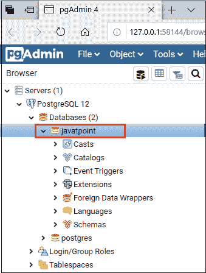
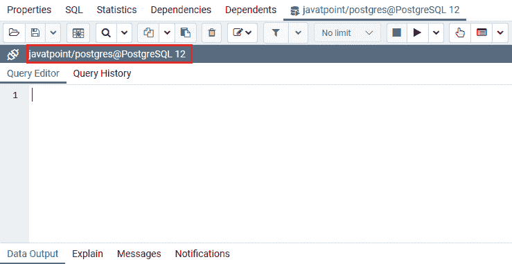

# 选择数据库

> 原文：<https://www.javatpoint.com/postgresql-select-database>

在本节中，我们将讨论如何在 PostgreSQL 中访问或选择数据库。

在 [PostgreSQL 教程](https://www.javatpoint.com/postgresql-tutorial)的上一节中，我们已经创建了一个数据库。

并且，现在我们要借助各种方法来**选择数据库**。

在 PostgreSQL 中，我们有两种方法来选择数据库:

*   **使用 pgAdmin 选择数据库**
*   **数据库 SQL 提示**

### 数据库 SQL 提示

假设我们已经启动了 PostgreSQL 客户端，并在以下 [SQL](https://www.javatpoint.com/sql-tutorial) 提示符处着陆:

```

postgres=#

```

*   我们可以在以下命令的帮助下验证可用的数据库列表:

```

\l

```

窗户会是这样的:


*   现在，键入以下命令来选择或连接所需的数据库。

```

postgres-# \c javatpoint

```

*   在这里，我们将连接到 javatpoint

```

You are now connected to database "javatpoint" as user "postgres".
javatpoint-#

```

## 使用 pgAdmin 选择数据库

在 pgAdmin 的帮助下，我们还可以选择数据库。按照以下步骤访问 PostgreSQL 中的数据库:

**第一步**

*   首先，我们将打开 pgAdmin 用户界面和 SQL 查询窗口。

**第二步**

*   然后我们将通过点击选择数据库，如下图所示:



**第三步**

*   之后点击**工具**下拉菜单，点击**查询工具**，如下图所示:


**第四步**

*   现在，出现了一个新窗口，它与我们选择的数据库建立了连接，在这里我们可以运行 SQL 查询。



* * *