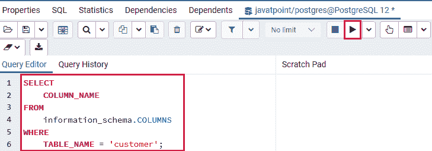
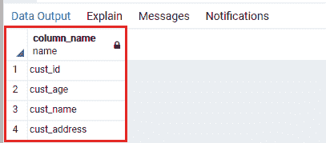
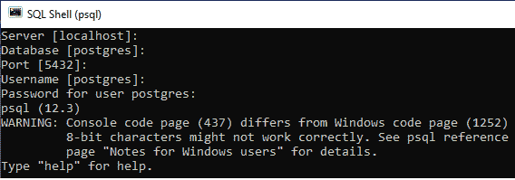
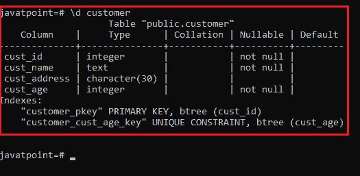

# 描述表

> 原文：<https://www.javatpoint.com/postgresql-describe-table>

在本节中，我们将讨论如何在 PostgreSQL 中**描述一个表。**

在 [PostgreSQL](https://www.javatpoint.com/postgresql-tutorial) 中，为了查找一个表的列的信息，我们可以用两种不同的方式使用 description 命令查询，如下所示:

*   **PostgreSQL 使用 pgAdmin 4** 描述表格
*   **PostgreSQL 使用 psql 描述表格**

#### 注意:在 PostgreSQL 中，我们不能使用直接命令来描述表，但是使用 MySQL，我们直接使用 description 命令来识别特定表的列上的信息。

### PostgreSQL 使用 pgAdmin 4 描述表

在 pgAdmin 4 中，我们将使用 **information_schema** 来描述这些表。

这里，**信息模式**本身是一个自动出现在所有数据库中的模式，称为**信息 _ 模式**。默认情况下，它在模式搜索路径中不可用。因此，如果我们想要访问所有对象，我们将通过它的限定名来使用它。

如果信息模式的**所有者**是**原始数据库用户**，则用户获得特定模式的所有优势。

同时，在信息模式中，一些对象的名称是通用名称，这可能发生在用户应用程序或软件中。因此，如果需要将信息模式放在路径上，我们应该保持警惕。

为此，我们将使用**信息 _ 模式**数据库中的**选择**命令来查询列表的**列名**。

例如，下面的查询将返回**客户**表的所有列名:

```sql

SELECT COLUMN_NAME
FROM information_schema.COLUMNS
WHERE TABLE_NAME = 'customer';

```

### PgAdmin4 中的 SQL 查询



### 表格结构

执行**选择命令**后，我们可以看到**客户**表中出现的**列 _ 名称**。



## PostgreSQL 使用 psql 描述表

在 psql 中，我们可以借助下面的命令获得一个表的信息，并描述当前数据库中的特定表:

```sql

\d table name

```

要获得表的列表，我们将遵循以下步骤:

**第一步**

*   打开**出现的**SQL shell(psql)**必要的细节**T4 的。之后，我们将使用在 PostgreSQL 安装过程中创建的**密码**登录到 Postgres 数据库服务器。
*   我们连接到 **Postgres 服务器**，如下图所示:



**第二步**

*   现在，我们将连接到我们之前创建的特定数据库服务器，即 **javatpoint** ，并借助以下命令:

```sql

\c javatpoint 

```


**第三步**

*   最后，我们将执行**描述**表命令，以查看特定的表信息。

```sql

Javatpoint=# \d customer

```

#### 注意:命令用于描述一个表，如类型、列、列的修饰符等。

**输出**

下面的截图解释得更清楚了:



* * *