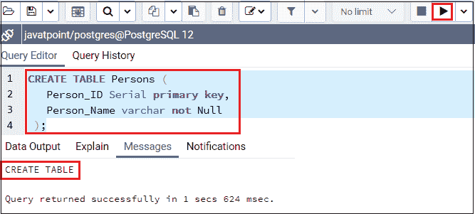
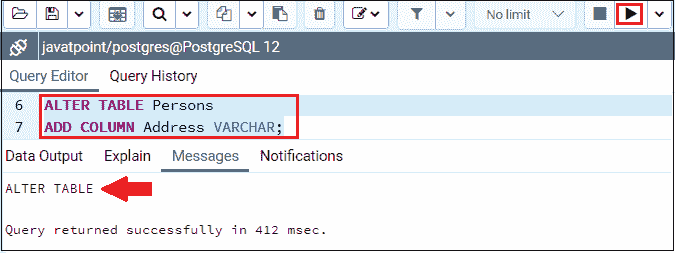
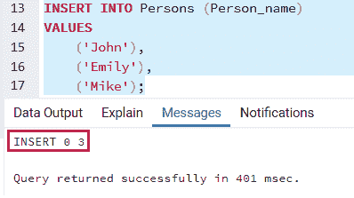
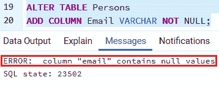
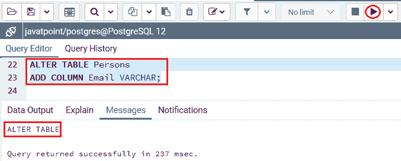
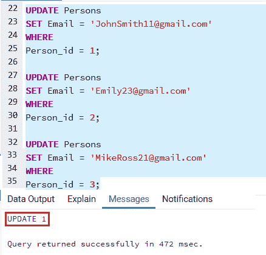
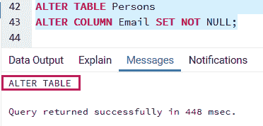

# PostgreSQL 添加列

> 原文：<https://www.javatpoint.com/postgresql-add-columns>

在本节中，我们将了解如何使用 PostgreSQL ADD COLUMN 命令向当前数据库表添加一个或多个列。

## PostgreSQL ADD COLUMN 命令

我们将使用**更改表添加列，**命令将新列添加到现有表中。

**语法**

**更改添加列命令**的语法如下:

```

ALTER TABLE table_name
ADD COLUMN new_column_name data_type;

```

在上面的语法中，我们有以下参数:

| 参数 | 描述 |
| 更改表格 | 它是一个子句，用于修改表的定义。 |
| 表名 | 它用于描述我们需要在 ALTER TABLE 子句后添加新列的表名。 |
| New_cloumn _name | 它用于在 ADD COLUMN 条件之后指定列名及其属性，如默认值、数据类型等。 |

#### 注意:当我们向表中添加新列时，PostgreSQL 会在表的末尾增强它，因为 PostgreSQL 没有其他选择来定义新列在表中的位置。

### 使用 alter table 命令添加多个列

**使用 alter table 命令添加多列的语法**:

```

ALTER TABLE table_name
ADD COLUMN new_column_name_1 data_type constraint,
ADD COLUMN new_column_name_2 data_type constraint,
:::
:::
ADD COLUMN new_column_name_N data_type constraint;

```

## PostgreSQL ADD COLUMN 示例

为了更好地理解添加列，我们将遵循以下过程:

首先，借助下面的命令，我们将创建一个名为 **Persons** 的新表，该表有两列 **Person_id 和 First_name** :

```

CREATE TABLE Persons (
    Person_ID Serial primary key,
   Person_Name varchar not Null     
 );

```

**输出**

执行上述查询后，我们会得到如下消息[窗口](https://www.javatpoint.com/windows)，显示**人员**表已经创建:



之后，我们将在以下命令的帮助下在**人员**表中添加**地址**列:

```

ALTER TABLE Persons 
ADD COLUMN Address VARCHAR;

```

**输出**

执行上述查询后，我们将获得下面的消息窗口:



下面的命令将帮助我们在**人员**表中添加**城市和电话号码**列:

```

ALTER TABLE Persons 
ADD COLUMN City VARCHAR,
ADD COLUMN Phone_no VARCHAR;

```

**输出**

执行上述查询后，我们将获得下面的消息窗口:


如果我们想在 **psql** 中看到**人员**表结构，我们将使用下面的命令:

```

javatpoint=# \d Persons                                  

```

****人员**表结构的输出**


如上图所示，我们在人员表的列列表末尾添加了**地址、城市和电话号码**列。

### 添加带有非空约束的列

在本文中，我们将向包含一些数据的特定表中添加一个非空约束的列。

首先，我们将使用插入命令向**人员**表中插入一些数据:

```

INSERT INTO Persons (Person_name)
VALUES
	('John'),
	('Emily'),
	('Mike');

```

**输出**

我们可以看到这三行已经被插入到下面消息窗口的**人员**表中。



现在，假设我们想要将**电子邮件**列添加到**人员**表中，为此，我们使用以下命令:

```

ALTER TABLE Persons 
ADD COLUMN Email VARCHAR NOT NULL;

```

**输出**

一旦我们执行了上面的命令，我们会得到一个错误，说
**列“电子邮件”包含空值**



出现上述错误是因为**电子邮件**列包含**非空**约束。

在 [PostgreSQL](https://www.javatpoint.com/postgresql-tutorial) 中，新列在添加列时取**空值**，这也破坏了**非空值**约束。

要解决上述错误，我们需要遵循以下步骤:

**第一步**

首先，我们需要添加没有 **NOT NULL** 约束的列，为此，我们将使用以下命令:

```

ALTER TABLE Persons 
ADD COLUMN Email VARCHAR;

```

**输出**

在下面的消息窗口中我们可以看到**邮件**栏已经被**添加到**人员**表中:**



**第二步**

现在，我们将更新电子邮件列的值。

```

UPDATE Persons
SET Email = 'JohnSmith11@gmail.com'
WHERE
Person_id = 1;

UPDATE Persons
SET Email = 'Emily23@gmail.com'
WHERE
Person_id = 2;

UPDATE Persons
SET Email = 'MikeRoss21@gmail.com'
WHERE
Person_id = 3;

```

**输出**

我们可以在下面的消息窗口中看到**电子邮件**列值已被**更新到**人员**表中:**



如果我们想检查**人员**表中的值是否更新，我们将使用**选择**命令:

```

Select * From Persons;

```

**输出**

上述查询的输出如下:


**第三步**

更新电子邮件列值后，我们将使用以下命令将**电子邮件**列的**不为空**约束设置到**人员**表中:

```

ALTER TABLE Persons
ALTER COLUMN Email SET NOT NULL;

```

**输出**

执行上述命令后，我们将看到下面的消息窗口:



* * *