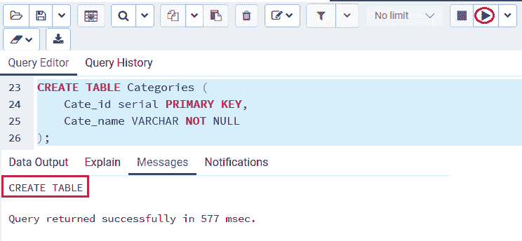
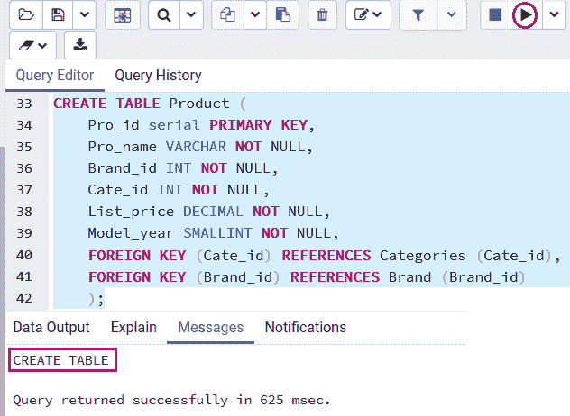
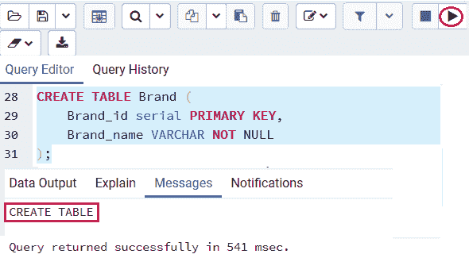
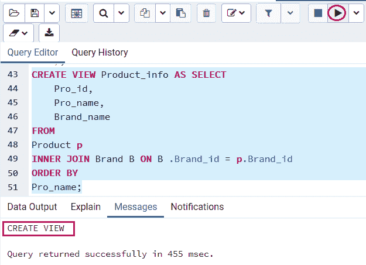
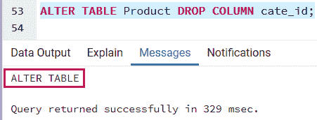
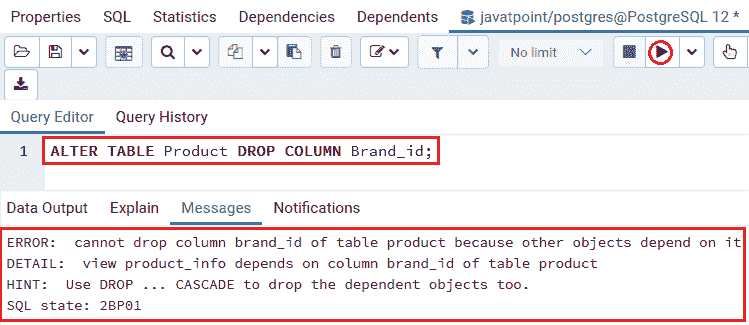
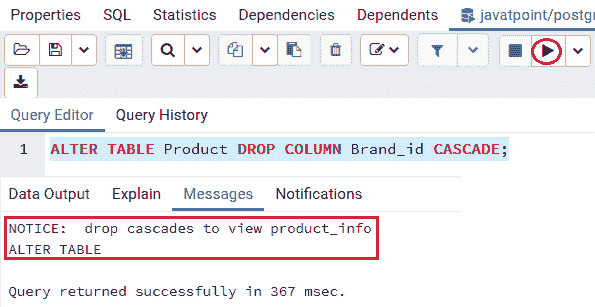
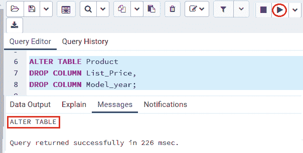
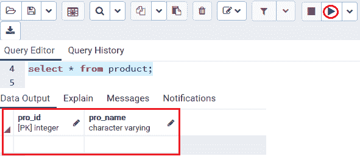

# PostgreSQL 删除列

> 原文：<https://www.javatpoint.com/postgresql-drop-column>

在本节中，我们将讨论如何在 **ALTER TABLE** 命令的帮助下**删除列**。

### PostgreSQL 删除列命令

我们将使用 [ALTER TABLE 命令](postgresql-alter-table)中的 DROP COLUMN 条件来删除表中的一列:

```sql

ALTER TABLE table_name 
DROP COLUMN column_name;

```

[PostgreSQL](https://www.javatpoint.com/postgresql-tutorial) 将自动删除其所有约束和索引，包括从表中删除一列时的列，并且每个删除列的条件都用**逗号(，**分隔。

我们不能删除其他对象依赖的那些列，这些列也用于其他数据库对象，如**触发器、视图、存储过程、**等。

因此，要删除这些列及其所有连接的对象，我们将使用**放置列**命令中的**级联**选项，如下所示:

```sql

ALTER TABLE table_name 
DROP COLUMN column_name CASCADE;

```

如果我们想删除一个不存在的列，PostgreSQL 会引发一个问题。我们将在 drop column 命令中添加 IF EXISTS 条件来克服这个错误，正如我们在下面的命令中看到的:

```sql

ALTER TABLE table_name 
DROP COLUMN IF EXISTS column_name;

```

在上面的命令中，如果我们删除一个不存在的列，PostgreSQL 将会发出通知而不是错误。

如果我们需要在一个命令中删除表的各种列，我们将使用下面的命令:

```sql

ALTER TABLE table_name
DROP COLUMN column_name_1,
DROP COLUMN column_name_2;

```

## PostgreSQL DROP COLUMN 命令示例

让我们看一些例子来理解**改变表格删除列**命令的工作。

因此，我们将创建三个不同的表，如**产品、类别和品牌**。


在上图中，每个**产品**只包含一个**品牌**，每个品牌可以有多个产品。每个产品分配到一个**类别**，每个类别可以有各种产品。

以下命令用于创建三个表**(类别、产品和品牌)**:

借助以下命令创建 ***类别*** 表格:

```sql

CREATE TABLE Categories (
    Cate_id serial PRIMARY KEY,
    Cate_name VARCHAR NOT NULL
);

```

**输出**

执行完上面的命令后，我们会得到下面的消息； ***类别*** 表已经创建。



使用以下语句创建 ***产品*** 表:

```sql

CREATE TABLE Product (
	Pro_id serial PRIMARY KEY,
	Pro_name VARCHAR NOT NULL,
	Brand_id INT NOT NULL,
	Cate_id INT NOT NULL,
	List_price DECIMAL NOT NULL,
    Model_year SMALLINT NOT NULL,
	FOREIGN KEY (Cate_id) REFERENCES Categories (Cate_id),
	FOREIGN KEY (Brand_id) REFERENCES Brand (Brand_id)
	);

```

**输出**

执行完上面的命令后，我们会得到下面的消息； ***产品*** 表已经创建。



使用以下命令创建*表:*

```sql

CREATE TABLE Brand (
	Brand_id serial PRIMARY KEY,
	Brand_name VARCHAR NOT NULL
);

```

**输出**

执行完上面的命令后，我们会得到下面的消息； ***品牌*** 表已经创建。



此外，我们基于**产品**和**品牌**表格创建了如下视图:

```sql

CREATE VIEW Product_info AS SELECT
 Pro_id,
 Pro_name,
 Brand_name
FROM
Product p
INNER JOIN Brand B ON B .Brand_id = p.Brand_id
ORDER BY
Pro_name;

```

**输出**

执行完上面的命令后，我们会得到下面的消息； ***产品信息*** 视图已经创建。



如果要删除**产品**表的**美食 _id** 列，我们将使用以下命令:

```sql

ALTER TABLE Product DROP COLUMN cate_id;

```

**输出**

执行完上面的命令后，我们会得到下面的消息；将 ***cate_id*** 列从 ***产品*** 表中删除。



如果我们想在 psql 中看到这个表，我们将使用下面的命令

```sql

Javatpoint=# \d Product;

```


从上面的截图中我们可以看到，上面的命令删除了 **Cate_id 列**，并将 **Cate_id** 列包含到外键约束中。

现在我们将尝试从 ***产品*** 表中删除**品牌标识**列。

```sql

ALTER TABLE Product DROP COLUMN Brand_id;

```

一旦我们执行了上面的命令，PostgreSQL 将会引发下面的错误:



它表示**产品信息**视图使用的是**T5【产品】T6**表的**品牌标识**一栏。

因此，在以下命令的帮助下，我们将使用**层叠**选项删除**品牌 _id** 列和**产品 _ 信息**视图:

```sql

ALTER TABLE Product DROP COLUMN Brand_id CASCADE;

```

一旦我们执行了上面的命令，它将提升下面的**通知**并降低特定的列。



在这里，我们将在一个命令中同时删除**价目表和车型年**列，我们需要使用**多个删除列**条件，如下所示:

```sql

ALTER TABLE Product 
DROP COLUMN List_Price,
DROP COLUMN Model_year;

```

**输出**

执行上述命令后，我们会得到如下消息窗口:**价目表 _ 价格和车型年列**已从**T3【产品】T4**表中删除。



如果我们想看看以上操作是否正常，我们将使用**选择**命令:

```sql

Select * from Product ;             

```

**输出**

执行上述命令后，我们将获得以下输出:



* * **