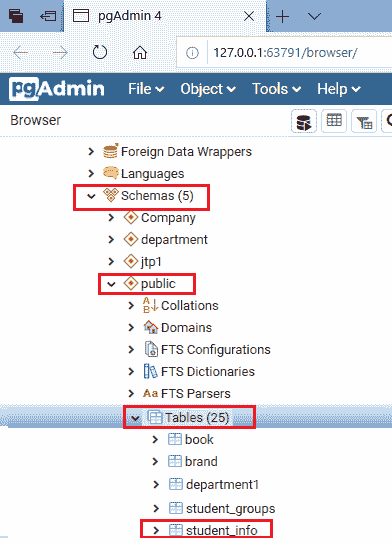
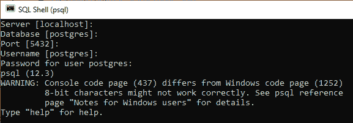

# PostgreSQL TRUNCATE TABLE

> 原文：<https://www.javatpoint.com/postgresql-truncate-table>

在这一节中，我们将了解 PostgreSQL TRUNCATE TABLE 命令的工作原理**，该命令用于快速删除大型表中的所有记录。**

要删除表格中的所有数据，我们使用 [DELETE 命令](https://www.javatpoint.com/postgresql-delete)。当一个表包含很多记录并且也没有用的时候，在这种情况下，我们将使用 **TRUNCATE TABLE** 命令从一个特定的表中删除所有的记录。

**截断命令的语法**

TRUNCATE TABLE 命令的基本语法如下:

```sql

TRUNCATE TABLE table_name;
[ RESTART IDENTITY | CONTINUE IDENTITY ] [ CASCADE | RESTRICT ]

```

在上面的语法中，我们有以下参数:

| 参数 | 描述 |
| **CASCADE** | 此选项自动截断所有表，这些表包含对其他表的外键引用，或者由于 CASCADE 而添加到集合中的任何表。 |
| **重启身份** | 它会重复重新启动被截断表的列所拥有的订单。 |
| **继续身份** | 它不改变订单的值，并且是默认选项。 |
| **限制** | 这也是一个默认选项，如果其他表包含表的外键引用(在命令中没有提到)，它可以拒绝截断。 |

#### 注意:TRUNCATE TABLE 命令从表中删除所有记录而不检查它，它比 DELETE 命令更快。

在 [PostgreSQL](https://www.javatpoint.com/postgresql-tutorial) 中，我们可以通过两种方式执行截断表:

*   **使用 pgAdmin 截断 PostgreSQL 表**
*   **PostgreSQL 使用 SQL Shell 截断表(PSQL**

### PostgreSQL 使用 pgAdmin 截断表

要使用 **pgAdmin** 中的**截断表格命令**删除表格，我们将遵循以下步骤:

**第一步**

打开你的 **pgAdmin** ，然后转到**对象树**，我们将转到数据库，转到**模式**下的**公共**部分，选择我们想要**截断**的特定表格 **(student_info)** 。

**数据库→Java 点→方案→公共→表→学生 _ 信息**



**第二步**

然后，我们将右键单击选定的(student_info)表，并单击 Truncate 选项，然后从给定的下拉列表中再次选择 Truncate 选项，如下图所示:


**第三步**

屏幕上会出现**截断表**弹出窗口，我们点击**确定**按钮截断**学生信息**表。


**第四步**

一旦点击**确定**按钮，表格会自动删除，如下图截图所示**表格**部分没有表格。


### 使用 SQL Shell 截断表

要使用 **psql** 中的**截断表格命令**删除表格，我们将遵循以下步骤:

**第一步**

打开 **[SQL](https://www.javatpoint.com/sql-tutorial) shell (psql)** ，里面出现了**必备的详细信息**。之后，我们将使用在 PostgreSQL 安装过程中创建的**密码**登录到 Postgres 数据库服务器。

我们连接到 **Postgres 服务器**，如下图所示:



**第二步**

现在，我们将连接到我们之前创建的特定数据库服务器，即 **javatpoint** ，并借助以下命令:

```sql

\c javatpoint   

```


**第三步**

最后，我们将执行 truncate table 命令来删除特定的表。

## psql 中 PostgreSQL 截断表的示例

为了实时理解 PostgreSQL Truncate 表的工作原理，我们将看到以下示例:

**从一个表中删除所有数据**

在下面的例子中，要从 ***学生信息*** 表中删除所有数据，我们使用 TRUNCATE TABLE 命令:

```sql

truncate table student_information;

```

**输出**

执行以上命令后，我们会得到如下输出，表示***student _ information***表数据已成功删除。


以下命令用于借助**重启身份**选项重置特定列中的值:

```sql

TRUNCATE TABLE table_name 
RESTART IDENTITY;

```

让我们看一个**示例**，在这里我们尝试重置特定列的值。

以下命令删除 ***学生信息*** 表中的所有行，并返回与**学生名称**列相关的顺序:

```sql

TRUNCATE TABLE student_information 
RESTART IDENTITY;

```

**输出**

执行上述命令后，我们将得到如下输出，表示 ***学生 _ 信息*** 表记录已成功删除


本质上，上述命令不会按照与 **student_information** 表中的列相关的顺序重新启动该值，因为**截断表**命令默认使用 **CONTINUE IDENTITY** 选项。

### 从几个表中删除所有记录

如果我们想同时截断一个或多个表中的所有记录，我们可以借助**逗号(，)来分隔每个表。**

**语法**

以下语法用于从多个表中**删除**所有数据:

```sql

TRUNCATE TABLE table_name1, table_name2 ...;

```

**例如**

以下命令用于删除 ***人员*** 和 ***部门*** 表格中的所有数据:

```sql

TRUNCATE TABLE persons, department;

```

**输出**

执行上述命令后，我们会得到如下输出，显示 ***人员和部门*** 表格数据已成功删除。


### 从具有外键引用的表中删除所有记录

如果我们需要频繁地截断一个包含其他表的外键引用的表，并且该表没有在 TRUNCATE TABLE 命令中列出。

默认情况下， **TRUNCATE TABLE** 命令不会从具有外键引用的表中删除任何记录。

因此，在这种情况下，我们将使用 **TRUNCATE TABLE** 命令中的 **CASCADE** 选项从包含外键引用的表和其他表中删除记录。

**语法**

从有外键引用的表中删除所有记录的基本语法如下:

```sql

TRUNCATE TABLE table_name 
CASCADE;

```

**例如**

在下面的示例中，我们将通过外键约束从 ***员工*** 表和其他引用 ***人员*** 表的表中删除数据:

```sql

TRUNCATE TABLE employee CASCADE;

```

**输出**

执行上述命令后，我们将得到如下输出，其中 ***员工*** 表数据已成功删除。


**CASCADE 选项**与一个附加的想法一起使用，或者如果我们想从表中删除我们不想要的记录。

**截断表**命令使用**限制**选项，避免我们截断默认情况下具有外键约束引用的表。

### PostgreSQL TRUNCATE TABLE 和事务

如果我们在事务中使用 truncate table 命令，我们可以安全地回滚它，因为它是事务安全的。

### PostgreSQL 截断表并在删除时触发

如果我们将触发器应用于用于表的 TRUNCATE TABLE 命令，则必须为该特定表指定 TRUNCATE 前/TRUNCATE 后触发器。

而 **TRUNCATE TABLE** 命令从一个表中删除所有记录，并且它不使用任何**删除触发器**选项来链接该表。

### 概观

*   要从一个大表中删除所有记录，我们可以使用 **TRUNCATE TABLE** 命令。
*   如果一个表通过外键约束引用另一个表，我们可以使用 **CASCADE 选项**来截断一个表和其他表。
*   截断表命令不使用删除触发器上的**，而是使用截断**触发器之前/之后的**。**

* * *