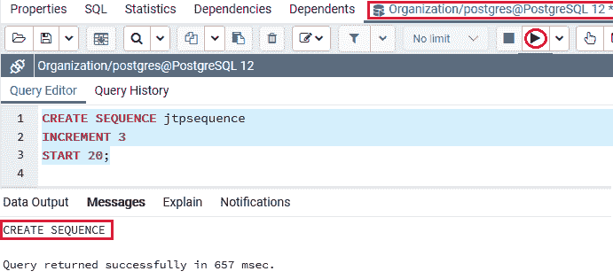
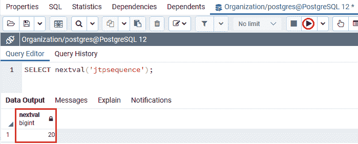
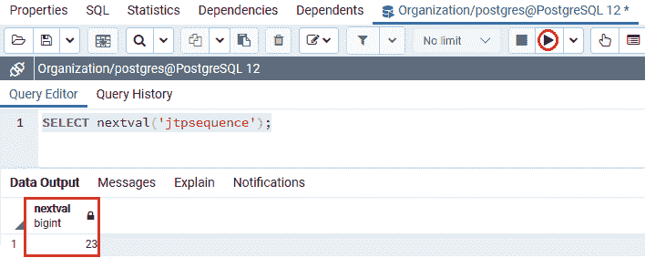
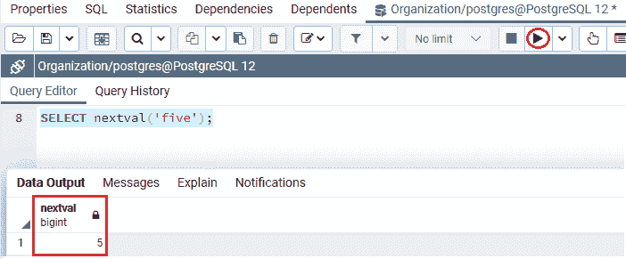
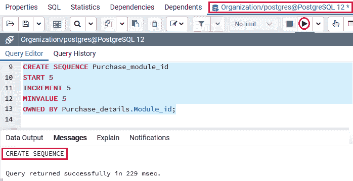
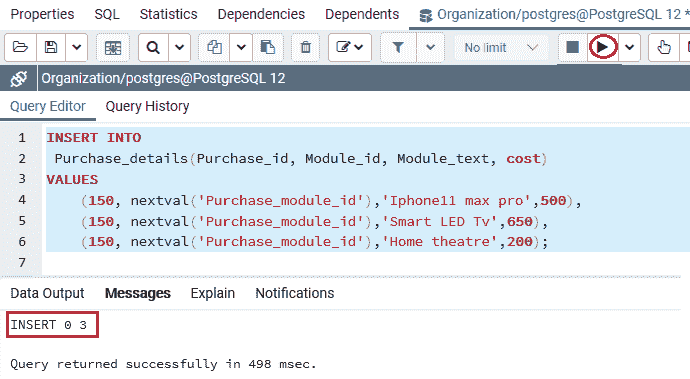
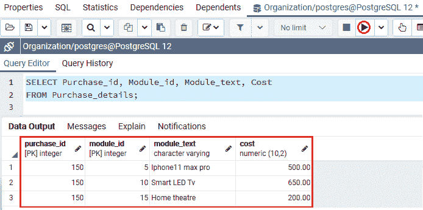

# PostgreSQL 序列

> 原文：<https://www.javatpoint.com/postgresql-sequence>

在本节中，我们将了解 **PostgreSQL Sequence 的工作原理，PostgreSQL Sequence 的示例**，并了解如何使用 Sequence 对象来创建数字序列，参见示例 **nextval()函数。**

我们也看到了使用**创建序列**命令创建**上升和下降**序列，并在**删除序列**命令的帮助下删除序列的例子。

## 什么是 PostgreSQL 序列？

Sequence 是一个生成器，用于创建一个渐进的数字，该数字有助于自动生成单个**主键**，并使各行或各表的键同步。

在 **[PostgreSQL](https://www.javatpoint.com/postgresql-tutorial)** 中，序列是用户定义的模式绑定对象，它根据特定的需求创建整数序列。

在 PostgreSQL 序列中，数字的顺序很重要。比如{5，6，7，8，9，10}和{10，9，8，7，6，5}是完全不同的序列。

我们使用 **CREATE SEQUENCE** 命令在 PostgreSQL 中生成一个序列。

### PostgreSQL CREATE SEQUENCE 命令

*   **PostgreSQL CREATE SEQUENCE** 命令用于生成一个原始的序列号生成器，其中还包括生成和设置一个新的不同的名为的单行表。
*   生成器将由对陈述提出疑问的用户维护。
*   PostgreSQL 序列建立在**双点算法**上；因此，**范围**从 **-9223372036854775808 到 9223372036854775807** 。我们无法超越一个**八字节**的范围
*   在 PostgreSQL 中，序列名称必须不同于任何附加序列，即类似模式中的**表、视图、索引或外部表**。
*   序列是在特定的模式中创建的，如果先前给定了模式名，则在现有模式中生成序列。
*   一旦序列生成，我们可以使用 **currval、setval 和 nextval** 功能对序列进行操作。
*   生成临时序列时不能指定模式名，因为**临时序列**出现在特殊模式中。

### PostgreSQL 创建序列命令的语法

PostgreSQL 创建序列的语法如下:

```

CREATE SEQUENCE [ IF NOT EXISTS ] sequence_name
    [ AS { SMALLINT | INT | BIGINT } ]
    [ INCREMENT [ BY ] increment ]
    [ MINVALUE minvalue | NO MINVALUE ] 
    [ MAXVALUE maxvalue | NO MAXVALUE ]
    [ START [ WITH ] start ] 
    [ CACHE cache ] 
    [ [ NO ] CYCLE ]
    [ OWNED BY { table_name.column_name | NONE } ]

```

在上面的语法中，我们使用了以下参数:

| 参数 | 描述 |
| 序列名称 | 

*   Sequence _ name is different from any other sequence, index, table, view or external table in similar schema.
*   We can then define the sequence name **to create the sequence**
*   And **if the condition** does not exist, a new sequence is temporarily generated only when it does not exist.

 |
| [as { smallint \ int })的缩写形式 | 

*   Series data type for adjusting the maximum and minimum values of series.
*   We can define the data types of the sequence, among which the supported data types are INT, BIGINT and SMALLINT.
*   If we forget to mention the data type, it will take it as BIGINT, because it is the default data type of Sequence.

 |
| [增量] | 

*   Increment describes this value, which must be added to the existing sequence value to generate a new value. The default value is 1.
*   Here, the **plus (+) sign** will generate the **rising sequence,** and the **minus (-) sign** will generate the **falling sequence** .

 |
| [ MINVALUE minvalue &#124;无最小值 ]
[ 最大值 &#124;无最大值 ] | 

*   If we use **no minimum value and** no maximum value, the sequence will adopt the default value.
*   For **ascending sequence,** maximum default value is **maximum value of sequence data type, and **default minimum value is **1** .****
*   For **decreasing sequence** , the maximum default value **is-1** , and the default minimum value of **is the minimum value of** data type of the sequence.

 |
| [开始[用]开始] | 

*   The [T0】 START 【T1] clause is used to define the starting value of the sequence.
*   And the default initial value is **. The maximum value** is the descending sequence and the minimum value is the ascending sequence.

 |
| 躲藏 | 

*   You can create one value at a time. By default, the sequence creates one value at a time, that is, **has no cache** .
*   The [T0】 CACHE parameter is used to specify the total **serial number pre-allocated by** , and it is stored in the memory for earlier access.

 |
| 循环&#124;无循环 | 

*   **Cyclic parameter** allows us to recover the value when the limit is reached. **The following numbers** will be the **maximum value** of **descending sequence** and the minimum value of **ascending sequence.**
*   If we use NO CYCLE, it will cause an error in the output when the limit is reached or when we are trying to get the next value.
*   **No cycle** is the default, if we don't define **cycle or** cycle.

 |
| 由表名拥有。列名 | 

*   Finally, use the **owned by parameter** to associate the table columns with the sequence.
*   Therefore, PostgreSQL will automatically discard related sequences; If we remove tables or columns.

 |

#### 注意:当我们对表的一列使用 SERIAL 伪类型时，在后台，PostgreSQL 会自动生成一个序列，该序列与该列相关。

### PostgreSQL 创建序列示例

让我们看不同的例子来理解**PostgreSQL****CREATE SEQUENCE**是如何工作的。

*   **生成升序序列的示例**

在以下示例中，以下命令被用作 **CREATE SEQUENCE** 命令，用于从 **20** 开始生成新的上升序列**以 **3** 的**增量**。**

```

CREATE SEQUENCE jtpsequence
INCREMENT 3
START 20;

```

**输出**

执行上述命令后，我们会得到如下消息窗口，显示**上升序列**已创建成功。



在这里，我们还可以使用 **nextval()函数**从序列中获取下一个值。

```

SELECT nextval('jtpsequence');

```

**输出**

执行上述命令后，我们将获得以下输出，显示序列中的下一个值。



如果我们再次执行上面的命令，我们将从序列中获得下一个值:

```

SELECT nextval('jtpsequence');

```

**输出**

执行上述命令后，我们将得到下面的输出，显示序列中的下一个值。



*   **生成下降序列的示例**

在以下示例中，以下命令用于生成从 5 到 1 的降序序列，并带有**循环**选项:

```

CREATE SEQUENCE five
INCREMENT -1
MINVALUE 1 
MAXVALUE 5
START 5
CYCLE;

```

**输出**

执行上述命令时，我们会得到如下消息，显示 ***下降序列*** 已成功创建到**组织**数据库中。


当我们多次执行下面的命令时，我们会看到数字从 **5，4，3，2，1 开始，然后回到 5，4，3，2，1** 等等:

```

SELECT nextval('five');

```

**输出**

执行上述命令后，我们将得到下面的输出，按降序显示序列中的值。



*   **创建与表格列相关的序列**

让我们看一个示例来理解如何创建与表列相关的序列。

### 步骤 1:创建新表

首先，我们在 CREATE 命令的帮助下创建了一个新表 ***Purchase_details*** ，并使用 [INSERT 命令](https://www.javatpoint.com/postgresql-insert)插入了一些值。

要将 ***Purchase_details*** 创建到**组织数据库**中，我们使用 **CREATE** 命令。

***采购 _ 明细*** 表包含各种列，如**采购 _id、模块 _id、模块 _ 文本和成本，**其中**采购 _id 和模块 _id** 列是**主键**列。

```

CREATE TABLE Purchase_details(
    Purchase_id SERIAL,
    Module_id INT NOT NULL,
    Module_text VARCHAR NOT NULL,
    Cost DEC(10,2) NOT NULL,
    PRIMARY KEY(Purchase_id, Module_id)
);

```

**输出**

执行上述命令时，我们会得到如下消息，显示 ***Purchase_details*** 表已成功创建到**组织**数据库中。


### 步骤 2:创建新序列

成功创建 ***Purchase_details*** 表后，我们将使用 **CREATE SEQUENCE** 命令创建一个新的序列，该序列与 **Purchase_details** 表的 **Module_id** 列相链接，如下命令所示:

```

CREATE SEQUENCE Purchase_module_id
START 5
INCREMENT 5
MINVALUE 5
OWNED BY Purchase_details.Module_id;

```

**输出**

执行上述命令后，新序列已成功创建:



### 步骤 3:插入数据

在成功创建 ***采购 _ 明细*** 表和一个**采购 _ 模块 _id** 序列后，我们将在 **INSERT** 命令的帮助下向 ***采购 _ 明细*** 表中插入一些值。

以下命令用于将各种采购订单模块插入 ***【采购 _ 明细】*** 表中。

```

INSERT INTO 
 Purchase_details(Purchase_id, Module_id, Module_text, cost)
VALUES
    (150, nextval('Purchase_module_id'),'Iphone11 max pro',500),
    (150, nextval('Purchase_module_id'),'Smart LED Tv',650),
    (150, nextval('Purchase_module_id'),'Home theatre',200);

```

**输出**

执行上述命令后，我们会得到如下消息窗口，显示这三个值已经成功插入 ***Purchase_details*** 表中。



#### 注意:在上面的命令中，我们使用了 nextval()函数从 Purchase_module_id 序列中检索 Module_id 值。

### 步骤 4:检索数据

创建并插入 ***采购 _ 明细*** 表的值后，我们将使用 [**选择**命令](https://www.javatpoint.com/postgresql-select)从 ***采购 _ 明细*** 表中检索数据:

```

SELECT Purchase_id, Module_id, Module_text, Cost
FROM Purchase_details;

```

**输出**

成功执行上述命令后，我们将得到如下结果，显示 PostgreSQL 返回 ***Purchase_details*** 表中存在的数据:



*   **在数据库中列出所有序列**

在下面的命令中，我们列出了现有数据库中的所有序列:

```

SELECT relname sequence_name
FROM  pg_class 
WHERE  relkind = 'S';

```

**输出**

在执行上述命令时，我们将获得以下结果，该结果显示列出了**组织**数据库中的所有序列:


*   **移除序列**

一旦表被删除，它将被自动删除，或者如果序列与表列相连，表的列将被删除。

手动，我们可以使用**删除序列**命令删除序列。

### 删除 PostgreSQL 序列的语法

删除 PostgreSQL 序列的语法如下:

```

DROP SEQUENCE [ IF EXISTS ] sequence_name [, ...] 
[ CASCADE | RESTRICT ];

```

在上面的语法中，我们使用了以下参数:

| 因素 | 描述 |
| 序列名称 | 

*   The name used to define the sequence, which we want to delete.

 |
| 如果存在 | 

*   If we need to delete several sequences at a time, we can use a comma-separated list of sequence names **.**
*   And **ifexists** parameters temporarily delete the sequence (if it exists).

 |
| 串联 | 

*   If we want to recursively delete objects based on Sequence, we can use CASCADE option.

 |

### PostgreSQL DROP SEQUENCE 命令示例

要删除 ***Purchase_details*** 表，我们使用了 [**删除表**命令](https://www.javatpoint.com/postgresql-drop-table)；同时，序列 **Purchase_module_id** 与 **Purchase_details** 的 **Module_id** 相连。

因此，它也会被反复删除，我们可以在下面的命令中看到:

```

DROP TABLE Purchase_details;

```

**输出**

执行上述命令后，我们会得到下面的消息窗口，显示 ***Purchase_details*** 已成功移除。


## 概观

在 **PostgreSQL 序列**部分，我们学习了以下主题:

*   **PostgreSQL 序列**用作**序列对象**来创建序列列表。
*   我们已经**使用了 CREATE SEQUENCE 命令来创建一个新的序列号**
*   在本节中，我们还将了解如何使用**创建序列**创建**上升**和**下降序列**
*   我们使用 **nextval()函数**从序列中检索下一个值**。**
*   我们也看到了用**删除序列/删除表**删除序列的例子

* * *