# PostgreSQL 间隔

> 原文：<https://www.javatpoint.com/postgresql-interval>

在本节中，我们将了解 **PostgreSQL Interval 数据类型**的工作原理，我们还将看到 **Interval 数据类型的**示例**。**和最常用的 Interval **功能**，例如 **NOW()，TO_CHAR()，EXTRACT()，狡辩 _days()，狡辩 _hours()，狡辩 _interval()。【PostgreSQL 间隔值的**输入和输出**格式。**

## 什么是 PostgreSQL 间隔数据类型？

在 PostgreSQL 中，**间隔**是用于存储和部署**年、月、日、小时、分钟、秒、**等时间的另一种数据类型。**月和日**值是**整数值**，而**秒的字段**可以是**分数值。**

PostgreSQL 区间数据类型值涉及 **16 字节存储**大小，这有助于存储可接受范围从- **178000000 年到 17800000**年的期间。

#### 注:第二个字段中的小数位数称为精度 p。

### PostgreSQL 间隔数据类型的语法

PostgreSQL 间隔数据类型的语法如下:

```sql

@ interval [ fields ] [ (p) ]   

```

在上面的语法中，我们有以下参数:

| 参数 | 描述 |
| **字段** | 该字段参数用于显示时间。 |
| **p** | p 用于显示精度值。 |
| **@** | 我们可以忽略@参数，因为它是一个可选参数。 |

让我们看一个示例，以便更好地理解如何使用 **@参数和不使用@参数**编写区间值**:**

```sql

@interval '6 months before';
@interval '2 hours 30 minutes';

```

**或**

```sql

interval '6 months before';
interval '2 hours 30 minutes';

```

#### 注:我们可以使用上述两种说法，因为它们相互对应。此外，区间值可以具有可选的精度值 p，允许的范围从 0 到 6 开始。

### PostgreSQL 间隔数据类型示例

让我们看一个示例来理解 **PostgreSQL Interval 数据类型**是如何工作的。

在下面的例子中，我们将尝试在去年**当前时间**找到 **2 小时 30 分钟之前的时间**；我们将使用以下命令:

```sql

SELECT
    now(),
    now() - INTERVAL '6 months 2 hours 30 minutes' 
             AS "2 hours 30 minutes before last year";

```

**输出**

执行以上命令后，我们会得到如下输出，显示去年前 2 小时 30 分**:**

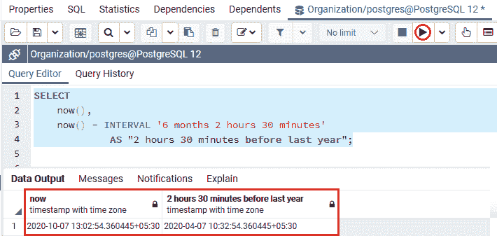

我们已经看到了区间数据类型的主要示例，并了解了它的工作原理。现在，我们将看到**间隔值的输入和输出格式。**

首先，我们将了解输入格式的 **PostgreSQL 间隔值:**

## PostgreSQL 间隔输入格式

在 PostgreSQL 中，我们有下面的**详细语法，**帮助我们编写间隔值:

```sql

quantity unit [quantity unit...] [direction]

```

我们有以下参数，这些参数用在上面的语法中:

| 参数 | 描述 |
| 量 | A **数量**为数字，也接受 **+** 或 **-** 等符号 |
| 单位 | **单位**可以是任意的**千年、百年、十年、年、月、周、日、时、分、秒、毫秒、微秒，**或者缩写可以是下面的 **y、m、d 等。**的复数形式可以是**月、日**等。 |
| 方向 | **方向**参数可以是**前或空字符串。** |

#### 注意:上面的语法也用于间隔输出格式，称为 postgres_verbose。

在下面的例子中，我们将显示一些使用**详细语法**的间隔值:

```sql

INTERVAL '1 year 5 months 5 days';
INTERVAL '1 weeks ago';

```

## 国际标准化组织 8601 间隔格式

除了上面详细的语法之外，为了借助 **ISO 8601 时间**区间来写区间值，PostgreSQL 为我们提供了两种方式，如下所示:

*   **指示器格式**
*   **替代格式**

ISO 8601 的指示符格式如下:

```sql

P quantity unit [ quantity unit ...] [ T [ quantity unit ...]]

```

在上面的格式中，间隔值 essential 以**字母 P** 开头，**字母 T** 用于定义**时间单位**。

下表显示了 **ISO 8601 间隔**单位缩写:

| 缩写 | 描述 |
| Y | 年 |
| M | 月份(日期部分) |
| W | 周末 |
| D | 天 |
| H | 小时 |
| M | 分钟(时间部分) |
| S | 秒 |

#### 注意:M 可以是几个月或几分钟，取决于它是在字母 t 之前还是之后。

让我们看一个 **ISO 8601 指示符**格式的例子，以便我们更好地理解:

**ISO 8601 标志符格式**可以写成 **5 年 4 个月 3 天 2 小时 1 分 1 秒**:

```sql

P5Y4M3DT2H1M1S

```

**ISO 8601** 的替代形式如下:

```sql

P [ years-months-days ] [ T hours:minutes:seconds ]

```

它也以**字母 P 和字母 T**开始，这将**时间和日期**分割为区间值的部分。

例如， **ISO 8601 备选表格**可以写成 **5 年 4 个月 3 天 2 小时 1 分 1 秒，**如下所示:

```sql

P0005-04-03T02:01:01

```

## PostgreSQL 间隔输出格式

间隔值的 PostgreSQL 间隔输出格式可以借助 **SET** **intervalstyle** 命令进行设置，如下例所示:

```sql

SET intervalstyle = 'iso_8601';

```

PostgreSQL 包含四种不同的输出格式，例如:

*   **iso_8601**
*   **postgres_verbose**
*   **后缀**
*   **sql 标准**

#### 注意:为了格式化间隔值，PostgreSQL 默认使用 Postgres 样式。

让我们看看一个更好理解的例子:

以下命令用于以四种不同的输出格式显示 **5 年 4 个月 3 天 2 小时 1 分 1 秒**:

### 对于 ISO_8601 输出格式

在下面的命令中，我们将**设置****区间**为上述区间值的 **iso_8601** :

```sql

SET intervalstyle = 'iso_8601';
SELECT
INTERVAL '5 years 4 months 3 days 2 hours 1 minute 1 second';

```

**输出**

执行以上命令后，我们会得到如下结果，表示 **iso_8601** 区间输出格式:


### 对于 postgres_verbose 输出格式

在下面的命令中，我们将**设置****区间**为上述区间值的**后缀 _verbose** :

```sql

SET intervalstyle = 'postgres_verbose';
SELECT
INTERVAL '5 years 4 months 3 days 2 hours 1 minutes 1 second';

```

**输出**

执行上述命令后，我们会得到如下结果，显示了 **postgres_verbose** 间隔输出格式:

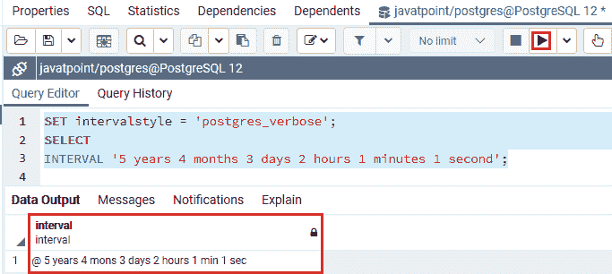

### 对于 Postgres 输出格式

在下面的命令中，我们将**设置****区间**为上述区间值的**后缀**:

```sql

SET intervalstyle = 'postgres';
SELECT
INTERVAL '5 years 4 months 3 days 2 hours 1 minutes 1 second';

```

**输出**

成功执行上述命令后，我们会得到如下结果，显示 **Postgres** 区间输出格式:

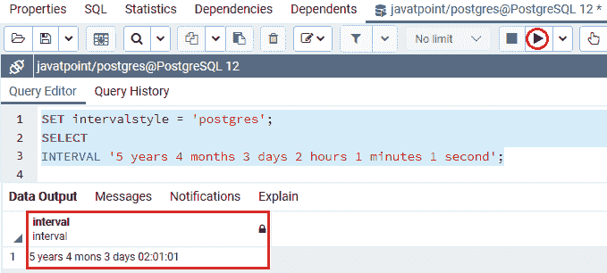

### 对于 Sql _ 标准输出格式

在下面的命令中，我们将**设置****区间**为上述区间值的 **sql_standard** :

```sql

SET intervalstyle = 'sql_standard';
SELECT
INTERVAL '5 years 4 months 3 days 2 hours 1 minutes 1 second';

```

**输出**

成功执行以上命令后我们会得到如下结果，代表 **sql_standard** 区间输出格式:

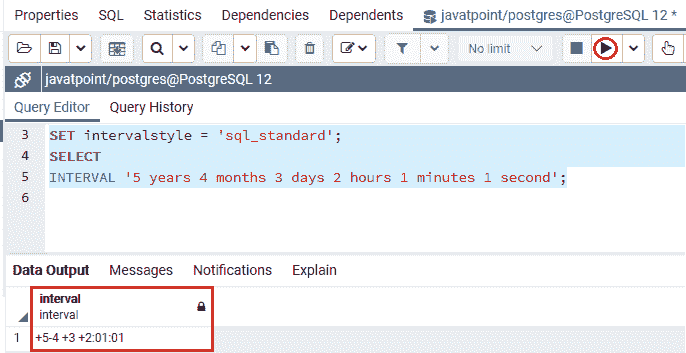

### 将 PostgreSQL 间隔修改为字符串

我们可以使用 **TO_CHAR()** 函数将区间值修改为字符串。

**将 PostgreSQL 间隔修改为字符串的语法**

```sql

TO_CHAR(interval,format)

```

**TO_CHAR()函数**将**第一个语句**作为**一个区间值**，另一个作为**格式**，并检索一个字符串，以特定格式显示区间。

在下面的示例中，我们将使用 TO_CHAR()函数，该函数将 PostgreSQL 间隔转换为字符串值:

```sql

SELECT
TO_CHAR( 
INTERVAL '15h 15m 15s','HH24:MI:SS'
    );

```

**输出**

成功执行上述命令后，我们将获得以下结果:

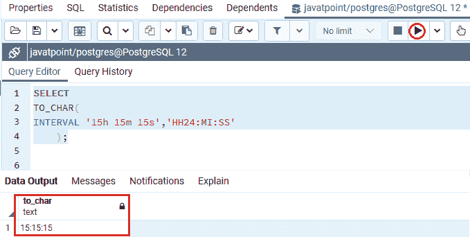

### PostgreSQL 区间相关运算符和函数

**区间操作员**

我们可以用下面的 **+，-，*，等。算术运算符**获取区间值。

**让我们看看下面的例子，以便更好地理解:**

在下面的命令中，我们将借助 PostgreSQL 区间数据类型使用**算术运算符(+)** :

```sql

SELECT 
INTERVAL '1h 50m' + INTERVAL '5m';

```

**输出**

在执行上述命令时，我们将得到如下结果，如下所示:

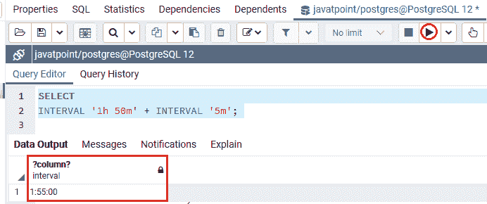

在下面的命令中，我们将借助 PostgreSQL 区间数据类型使用**算术运算符(-)** :

```sql

SELECT
INTERVAL '3h 50m' - INTERVAL '30m'; 

```

**输出**

在执行上述命令时，我们将得到以下结果:

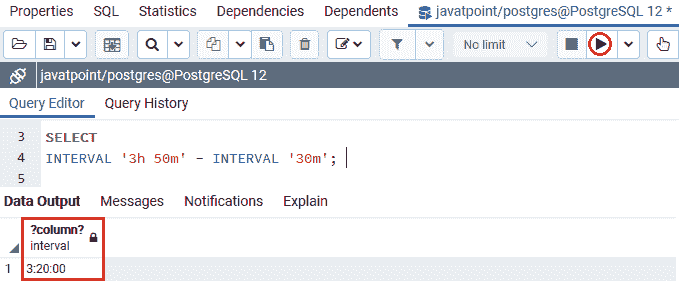

在下面的命令中，我们将借助 PostgreSQL 间隔数据类型使用**算术运算符(*)** :

```sql

SELECT
400 * INTERVAL '5 minute';

```

**输出**

在执行上述命令时，我们将得到以下结果:

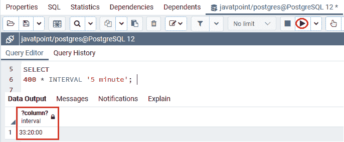

### 从 PostgreSQL 间隔中提取数据

我们可以使用 **EXTRACT()** 函数从区间值中提取字段，例如**年、月、日等**。

**从 PostgreSQL 间隔中提取数据的语法**

```sql

EXTRACT(field FROM interval)

```

在上面的语法中，我们可以使用**年、月、日、时、分**等。，在字段参数中。

如果我们想从区间中提取，则**提取**函数返回一个双精度类型的值。

在下面的例子中，我们将使用 **EXTRACT()** 函数来检索双精度值。

```sql

SELECT
EXTRACT (MINUTE
FROM
INTERVAL '2 hours 30 minutes'
    );

```

**输出**

成功执行上述命令后，我们将获得如下输出，显示双精度值的**日期部分，如下所示:**

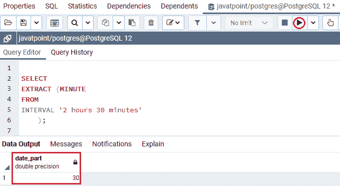

### 调整 PostgreSQL 间隔值

我们有两个功能，PostgreSQL 中的**调整 _ 天和调整 _ 小时**，这允许我们修改**24 小时的间隔**认为是**一天**和 **30 天的间隔**认为是**一个月**。

让我们看一个例子来理解我们是如何调整 PostgreSQL 间隔值的:

在下面的命令中，我们将使用**调整 _ 天和调整 _ 小时功能:**

```sql

SELECT
    justify_days(INTERVAL '30 days'),
    justify_hours(INTERVAL '24 hours');

```

**输出**

执行上述命令后，我们会得到如下结果，其中 **30 天的间隔显示为一个月**，24 小时的**间隔显示为一天**:

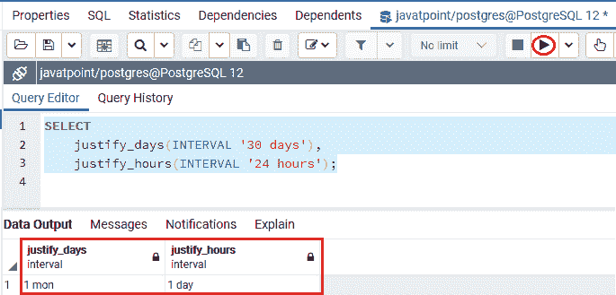

除此之外，**调整间隔**功能在**调整天数和小时数**的帮助下调整间隔值，并增加了符号修改:

在下面的示例中，我们将使用带有 SELECT 命令的 proality _ interval 函数:

```sql

SELECT
justify_interval(interval '6 months  -1 hour');

```

**输出**

实现上述命令后，我们将获得以下输出:

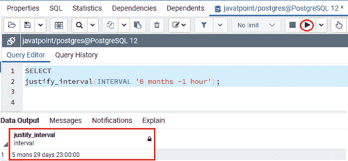

## 概观

在 **PostgreSQL Interval 数据类型**部分，我们学习了以下主题:

*   **PostgreSQL Interval 数据**类型用于存储和部署**年、月、日、小时、分钟、秒的时间段。**
*   我们使用不同的**间隔函数**，例如， **NOW()，TO_CHAR()，**来增强特定表格中的间隔值。
*   PostgreSQL 间隔值具有**输入和输出**间隔格式。
*   我们可以通过**调整 PostgreSQL 的间隔值，调整调整调整调整调整调整调整调整调整调整调整调整调整调整调整调整调整调整调整调整调整调整调整调整调整调整调整调整调整调整调整调整调整调整调整调整调整调整调整调整调整调整调整调整调整调整调整调整调整调整调整调整调整调整调整调整调整调整。**
*   我们可以使用 **EXTRACT()** 函数来提取区间字段值。

* * *