# PostgreSQL 伺服器

> 哎哎哎:# t0]https://www . javatppoint . com/PostgreSQL-hsore

在本节中，我们将了解 **PostgreSQL hstore 数据类型的工作方式，例如 **hstore 数据类型**的**，我们还将看到带有 **WHERE** 子句的 **hstore** 的示例，这有助于我们更有资源地处理 **hstore 数据值**。

我们将了解如何在 PostgreSQL hstore 数据类型中添加、更新、删除**键值对**。

我们将讨论以下运算符，如 **- >运算符**(选择特定值的数据)、**？运算符(**检查 hstore 列中的显式键**)，@ >运算符(**检查键值对**)，？&还有？|运算符(**选择 hstore 列具有各种键的行)。

另请参见 **avals()、svals()、akeys() skeys()、EACH()、hstore_to_json()函数的用法。**

## 什么是 PostgreSQL 存储数据类型？

在 [PostgreSQL](https://www.javatpoint.com/postgresql-tutorial) 中，我们要理解的下一个数据类型是 **hstore** ，它用于将**键值对存储在单位值中。**对于各种情况，比如半结构化数据或带有 serval 属性的行，这种方法总是正确的，这是不常见的。

#### 注意:基本上，键和值是文本字符串。

### PostgreSQL hstore 数据类型的语法

PostgreSQL hstore 数据类型的语法如下:

```

variable_name hstore;

```

在我们开始学习 hstore 数据类型之前，我们必须首先允许 hstore 扩展，它为我们的 PostgreSQL 示例加载了 **contrib 模块**。

### 启用 PostgreSQL hstore 扩展

要为我们的 PostgreSQL 设计启用 PostgreSQL hstore 扩展，我们可以使用**组织**数据库中的 **CREATE EXTENSION** 命令，如下面的语句所示:

```

CREATE EXTENSION hstore;

```

**输出**

执行上述命令后，我们会得到如下消息: **hstore 扩展**已经用**创建扩展**命令成功安装。

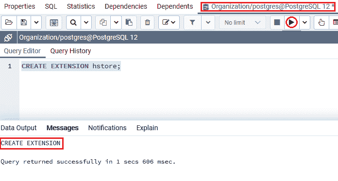

### PostgreSQL hstore 数据类型示例

让我们看一个示例来理解 **PostgreSQL hstore 数据类型**是如何工作的。

在 CREATE 命令的帮助下，我们正在创建一个新表作为 ***电影*** 和 **hstore 列**，并使用 INSERT 命令插入一些值。

***电影*** 表包含各种列，如**电影 _id、电影 _ 名称、电影 _attr** 并具有以下属性:

*   **Movie_id** 是主键，用于查找电影。
*   **电影名**是电影的另一个名字
*   而 **Movie_attr** 列用于包含电影的属性，例如**分级、电影 _ 流派、语言、运行时间和发行年份**。

对于 **Movie_attr** 列，我们使用了 hstore **数据类型。**

要创建一个 ***【电影】*** 表到一个类似的**数据库中，该数据库是“组织”**，在这里我们启用 hstore 扩展，我们使用 **CREATE** 命令，如下面的命令所示:

```

CREATE TABLE Movie (
	Movie_id serial primary key,
	Movie_name VARCHAR,
	Movie_Attr hstore
);

```

**输出**

执行上述命令时，我们会得到如下消息，显示 ***电影*** 表已经创建成功。

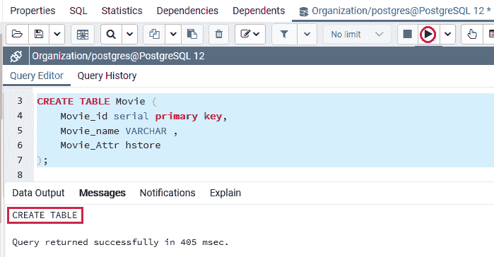

当 ***电影*** 表创建成功后，我们将在 **INSERT** 命令的帮助下向其中插入一些值。

### 将值插入 PostgreSQL hstore 列

要将该值插入 hstore 列，我们使用 [INSERT 命令](https://www.javatpoint.com/postgresql-insert)，如下语句所示:

```

INSERT INTO Movie (Movie_name, Movie_attr)
VALUES
(		'Avengers Endgame',
		'"rating" => "8.4",
	   "movie_genres" => "Action/Sci-fi",
	   "language" => "English",
	   "release_year" => "2019",
		"running_time" => "181 Minutes"' 
),	
 	(	'US',
		'"rating" => "6.9",
	   "movie_genres" => "Horror/Thriller",
	   "language"  => "English",
	   "release_year" => "2019",
		"running_time"  => "116 Minutes"'
	),
 (	'Dolittle',
		'"rating" => "5.6",
	   "movie_genres" => "Adventure/Family ",
	   "language" => "English",
	   "release_year" => "2020",
		"running_time" => "101 Minutes"'
);

```

**输出**

执行上述命令后，我们会得到如下消息窗口，显示指定值已成功插入 ***【电影】*** 表。

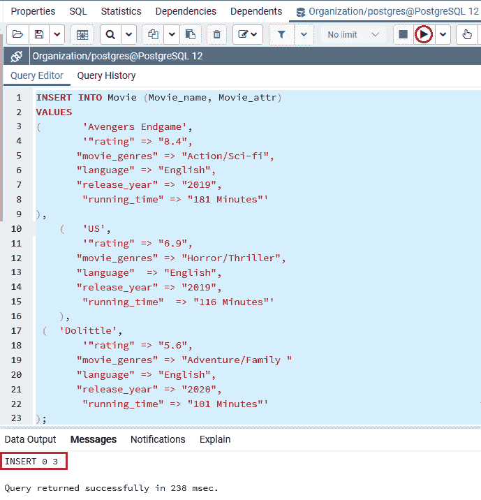

#### 注意:正如我们在上面的 insert 命令中看到的，我们插入到 hstore 列中的值是逗号分隔的键= >值对的列表。键和值都用双引号(")括起来。

在 ***电影*** 表中创建并插入值后，我们将使用**选择**命令从 ***电影*** 表中检索所有数据:

### 从 hstore 列中选择值

从 **hstore 列**中选择值等于在 [SELECT 命令](https://www.javatpoint.com/postgresql-select)的帮助下从具有本机数据类型的列中选择值，如下所示:

```

Select * 
FROM Movie;

```

**输出**

成功执行上述命令后，我们将获得以下输出，其中显示了 ***电影*** 表中存在的所有数据:


### 为特定键选择数据

PostgreSQL hstore 数据类型允许我们使用 **- >** 运算符从 **hstore 列** (Movie_Attr)中选择特定键的数据值。

在下面的例子中，我们使用 **- >** 运算符来识别 ***电影*** 表中所有可用电影的 **running_time** ，如下命令所示:

```

SELECT
Movie_attr -> 'running_time' AS Time_duration
FROM
Movie;

```

**输出**

执行上述命令后，我们将获得以下输出，显示来自 ***电影*** 表的每部电影的**运行时间**。

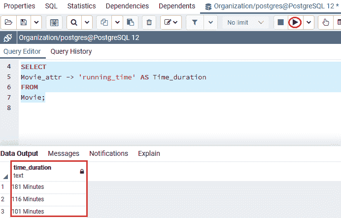

### 在 WHERE 子句中使用 hstore 数据值

过滤**行的值与**输入值**匹配的行。所以，对于这种情况，我们可以使用 [**WHERE** 子句](https://www.javatpoint.com/postgresql-where-clause)中的 **- >运算符**。**

**让我们看一个示例，以便更好地理解:**

在下面的例子中，我们试图获得电影的**电影名称**和**电影类型**，其**relasses _ year**值与 2019 年匹配:

```

SELECT
Movie_name, Movie_attr -> 'movie_genres' AS Genres
FROM Movie
WHERE Movie_attr -> 'release_year' = '2019';

```

**输出**

执行上述命令后，我们将使用输出中的 **WHERE 子句**获得 **hstore 列**的值，如下所示:

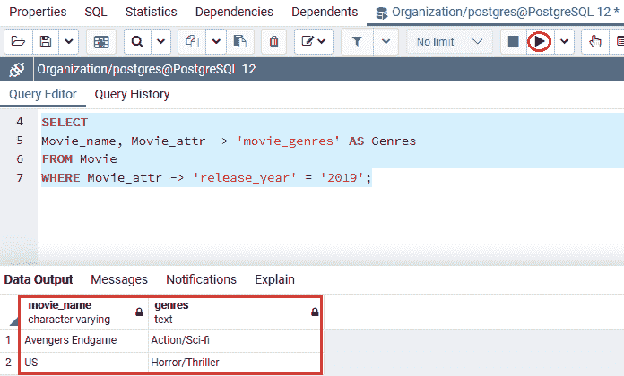

### 从 hstore 列中检索所有值

要从 hstore 列中检索所有数据值，我们可以在数组中使用 **avals()函数**。

在下面的例子中，我们在 **avals()** 函数的帮助下，从 ***电影*** 表的一个 hstore 列中获取所有值:

```

SELECT avals (Movie_attr)
FROM Movie;

```

**输出**

执行上述命令后，我们将获得以下输出，其中显示了**电影**表中所有可用的 **Moive_attr** 值:

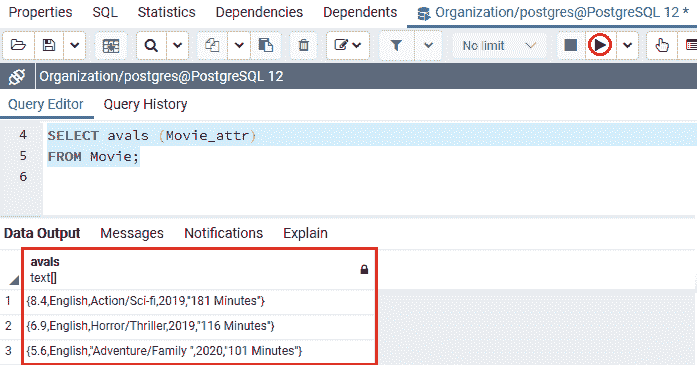

**或**

如果我们想以集合的形式检索输出，我们可以使用 **svals()** 函数。

在下面的命令中，我们使用**svals()函数**而不是 **avals(** )来获得一组输出:

```

SELECT svals (Movie_attr)
FROM Movie;

```

**输出**

在执行上述命令时，我们将获得以下输出:

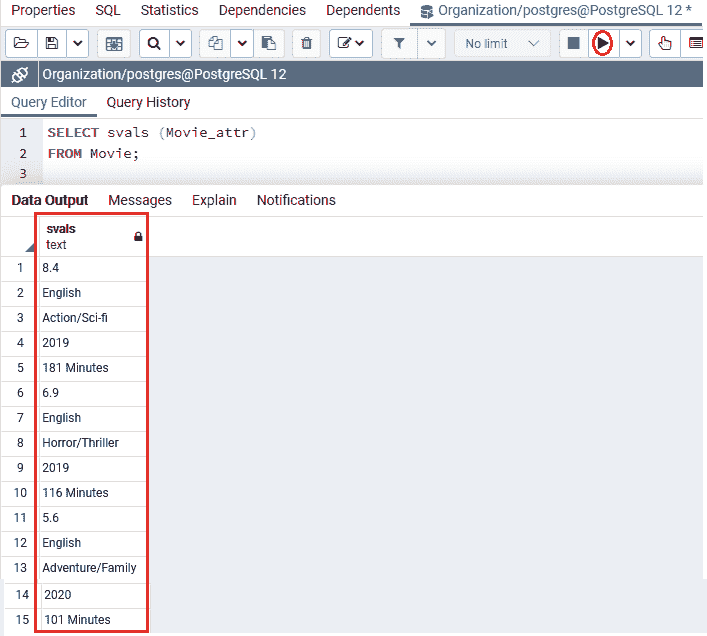

### 从 hstore 列中检索所有键

就像我们可以使用 **avals()和 svals()** 函数从 hstore 列中获取所有值一样，我们可以使用 **akeys()函数**从 hstore 列中检索所有键:

```

SELECT akeys (Movie_attr)
FROM Movie;

```

**输出**

在执行上述命令时，我们将获得以下输出，该输出显示了在**电影**表中可用的**电影 _attr** 列的所有**键**值:

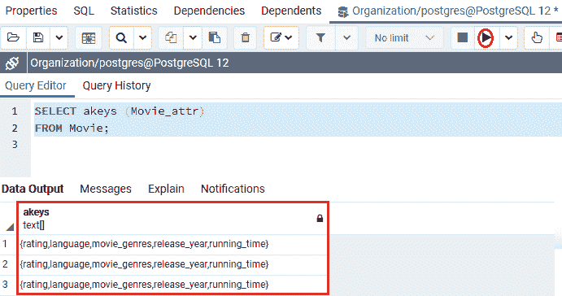

**或**

如果我们希望 PostgreSQL 将输出作为一个集合检索，我们可以使用 **skey()函数**。

在下面的命令中，我们使用**skey()函数**而不是 **akeys(** )来获得一组输出:

```

SELECT skeys (Movie_attr)
FROM Movie;

```

**输出**

执行上述命令后，我们将获得以下输出集:

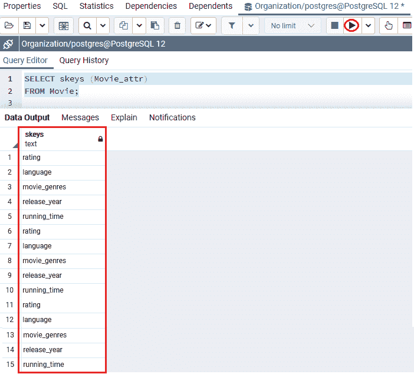

### 将 hstore 数据修改为集合

我们可以使用 **EACH()函数**将 hstore 数据修改为集合，如以下命令所示:

```

SELECT Movie_name, 
(EACH(Movie_attr)).* 
FROM Movie;

```

**输出**

成功执行上述命令后，我们将获得以下输出，该命令将修改后的 hstore 数据显示为集合:

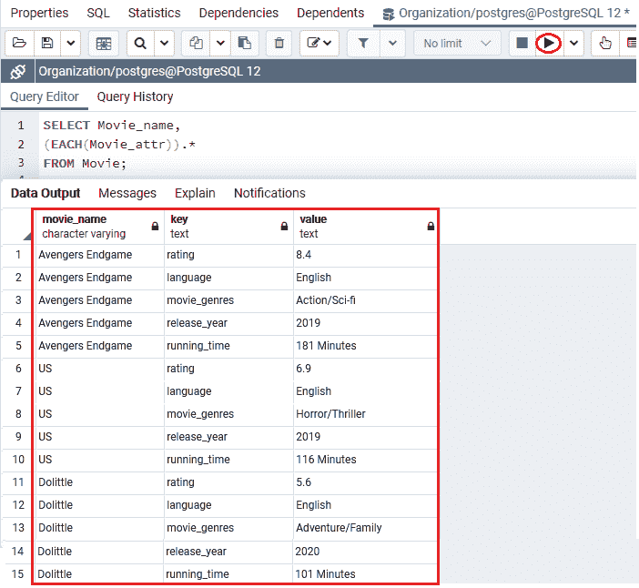

### 将 hstore 数据修改为 JSON

要将 hstore 数据更改为 **JSON，** PostgreSQL 提供了 **hstore_to_json()** 功能。

在下面的命令中，我们使用 **hstore_to_json()** 函数将 **hstore** 数据值转换为 **json** :

```

SELECT Movie_name, 
hstore_to_json (Movie_attr) json
FROM Movie;

```

**输出**

执行上述命令后，我们将得到以下结果，显示我们已经成功地将 hstore 数据修改为 json:

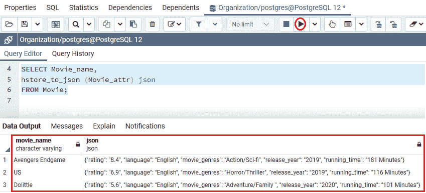

### 将键值对添加到当前行

我们可以用 hstore 列向当前行添加一个新的键值对。

**例如**，我们可以将**国家**键添加到 ***电影*** 表格的**电影 _attr** 列中，如下命令所示:

```

UPDATE Movie
SET Movie_attr = Movie_attr || '"Country"=>"United States"':: hstore;

```

**输出**

执行上述命令后，我们将得到下面的结果，显示三列已经成功更新。

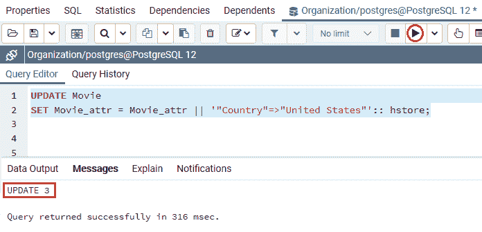

现在，如果我们想看到**“国家”= >“美国”**值已经成功更新。

```

SELECT Movie_name,
Movie_attr -> 'Country' AS Country
FROM Movie;

```

**输出**

在执行上述命令时，我们将得到以下结果，显示**国家** **电影 _attr** 值**美国**已更新为指定值。

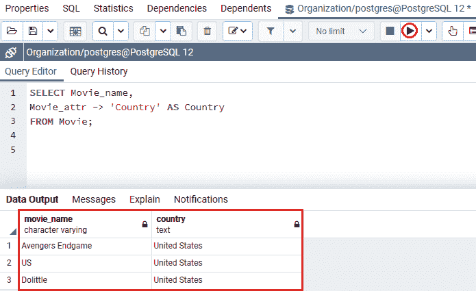

### 更新当前键值对

借助**更新**命令，我们可以更新**当前键值对**。

例如:在下面的命令中，我们将把“国家”键的值更新为“美国”。

```

UPDATE Movie
SET Movie_attr = Movie_attr || '"Country"=> "USA"' ::hstore;

```

**输出**

执行上述命令后，我们将看到下面的消息窗口，显示值已成功更新。

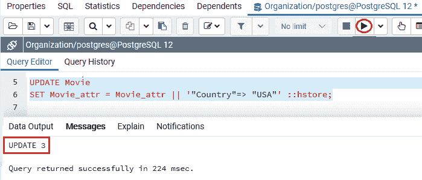

### 删除当前键值对

PostgreSQL 为我们提供了从 hstore 列中删除当前键值对的功能。

让我们看一个示例来更好地理解:

在下面的命令中，我们删除了**电影 _ attr** 列中的**“国家”= >【美国】**键值对。

```

UPDATE Movie
SET Movie_attr = delete(Movie_attr, 'Country');

```

**输出**

执行上述命令后，我们将看到下面的消息窗口，显示指定的值已成功更新。

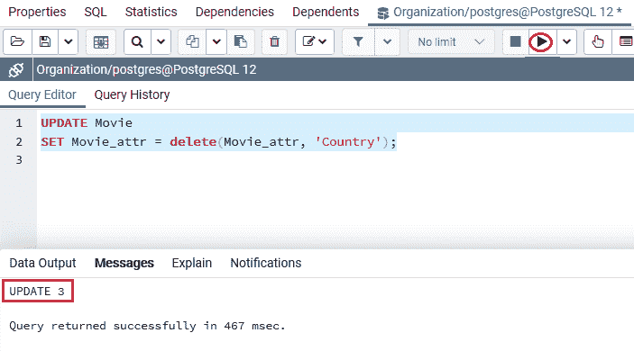

### 检查 hstore 列中的显式键

**那个？**运算符用于检查 **WHERE** 子句中 **hstore 列**中的显式键。

在下面的示例中，下面的命令检索所有带有**电影属性的行，其中包含关键的**电影**类型。**

```

SELECT Movie_name, 
Movie_attr->'movie_genres' as genres,
Movie_attr
FROM Movie
WHERE Movie_attr ? 'movie_genres';

```

**输出**

在实现上述命令时，我们将得到以下结果，它在 hstore 列中显示了指定的键。

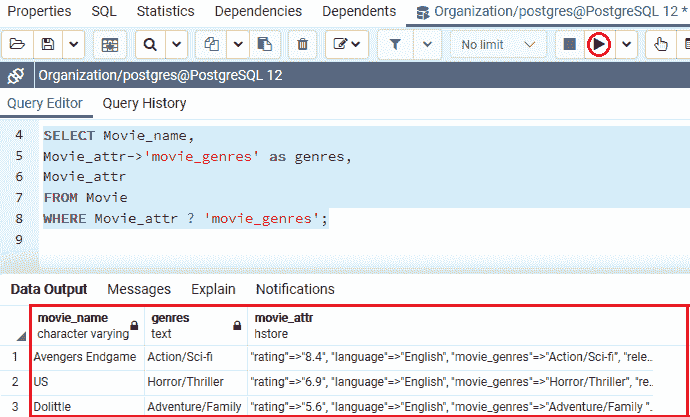

### 检查键值对

我们可以使用 **@ >运算符**来选择 hstore 键值对。

让我们看一个例子来看看 **@ >运算符**的用法:

下面的命令用于从 **Movie_attr** 列返回包含键值对的所有行，并且还匹配**“语言”= >“英语”**。

```

SELECT Movie_name
FROM Movie
WHERE Movie_attr @> '"language"=>"English"' :: hstore;

```

**输出**

成功执行上述命令后，我们将得到下面的结果，代表 hstore 键值对。

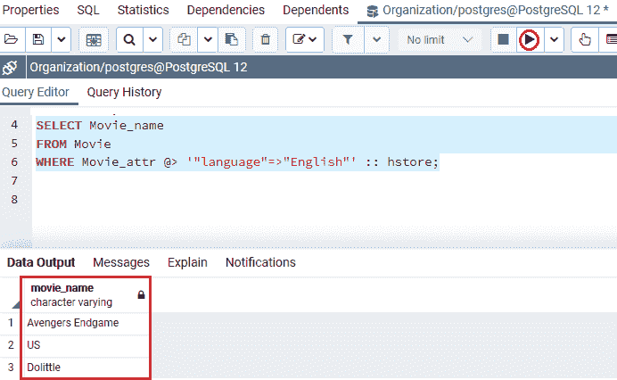

### 选择具有各种指定键的行

**那个？&操作符**用于选择 hstore 列有各种键的行。

在下面的例子中，我们可以得到**电影**，其中**电影 _attr** 列包含**运行时间**和**评级**键:

```

SELECT Movie_name
FROM Movie
WHERE 
Movie_attr ?& ARRAY [ 'running_time', 'rating' ];

```

**输出**

执行上述命令后，我们将获得以下输出:

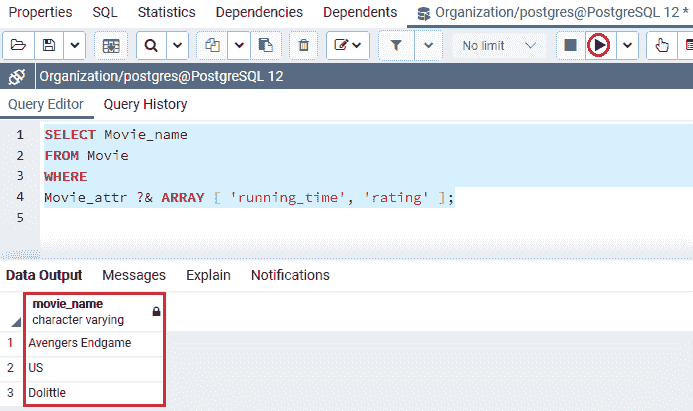

#### 注意:我们也可以用？|运算符在？& operator 用来检查 hstore 列是否包含键列表中的任何键的位置。

在下面的命令中，我们使用的是**？|** 符代替**？&** 从键列表中获取那些其 **hstore 列**包含任何键的行:

```

SELECT Movie_name
FROM Movie
WHERE 
Movie_attr ?| ARRAY [ 'running_time', 'rating' ];

```

**输出**

执行上述命令后，我们会得到与**的输出类似的结果？&** 符:

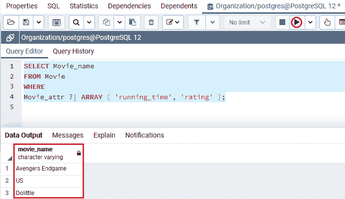

## 概观

在 **PostgreSQL 的 hstore 数据类型**部分进行最有用的操作，我们可以针对 hstore 数据类型执行。

我们已经学习了以下主题:

*   **PostgreSQL hstore 数据**类型用于存储单位值中的**键值对。**
*   我们使用**创建扩展**启用了 PostgreSQL 存储
*   借助 **- >运算符**，我们可以选择特定值的数据。
*   我们在**中使用了 **hstore 数据类型****
*   我们也可以使用 **avals()函数**从 hstore 列中检索值。
*   要将**输出设置为**，我们可以使用 **svals()函数**。
*   我们也可以在 **akeys()** 的帮助下从 hstore 值返回所有的键
*   要将**输出作为一组返回，**我们可以使用 **skeys()功能**。
*   我们使用了 **EACH()函数**将 hstore 数据修改为集合。
*   在 PostgreSQL 的 hstore 数据类型部分，我们也可以**使用 **hstore_to_json()函数**将 hstore 数据更改为 json** 。
*   我们还可以添加、更新、删除 PostgreSQL hstore 数据类型中的**键值对**。
*   我们也讨论过以下运算符，比如，**？(**检查 hstore 列中的显式键**)、@ >(检查键值对)、？&，还有？|(** 选择 hstore 列具有各种键的行)。

* * *