# 用户定义的数据类型

> 原文：<https://www.javatpoint.com/postgresql-user-defined-data-type>

在本节中，我们将借助 **CREATE DOMAIN 和 CREATE TYPE** 命令来了解 **PostgreSQL 用户定义数据类型**的工作方式，并查看其一个**示例**。

## 什么是 PostgreSQL 用户定义的数据类型？

除了内置的**数据类型**， [PostgreSQL](https://www.javatpoint.com/postgresql-tutorial) 为我们提供了生成**用户定义的数据类型**的帮助，下面的命令:

| 命令 | 描述 |
| **创建域** | 它生成带有约束的用户定义的数据类型，例如，检查、非空等。 |
| **创建类型** | create type 命令用于生成一个复合类型，根据返回值的数据类型在**存储过程**中使用。 |

现在，让我们看看 **CREATE DOMAIN** 和 **CREATE TYPE** 命令如何处理 PostgreSQL 用户定义的数据。

### PostgreSQL CREATE DOMAIN 命令

在 PostgreSQL 中，域在模式范围内具有唯一的名称，因为**域**是具有**选择性约束**的数据类型，如**检查，不为空**。对于合并具有公共约束的字段的组织，域总是有益的。

**例如**，假设我们有一些表包含一个类似的列，它不接受 NULL 和空格。

换句话说，我们可以说一些表可能包含文本列，这需要一个 CHECK 约束来确保值不为空并保持用空格扩展。

### 域数据类型示例

让我们看一个示例来理解**域数据类型**是如何工作的。

在 CREATE 命令的帮助下，我们创建了一个新的表作为*接收者，并使用 INSERT 命令插入了一些值。*

 *要将 ***收件人*** 创建到**组织数据库**中，我们使用 **CREATE** 命令。

***【收件人】*** 表包含以下几列，如**收件人 _id、名字、姓氏和电子邮件。**

```

CREATE TABLE Recipients (
Recipient_ID SERIAL PRIMARY KEY,
    First_name VARCHAR NOT NULL,
    Last_name VARCHAR NOT NULL,
    Email VARCHAR NOT NULL,
    CHECK (
      First_name !~ '\s'
      AND Last_name !~ '\s'
    )
);

```

**输出**

执行上述命令时，我们会收到以下消息，显示 ***【收件人】*** 表已成功创建到**组织**数据库中。

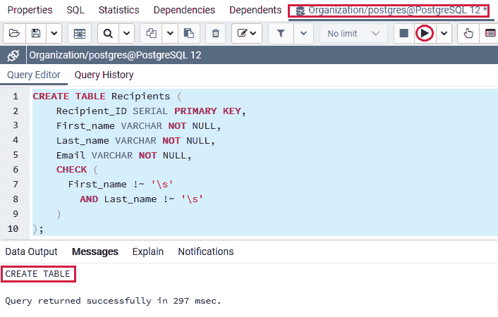

我们使用了上表中的 **CHECK 约束**，即**名**和**姓**列不接收**空格和空值。**

因此，这里我们可以创建为 **person_name** Domain，并在各个列中重用它来定义 CHECK 约束。

在下面的命令中，我们使用 **CREATE DOMAIN** 命令，使用不包含空格和空值的 **VARCHAR 数据类型**生成一个名为 **person_name** 的新域:

```

CREATE DOMAIN person_name AS 
 VARCHAR NOT NULL CHECK (value!~ '\s');

```

**输出**

执行上述命令后，我们会得到如下消息窗口，显示 ***【收件人】*** 表的**人名*域*** 已创建成功。

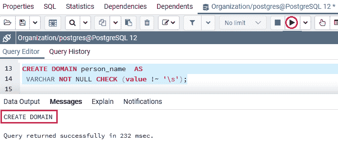

创建域后，我们可以使用 **person_name** 域作为 **First_name** 和 **Last_name** 列的数据类型作为一致的内置类型，如下命令所示:

```

CREATE TABLE Recipients1 (
Recipient_ID SERIAL PRIMARY KEY,
    First_name person_name,
    Last_name person_name,
    Email VARCHAR NOT NULL
    );

```

**输出**

执行以上命令后，我们会得到如下消息窗口，显示 ***【收件人】*** 1 表已创建成功。


**注:**

*   一旦我们创建了域，请确保两个表必须具有不同的名称，因为它采用了表的相同名称( **Recipients** )。
*   PostgreSQL 引发如下错误**关系“收件人”已经存在，**如下图截图所示:


一旦 ***收件人 1*** 表创建成功，我们将使用 [**插入**命令](https://www.javatpoint.com/postgresql-insert)向其中插入一些值。

在下面的命令中，我们将一些值插入到 ***收件人 1*** 表中。

```

INSERT INTO Recipients (First_name, Last_name, Email)
VALUES('Mike',' W Ross','rossmike11@gmail.com');

```

**输出**

执行上述命令后，PostgreSQL 会引发以下错误**关系“recipients”的新行违反了检查约束“recipients _ check”**，因为**姓氏**列包含如下截图所示的空格:

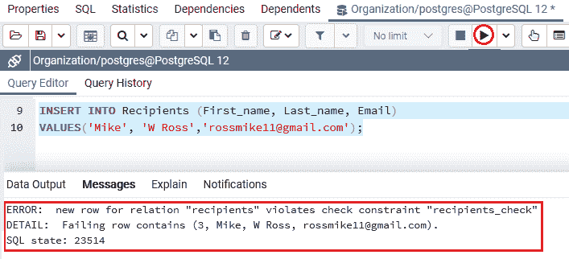

为了解决上述错误，我们将提供**姓氏**而不给出任何空格，如下命令所示:

```

INSERT INTO Recipients (First_name, Last_name, Email)
VALUES('Mike','Ross','rossmike11@gmail.com');

```

**输出**

成功执行上述命令后，我们将获得下面的消息窗口，其中显示特定值已插入到 ***【收件人】*** 表中。

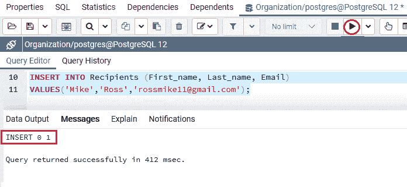

## 在 psql 中查看域

我们将按照以下流程在 **psql:** 中查看一个域

**第一步**

首先，我们将在本地系统中打开 **psql** ，我们将连接到我们想要创建表的数据库。

**第二步**

为了连接**组织**数据库，我们将输入以下命令:

```

postgres=# \c Organization 

```

**输出**

执行上述命令后，我们将获得以下输出:


**第三步**

现在，我们将输入下面的命令来查看**组织**数据库中的域。

```

Organization=# \dD

```

**输出**

在执行上面的命令时，我们将获得下面的输出，它显示了现有的域，即存在于**组织**数据库中的**人名**:


## 删除/更改域

我们可以单独使用**DROP DOMAIN 或 ALTER DOMAIN** 命令来删除或修改一个域。

```

DROP DOMAIN IF EXISTS person_name;

```

**输出**

执行上述命令后，我们会得到如下错误消息:我们无法**删除 type person_name，因为其他对象依赖于它。**

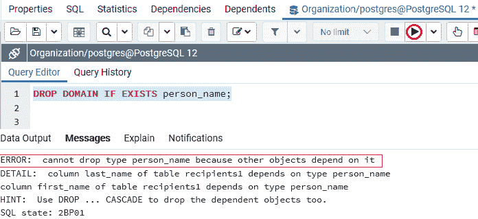

因此，在上面的命令中，我们使用 **CASCADE** ，因为它用于自动放下依赖于表格的对象。

```

DROP DOMAIN IF EXISTS person_name CASCADE;

```

**输出**

执行上述命令后，我们将得到以下结果，显示 **person_name** 域已成功删除。

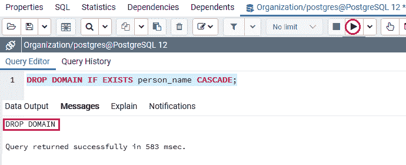

## PostgreSQL 创建类型命令

PostgreSQL CREATE TYPE 命令为我们提供了一个**复合类型**，可以作为函数的返回类型。

**例如:**如果我们想要一个函数，它返回几个值: **item _id，item_name，item_price**

**第一步**

首先，我们将**创建一个类型**，如 ***Item_details，*** ，如下命令所示:

```

CREATE TYPE Item_details AS (
    item_id INT,
    item_name VARCHAR,
    item_price Numeric(5,2)
);

```

**输出**

执行上述命令后，我们会得到如下消息窗口，显示 **item_details 类型**已经创建成功。

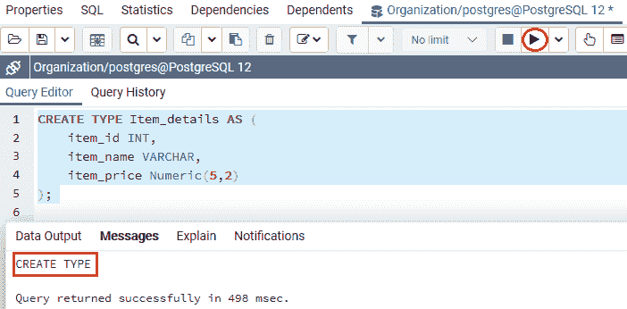

**第二步**

之后，我们将使用 **item_details** 数据类型作为函数的返回类型，如下命令所示:

```

CREATE OR REPLACE FUNCTION get_Item_details (I_id INT) 
    RETURNS Item_details AS 
$$ 
SELECT item_id, item_name,  item_price 
FROM items
WHERE item_id = I_id ; 
$$ 
LANGUAGE SQL;

```

**输出**

执行上述命令后，我们将获得以下消息窗口，显示函数已成功创建。

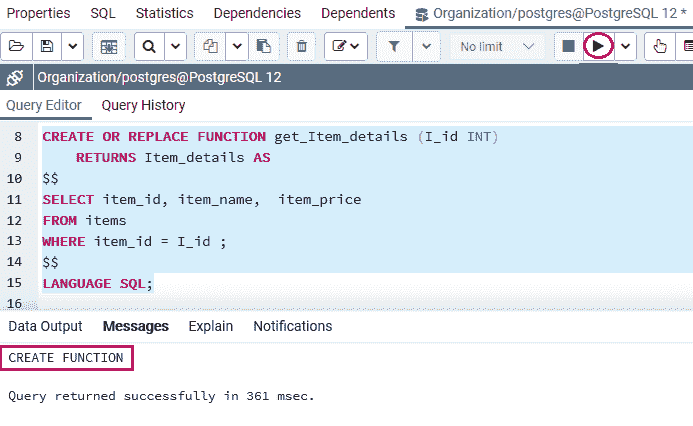

**第三步**

最后，我们将借助**选择**命令调用 **get_Item_details()** 功能:

```

SELECT * FROM get_Item_details(3);

```

**输出**

在执行上述命令时，我们将获得以下输出，其中显示了特定的 id 项，即**奥迪 A7** 。

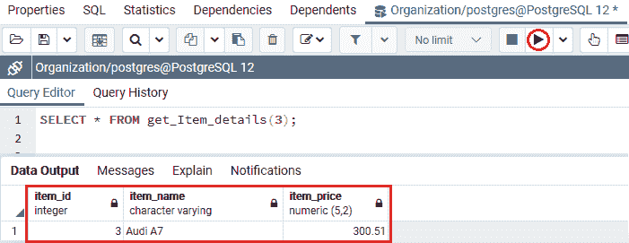

### 删除/更改类型

就像我们使用 **Drop domain** 命令删除 domain 一样，我们可以使用**Drop TYPE 命令**删除用户定义的数据类型，我们可以使用 **ALTER TYPE** 命令修改用户定义的数据类型。

```

DROP TYPE IF EXISTS Item_details;

```

**输出**

我们将得到与上面类似的错误(删除域)**我们不能删除 Item_details 类型，因为其他对象在执行上面的命令时依赖于它**。

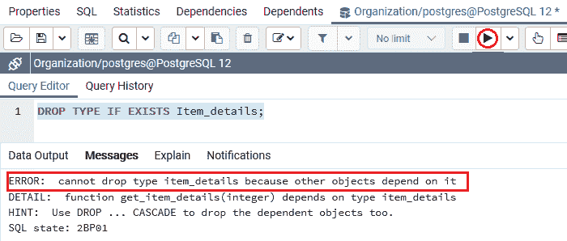

为了解决上述错误，我们使用 **CASCADE** 来自动放下依赖于表格的对象。

```

DROP TYPE IF EXISTS Item_details CASCADE;

```

**输出**

执行上述命令后，我们将获得下面的消息窗口，显示指定的类型已成功删除。


### 在 psql 中查看类型

如果我们使用 psql 程序，我们可以在以下命令的帮助下列出现有数据库中的所有用户定义类型:

```

 \dT or \dT+

```

例如，我们将按照下面的过程在 **psql 中查看一个类型:**

**第一步**

首先，我们将在本地系统中打开 **psql** ，我们将连接到我们想要创建表的数据库。

**第二步**

为了连接**组织**数据库，我们将输入以下命令:

```

postgres=# \c Organization 

```

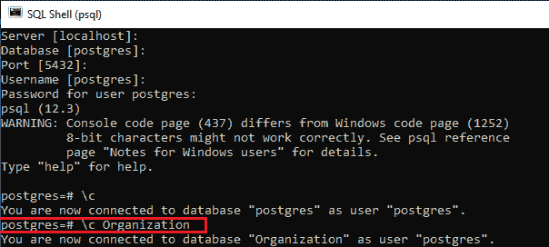

**第三步**

现在，我们将输入下面的命令来查看**组织**数据库中的域。

```

Organization=# \dT

```

**输出**

在执行上面的命令时，我们将获得下面的输出，它显示现有的类型，即**组织**数据库中存在的 **Item_details** :

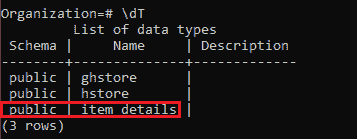

```

Organization=# \dT+

```

**输出**

执行上述命令后，我们将获得以下输出，显示现有类型，即**组织**数据库中存在的 **Item_details** :


## 概观

在 **PostgreSQL 用户定义的数据类型**部分对最有用的操作，我们已经学习了以下主题:

*   **PostgreSQL 自定义数据**类型用于在 **Create DOMAIN 和 CREATE TYPE** 的帮助下生成**自定义数据类型**
*   **CREATE DOMAIN** 命令用于生成带有约束条件的用户定义数据类型，如 **CHECK，NOT NULL** 等。
*   使用 **CREATE TYPE** 命令生成一个复合类型，根据返回值的数据类型在**存储过程**中使用。
*   为了查看 PSQL 中新创建的域，我们使用了 **\dD**
*   我们已经使用了 **\dT 或\dT+** 命令来查看 PSQL 中新生成的类型。
*   我们已经使用**DROP DOMAIN 命令删除了用户定义的数据类型，并且可以使用 **ALTER DOMAIN** 命令修改用户定义的数据类型。**
*   我们还使用了 **DROP TYPE 或 ALTER TYPE** 命令来移除和删除用户定义的类型。

* * **