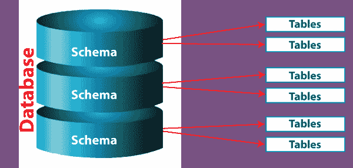
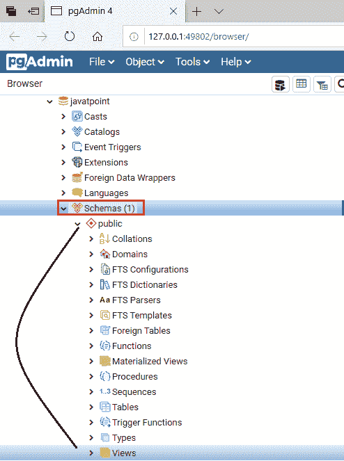
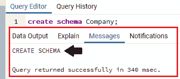
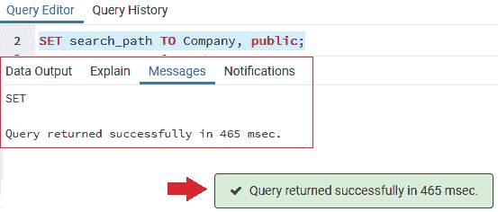
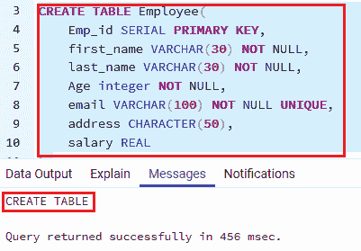

# PostgreSQL 架构

> 原文：<https://www.javatpoint.com/postgresql-schema>

在本节中，我们将学习 **PostgreSQL Schema，公共 Schema，PostgreSQL 如何使用模式搜索路径来解析 Schema 中的对象，PostgreSQL 模式和权限，以及使用 PostgreSQL Schema** 的优势。

### PostgreSQL 模式介绍

每个数据库都以一个模式开始，应该是**公共**模式。而**模式**是一个命名的表集合。



模式是一个命名空间，它提供了几个对象，例如

*   视图
*   指数
*   顺序
*   数据类型
*   经营者
*   功能
*   桌子
*   其他关系。



#### 注意:PostgreSQL 模式是一个保存命名对象的命名空间。

在 [PostgreSQL 模式](https://www.javatpoint.com/postgresql-schema)中，我们可以借助下面的语句，用模式名作为前缀来固定名称，以便访问模式的对象:

```sql

schema_name.object_name

```

否则我们可以设置一个包含模式的**搜索路径**，以后也可以覆盖模式搜索路径。

一个数据库可以有一个或多个模式，而每个模式只存在于一个数据库中，两个模式可以包含不同的对象，这些对象共享一个相似的名称。

**例如**

假设我们有包含**员工表**的**公司模式**，公共模式也有**员工表**。当我们参考雇员表时，它应该如下:

```sql

public.comany
Or
Employee.company

```

### 为什么我们需要在 PostgreSQL 中使用 Schemas？

在 [PostgreSQL](https://www.javatpoint.com/postgresql-tutorial) 中，我们使用模式的主要原因如下:

*   最终用户只能使用那些允许测试表和逻辑与生产表分离的模式。
*   在模式中，我们可以高效地获取数据，并且可以应用于以下一些活动:
    *   我们可以快速恢复数据，数据呈现在不同的模式中。因此，面向应用程序的模式可以单独返回和备份，以便进行恢复和时间旅行。
    *   当应用程序数据在模式中时，我们可以管理应用程序更改。因此，新版本的应用程序可以在新模式中处理表结构，包括对模式名称的简单修改。
    *   我们可以轻松地备份单独模式中的数据。因此，不稳定的数据可以有几个来自非易失性数据的备份计划。

因此，出于**创建的目的**，我们可以在模式高级管理中将我们的应用程序数据分开。出于**最终用户的目的**，我们可以通过相互踩在对方身上，让我们的用户保持在不同的模式中。

### 公共模式

在 PostgreSQL 教程的早期主题中，我们创建了没有描述任何模式名称的表。默认情况下，这些表和附加对象会自动放入**公共模式**中。

对于每个新的数据库，PostgreSQL 都会生成一个名为 **public 的模式。**因此，以下命令是并行的:

```sql

CREATE TABLE table_name;
And
CREATE TABLE public.table_name;

```

## PostgreSQL 架构搜索路径

*   在 PostgreSQL 中，如果我们只通过名称来选择一个表，我们可以使用**模式搜索路径的帮助**来搜索该表。
*   PostgreSQL 将为模式搜索路径中的初始等效表提供权限。如果没有匹配，它将抛出一个错误，甚至名称出现在数据库中的另一个模式中。
*   在 PostgreSQL 中，**当前模式**被认为是搜索路径中的主要模式。
*   我们可以经常在**模式搜索路径**中引用一个没有模式名的表。

**例如**

要访问雇员表，我们使用**公司。员工**。

**注:**

*   如果我们创建一个没有描述模式名称的新对象，PostgreSQL 也将使用**当前模式**作为新对象。
*   **current_schema()** 方法用于返回当前模式。

```sql

SELECT current_schema();

```

**输出**

执行上述命令后，我们将获得以下输出:


#### 注意:PostgreSQL 为我们在数据库中创建的每个新对象使用公共。

我们可以使用下面的 SHOW 语句来查看当前的搜索路径。

```sql

SHOW search_path;

```

**输出**

执行上述命令后，我们将获得以下输出:


在上面的输出中:

*   **“$ user”**定义了 PostgreSQL 将用来查找与当前用户同名的对象的第一个模式。
    **例如**
    如果我们使用 Postgres 用户登录并拥有 **Employee** 表的特权。在 **Postgres 模式**中，PostgreSQL 将搜索**员工**表。如果找不到这样的对象，它将继续在**公共**模式中搜索对象。
*   第二个组件是指定公共模式，正如我们之前所理解的。

要创建一个**新模式**，我们可以使用 [**创建模式**命令](https://www.javatpoint.com/postgresql-create-schema):

```sql

CREATE SCHEMA Company;

```

**输出**



为了将新模式添加到搜索路径中，我们可以使用以下语句:

```sql

SET search_path TO Company, public;

```

**输出**



如果我们创建一个新表**雇员**而不描述模式名，那么 PostgreSQL 会将这个**雇员表**放入**公司模式:**

```sql

CREATE TABLE Employee(
Emp_id SERIAL PRIMARY KEY,
first_name VARCHAR(30) NOT NULL,
last_name VARCHAR(30) NOT NULL,
Age integer NOT NULL,
email VARCHAR(100) NOT NULL UNIQUE,
address CHARACTER(50), 
salary REAL
);

```

**输出**



下面的截图显示了新的模式**公司**和**员工**表，属于**公司模式:**


要访问**公司模式**中的**员工表**，我们可以使用以下命令之一:

```sql

SELECT * FROM Employee;
Or 
SELECT * FROM Company.Employee;

```

**公共模式**是搜索路径中的第二个组件；因此，要访问公共模式中的**员工表**，我们应该在下面指定表名:

```sql

SELECT * FROM public.Employee;

```

一旦我们执行了上面所有的语句，我们将得到下面的输出。

运行**第一个命令**后，我们会得到如下输出:


执行第二个命令后，我们将获得以下输出:


一旦我们执行**最后一个命令**，我们会得到下面的输出:


执行完所有三个命令后，我们将获得相同的输出，这就是为什么我们可以使用上面的任何查询来访问公司模式中的**员工表。**

#### 注意:我们也可以删除公共模式，因为它不是唯一的模式。

## PostgreSQL 架构和权限

用户只能有权限访问他们创建的模式中的对象，这意味着用户不能使用模式中非他们创建的任何其他对象。

因此，我们必须授予用户**使用权限**来获得模式中对象的所有访问权限，这是他们没有创建的。

以下命令用于获取模式上用户的**使用权限**:

```sql

GRANT USAGE ON SCHEMA schema_name TO user_name;

```

为了允许用户在他们没有创建的模式中创建一个对象，我们必须授予他们 **CREATE 特权**。

以下命令用于授予模式的创建权限:

```sql

GRANT CREATE ON SCHEMA schema_name TO user_name;

```

#### 注意:默认情况下，每个用户都具有公共架构的 USAGE 和 CREATE 权限。

如果我们不想在下面命令的帮助下访问该权限，我们可以撤销该权限。

```sql

REVOKE CREATE ON SCHEMA public FROM PUBLIC;

```

这里第一个**公众**指的是**这个模式，**第二个**公众**指的是**每个用户**。

### PostgreSQL 架构操作

*   我们可以使用 **CREATE SCHEMA** 命令来创建一个新的模式。
*   我们可以使用**删除模式**命令删除一个模式。
*   我们可以使用 **ALTER SCHEMA** 命令来重命名模式或修改所有者。

## 使用 PostgreSQL 模式的好处

该模式允许我们简化许多用户使用一个数据库，而不涉及其他用户。PostgreSQL 模式的一些普遍优势如下:

*   在 PostgreSQL Schema 中，关键的优势在于，如果一个数据库属于不同的模式，它可以有相同的表名。
*   模式可以将数据库对象分类到逻辑组中，以使它们更加可控。
*   模式允许用户使用一个数据库作为多个数据库的替代。
*   为了避免与其他对象的名称冲突，我们可以将第三方模式放入不同的模式中。
*   只要名称相似的对象放在不同的模式中，它们就不会发生冲突。

* * *