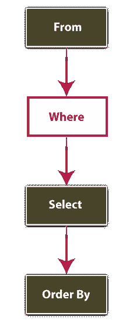
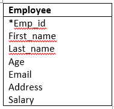
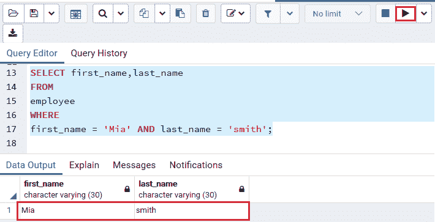
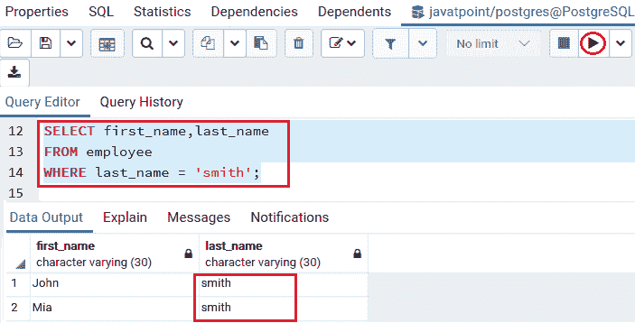
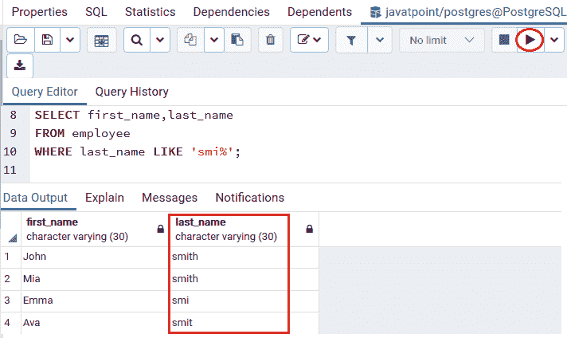
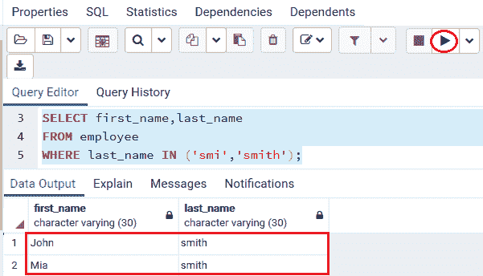
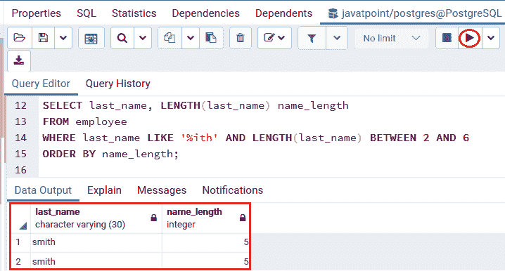
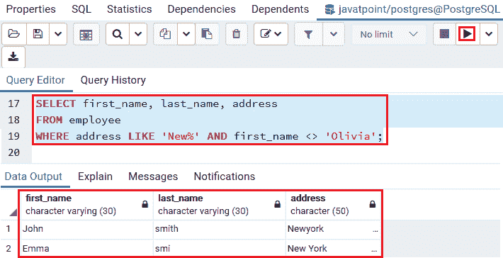
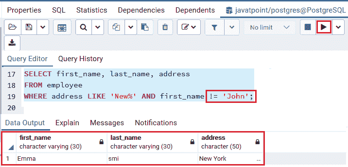

# PostgreSQL WHERE 子句

> 原文：<https://www.javatpoint.com/postgresql-where-clause>

在本节中，我们将了解 PostgreSQL **where 子句**的工作原理，该子句用于过滤由 **Select** 命令返回的行。

WHERE 条件用于描述我们从表中获取数据或连接各种表时的条件。常用于**选择、更新、删除**命令过滤输出。只有当条件满足时，它才会返回确切的结果。

#### 注意:要选择满足详细条件的行，我们使用 WHERE 子句。SELECT 命令返回表中一列或多列的所有行。

### PostgreSQL WHERE 子句的语法

PostgreSQL WHERE 条件的语法如下:

```sql

SELECT column1, column2, ..... columnN  
FROM table_name  
WHERE [search_condition]  
ORDER BY sort_expression

```

在**选择**命令中，**条件出现在 **FROM** 子句之后。该条件用于过滤从[选择命令](https://www.javatpoint.com/postgresql-select)返回的行。**

 **如果我们使用 **[和&或](https://www.javatpoint.com/postgresql-and-or-condition)** 运算符，where 子句可以是**布尔**表达式或一组布尔表达式。该子句必须评估为**真、假或未知**。

WHERE 条件适用于以下格式:

它从 **From 子句→** 开始，然后执行 **Where 条件→** 之后，它将**选择**特定列 **→** ，然后按子句的**顺序执行。**



**WHERE** 条件不支持 **SELECT** 命令下的**列别名**。Where 子句支持 **[【删除】](https://www.javatpoint.com/postgresql-delete)和[更新](https://www.javatpoint.com/postgresql-update)** 命令，用于定义删除和更新的行。

**WHERE 条件**可以与**逻辑和比较运算符**一起使用，如下表所示:

| 不同的操作员 | 描述 |
| **和** | 逻辑运算符“与” |
| **或** | 逻辑运算符或 |
| **=** | 平等的 |
| **>** | 大于 |
| **<** | 不到 |
| **< >还是！=** | 不平等 |
| **> =** | 大于或等于 |
| **< =** | 小于或等于 |
| **输入** | 如果一个值与列表中的任何值相匹配，IN 运算符将返回 true |
| **喜欢** | 如果一个值与一个模式匹配，LIKE 运算符用于返回 true |
| **在**之间 | 如果一个值在一系列值之间，则使用 BETTER 运算符返回 true |
| **不是** | 否定其他运算符的结果 |
| **为空** | 它用于在值为空时返回真。 |

### PostgreSQL WHERE 条件的示例

让我们看一些例子，从中我们可以了解到 **WHERE 子句**在 PostgreSQL 中是如何工作的。

为此，我们将采用*员工表，该表是我们在 [PostgreSQL 教程](https://www.javatpoint.com/postgresql-tutorial)的前面部分中创建的。*

 *下面的截图定义了 ***员工*** 表格中的不同列:



在上表中，我们将使用 **where 子句**来执行**不同类型的运算符**。

*   **使用 WHERE 子句的 AND 运算符示例**

在下面的例子中，我们将使用**和逻辑运算符**来组合 ***员工*** 表中的两个布尔表达式，以找到**名字是 Mia，姓氏**是**史密斯**。

```sql

SELECT first_name, last_name
FROM 
employee
WHERE 
first_name = 'Mia' AND last_name = 'Smith';

```

**输出**

执行上述命令后，我们将获得以下输出:



*   **使用 WHERE 子句的(=)等号运算符示例**

在下面的命令中，我们使用 ***员工*** 表中的**等号(=)运算符**，使用 **where 条件**来标识姓氏等于 smith 的记录**。**

```sql

SELECT first_name,last_name
FROM employee
WHERE last_name = 'smith';

```

**输出**

执行上述命令后，我们将获得下面的输出，该输出获取两个记录，这两个记录的**姓氏**等于**史密斯**。



*   **使用 WHERE 子句的 OR 运算符示例**

在下面的示例中，我们将使用*表中的 **[或](https://www.javatpoint.com/postgresql-or-condition)逻辑运算符**将**名**识别为**梅根**，将**姓**识别为**威尔**。*

```sql

SELECT first_name, last_name
FROM 
employee
WHERE 
first_name = 'megan' OR last_name = 'will';

```

**输出**

执行上述命令后，我们将获得以下输出:


*   **使用 WHERE 子句的 LIKE 运算符示例**

在这里，我们将使用 **[LIKE 运算符](https://www.javatpoint.com/postgresql-like-condition)** 来识别字符串，该字符串与定义的设计相匹配。

下面的命令显示那些在 ***员工*** 表中**姓氏**以字符串 **smi** 开头的记录。

```sql

SELECT first_name,last_name
FROM employee
WHERE last_name LIKE 'smi%';

```

**输出**

执行上述命令后，我们将得到下面的输出，其中上面的查询获取**四条记录**，其**姓氏**以 **smi 字符串**开头:



#### 注意:在上面的命令中,%被称为通配符，这有助于匹配任何字符串。“smi%”模式匹配那些以“smi”开头的字符串。

*   **使用 WHERE 子句的 IN 运算符示例**

这里，我们将使用 **IN 运算符**将一个字符串与列表中的任何字符串进行匹配。

以下命令在 ***员工*** 表中显示那些**姓氏为 **smi，史密斯**的记录。**

```sql

SELECT first_name,last_name
FROM employee
WHERE last_name IN ('smi','smith');

```

**输出**

一旦我们实现了上面的命令，我们将得到下面的输出:



*   **使用 WHERE 子句的 BETWEEN 运算符示例**

在下面的命令中，我们将使用**在运算符**之间显示**姓氏**，该姓氏以字符串**结尾，带有**，在 ***员工*** 表中有 **2 到 6 个**字符。

#### 注意:在本例中，我们使用 LENGTH()函数来获取输入字符串的字符数。

```sql

SELECT last_name, LENGTH(last_name) name_length
FROM employee
WHERE last_name LIKE '%ith' AND LENGTH(last_name) BETWEEN 2 AND 6
ORDER BY name_length;

```

**输出**

一旦我们执行了上面的命令，我们将得到下面的输出，其中上面的查询获取了两个与字符串匹配的记录，并且**的名称长度**在 **2 和 6** 之间。



*   **使用 WHERE 子句**的不等运算符(< >)的示例

在下面的例子中，我们将使用**不等于< >** 运算符来识别那些**员工**，他们的**地址**以**新字符串**开头，**名字**不等于**奥利维亚**。

```sql

SELECT first_name, last_name, address
FROM employee
WHERE address LIKE 'New%' AND first_name <> 'Olivia';

```

**输出**

一旦我们执行了上面的命令，我们将得到下面的输出，其中查询获取了**地址**与**新字符串**匹配的**两条记录**，并且**名字**不等于**奥利维亚**。



#### 注意:我们可以同时使用<>运算符和！=运算符，因为它们与我们在下面的命令中看到的相似:

```sql

SELECT first_name, last_name, address
FROM employee
WHERE address LIKE 'New%' AND first_name <> 'John';

```

**输出**

执行上述命令后，我们将得到下面的输出，其中查询获取地址以**新字符串**开头的一条记录，**名字**不等于**约翰**。



* * *****