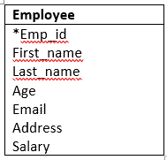
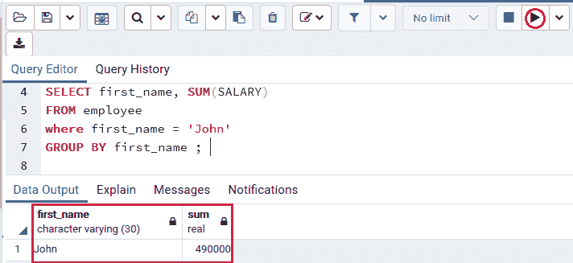
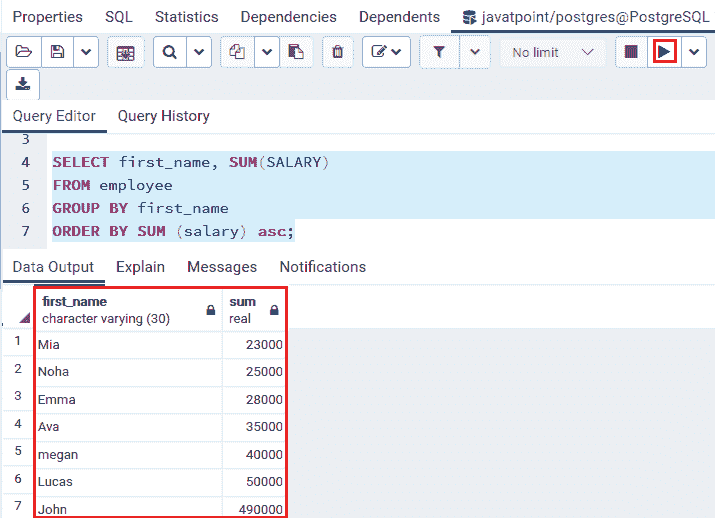
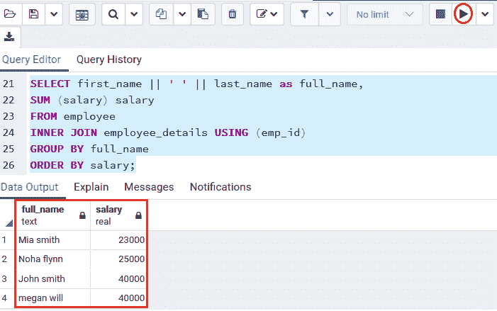
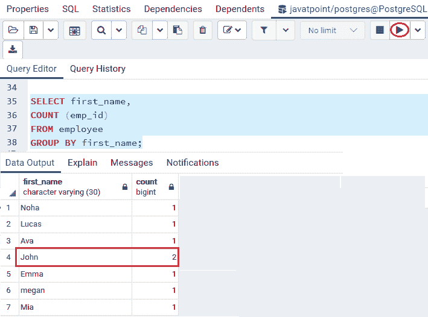
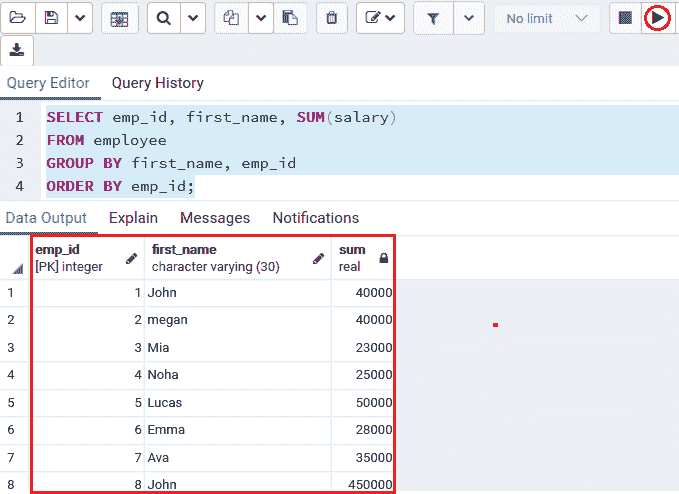

# PostgreSQL 分组依据

> 原文：<https://www.javatpoint.com/postgresql-group-by-clause>

在本节中，我们将了解 PostgreSQL 中 **GROUP BY** 子句的工作原理。我们也看到了 GROUP BY 子句如何使用 **SUM()函数、COUNT()、JOIN 子句、多列和没有聚合函数的**的例子。

PostgreSQL GROUP BY 条件与 SELECT 命令一起使用，它也可以用来减少结果中的冗余。

## PostgreSQL GROUP BY 子句

最重要的是，该子句用于将行拆分成组，其中 GROUP BY 条件收集多个记录中的数据，并按一列或多列设置结果。

每个组可以应用一个聚合函数，如 **COUNT()函数**用于获取组中的项目数， **SUM()函数**用于分析项目的总和。

### PostgreSQL group by 子句的语法

GROUP BY 子句的基本语法如下:

```

 SELECT column-list  
FROM table_name  
WHERE [conditions ]  
GROUP BY column1, column2....columnN  
ORDER BY column1, column2....columnN  

```

以下是上述语法中使用的参数:

**列-列表:**用于选择我们需要分组的列，可以是**列 1、列 2、...圆柱**。

我们还可以在 GROUP BY 子句中使用 SELECT 命令的附加条件。

在 [PostgreSQL](https://www.javatpoint.com/postgresql-tutorial) 中，GROUP BY 子句的工作如下:


### PostgreSQL GROUP BY 子句的示例

为了更好地理解，我们将采用一个**员工**表，它是我们在 PostgreSQL 教程的前面部分创建的。



*   **不使用聚合函数的 GROUP BY 子句示例**

这里，我们将使用 **GROUP BY** 子句，而不应用聚合函数。因此，我们使用下面的命令，该命令从 ***员工*** 表中获取记录，并通过 **emp_id** 对结果进行分组。

```

SELECT emp_id
FROM employee
GROUP BY emp_id;

```

**输出**

执行上述命令后，我们将得到以下结果:


在上面的例子中， **GROUP BY** 子句的工作方式类似于 [**DISTINCT** 条件](postgresql-distinct)，这有助于我们从结果集中删除匹配的行。

*   **使用 PostgreSQL GROUP BY Clasue 的 SUM()函数示例**

这里，我们使用带有 **GROUP BY** 条件的聚合函数。

比如我们想得到 ***员工*** 表中**名字**是**约翰**的**工资**之和。所以，我们用**其中**子句和 GROUP BY 子句来获得约翰的工资。

下面的命令用于在**分组**条件的帮助下获取**约翰工资的总和**:

```

SELECT first_name, SUM(SALARY)   
FROM employee
where first_name = 'John'
GROUP BY first_name ;

```

**输出**

执行上述命令后，我们将得到以下结果:



#### 注:在雇员表中，我们有约翰名字的冗余。使用此命令后，由于我们使用了 where 子句，两个 john 的工资被合并，并显示了 john 工资的总和。

在下面的命令中，我们使用 **ORDER BY** 条件以**升序**显示所有员工的工资，并带有 **GROUP BY** 子句:

```

SELECT first_name, SUM(SALARY)   
FROM employee
GROUP BY first_name
ORDER BY SUM (salary) asc;

```

**输出**

执行上述命令后，我们将获得以下输出:



*   **使用 PostgreSQL GROUP BY 子句的连接条件示例**

在下面的例子中，我们使用 **GROUP BY** 子句和 [INNER JOIN](https://www.javatpoint.com/postgresql-join) 子句来获得每个员工的工资总和。

在下面的命令中，我们将 ***员工表与员工 _ 详细信息*** 表和**表按姓名连接(组合)**员工。

```

SELECT first_name || ' ' || last_name as full_name,
SUM (salary) salary
FROM employee
INNER JOIN employee_details USING (emp_id)    	
GROUP BY full_name
ORDER BY salary;

```

**输出**

执行上述命令后，我们将得到以下结果:



*   **使用 PostgreSQL GROUP BY 子句的 Count()函数示例**

在下面的例子中，我们使用 **COUNT()** 函数来获取 **emp_id** 的数量。于是，我们选择**名字**，从 ***员工*** 表中得到 **emp_id** 的计数。

```

SELECT first_name,
COUNT (emp_id)
FROM employee
GROUP BY first_name;

```

**输出**

执行上述命令后，我们将得到下面的结果，在这里我们可以看到在 **first_name** 列中，我们得到了约翰的计数为 **2** 。



对于每个组，它通过使用 **COUNT()函数**返回行数。GROUP BY 子句将员工中的行分成组，并在 **emp_id** 列中按值对它们进行分组。

*   **使用 PostgreSQL GROUP BY 子句的多列示例**

在这种情况下，我们将采用一个或多个列，并借助 **GROUP BY** 子句获取记录。

在下面的例子中，我们采用的多列是使用 GROUP BY 子句的 **emp_id 和 first_name** ，该子句通过其值分隔 ***员工* **表中的行，对于每组 **emp_id 和 first_name** 。****

并且 **SUM()** 函数用于评估每个员工的总薪资。

```

SELECT emp_id, first_name, SUM(salary) 
FROM employee
GROUP BY first_name, emp_id
ORDER BY emp_id;

```

**输出**

执行上述命令后，我们将得到以下结果:



* * *