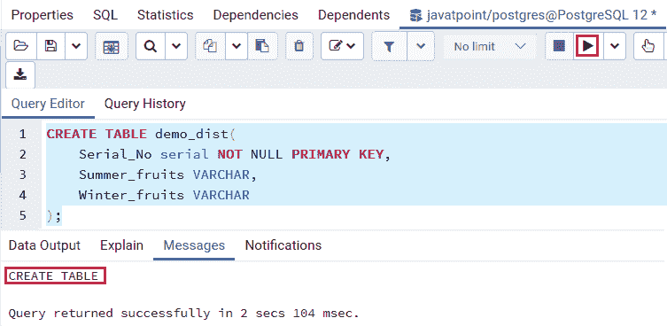
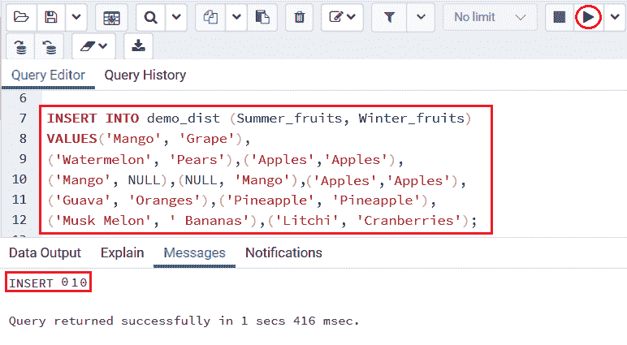
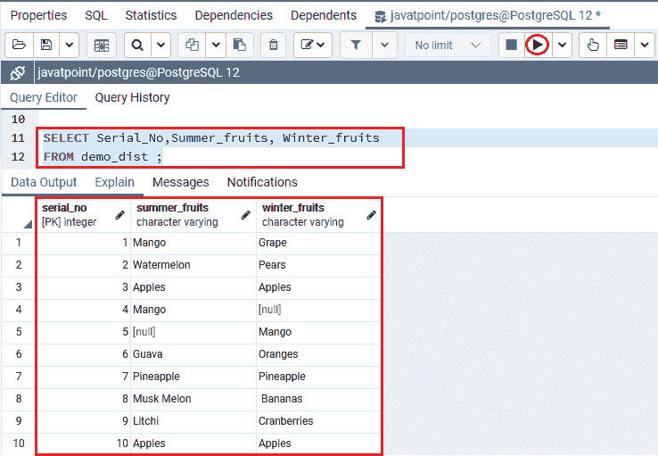
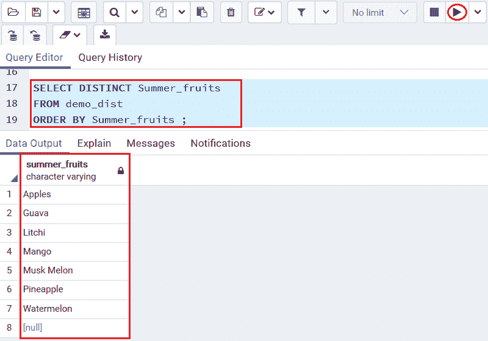
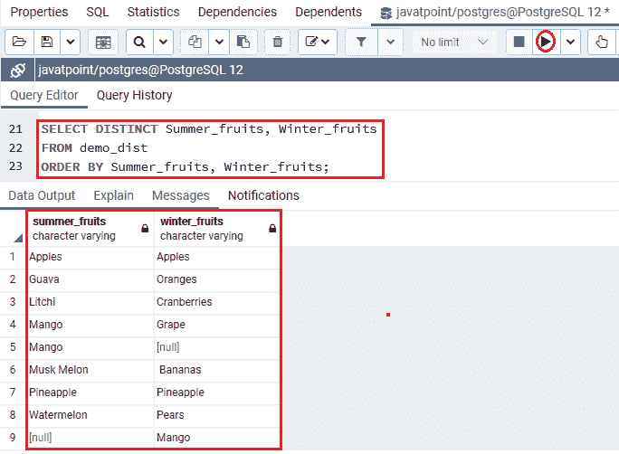
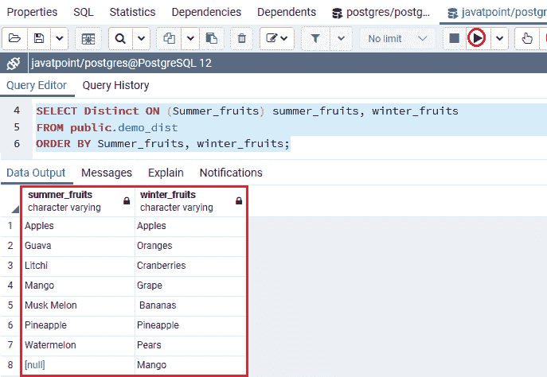

# PostgreSQL DISTINCT

> 原文：<https://www.javatpoint.com/postgresql-distinct>

在本节中，我们将了解**PostgreSQL DISTINCT 子句**的工作原理，该子句用于从表中删除匹配的行或数据，并且只获取唯一的记录。

#### 注意:DISTINCT 子句仅用于 SELECT 命令。

DISTINCT 子句对于 [SELECT](https://www.javatpoint.com/postgresql-select) 命令的选择列表中的几列很有用，并且还为每个重复组保留一行。

### PostgreSQL select distinct 子句的语法

DISTINCT 子句的基本语法如下:

**语法 1**

在下面的语法中，**列 1** 中的值用于评估副本。

如果我们描述不同的列， **DISTINCT** 子句将根据这些列的值的分组来分析匹配的行或数据。

```

Select Distinct column1
FROM table_name;

```

**语法 2**

如果**列 1** 和**列 2** 列具有相似的值，那么为了获得重复的值，我们可以使用以下语法:

```

SELECT DISTINCT column1, column2
FROM table_name;

```

**语法 3**

[PostgreSQL](https://www.javatpoint.com/postgresql-tutorial) 还提供了 DISTINCT ON 表达式来维护每组副本的**第一行**。因此，对于这些情况，可以使用以下命令:

```

SELECT DISTINCT ON (column1) column_alias, column2
FROM table_name
ORDER BY column1, column2 ;

```

如果我们连续执行带有 **DISTINCT ON(表达式)**的 ORDER BY 子句，使结果可预期，因为这是一个很好的执行练习。

#### 注意:ORDER BY 子句中最左边的表达式必须与 DISTINCT ON 表达式匹配。

### PostgreSQL SELECT DISTINCT 示例

为了理解 PostgreSQL 中 DISTINCT 子句的工作原理，我们将看到一些例子。

为此，我们正在**创建一个名为 ***的新表，并在特定的表中插入一些值。在本节中，我们只是在 **psql 或 pgAdmin** 中执行命令。*****

要查看 PostgreSQL 的 **Pgadmin4** 中**选择不同命令**的示例，我们需要遵循以下步骤:

**第一步**

我们将借助 [CREATE TABLE](https://www.javatpoint.com/postgresql-create-table) 命令创建一个表，从下面的命令中我们可以看到我们已经创建了 ***Demo_dist*** 表，该表由三列 **Serial_NO、Summer _ 水果和 Winter _ 水果**组成。

```

CREATE TABLE demo_dist(
	Serial_No serial NOT NULL PRIMARY KEY,
	Summer_fruits VARCHAR,
	Winter_fruits VARCHAR	
);

```

**输出**

执行以上命令后，我们会得到下面的消息窗口； ***Demo_dist*** 表已创建成功。



**第二步**

在创建了 ***Demo_dist*** 表之后，我们将借助下面的 insert 命令向其中插入一些值:

```

INSERT INTO demo_dist (Summer_fruits, Winter_fruits)
VALUES('Mango', 'Grape'),
('Watermelon', 'Pears'),('Apples','Apples'), 
('Mango', NULL),(NULL, 'Mango'), ('Apples','Apples'),
('Guava', 'Oranges'),('Pineapple', 'Pineapple'),
('Musk Melon', ' Bananas'),('Litchi', 'Cranberries');

```

**输出**

执行以上命令后，我们会得到下面的消息窗口；**值**已成功插入到 ***Demo_dist*** 表中。



**第三步**

之后，我们将借助下面的 select 命令从 ***Demo_dist*** 表中选择数据:

```

SELECT Serial_No,Summer_fruits, Winter_fruits
FROM demo_dist ;

```

**输出**

一旦我们实现了上面的命令，我们将得到下面的输出:



### PostgreSQL DISTINCT 一列示例

在下面的例子中，我们将从 **Demo_dist** 表中选择**Summer _ 水果**列中的唯一记录，并执行 [ORDER BY 子句](https://www.javatpoint.com/postgresql-order-by-clause)以按顺序获得结果。

```

SELECT DISTINCT Summer_fruits
FROM demo_dist 
ORDER BY Summer_fruits ;

```

**输出**

执行完上面的命令后，我们会得到下面的输出，在这里我们得到了按字母顺序排列的**summer _ 水果**列的列表。



### 使用 PostgreSQL DISTINCT 的多列示例

在下面的例子中，我们将在一列或多列上使用 DISTINCT 子句，

要使用 distinct 子句获取各列的值，我们将采用**Summer _ 水果和 Winter _ 水果**列，如以下命令所示:

```

SELECT DISTINCT Summer_fruits, Winter_fruits
FROM demo_dist
ORDER BY Summer_fruits, Winter_fruits;

```

**输出**

执行上述命令后，我们将获得下面的输出，其中我们获得了按字母顺序排列的**夏季水果列表和冬季水果**列。



在上面的命令中，我们在 **SELECT DISTINCT** 子句中描述了**夏季水果和冬季水果**列；这就是为什么 PostgreSQL 在**Summer _ 水果和 Winter _ 水果**列中加入了值来分析行的唯一性。

一旦我们执行上述命令，它将从**演示区**表中返回**夏季水果和冬季水果的唯一组合**。

#### 注意:Demo_dist 表有两行，在“夏季水果”和“冬季水果”列中都有值“苹果”。当我们对两列都使用 DISTINCT 时，输出中有一行被删除了，因为它是重复的。

### 示例 PostgreSQL DISTINCT ON

在下面的例子中，我们将按照**Summer _ 水果和 Winter _ 水果**对结果进行排序，并且对于每组重复值，它将保留返回输出中的第一行。

```

SELECT Distinct ON (Summer_fruits) summer_fruits, winter_fruits
FROM public.demo_dist
ORDER BY Summer_fruits, winter_fruits;

```

**输出**

执行上述命令后，我们将得到下面的输出，它显示了两个列(即 Summer _ 水果和 winter _ 水果)不显示相似值的结果。



* * *