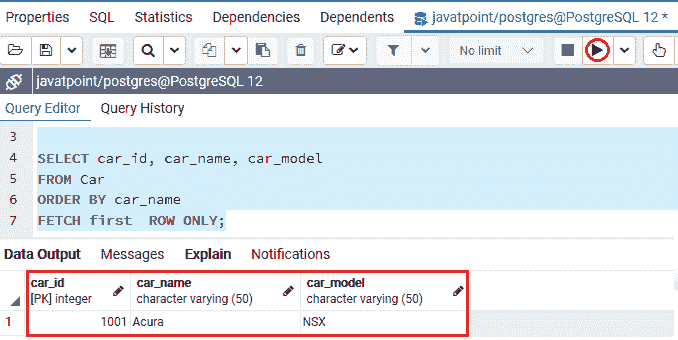
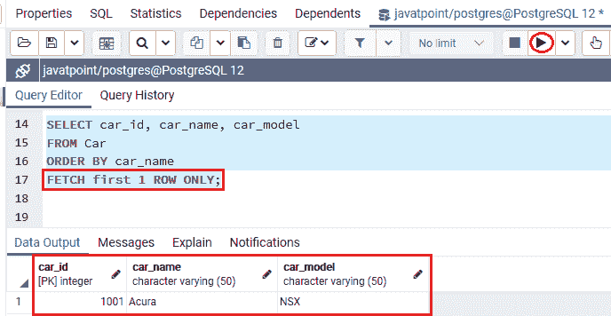
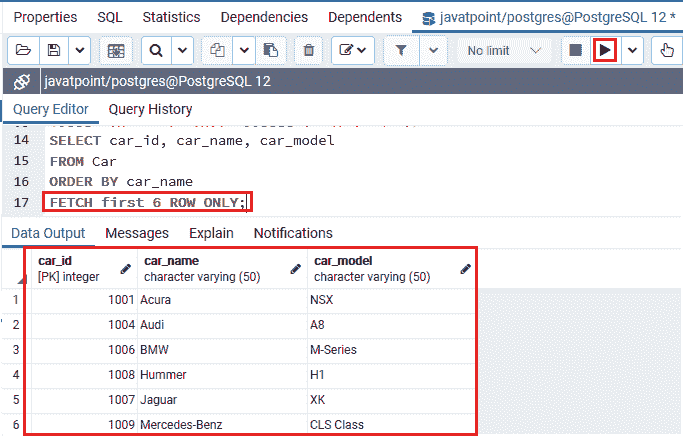
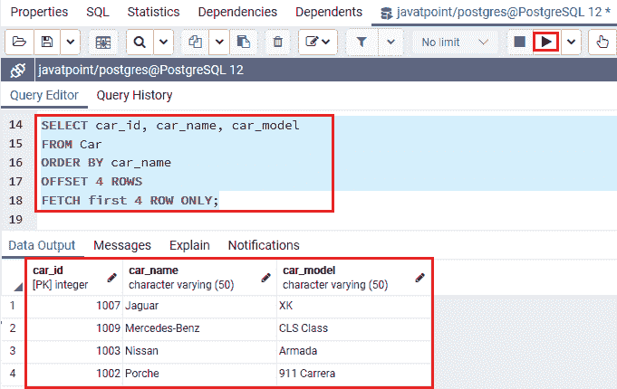

# PostgreSQL 提取子句

> 原文：<https://www.javatpoint.com/postgresql-fetch-clause>

在本节中，我们将了解 **PostgreSQL FETCH 子句**的工作原理，该子句用于报告特定语句返回的一部分行。

各种关系数据库管理系统**(关系数据库管理系统)**如 **H2、MySQL 和 HSQLDB** 广泛使用 **LIMIT 子句**。

在 [PostgreSQL 教程](https://www.javatpoint.com/postgresql-tutorial)的前一节中，我们已经学习了 **Limit 子句**，它用于约束语句返回的行数。而[限制条款](postgresql-limit)并没有遵循 SQL 标准。

因此，为了遵循 SQL 标准，PostgreSQL 还引入了 **FETCH 子句，用于恢复命令返回的各种行。而****FETCH 条款**是 SQL 在 2008 年推出的。

### PostgreSQL 提取子句的语法

PostgreSQL FETCH 子句的一般语法如下:

```

OFFSET start { ROW | ROWS }
FETCH { FIRST | NEXT } [ row_count ] { ROW | ROWS } ONLY

```

在上面的语法中，我们有以下参数:

| 参数 | 描述 |
| **开始** | 本质值为**正或零的整数；**否则取默认值，即**零**。 |
| **ROW &#124; ROWS** | 这里**排**是**排**的替代品，也就是说**排**是其他**排的替代品；**这就是为什么我们可以等价地使用它们。 |
| **行数** | 如果我们没有明确定义**行数**，它会取默认值**为一**。 |

**注:**

*   如果未定义 **OFFSET 子句**，则**开始**大于结果中的行数，并且由于该表中的行顺序未命名，因此不返回任何行。
*   如果我们想让我们的软件与其他数据库系统兼容，我们应该使用 FETCH 子句，因为它遵循标准的 SQL，并且 FETCH 子句在功能上与 LIMIT 子句相当。

### PostgreSQL FETCH 子句的示例

为了实时理解 PostgreSQL fetch 子句，我们将使用***【CAR】***表，该表是我们在 PostgreSQL 教程的 Limit 子句部分创建的。

这里我们从 **Car** 表中选择 **Car_id、Car_name、Car_model** 列，**通过 **FETCH** 子句按照**升序**对**第一行**进行排序，如下命令所示:**

```

SELECT car_id, car_name, car_model
FROM Car
ORDER BY car_name 
FETCH FIRST ROW ONLY;

```

**输出**

执行上述命令后，我们将得到如下输出，该输出仅显示*表中的**第一行**。*

*

或者我们可以使用下面的命令，因为这两个查询生成相同的输出:

```

SELECT car_id, car_name, car_model
FROM Car
ORDER BY car_name 
FETCH first 1 ROW ONLY;

```

**输出**

执行以下命令后，我们将获得下面的输出，与上面的命令相比，它显示了类似的输出:



如果我们想选择**前六行**，我们可以使用下面的命令，这六行按照它们的**车名:**排序

```

SELECT car_id, car_name
FROM Car
ORDER BY car_name 
FETCH first 6 ROW ONLY;

```

**输出**

执行上述命令后，我们将得到下面的输出，它显示了前六行，这些行是根据它们在*表中的**Car _ name**排序的。*

*

在下面的例子中，我们将尝试从 **CAR** 表中获取接下来的四辆 **Car** ，这是在按 **Car_name** 排序的**前六辆车**之后。

```

SELECT car_id, car_name, car_model
FROM Car
ORDER BY car_name
OFFSET 4 ROWS 
FETCH first 4 ROW ONLY;

```

**输出**

执行上述命令后，我们将获得以下输出，其中显示了以下四个 Cars 详细信息:



* * ***