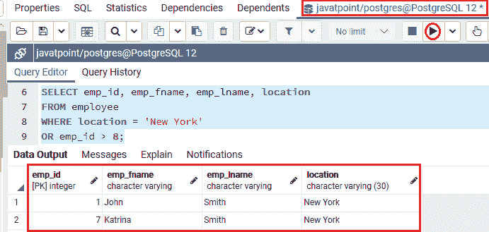
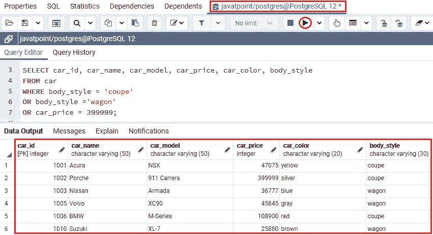
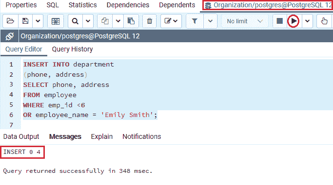
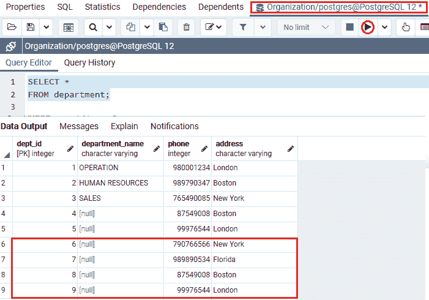
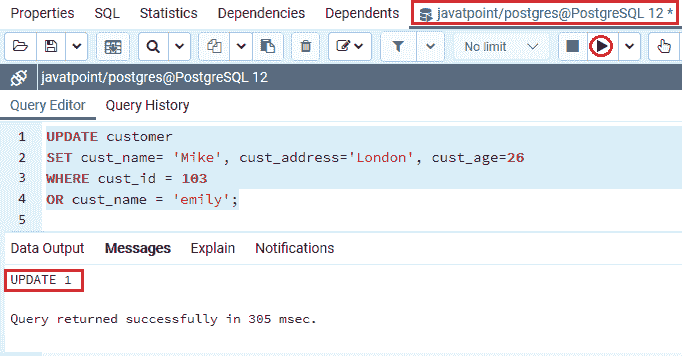
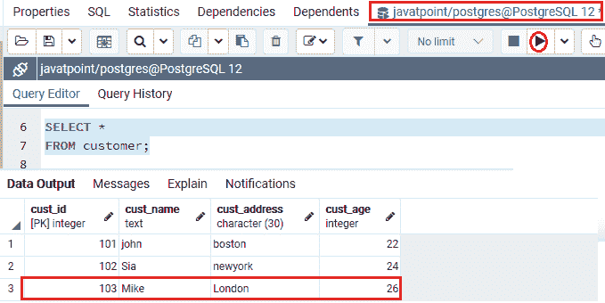
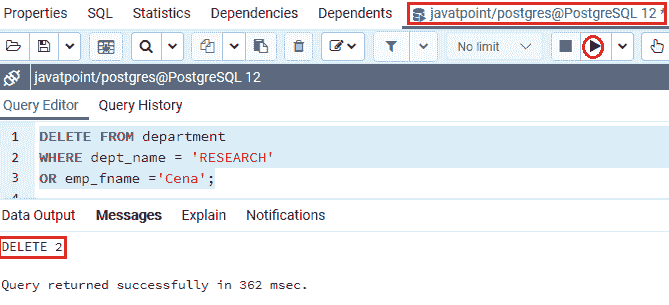
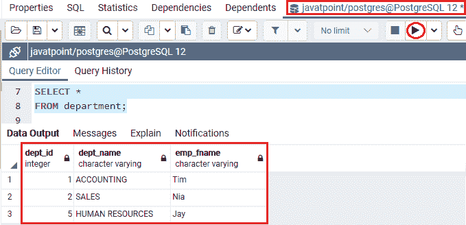

# 后置条件或条件

> 原文：<https://www.javatpoint.com/postgresql-or-condition>

在这一节中，我们将了解 **PostgreSQL OR Condition，**的工作原理，它规定如果我们取两个或多个条件，那么必须满足其中一个条件才能得到结果记录。我们还将看到**或条件**的**示例**，以及**不同的查询，如插入、选择、更新和删除**。

## 后置条件介绍

在 [PostgreSQL](https://www.javatpoint.com/postgresql-tutorial) 中，**或**条件可以与[选择](https://www.javatpoint.com/postgresql-select)、[插入](https://www.javatpoint.com/postgresql-insert)、[更新](https://www.javatpoint.com/postgresql-update)和[删除](https://www.javatpoint.com/postgresql-delete)命令相结合，从表中的各列中选择唯一的数据。换句话说，我们可以说**或条件**用于返回数据，如果任一条件除以或**为真**。

#### 注意:后置条件允许我们返回两个或多个条件。它需要任何可能是条件 1、条件 2 的条件...数据中的条件和输出中涉及的条件。

## 后置 SQL 或条件语法

PostgreSQL 或条件的语法如下:

```sql
WHERE condition1  
OR condition2  
...  
OR condition_n;  

```

在上面的语法中，我们使用了以下参数:

| 参数 | 描述 |
| **条件 1，条件 2，...条件 _n:** | 它指定评估的条件，以确定何时选择记录。 |

## 后置条件的例子

让我们看不同的例子来理解**后置条件是如何工作的。**

### 带有选择命令的后置 SQL OR 示例

在下面的例子中，我们将看到使用**或条件**和带有两个条件的**选择**命令。

为此，我们从**Javapoint**数据库中取出 ***员工*** 表，从该表中取出所有记录。

我们将 **OR 条件**与 [WHERE 子句](https://www.javatpoint.com/postgresql-where-clause)一起使用，可以看到以下命令:

```sql
SELECT emp_id, emp_fname, emp_lname, location
FROM employee
WHERE location = 'New York' 
OR emp_id > 8;

```

**输出**

执行上述命令后，我们将获得以下输出:



从上面的截图中我们可以看到， **PostgreSQL OR** 条件将返回那些**位置**为**【纽约州】**或 **emp_id** 大于 8 的员工信息。

## 带有选择命令的后置 SQL OR 示例(两个或多个条件)

让我们再看一个带有**或条件**的**选择**命令的例子。为此，我们从**Javapoint**数据库中提取**T5【汽车】T6**表。

与上面的语句相比，以下命令是一个更复杂的查询:

```sql
SELECT car_id, car_name, car_model, car_price, car_color, body_style
FROM car
WHERE body_style = 'coupe'
OR body_style ='wagon' 
OR car_price = 399999;

```

**输出**

成功执行上述命令后，我们将获得以下输出:



从上面的截图中我们可以看到 **PostgreSQL OR** 条件将返回所有那些来自 **car_id、car_name、car_model、car_price、car_color、body_style** 列值的记录，这些值来自 ***car*** 表谁的 **body_style** 是**‘coupe’或‘Wagon’OR****car _ price**是**6388**

## 带有插入命令的 PostgreSQL OR 示例

在下面的例子中，我们将显示如何使用**插入**命令来使用**或条件**。

为此，我们从**组织数据库**中取出 ***员工*** 和 ***部门表*** ，将记录从一个表插入到另一个表中。

```sql
INSERT INTO department
(phone, address)
SELECT phone, address
FROM employee 
WHERE emp_id <6
OR employee_name = 'Emily Smith';

```

**输出**

执行上述命令后，我们将看到下面的消息窗口，显示该值已成功插入。



为了检查记录是否已经插入到 ***部门*** 表中，我们将使用如下的 SELECT 命令:

```sql
Select * from department;

```

**输出**



我们可以在下面的截图中看到，PostgreSQL OR 条件将四条记录插入到 ***部门*** 表中。

**电话**和**地址**列记录自**员工**表，其中 **emp_id** 小于 **6 或**，其**员工名称**为**艾米丽·史密斯**。

## 带有更新命令的后置 SQL OR 示例

在下面的例子中，我们将显示如何使用**更新命令**来使用**或条件**。

为此，我们从 **Javatpoint** 数据库中获取 ***客户*** 表。

在以下命令中，**后置条件**用于更新以下值:

在 ***【客户】*** 表中 **cust_name** 值为 **Mike，cust_address** 值为**伦敦，cust_age** 值为 **26** ，其中 **cust_id** 等于 **103 或****cust _ name**为 **emily** 。

```sql
UPDATE customer
SET cust_name= 'Mike', cust_address='London', cust_age=26
WHERE cust_id = 103
OR cust_name = 'emily';

```

**输出**

执行完上面的命令后，我们会得到下面的输出，在这里我们可以看到 ***客户*** 表已经更新成功。



我们现在将使用**选择**命令来检查在 ***客户*** 表中的特定记录是否已经更新:

```sql
SELECT * 
FROM customer;

```

**输出**

执行上述命令后，我们将得到以下结果:



## 带有 DELETE 命令的 PostgreSQL OR 示例

在下面的例子中，我们将看到如何使用**删除命令**来使用**或条件**。

在下面的例子中，我们从 **Javatpoint** 数据库中取出 ***部门*** 表格，从表格中删除特定的记录。

在以下命令中， **PostgreSQL OR** 条件用于删除 ***部门*** 表中的所有记录，其中**部门名称**为**【研究】**， **emp_fname** 为**【Cena】**。

```sql
DELETE FROM department
WHERE dept_name = 'RESEARCH' 
OR emp_fname ='Cena';

```

**输出**

执行上述命令后，我们将获得如下消息窗口，显示记录已从 ***部门*** 表中成功删除。



我们现在将使用**选择**命令来检查在 ***部门*** 表中的特定记录是否已被删除:

```sql
SELECT * 
FROM department;

```

**输出**

成功执行上述命令后，我们将获得以下输出:



### 概观

在 **PostgreSQL OR 条件**部分，我们学习了以下主题:

*   PostgreSQL 或条件的使用只在一个命令中提供了或条件的好处。
*   我们使用**或条件**和**选择**命令来获取特定的表记录。
*   我们使用**或条件**和**插入命令**将记录从一个表插入到另一个表。
*   我们使用 **OR 条件**和 **UPDATE** 语句来**更新**特定表的记录。
*   我们使用 **OR 条件**和 **DELETE** 语句来**删除**特定表的记录。

* * *