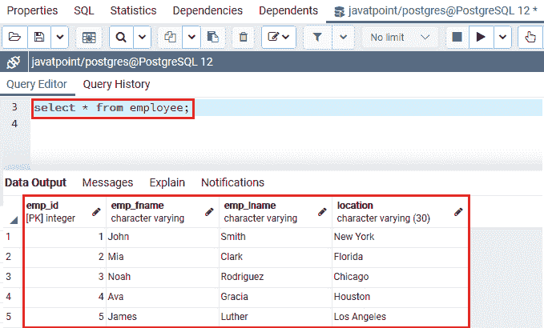
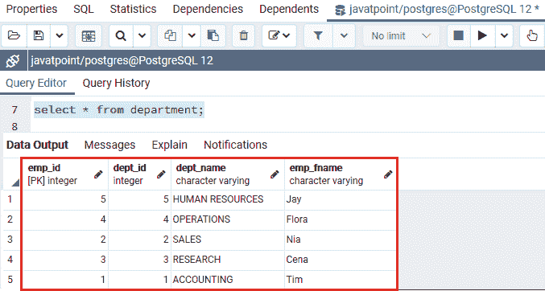
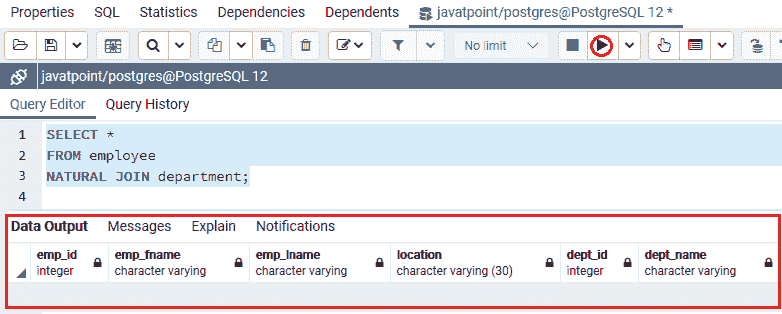

# 自然连接

> 原文：<https://www.javatpoint.com/postgresql-natural-join>

在这一节中，我们将了解 **PostgreSQL 自然连接**的工作原理，该连接用于连接两个或两个以上的表。

### 什么是 PostgreSQL 自然连接子句？

**自然连接**是多个表组合在一起的地方，作为输出，我们将获得新的行，用于连接每个表的列。它还用于组合表，这将根据组合表中相似的列名创建隐式连接。

换句话说，我们可以说 **PostgreSQL 自然连接**子句本质上为一组行创建了一个临时表，用于处理几个(两个或更多)表。

并且那些表将在联接条件中指定，并且至少有一个相互列，并且这些标准列之间应该有关系。

默认情况下， [PostgreSQL](https://www.javatpoint.com/postgresql-tutorial) 将使用 INNER JOIN 操作。它可以与[左连接](https://www.javatpoint.com/postgresql-left-join)、[内连接](https://www.javatpoint.com/postgresql-inner-join)或[右连接](https://www.javatpoint.com/postgresql-right-join)一起使用，但连接类型必须在连接中定义，否则 PostgreSQL 将默认使用内连接操作。

## PostgreSQL 自然连接的语法

自然连接关键字与[选择命令](https://www.javatpoint.com/postgresql-select)一起使用，必须写在 **FROM** 关键字之后。

```

SELECT [Column_list |*]
FROM Table1
NATURAL [INNER, LEFT, RIGHT] JOIN Table2;

```

#### 注意:在上面的语法中，我们也可以使用星号(*)来代替列列表，因为星号将生成包含以下字段的输出:

*   当两个表都有一个**唯一列**，其中包含 ***不同的*列**名称。
*   当一个表有一个**公共字段**并且其中**两列**有一个相同的名称时。

## PostgreSQL 自然连接示例

让我们看一个例子来理解 **PostgreSQL 自然连接**是如何工作的:

## 使用 PostgreSQL 自然连接来连接两个表

为此，我们将在 **CREATE** 命令的帮助下创建两个名为 ***课程 _ 类别和课程*** 的表格，并使用 [**INSERT** 命令](https://www.javatpoint.com/postgresql-insert)插入一些值。

首先，我们将使用 **CREATE** 命令创建 ***课程 _ 类别和课程*** 表格:

以下语句用于创建 ***课程 _ 类别*** 表:

```

CREATE TABLE Course_categories (
Course_category_id serial PRIMARY KEY,
Course_category VARCHAR NOT NULL,
Course_id INT NOT NULL,
FOREIGN KEY (Course_id) REFERENCES Course(Course_id)
);

```

以下命令用于创建*表:*

```

CREATE TABLE Course (
Course_id serial PRIMARY KEY,
Course_name VARCHAR NOT NULL
);

```

执行上述命令后，已成功创建 ***【课程 _ 类别】和*** 表。

在上表中，所有**课程类别**都有零个或几个**课程**，但这里所有课程都链接到唯一的**课程类别**。

在 ***课程 _ 类别*** 表中，**课程 _id** 列是**外键**，被称为 ***课程*** 表的**主键**。

我们将使用来执行 **PostgreSQL 自然连接**，因为**课程 _id** 是两个表中的标准列。

一旦生成了这两个表，我们就可以使用 **INSERT** 命令向其中插入一些值，如下所示:

在下面的命令中，我们将值插入到 ***课程 _ 类别*** 表中:

```

INSERT INTO Course_categories (Course_category, Course_id)
VALUES
('Adobe Photoshop', 1),
('Adobe Illustrator', 1),
('JavaScript', 2),
('Advance CSS', 2),
('Machine Learning', 2),
('AWS', 3),
('CCNA', 3),
('Kubernetes', 3),
('Social Media Marketing', 4),
('Digital Marketing', 4);

```

在下面的命令中，我们将值插入到*表中:*

```

INSERT INTO Course (Course_name)
VALUES
('Design'),
('Development'),
('IT & Software')
('Marketing');

```

在 ***【课程 _ 类别】和*** 表中创建并插入值后，我们将使用**选择**命令查看特定表中的现有记录:

**表 1: *课程 _ 类别*T3】**

```

Select * from Course_categories;

```

**输出**

执行上述命令后，我们将从 ***课程 _ 类别*** 表中获得以下数据:


**表 2:课程**

```

Select * from Course;

```

**输出**

执行上述命令后，我们将从 ***航向*** 表中得到以下记录:


下面的查询使用 **PostgreSQL 自然连接**子句来组合来自 ***课程和课程 _ 类别表*** 的记录。

```

SELECT * 
FROM Course_categories
NATURAL JOIN Course;

```

**输出**

执行上述命令后，我们将得到以下结果:


上面的命令类似于下面的命令，我们使用 **INNER JOIN** 子句代替**自然连接关键字**。

```

SELECT * 
FROM Course_categories
INNER JOIN Course USING (Course_id);

```

**输出**

执行上述命令后，我们将得到以下命令:


在 **PostgreSQL 自然连接**中，似乎没有必要描述 Join 子句，因为它使用的**隐式连接**条件取决于 Common 列。

但是我们应该尽可能忽略使用**自然连接**，因为有时它可能会导致不可预测的结果。

让我们看一个例子，如果我们在两个表中都有两个标准列。所以，为此我们将采取 ***员工和*** 部门的表格:

### 员工表的结构

我们将通过使用如下选择命令来查看雇员表的结构:

```

Select * from employee;

```

**输出**

执行上述语句后，我们将得到以下结果:



### 部门表的结构

我们将通过使用如下选择命令来查看 ***部门*** 表格的结构:

```

Select * from department;

```

**输出**

执行上述语句后，我们将得到以下结果:



从上面的截图中我们可以观察到 ***员工和*** 部门的表具有相同的 **emp_id** 列，因此我们可以在下面的命令中使用**自然连接子句**来组合这些表:

```

SELECT * 
FROM employee
NATURAL JOIN department;

```

**输出**

在执行上述命令时，我们将获得以下输出:



在上面的输出中，我们将得到**空表**，因为两个表还有另一个公共列名为 **emp_fname** ，不能用于 PostgreSQL **自然连接**。但是**自然加入**条件只使用 **emp_fname** 列。

### 概观

在 PostgreSQL 自然连接部分，我们学习了以下主题:

*   在 **PostgreSQL 自然连接**部分，我们学习了以下主题:

* * ***