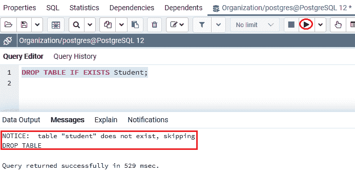
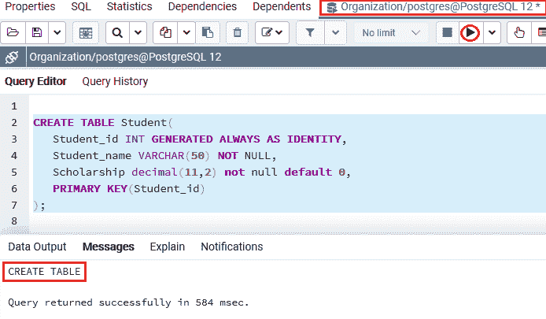
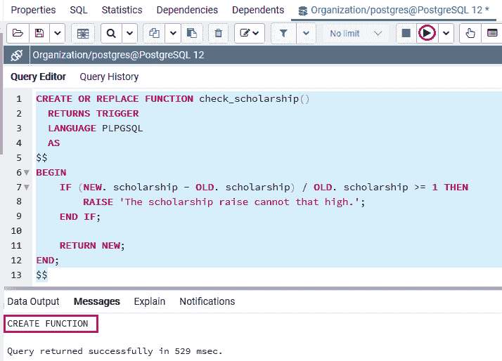
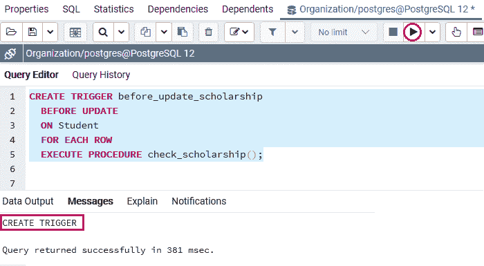
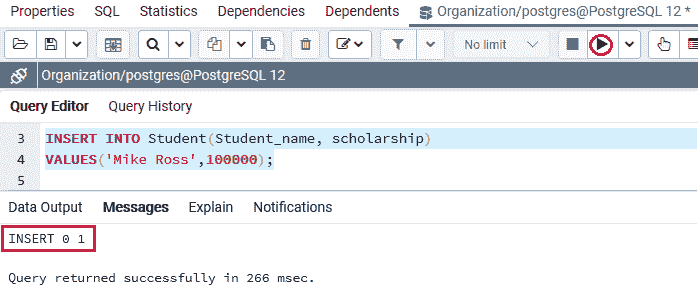
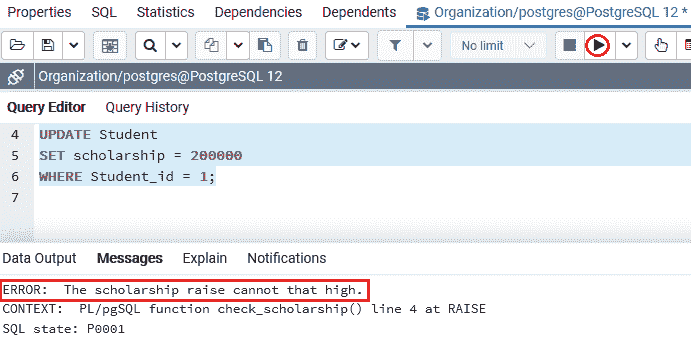
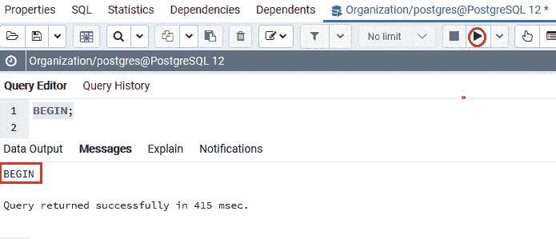
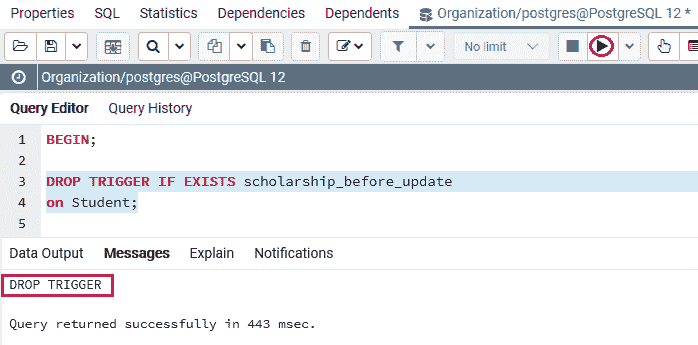
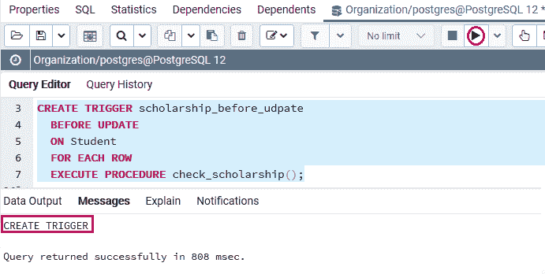
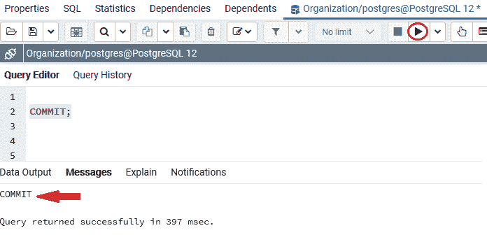

# PostgreSQL ALTER TRIGGER

> 原文：<https://www.javatpoint.com/postgresql-alter-trigger>

在本节中，我们将了解 **PostgreSQL ALTER TRIGGER** 命令的工作原理，并查看**从 PostgreSQL 中的指定表更改**触发器或重命名触发器的示例。

## PostgreSQL ALTER TRIGGER 命令是什么？

在 **PostgreSQL Trigger** 中，下一个命令是 **Alter Trigger** 命令，用于重命名现有的触发器。

### PostgreSQL Alter 触发器命令的语法

下图用于从表中更改触发器:

```sql

ALTER TRIGGER trigger_name
ON table_name 
RENAME TO new_trigger_name;

```

在上面的语法中，我们使用了以下参数:

| 因素 | 描述 |
| 触发器名称 | 用于定义我们需要重命名的触发器名称，在 **ALTER TRIGGER** 关键字后提到。 |
| 表名 | **表名**参数用于定义表名，表名与触发器相连。在**开**关键字后使用。 |
| 新触发器名称 | 它用于指定触发器的新名称。并且写在**重命名为**关键字之后。 |

## PostgreSQL ALTER TRIGGER 命令示例

让我们看一个示例来理解 **PostgreSQL Alter Trigger** 命令的工作原理。

在 CREATE 命令的帮助下，我们创建了一个名为 ***【学生】*** 的新表格，并使用 [INSERT 命令](https://www.javatpoint.com/postgresql-insert)插入了一些值。

### 步骤 1:创建新表

要将 ***学生*** 创建到**组织数据库**中，我们使用 **CREATE** 命令。

但是，在创建 ***【学生】*** 表之前，我们将使用 **DROP TABLE** 命令来检查相似的表是否已经存在于**组织**数据库中。

```sql

DROP TABLE IF EXISTS Student;

```

**输出**

执行上述命令后，我们会得到如下窗口消息: ***学生*** 表不存在。



***学生*** 表包含各种列，如**学生证、学生名、奖学金**列，其中我们使用**学生证**作为**生成的始终身份约束**。

```sql

CREATE TABLE Student(
   Student_id INT GENERATED ALWAYS AS IDENTITY,
   Student_name VARCHAR(50) NOT NULL,
   Scholarship decimal(11,2) not null default 0,
   PRIMARY KEY(Student_id)
);

```

**输出**

在执行上述命令时，我们将获得以下消息: ***学生*** 表已成功创建到**组织**数据库中。



### 步骤 2:创建新函数

在成功创建 ***学生*** 表后，我们将创建一个新的函数，如果新的奖学金比旧的奖学金大 100%，则会引发异常:

```sql

CREATE OR REPLACE FUNCTION check_scholarship()
  RETURNS TRIGGER 
  LANGUAGE plpgsql  
  AS
$$
BEGIN
	IF (NEW. scholarship - OLD. scholarship) / OLD. scholarship >= 1 THEN
		RAISE 'The scholarship raise cannot that high.';
	END IF;

	RETURN NEW;
END;
$$

```

**输出**

在执行上述命令时，我们将获得以下消息，显示 **check_scholarship()** 功能已成功创建到**组织**数据库中。



### 步骤 3:创建新触发器

创建 **check_scholarship()** 功能后，在更新[之前，我们将在 ***学生*** 表格上**创建一个新的触发器**，该触发器在更新奖学金之前执行 **check_scholarship()** 功能。](https://www.javatpoint.com/postgresql-trigger)

```sql

CREATE TRIGGER before_update_scholarship
  BEFORE UPDATE
  ON Student
  FOR EACH ROW
  EXECUTE PROCEDURE check_scholarship ();

```

**输出**

执行完上述**before _ update _ scholarship**命令后，我们会得到如下消息窗口，显示 ***学生*** 表已成功插入指定触发器。



### 步骤 4:插入新值

一旦**功能和触发**成功生成，我们将**使用 **INSERT 的**命令帮助将**插入到 ***学生*** 表中:

```sql

INSERT INTO Student(Student_name, scholarship)
VALUES('Mike Ross',100000);

```

**输出**

执行上述命令后，我们将获得下面的消息窗口，显示特定值已成功插入 ***【学生】*** 表。



### 步骤 5:更新值

插入新行后，我们将使用下面的**更新**命令更新**学号** 1 的奖学金:

```sql

UPDATE Student
SET scholarship = 200000
WHERE Student_id = 1;

```

**输出**

在执行上述命令时，触发器被执行并引发一个错误，表示**奖学金的提升不能那么高。**



### 步骤 5:改变触发命令

为了解决上面的错误，我们将使用 **ALTER TRIGGER** 命令将**before _ update _ scholarship**TRIGGER 重命名为**scholarship _ before _ update**。

```sql

ALTER TRIGGER before_update_scholarship
ON Student
RENAME TO scholarship_before_update;

```

**输出**

执行上述命令后，我们将获得下面的消息窗口，显示特定触发器已成功从**pre _ update _ scholarship**触发器重命名为**scholarship _ pre _ update**。


### 查看触发器 SQL 外壳

我们将按照以下流程查看 **psql 中的触发器:**

**第一步**

首先，我们将在本地系统中打开 **psql** ，我们将连接到我们想要创建表的数据库。

**第二步**

为了连接**组织**数据库，我们将输入以下命令:

```sql

postgres=# \c Organization 

```

**输出**

执行上述命令后，我们将获得以下输出:


**第三步**

我们现在将输入下面的命令来查看与**组织**数据库中的一个表链接的所有触发器。

```sql

Organization=# \dS Student

```

**输出**

在执行上述命令时，我们将获得下面的输出，该输出显示现有的触发器，即**组织**数据库中存在的**奖学金 _ 之前 _ 更新**:


#### 注意:在\dS 命令中，字母 S 是大写的，或者如果我们使用\ds，其中字母 S 是小写的，将会出现以下错误:


## 更改触发器

在 [PostgreSQL](https://www.javatpoint.com/postgresql-tutorial) 中，不包含**或【替换】**命令，该命令提供我们像**功能** n 一样更改触发器解释，该功能将在触发器执行时实现。

因此，我们可以将这些命令包装在一个**事务中，**并且还可以使用 **CREATE TRIGGER 和 DROP TRIGGER** 命令。

让我们看一个示例来理解 [**DROP TRIGGER**](postgresql-drop-trigger) 和 [**CREATE TRIGGER**](postgresql-create-trigger) 命令在事务中是如何工作的。

以下命令表示如何将**奖学金的**检查 _ 奖学金()**功能更改为**验证 _ 奖学金**:**

### 第一步:开始交易

要启动事务，我们可以使用以下语句:

```sql

BEGIN;

```

**输出**

执行完上面的命令后，我们会得到下面的消息窗口，上面说指定的命令已经成功执行。



### 步骤 2:使用 DROP 触发器命令

成功启动交易流程后，我们将执行以下 **DROP TRIGGER** 命令:

```sql

DROP TRIGGER IF EXISTS scholarship_before_update 
on Student;

```

**输出**

执行上述命令后，我们将获得以下输出，显示特定触发器已成功从 ***【学生】*** 表中删除。



### 步骤 3:创建新触发器

成功删除**奖学金 _before_update 触发器**后，我们创建一个名称相似的新触发器**奖学金 _before_udpate** ，如下命令所示:

```sql

CREATE TRIGGER scholarship_before_udpate
  BEFORE UPDATE
  ON Student
  FOR EACH ROW
  EXECUTE PROCEDURE check_scholarship();

```

**输出**

执行上述命令后，我们将获得以下消息窗口，显示特定触发器已成功插入 ***【学生】*** 表。



### 步骤 4:提交事务

为了使更改对其他会话(或用户)可见，我们需要在 **COMMIT** 命令的帮助下提交事务，如下所示:

```sql

COMMIT;

```

**输出**

执行上述命令后，我们会得到如下消息窗口，显示 ***学生*** 表的事务已经提交成功。



## 概观

在 **PostgreSQL ALTER Trigger** 部分，我们学习了以下主题:

*   为了重命名一个触发器，我们用了一个例子 **PostgreSQL Alter Trigger 命令**。
*   为了用一个新的触发器来改变一个触发器，我们使用了一对 **DROP TRIGGER 和 CREATE TRIGGER** 命令。

* * *