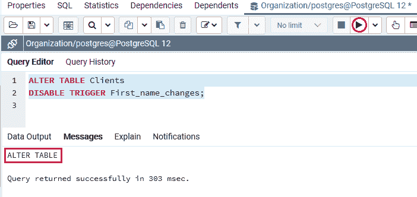
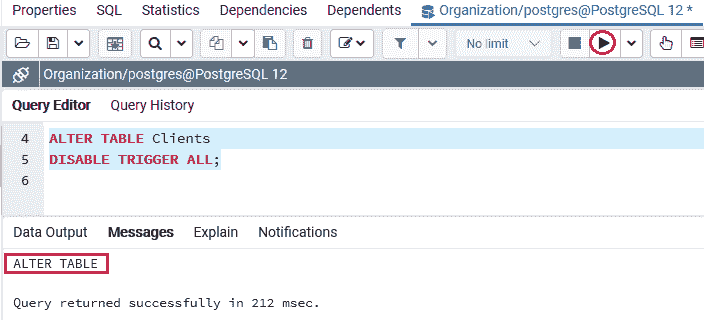

# PostgreSQL DISABLE TRIGGER

> 原文：<https://www.javatpoint.com/postgresql-disable-trigger>

在本节中，我们将使用**更改表格**命令了解**禁用触发器**的工作原理，并查看其**示例**。

## 什么是 PostgreSQL DISABLE TRIGGER 命令？

如果我们想要禁用一个触发器，我们将使用**禁用触发器**命令和[改变表格命令](https://www.javatpoint.com/postgresql-alter-table)。

### 使用 ALTER TRIGGER 命令禁用触发器的语法

使用 [ALTER TRIGGER 命令](postgresql-alter-trigger)禁用触发器的语法如下:

```

ALTER TABLE table_name
DISABLE TRIGGER trigger_name | ALL

```

在上面的语法中，我们使用了以下参数，如下表所示:

| 因素 | 描述 |
| **表名** | 

*   **Table Name** parameter is used to define the table name of trigger link.
*   And it is the keyword mentioned after **.**

 |
| **触发器 _ 名称** | 

*   Used to define the trigger name, we want to disable it.
*   It can be written after **disable trigger** keyword.
*   To disable all triggers associated with the table, we can also use the keyword **all** .

 |

#### 注意:如果我们试图禁用一个触发器，而该触发器仍然存在于数据库中，或者如果与该触发器链接的事件发生，则禁用的触发器命令将不会被执行。

## 使用 ALTER TABLE 命令的 PostgreSQL DISABLE TRIGGER 示例

让我们看一个示例来理解 **PostgreSQL DISABLE Trigger** 命令的工作原理。

*   **使用触发器名称**

在下面的例子中，我们采用了 [PostgreSQL 教程](https://www.javatpoint.com/postgresql-tutorial)的 PostgreSQL Create 触发器部分中创建的 ***Clients*** 表。

以下命令禁用与 ***客户端*** 表连接的[触发器:](https://www.javatpoint.com/postgresql-trigger)

```

ALTER TABLE Clients
DISABLE TRIGGER First_name_changes;

```

**输出**

执行上述命令后，我们会得到如下消息窗口，显示 **First_name_changes** 触发器已被**禁用**成功进入 ***Clients*** 表。



*   **使用 ALL 关键字代替触发器名称**

并且，如果我们想要禁用所有与 ***客户端*** 表链接的触发器，我们可以使用下面的命令:

```

ALTER TABLE Clients
DISABLE TRIGGER ALL;

```

**输出**

在执行上述命令时，我们将获得以下窗口消息，该消息显示与 ***客户端*** 表相关联的所有触发器都已成功禁用。



## 概观

在 **PostgreSQL 禁用触发器**部分，我们学习了以下主题:

*   我们将 **PostgreSQL DISABLE TRIGGER** 与 **ALTER TABLE** 命令一起使用，以便借助于与指定表链接的特定**触发器名称**来禁用触发器。
*   我们可以使用 **ALL 关键字**来禁用与特定表链接的所有触发器，而不是使用触发器名称。

* * *