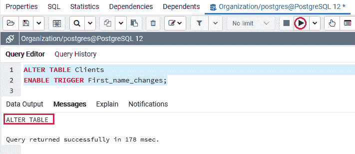

# PostgreSQL ENABLE TRIGGER

> 原文：<https://www.javatpoint.com/postgresql-enable-trigger>

在本节中，我们将使用**更改表格**命令了解**启用触发器**的工作原理，并查看其**示例**。

### 什么是 PostgreSQL ENABLE TRIGGER 命令？

如果我们想要启用一个触发器，我们将使用**启用触发器**命令和[更改表格命令](https://www.javatpoint.com/postgresql-alter-table)。

### 使用 ALTER TRIGGER 命令启用触发器的 PostgreSQL 语法

使用 [ALTER TRIGGER 命令](postgresql-alter-trigger)的 PostgreSQL Enable Trigger 语法如下:

```

ALTER TABLE table_name
ENABLE TRIGGER trigger_name | ALL

```

在上面的语法中，我们使用了以下参数，如下表所示:

| 因素 | 描述 |
| **表名** | 它用于定义触发器所链接的表名。并且是在 **ALTER TABLE** 关键字之后提到的。 |
| **触发器 _ 名称** | 它用于定义触发器名称，我们希望启用它。并且可以写在**启用触发器**关键字之后。
要启用所有与表关联的触发器，我们还可以使用 **ALL** 关键字。 |

#### 注意:PostgreSQL 禁用的触发器不会在触发事件发生时执行，为了实现它，我们需要启用它。

### 使用 ALTER TABLE 命令的 PostgreSQL ENABLE TRIGGER 示例

让我们看一个简单的例子来理解 **PostgreSQL ENABLE Trigger** 命令的工作原理。

*   **使用触发器名称**

在下面的例子中，我们采用了一个类似的*客户端表，我们在 [PostgreSQL 教程](https://www.javatpoint.com/postgresql-tutorial)的 PostgreSQL Disable 触发器部分使用了这个表。*

 *如果要启用[触发](https://www.javatpoint.com/postgresql-trigger)连接 ***客户端*** 表，如下命令所示:

```

ALTER TABLE Clients
ENABLE TRIGGER First_name_changes;

```

**输出**

在执行上述命令时，我们将获得以下窗口消息，显示 ***客户端*** 表的**名字 _ 变更**触发器已成功启用。



*   **使用 ALL 关键字代替触发器名称**

并且，如果我们想要启用所有与 ***客户端*** 表链接的触发器，我们可以使用下面的命令:

```

ALTER TABLE Clients
ENABLE TRIGGER ALL;

```

**输出**

执行上述命令后，我们将获得以下消息窗口，显示**关联的所有**触发器已被**启用**成功进入 ***客户端*** 表。****

**

## 概观

在 **PostgreSQL 启用触发器**部分，我们学习了以下主题:

*   我们将 **PostgreSQL ENABLE TRIGGER** 与 **ALTER TABLE** 命令一起使用，以便借助与指定表链接的特定**触发器名称**来启用触发器。
*   我们可以使用 **ALL 关键字**来启用与特定表链接的所有触发器，而不是使用触发器名称。

* * ****