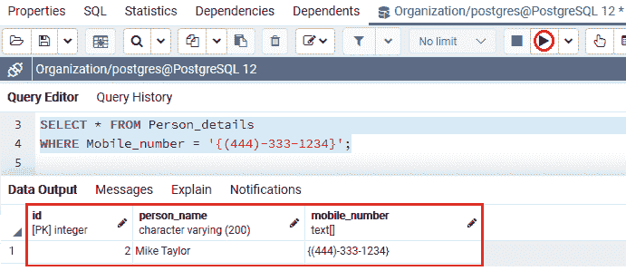
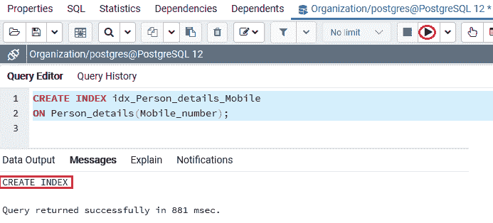

# 创建索引

> 原文：<https://www.javatpoint.com/postgresql-create-index>

在本节中，我们将了解**创建索引命令**的 **PostgreSQL 创建索引**和**示例**的工作原理。

## 为什么我们使用 PostgreSQL 创建索引命令？

在 **[PostgreSQL](https://www.javatpoint.com/postgresql-tutorial)** 中，**创建索引**命令用于通过定义在其上创建索引的**索引名称**和**表或列名称**来创建新索引。

### PostgreSQL 创建索引命令的语法

创建[索引命令](postgresql-indexes)的语法如下:

```sql

CREATE INDEX index_name ON table_name [USING method]
(
    column_name [ASC | DESC] [NULLS {FIRST | LAST}],
    ...
);

```

在上面的语法中，我们使用了以下参数，如下表所示:

| 因素 | 描述 |
| **索引 _ 名称** | 

*   **name used to define the indicator.**
*   And it should be written in **create index**
*   After that, we should try our best to give easy and meaningful names for indexing, so that we can easily recall them.

 |
| **表名** | 

*   **Table Name** parameter is used to define the table name, which is associated with the index.
*   Specify after **turns on** keyword.

 |
| **使用【方法】** | 

*   Used to specify index methods, such as **b tree, GIN, HASH, GiST, BRIN, SP-GiST.**
*   By default, PostgreSQL uses **B tree index** .

 |
| **列名** | 

*   **Column name** parameter is used to define the list, if we have several columns stored in the index.
*   **ASC and DESC** are used to define the sort order. And the default is **ASC** .
*   **first empty or last empty** is used to describe that **is empty** is sorted before or after **non-empty value.**
*   When **desc** is defined as by **, **nullsfirst** is regarded as the default.**
*   When **desc** is **undefined,** is blank, **and** is regarded as the default.

 |

#### 注意:如果我们想确定一个命令是否使用索引，我们可以使用解释命令。

## PostgreSQL 创建索引的示例

让我们看一个示例来理解 **PostgreSQL CREATE Indexes** 命令的工作原理。

但是在讨论这个例子之前，我们将看到**索引和电话簿类比**作为我们例子的一部分。

### 索引和电话簿类比

为了理解**索引和电话簿类比**的实例，我们有以下情况:

**情况 1:如果电话簿是按字母顺序排列的。**

*   假设我们需要在**电话簿**中看到**迈克·泰勒**的**电话号码**。
*   我们也知道**电话簿**中的名字是按字母顺序排列的。
*   因此，首先我们会检查那些**姓**是**泰勒**的页面，识别**名**是**麦克**，最后检索他的**电话号码**。

**情况 2:如果电话簿不是按字母顺序排列的。**

*   假设**电话簿**上的名字不是按字母顺序排列的。
*   因此，我们应该检查所有页面，就像检查所有姓名一样，直到我们识别出迈克·泰勒的电话号码。
*   这个过程被称为**顺序扫描**，它将检查所有条目，直到我们识别出要搜索的条目。

**注:**

与**电话簿并行的是，**表中存储的数据可以按照特定的顺序准备，以加速几次搜索；因此，我们使用了索引。

索引可以被认为是一种数据结构，例如。， **B-Tree** ，以进一步写入和存储来保存为代价，提高了表的数据检索率。

我们使用的是***Person _ detailis***表，它是我们在 PostgreSQL 教程的前面部分创建的。

而***Person _ deatiles***表包含 **id、Person_name、Mobile_number、**等各种列，如下图截图所示:


在下面的命令中，我们将尝试识别**手机号为(444)-333-1234** 的人名:

```sql

SELECT * FROM Person_details
WHERE Mobile_number = '{(444)-333-1234}';

```

**输出**

在执行上述命令时，我们将获得以下输出，其中我们成功识别出移动号码为 **(444)-333-1234** 的**人名**，即**迈克·泰勒**。



数据库必须扫描完整的 ***人员详细信息*** 表来识别**人员名称**是完全可以理解的，因为**移动号码**列没有索引。

在这里，我们可以使用 **EXPLAIN** 命令来查看查询计划，如下图所示:

```sql

EXPLAIN SELECT *
FROM Person_details
WHERE Mobile_number = '{(444)-333-1234}';

```

**输出**

执行上述命令后，我们会得到如下输出，显示 ***Person_details*** 表的**查询计划**。


现在，为了创建一个新的索引，我们在以下命令的帮助下，从 ***人员详细信息*** 表的 **Moblie_phone** 列中获取值:

```sql

CREATE INDEX idx_Person_details_Mobile 
ON Person_details(Mobile_number);

```

**输出**

执行上述命令时，我们将获得以下消息:**idx _ Person _ details _ Mobile**索引已成功创建。



如果我们想要识别数据库引擎，其中包含了要查找的索引，那么我们可以再次使用上面的**解释命令**，如下命令所示:

```sql

EXPLAIN SELECT *
FROM Person_details
WHERE Mobile_number = '{(444)-333-1234}';

```

**输出**

执行上述命令会得到如下消息，显示 ***Person_details*** 表的查询计划。


### 概观

在 PostgreSQL 中，我们有**单索引列索引**，这有助于我们增强 PostgreSQL 索引的性能。

在 **PostgreSQL 创建索引**部分，我们学习了以下主题:

*   我们已经**使用了 CREATE Index** 命令来为特定的表创建一个新的索引。

* * *