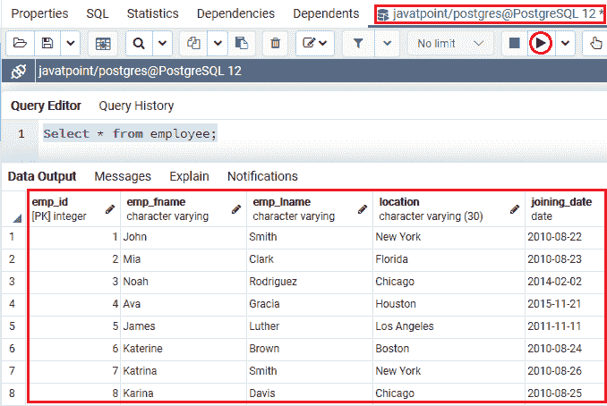
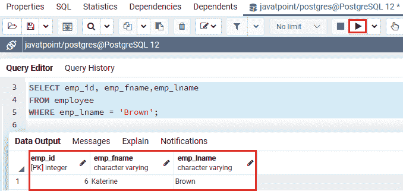
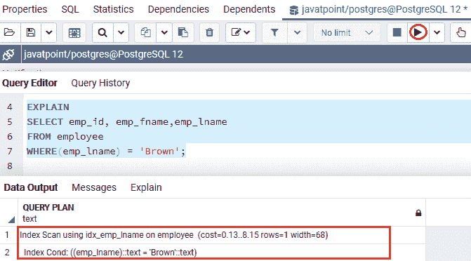
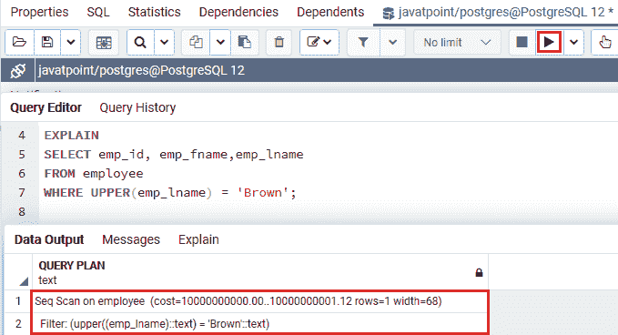
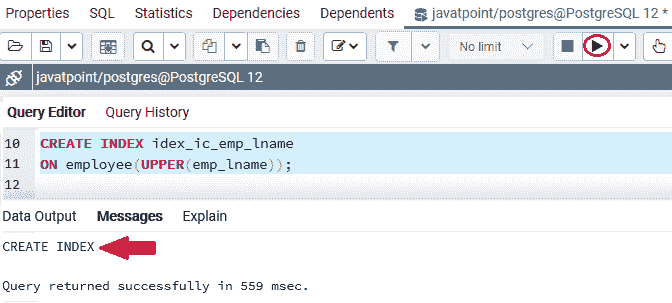
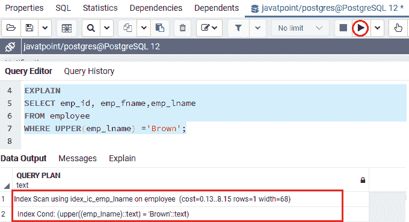

# 表达式上的 PostgreSQL 索引

> 原文：<https://www.javatpoint.com/postgresql-index-on-expression>

在本节中，我们将了解索引对表达式的控制，这有助于我们**提高也包含表达式的命令**的性能。另外，参见表达式上的 **PostgreSQL 索引的**示例**。**

## 表达式上的 PostgreSQL 索引是什么？

一般来说，[创建索引](https://www.javatpoint.com/postgresql-create-index)是指一个表的一个或多个列。但是我们也可以基于表达式创建一个索引**，它包括表列，这些场景被称为表达式索引。**

基于函数的索引被称为表达式上的索引**。**

### 表达式上 PostgreSQL 索引的语法

为了在表达式上创建索引，我们有以下示例:

```sql

CREATE INDEX index_name 
ON table_name (expression);

```

在上面的语法中，我们使用了以下参数，如下表所示:

| 因素 | 描述 |
| **索引 _ 名称** | index_name 用于定义索引名称，它写在 CREATE INDEX 命令之后。 |
| **表 _ 名称** | 它创建一个包含表名的表列的表达式。 |
| **表情** | 当我们指定索引表达式时，该表达式在 SQL 命令的 Order BY 或 WHERE 子句中指定。 |

**注:**

*   表达式索引的维护相当昂贵，因为 PostgreSQL 必须评估每一行的表达式。
*   因此，如果检索速度比**插入和更新**速度更关键，我们可以使用**表达式的索引**。

## 表达式上的 PostgreSQL 索引示例

让我们看一个示例来理解 **PostgreSQL 索引对表达式的作用。**

我们采用的是 [PostgreSQL 教程](https://www.javatpoint.com/postgresql-tutorial)前面部分中创建的 ***员工*** 表。

如果我们想查看 ***员工*** 表格中的数据，我们将使用 [**选择**命令](https://www.javatpoint.com/postgresql-select)，如下图所示:

```sql

Select * from employee;

```

**输出**

执行上述命令后，我们会得到如下结果，包含 **emp_id、emp_fname、emp_lname、位置、加入日期**等各种列，如下截图所示:



雇员表有一个为 **emp_fname** 列定义的 **B 树索引**。以下命令用于识别那些其 **emp_lname** 为棕色的员工:

```sql

SELECT emp_id, emp_fname,emp_lname 
FROM employee
WHERE emp_lname = 'Brown';

```

**输出**

执行上述命令后，我们将得到以下输出，显示 **emp_lname** 为**布朗**的**员工**。



然后，我们实现以下命令，其中 PostgreSQL 使用**解释**命令使用 **idx_emp_lname** 索引:

```sql

EXPLAIN 
SELECT emp_id, emp_fname,emp_lname 
FROM employee
WHERE(emp_lname) = 'Brown';

```

**输出**

执行上述命令后，我们将获得以下输出:PostgreSQL 优化器使用 ***员工*** 表的 **Idx_emp_lname** 索引。



在下面的命令中，我们将尝试识别那些在**大写**中 **emp_lname** 为**布朗**的员工。但是 PostgreSQL 不能使用索引进行查找，如下所示:

```sql

EXPLAIN 
SELECT emp_id, emp_fname,emp_lname 
FROM employee
WHERE UPPER(emp_lname) ='Brown';

```

**输出**

执行上述命令时，我们会得到如下消息，显示了**员工**表的查询计划。



为了增强上面的命令，我们可以指定**索引表达式，**如下命令所示:

```sql

CREATE INDEX idex_ic_emp_lname
ON employee(UPPER(emp_lname)); 

```

**输出**

在我们执行上述命令后， **idex_ic_emp_lname** 索引已经成功创建。



我们现在将实现下面的命令，它帮助我们根据 **emp_lname** 以不区分大小写的方式识别员工，并在表达式上使用**索引，如下面的命令所示:**

```sql

EXPLAIN 
SELECT emp_id, emp_fname,emp_lname 
FROM employee
WHERE UPPER(emp_lname) ='Brown';

```

**输出**

执行上述命令后，我们将得到以下结果:



### 概观

在**表达式上的 PostgreSQL 索引**部分，我们学习了以下主题:

*   我们已经了解表达式上的 **PostgreSQL 索引用于增强查询，该查询包含一个包含表列的表达式。**

* * *