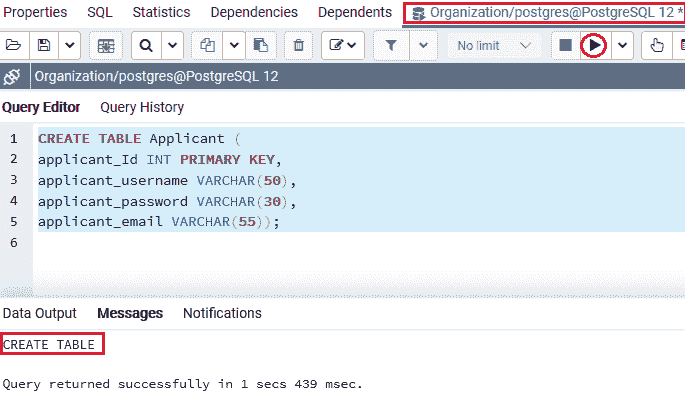
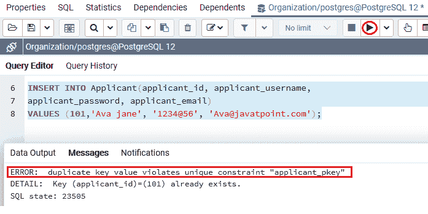
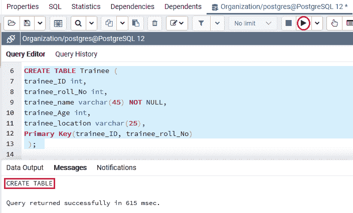
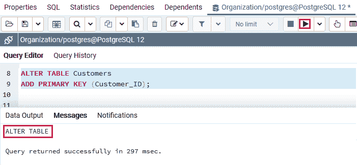
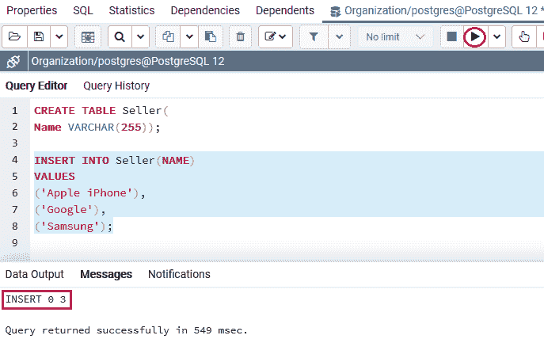
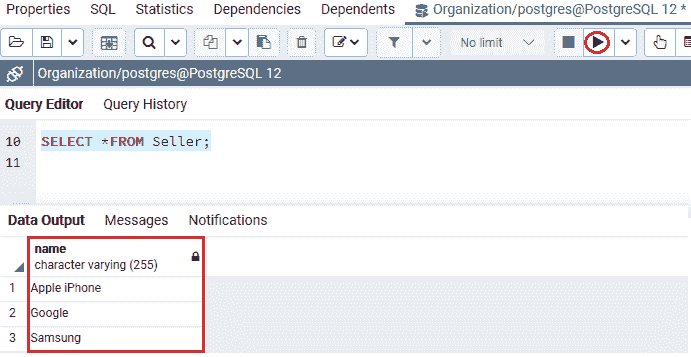
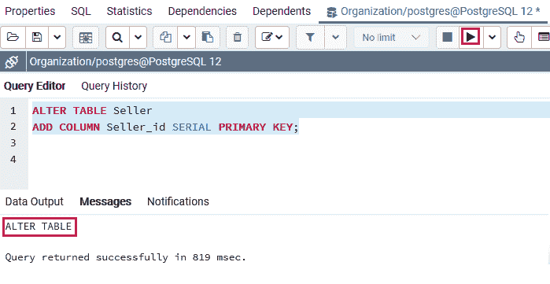
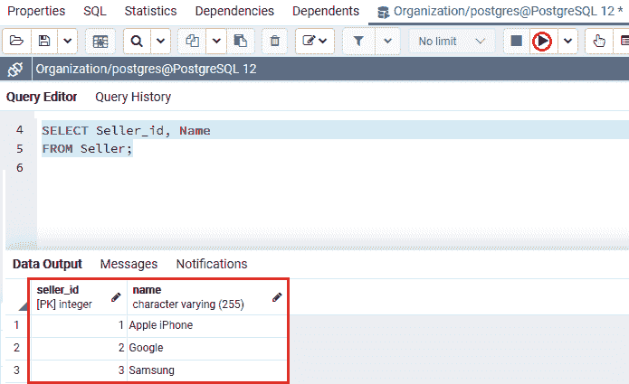
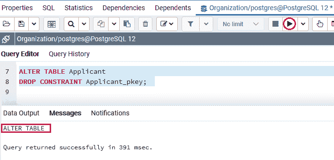

# PostgreSQL 主键

> 原文：<https://www.javatpoint.com/postgresql-primary-key>

在本节中，我们将了解 **PostgreSQL 主键、****示例、 **PostgreSQL 主键、**的工作原理，以及如何管理 PostgreSQL 主键对 SQL 命令的约束。**

此外，了解如何将**自动递增(SERIAL)主键**添加到当前表中，以及**删除主键**。

## PostgreSQL 的主键是什么？

它是表中的一个字段，单独标识数据库表中的每一行或记录，并且包含唯一的值。

主键不包含任何空值。为此，我们也可以说**主键**正在收集一个表的**唯一**和**非空约束**。如果列有**主键约束**，则不能为 **null 或空**。

它用于区别地识别数据库表中的每条记录。我们可以包含其他唯一的列，但是在包含单个或多个字段的数据库表中**只有一个主键。**

这是创建数据库表时最关键的一个键，它可以是一个唯一的标识。它可以表示一列或一组列。

主键的工作类似于**唯一约束**。尽管如此，主键和唯一约束之间的显著区别是一个表只能有一个**主键**；但是，该表可以有一个或多个**唯一的**和**非空的**约束。

当我们在表中插入一个新行时，主键列也可以使用 **SERIAL(自动递增)**功能自动为特定行创建下一个数字。

换句话说，我们可以说 **PostgreSQL 主键**只是字段或字段分组，唯一指定数据。并且作为主键一部分的字段都不能有空值。

每当向表中添加主键时，PostgreSQL 都会在列组或列上创建唯一的 **B 树索引，该索引描述主键。**

**主键规则**

如果我们正在处理 **PostgreSQL 主键**，我们应该遵循以下规则:

*   主键列不能包含 null 或空值。
*   主键列值必须唯一。
*   每个表只能有一个主键。
*   如果我们使用主键，应该按照建议使用 **INT 或 BIGINT** 数据类型。

### 如何在 PostgreSQL 中创建主键

在 [PostgreSQL](https://www.javatpoint.com/postgresql-tutorial) 中，我们可以借助以下命令创建一个主键:

*   **创建表格命令**
*   **更改表格命令**

#### 注意:在 PostgreSQL 中，ALTER TABLE 命令用于添加或删除主键。

现在，我们正在详细讨论这两个命令。

## 使用创建表命令创建主键

在 CREATE TABLE 命令的帮助下，我们可以在 PostgreSQL 中生成一个主键。

当我们使用 [CREATE TABLE 命令](https://www.javatpoint.com/postgresql-create-table)指定表的结构时，我们通常可以将主键添加到表中。

**使用创建表语句创建主键的语法**

下图显示了如何使用 CREATE TABLE 命令创建主键:

第一种语法用于在表中只创建一个主键列:

```

CREATE TABLE table_name
(
  column1 datatype CONSTRAINT constraint_name PRIMARY KEY,
  column2 datatype [ NULL | NOT NULL ],
  ...
);

```

**或**

我们可以用第二个例子**在表中创建多个主键**列:

```

CREATE TABLE table_name
(
  column1 datatype [ NULL | NOT NULL ],
  column2 datatype [ NULL | NOT NULL ],
  ...
  CONSTRAINT constraint_name
   PRIMARY KEY (column_name(s))
);  

```

在上面的语法中，我们使用了下表中讨论的以下参数:

**参数描述**

| 参数名称 | 描述 |
| **表名** | 这是我们要创建的表的名称。 |
| **第 1 栏，第 2 栏** | 这些是我们在表中创建的列。 |
| **约束 _ 名称** | 约束名用于指定主键的名称。 |
| **列名** | 这些列将成为主键。 |

## 使用创建命令的 PostgreSQL 主键示例

为了理解 **PostgreSQL 主键的工作原理，**我们将看到下面的例子，它描述了主键是如何在 PostgreSQL 中使用的。

在下面的示例中，我们创建了一个名为**申请人**的新表，该表包含**四列**，如**申请人 _Id、申请人 _ 用户名、申请人 _ 密码和申请人 _ 电子邮件**。

而**申请人 _id** 是主键，在 ***申请人*** 表中对申请人 id 进行唯一分类。

```

CREATE TABLE Applicant (  
applicant_Id INT SERIAL PRIMARY KEY,  
applicant_username VARCHAR(50),   
applicant_password VARCHAR(30),  
applicant_email VARCHAR(55));  

```

**输出**

执行上述命令后，我们会得到如下消息窗口，显示 ***【申请人】*** 表已成功创建到**机构**数据库中。



成功创建新表**为申请人**后，我们将在 **INSERT** 命令的帮助下输入一些值。

```

INSERT INTO Applicant(applicant_id, applicant_username, applicant_password, applicant_email)   
VALUES (101,'Mike Ross', 'Mikeross@', 'rossmike@javatpoint.com'),   
(102, 'John Smith', 'Smith#john', 'Johnsmith11@javatpoint.com');  

```

**输出**

执行上述命令后，我们会得到如下消息窗口，显示**两个值**已成功插入 ***申请人*** 表中。


从上面的截图中我们可以看到，**第一个插入命令**将被执行，因为我们已经使用了主键列的唯一值。

但是如果我们想使用与 101 相同的**applicator _ id**值在***applicator***表中再插入一个值，那么 PostgreSQL 将会发出一个错误。

```

INSERT INTO Applicant(applicant_id, applicant_username,
applicant_password, applicant_email)   
VALUES (101,'Ava jane', '1234@56', 'Ava@javatpoint.com');

```

**输出**

执行上述插入命令后，我们将得到以下错误:**重复键值违反了唯一约束“applicator _ pkey**”，因为**applicator _ id = 101 的值已经存在。**



### 在多列上定义主键

让我们看一个示例来理解 **PostgreSQL 主键在多列上的工作。**

假设我们要在**多列**上指定主键；在这种情况下，我们可以看到下面的**创建命令**示例，其中我们生成一个新表作为 ***【培训生】*** ，其主键是**培训生 _ID 和培训生 _roll_no.** 的组合

```

CREATE TABLE Trainee (  
trainee_ID int,   
trainee_roll_No int,  
trainee_name varchar(45) NOT NULL,   
trainee_Age int,   
trainee_location varchar(25),  
Primary Key(trainee_ID, trainee_roll_No)  
 );

```

**输出**

执行上述命令后，我们会得到如下消息窗口，显示*表已成功创建到**组织**数据库中。*

*

#### 注意:默认情况下，PostgreSQL 使用表名 pkey 作为主键约束的默认名称。

在上例中，PostgreSQL 将**主键约束**创建为 ***练习生 _pkey*** 为 ***练习生*** 表。

如果要定义主键约束的名称，可以使用 **[CONSTRAINT 子句](https://www.javatpoint.com/postgresql-constraints)** ，如下命令所示:

```

CONSTRAINT constraint_name PRIMARY KEY(column_1, column_2,...);

```

## 使用 ALTER TABLE 命令创建主键

我们可以在 PostgreSQL 中通过 **ALTER TABLE** 命令的帮助生成一个主键。

由于很少为现有表指定主键，因此为了添加主键约束，我们可以使用 ALTER TABLE 命令。

**使用 alter table 语句创建主键的语法**

下图用于使用 PostgreSQL 中的 [ALTER TABLE 命令创建主键:](https://www.javatpoint.com/postgresql-alter-table)

```

ALTER TABLE table_name 
ADD PRIMARY KEY(column_list);

```

**或**

```

ALTER TABLE table_name
ADD CONSTRAINT [ constraint_name ]
PRIMARY KEY (index_col1, index_col2, ... index_col_n)

```

在上面的语法中，我们使用了下表中讨论的以下参数:

| 参数名称 | 描述 |
| **表名** | 这是一个表的名称，我们将修改它。 |
| **列 _ 列表** | 这些是我们在表中创建的列。 |
| **约束 _ 名称** | 它用于定义主键的名称。 |
| **index_col1，index_col2，...索引 _col_n** | 这些列用于构造主键。 |

## 使用 ALTER TABLE 命令的 PostgreSQL 主键示例

为了理解 **PostgreSQL 主键使用 ALTER TABLE 命令，**我们将看到下面的例子。

在下面的示例中，我们创建了一个名为 ***【客户】*** 的新表，该表不包含**表描述中的**主键列**。**

```

CREATE TABLE Customers (  
Customer_ID int NOT NULL,   
Customer_Name varchar(45),   
Customer_Age int,   
Customer_Address varchar(25)  
 );  

```

**输出**

执行上述命令后，我们会得到如下消息窗口，显示 ***【客户】*** 表已创建成功进入 ***组织*** 表。


如果我们想给 ***【客户】*** 表添加一个主键约束，我们可以使用下面的 ALTER TABLE 命令:

```

ALTER TABLE Customers
ADD PRIMARY KEY (Customer_ID);

```

**输出**

执行上述命令后，我们将获得如下消息窗口，显示**客户**表已成功更改为类似的数据库。



在了解了 **PostgreSQL 主键**使用 CREATE TABLE 和 ALTER TABLE 命令的工作方式后，我们将尝试在当前表中添加一个**自动递增的**主键。

### 如何向当前表添加自动递增的主键

让我们看一个向当前表添加自动递增主键的示例。

假设我们在 CREATE table 命令的帮助下创建了一个名为 ***【卖家】*** 的表，并且该表不包含任何主键。

```

CREATE TABLE Seller(
Name VARCHAR(255));

```

**输出**

执行上述命令后，我们将检索一个消息窗口，其中显示 ***卖家*** 表已成功创建到**组织**数据库中。


成功创建 ***卖家*** 表后，我们将在 **INSERT** 命令的帮助下输入一些值。

```

INSERT INTO Seller (NAME)
VALUES
	('Apple iPhone'),
	('Google),
	('Samsung');

```

**输出**

执行上述命令后，我们会得到如下消息窗口，显示**三个值**已经成功插入**T3【卖家】T4**表中。



创建并插入 ***卖家*** 表的值后，我们将使用 [**选择**命令](https://www.javatpoint.com/postgresql-select)从 ***卖家*** 表中检索数据:

```

SELECT *FROM Seller;

```

**输出**

成功执行上述命令后，我们将得到如下结果:PostgreSQL 返回 ***卖家*** 表中的数据:



如果要在 ***卖家*** 表中新增一列**卖家 _id** ，这也是**主键列**。

我们使用下面的命令，其中 **Seller_id** 列自动递增 1，如下例所示:

```

ALTER TABLE Seller
ADD COLUMN Seller_id SERIAL PRIMARY KEY;

```

**输出**

执行上述命令后，我们会得到如下消息窗口，显示 ***卖家*** 表已修改成功。



修改完 ***卖家*** 表格后，我们将再次使用 select 命令来验证特定表格的修改。

```

SELECT Seller_id, Name
FROM Seller;

```

**输出**

在执行上述命令时，我们将获得以下输出，该输出成功地将发生的修改显示到 ***【卖方】*** 表中。



## 如何删除 PostgreSQL 主键

在 PostgreSQL 中，我们可以借助 **ALTER TABLE** 命令删除主键。

**使用 alter table 命令删除主键的语法**

下图用于在 PostgreSQL 中使用 ALTER TABLE 命令删除主键:

```

ALTER TABLE table_name  
DROP PRIMARY KEY;  

```

**或**

```

ALTER TABLE table_name 
DROP CONSTRAINT primary_key_constraint;

```

在上面的语法中，我们使用了下表中讨论的以下参数:

| 参数 | 描述 |
| **表 _ 名称** | 表名参数用于指定需要修改的表名。 |
| **约束 _ 名称** | 约束名称参数用于定义主键的名称，我们希望删除它。 |

### 使用 ALTER TABLE 命令删除 PostgreSQL 主键的示例

让我们看一个从定义的表中移除主键的示例。

为此，我们在 **ALTER TABLE** 命令的帮助下，使用 ***申请人*** 表删除主键，如下图所示:

```

ALTER TABLE Applicant
DROP CONSTRAINT Applicant_pkey;

```

**输出**

成功执行上述命令后，我们将获得如下消息窗口，显示主键已从 ***【申请人】*** 表中删除**。**



### 概观

在 **PostgreSQL 主键**部分，我们学习了以下主题:

*   我们已经使用 **CREATE TABLE** 命令为特定的表创建了一个**主键**。
*   我们已经理解了使用**创建表**改变 PostgreSQL 主键的概念
*   我们在现有表格中添加了一个**自动递增主键**。
*   我们使用 **ALTER TABLE** 命令将**主键**从特定表中删除。

* * **