# 非空约束

> 原文：<https://www.javatpoint.com/postgresql-not-null-constraint>

在本节中，我们将了解 **PostgreSQL NOT NULL 约束的工作原理，**用于确保**一列的值不为 NULL。**

**示例 **PostgreSQL NOT NULL 约束、**如何声明 PostgreSQL NOT NULL 约束、**将 NOT NULL 约束添加到现有列**。**

在理解 PostgreSQL NOT NULL 约束的概念之前，我们将了解 NULL。

## 什么是空？

**空值**用于表示未知或信息缺失。它不像数据库理论中的空字符串或数字零。

**例如**如果我们想将**客户的手机号码**插入到特定的表格中，我们可以请求他/她的手机号码。但如果不知道客户是否有手机号，可以在**手机号栏**插入 NULL。

在这种情况下，空值表示记录时移动电话号码未知。

空值非常重要，因为它不等同于任何东西，甚至不等同于它本身，正如我们可以在下面的表达式中观察到的:

```sql

NULL = NULL 

```

上面的语句将返回**空值**，因为两个未识别的值不应该相等是有意义的。

如果我们想检查值是否为空，我们可以使用**为空**布尔运算符。**例如，如果**手机号码列的值**为空，则下面的语句返回真。**

```sql

Mobile_number IS NULL

```

**注:**

*   **不为空**操作符与**为空**的输出相矛盾
*   我们不应该使用(=) **等运算符**来比较值与**空值**，因为它总是返回**空值**。

## 什么是 PostgreSQL 非空约束？

在 [PostgreSQL](https://www.javatpoint.com/postgresql-tutorial) 中，**非空约束**是一个列，默认可以保存**空值**。如果我们不希望一个列有空值，我们需要解释对这个列状态的约束，对于那个特定的列，空值现在是不可接受的。

not null 约束总是作为**列约束**创建，它代表未知数据，但并不意味着数据应该是 **null** 。

换句话说，我们可以说 **PostgreSQL 非空约束**用于确保一列不能有任何空值。

而且是**列约束**，不能作为**表约束**使用，也就是说不能指定名称来创建**非空约束**。我们可以将非空约束直接放在列的**数据类型之后。**

【PostgreSQL 非空约束的语法

在下图中，我们将使用非空约束来检查一列是否可以接受空值:

```sql

CREATE TABLE table_name(
   ...
 column_name data_type NOT NULL,
   ...
);

```

#### 注意:如果列包含非空约束，或者我们试图在列中插入或更新空值，它将在输出中发出错误。

## PostgreSQL 非空约束的示例

为了理解 **PostgreSQL not null 约束的工作方式，**我们将看到下面的例子，它描述了 **NOT NULL 约束**是如何在 PostgreSQL 中使用的。

在下面的命令中，我们将使用 **CREATE** 命令的帮助和**使用 [**INSERT** 命令](https://www.javatpoint.com/postgresql-insert)插入一些值来创建一个新表作为 ***账单*** 。**

要将 ***票据*** 创建到 **Javatpoint 数据库**中，我们将使用 **CREATE** 命令，该命令包含各种列，如**票据 _id、项目 _id、数量、实际 _ 价格**列。

```sql

CREATE TABLE Bills(
 Bill_id SERIAL PRIMARY KEY,
  Item_id INT NOT NULL,
  Quantity NUMERIC NOT NULL CHECK(Quantity > 0),
  Actual_price NUMERIC CHECK(Actual_price > 0) 
);

```

**输出**

执行上述命令时，我们将获得以下消息:*账单表已成功创建到 **Jtp** 数据库中。*

*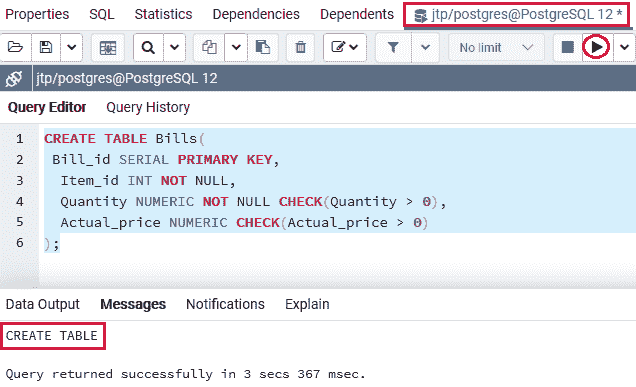

在上面的例子中，我们在 **Item_id** 和 **Quantity** 列的数据类型后使用了 **NOT NULL** 关键字来表示 **NOT NULL** 约束。

**注:**

*   在 PostgreSQL 中，一个列可以包含各种约束，如 CHECK、FOREIGN KEY、UNIQUE KEY 和 **NOT NULL** ，它们紧挨着出现。
*   PostgreSQL 可以以任何顺序控制约束列表，因为约束的顺序并不重要。
*   默认情况下，如果我们不定义**非空或空**，它接受**空值**

## 使用 ALTER TABLE 命令向现有列添加一个 PostgreSQL NOT NULL 约束

在 PostgreSQL 中，我们可以在 **ALTER TABLE** 命令的帮助下，将 **NOT NULL 约束**添加到现有表的列中。

**使用 ALTER table 命令添加非空约束的语法**

下面的 [**【变更表格】**命令](https://www.javatpoint.com/postgresql-alter-table)的图示用于向现有表格中添加一个非空约束:

```sql

ALTER TABLE table_name
ALTER COLUMN column_name 
SET NOT NULL;

```

**或**

如果我们想在不同的列中添加**个非空约束**，我们可以使用下面的语法:

```sql

ALTER TABLE table_name
ALTER COLUMN column_name_1 SET NOT NULL,
ALTER COLUMN column_name_2 SET NOT NULL,
...;

```

### 使用 ALTER TABLE 命令的 PostgreSQL 非空约束示例

为了理解 **PostgreSQL NOT NULL 约束的工作原理，**我们将看到下面的例子，它描述了如何通过 PostgreSQL 中的 **ALTER table** 命令添加一个 **NOT NULL 约束**。

在下面的示例中，我们将创建一个名为*的新表，并将其放入 **Jtp** 数据库。*

 *在创建**订单**表之前，如果 **Jtp** 数据库中存在类似的表，我们将使用 **[DROP TABLE](https://www.javatpoint.com/postgresql-drop-table)** 命令。

```sql

DROP TABLE IF EXISTS Orders;

```

**输出**

执行上述命令后，我们会得到如下窗口消息，显示 ***【订单】*** 表已成功下架。

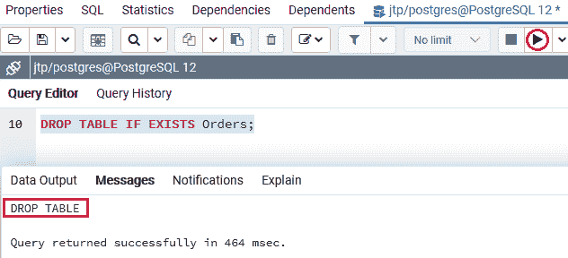

一旦先前创建的 ***【订单】*** 表被删除，我们将创建一个新的 ***【订单】*** 表，该表包含各种列，如**标识、规格、原材料标识、数量、开始标识和结束标识列。**

```sql

CREATE TABLE Orders (
	ID SERIAL PRIMARY KEY,
	Specification VARCHAR (50) NOT NULL,
	Raw_material_id VARCHAR (15),
	Quantity NUMERIC,
	Begin_date DATE,
	End_date DATE
);

```

**输出**

执行上述命令后，我们将获得以下消息:*订单表已成功创建到 **Jtp** 数据库中。*

*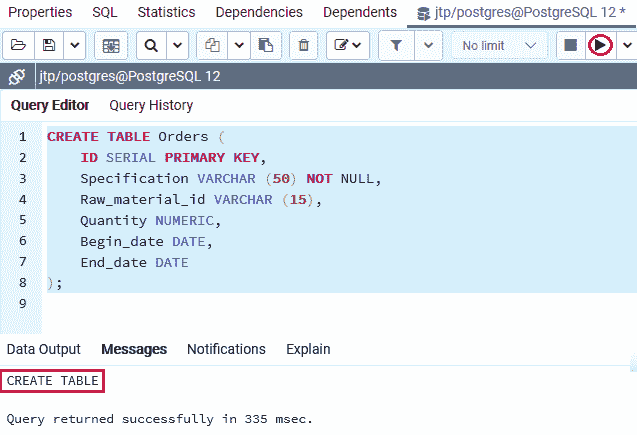

一旦 ***订单*** 表创建成功，我们将在 **INSERT** 命令的帮助下向其中插入一些记录，如下命令所示:

```sql

INSERT INTO Orders (Specification)
VALUES('Make for TCS');

```

**输出**

在执行上述命令时，我们将获得以下消息窗口，该窗口显示**一值**已成功插入到 ***订单*** 表中。

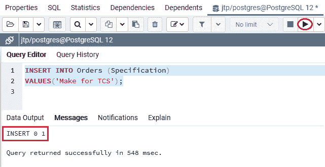

之后，我们可以将**非空约束**添加到**数量**列中，以确保**数量**列不是**空**，尽管该列已经包含一些数据。

要将**非空约束**添加到包含空值的列中，我们将遵循以下步骤。

**第一步**

首先，我们需要将**空更新为非空**，如下语句所示:

```sql

UPDATE Orders
SET Quantity = 1;

```

**输出**

执行以上命令后，我们会得到如下消息窗口，显示 ***订单*** 表已更新成功。

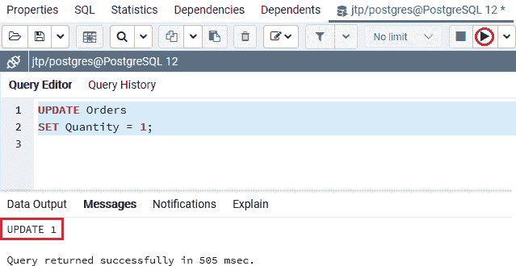

从上面的截图中我们可以看到**数量**列的值更新为 1。

**第二步**

现在，我们将使用 ALTER table 命令将 **NOT NULL 约束**添加到**数量**列，如下面的语句所示:

```sql

ALTER TABLE Orders 
ALTER COLUMN Quantity
SET NOT NULL;

```

**输出**

在执行上述命令时，我们会得到如下消息窗口，显示 ***订单*** 表已修改成功。

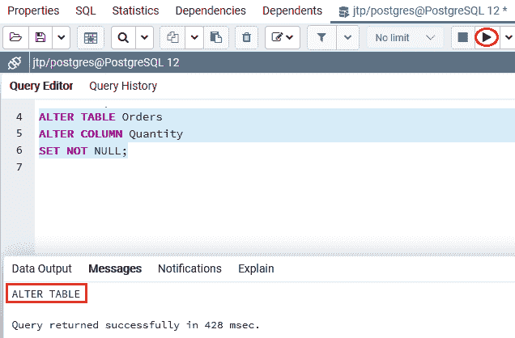

**第三步**

之后，我们将在以下命令的帮助下更新**原材料标识、开始日期和结束日期**列的非空约束:

```sql

UPDATE Orders
SET Raw_material_id = 'PQR',
 Begin_date = '2013-04-08',
 End_date = '2013-04-08';

```

**输出**

我们会得到下面的消息窗口，显示 ***订单*** 表在执行上述命令后已经成功更新:

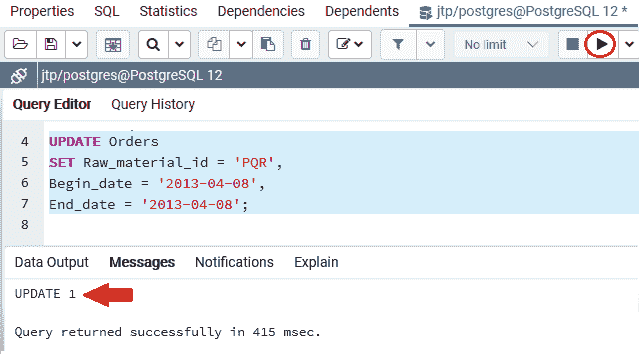

**第四步**

之后，我们将在各列中添加**非空约束**，如下图所示:

```sql

ALTER TABLE Orders 
ALTER COLUMN Raw_material_id SET NOT NULL,
ALTER COLUMN Begin_date SET NOT NULL,
ALTER COLUMN End_date SET NOT NULL;

```

**输出**

在执行上面的命令时，我们将检索下面的消息窗口，它显示特定的表已经被成功修改。

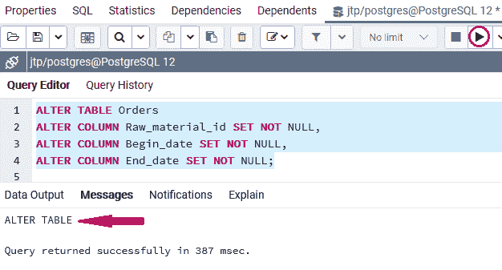

**第五步**

最后，我们将尝试将**数量**列中的值修改为 **NUL** L，因为我们可以观察到以下语句:

```sql

UPDATE Orders
SET Quantity = NULL;

```

**输出**

执行上述命令后，PostgreSQL 发出了以下错误消息:

**错误:“数量”列中的空值违反了非空约束详细信息:失败行包含(1，for TCS 制造，空，2013-04-08，2013-04-08)。**

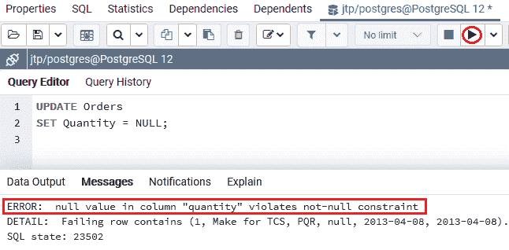

## 非空约束的不同情况

除了 **PostgreSQL Not Null 约束**之外，我们还可以使用一个 **CHECK 约束**强制一列接受 Null 值， **NOT NULL 约束**等于下面的 CHECK 约束:

```sql

CHECK(column IS NOT NULL)

```

让我们看一个理解 PostgreSQL 非空约束特例的示例。

假设我们希望 ***买方*** 表的**登录名或电话号码**列都为**非空**或**为空**。在这种情况下，我们可以使用 **CHECK 约束**。

为此，首先我们将借助[创建表命令的](https://www.javatpoint.com/postgresql-create-table)帮助创建 ***买方*** 表，如下命令所示:

```sql

CREATE TABLE Buyer (
ID serial PRIMARY KEY,
Login_name VARCHAR (40),
Password VARCHAR (40),
Phone_number VARCHAR (40),
CONSTRAINT Login_name_Phone_number_notnull CHECK (
   NOT (
     (Login_name IS NULL OR  Login_name = '' )
     AND
     ( Phone_number IS NULL  OR  Phone_number = '' )
   )
 )
);

```

**输出**

执行上述命令后，我们会得到如下消息窗口，显示 ***【买家】*** 表已成功创建到 **jtp** 数据库中。

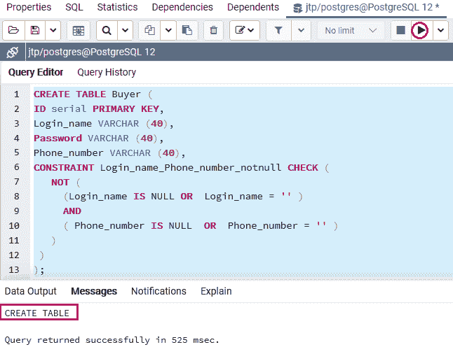

在成功创建新表为 ***【买家】*** 后，我们将在 **INSERT** 命令的帮助下输入一些值。

```sql

INSERT INTO Buyer (Login_name, Phone_number)
VALUES
	('Login1', NULL),
	(NULL, '9876543210'),
	('Login2,'0123456789'),
	('Login3', '');

```

**输出**

执行上述命令后，我们会得到如下消息窗口，显示**四个值**已经成功插入到 ***买家*** 表中。


但是下面的命令将不起作用，因为它中断了**检查约束**:

```sql

INSERT INTO Buyer (Login_name, Phone_number)
VALUES 
(NULL, ''),
(NULL, NULL), 
('', ''),
('', NULL);

```

**输出**

执行上述命令后，PostgreSQL 将引发以下错误:

错误:关系“买方”的新行违反了检查约束“登录名 _ 电话号码 _ 非空”详细信息:失败行包含(5，空，空，)。

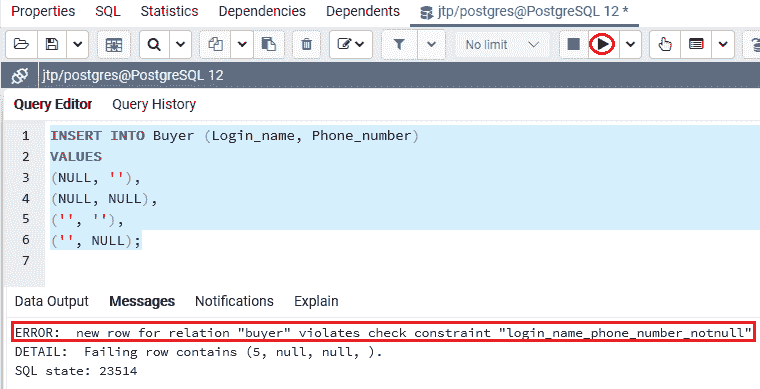

### 概观

在 **PostgreSQL 非空约束**部分，我们学习了以下主题:

*   我们使用了**不为空约束**来确保**一列的值不为空。**
*   我们已经理解了 PostgreSQL NOT NULL 约束的不同情况。
*   为了检查一个值是否为空**，我们使用了**为空**运算符，其中**不为空**拒绝**为空**的输出。**

 *** * ******