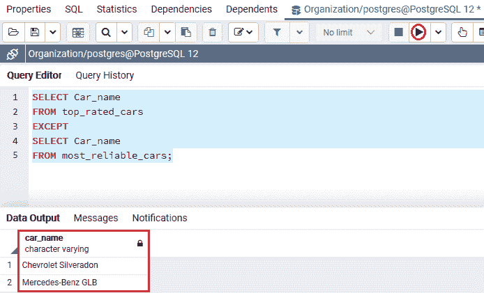
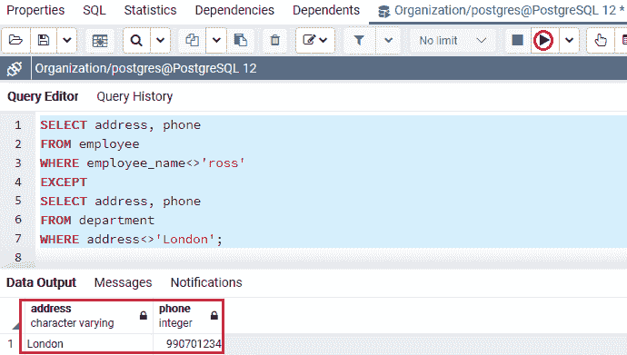

# PostgreSQL EXCEPT

> 原文：<https://www.javatpoint.com/postgresql-except>

在本节中，我们将了解 **PostgreSQL EXCEPT 运算符**的工作原理，该运算符用于返回初始命令中没有出现在第二个命令输出中的行。

以及带有**单个和多个**表达式的 **PostgreSQL 除运算符**的**示例和 **order by 子句**。**

## 什么是 PostgreSQL 除运算符？

在 [PostgreSQL](https://www.javatpoint.com/postgresql-tutorial) 中， **EXCEPT** 运算符用于通过将两个或多个命令的输出相等来检索行，就像 UNION 和 **INTERSECT** 运算符一样。

换句话说，我们可以说 **PostgreSQL EXCEPT** 运算符从**左侧(第一个选择)命令**中检索不同的行，这些行不在**右侧(第二个选择)命令**的结果集中。所有[选择命令](https://www.javatpoint.com/postgresql-select)将定义一个数据集。

**EXCEPT 运算符**将从初始数据集中返回所有记录，然后从第二个数据集中消除所有值。

下图表示最终输出，由 EXCEPT 运算符生成。


在上图中，芥末黄区域代表执行 EXCEPT 命令后检索到的记录。这些记录存在于**圈 P** 而不存在于**圈 Q** 中。

EXCEPT 命令中的每个 **SELECT** 命令必须具有相似数量的具有相似数据类型的输出字段。

### PostgreSQL 除运算符的语法

PostgreSQL 除运算符外的图示如下:

```sql

SELECT expression1, expression2, ... expression_n
FROM table P
[WHERE conditions]
EXCEPT
SELECT expression1, expression2, ... expression_n
FROM table Q
[WHERE conditions];

```

在上面的语法中，我们有以下参数，我们在下表中讨论了这些参数:

| 参数 | 描述 |
| **表达式 1，表达式 2，表达式 _n** | 这些是我们想要在两个 SELECT 命令之间进行比较的列或计算。
并且它们不需要是每个 SELECT 命令中的匹配字段，而等效的列必须包含等效的数据类型。 |
| **表格** | 这些是我们想从中获取记录的表格。 |
| **条件** | 这些是要排序的值必须遇到的条件。它是一个可选参数。 |

## PostgreSQL 除运算符示例

为了了解 **PostgreSQL 除了运算符之外的工作方式，**我们将采用 [PostgreSQL UNION 教程](postgresql-union)中创建的**顶级汽车**和**最可靠汽车**表:

要查看来自**顶级汽车**表的数据，我们将使用**选择**命令，如下命令所示:

```sql

SELECT * FROM top_rated_cars;

```

**输出**

执行上述命令后，我们将得到以下结果:


以下命令从**最可靠汽车**表返回数据:

```sql

SELECT * FROM most_reliable_cars;

```

**输出**

在执行上述命令时，我们将获得以下输出:


*   **PostgreSQL 示例，单表达式除外**

在下面的示例中，我们将使用一个 EXCEPT 运算符，该运算符包含一个具有相似数据类型的字段:

```sql

SELECT Car_name
FROM top_rated_cars
EXCEPT
SELECT Car_name
FROM most_reliable_cars;

```

**输出**

执行上述命令后，我们将获得以下输出:



在上面的例子中，EXCEPT 操作符在 ***【顶级汽车】*** 表中检索所有**汽车名称**值，而不在 ***最可靠汽车*** 表中。

这意味着如果一个**车名**值存在于 ***top_rated_cars*** 表中，并且也存在于 ***最可靠 _cars*** 中，则**车名**值不会出现在 EXCEPT 命令输出中。

### PostgreSQL 示例，除了各种表达式

我们现在将看到一个示例来理解 PostgreSQL，除了操作符处理多个列。

在下面的例子中，我们将使用 PostgreSQL 中的 **Except 运算符**来检索各种列。

为此，我们从**组织**数据库中获取**员工** 和 ***部门*** 表，该数据库是我们在 PostgreSQL 教程的前面部分创建的。

```sql

SELECT address, phone
FROM employee
WHERE employee_name<>'ross'
EXCEPT
SELECT address, phone
FROM department
WHERE address<>'London';

```

**输出**

执行上述命令后，我们将获得以下输出，其中显示了来自*员工表的记录，其中**地址和电话**值与**部门表的地址和电话**值不匹配。*

*

在上面的示例中，Except 运算符命令将检索雇员表的值，该值具有与 ***部门**表的**地址和电话**列*值不匹配的 ***地址、电话*** 值。

*   **PostgreSQL 除了 ORDER BY 子句**

如果我们想要对 EXCEPT 操作符的输出进行排序，我们将 [ORDER BY 子句](https://www.javatpoint.com/postgresql-order-by-clause)放在查询列表的最终命令中。

**PostgreSQL 的语法，除了 ORDER BY 子句**

下图用于表示除了 order by 子句之外的 PostgreSQL:

```sql

SELECT select_list
FROM table1
EXCEPT
SELECT select_list
FROM table2
ORDER BY sort_expression;

```

### 带有 Order by 子句的 PostgreSQL EXCEPT 示例

在下面的例子中，我们使用类似于 ***top_rated_car*** 和 ***最可靠 _cars*** 的表格来理解带有 ORDER BY 子句的 EXCEPT 运算符的用法:

```sql

SELECT * FROM top_rated_cars
EXCEPT
SELECT * FROM most_reliable_cars
ORDER BY Car_name;

```

**输出**

执行上述命令后，我们将得到下面的结果集，该结果集按照由 **ORDER BY Car_name** 表示的升序显示排序后的 **top_rated_cars** 。并且**车名**列字段位于输出中#1 的位置。


在上面的例子中，随后，两个**选择**命令的列名不同。

通过列在输出中的位置来引用 **ORDER BY** 子句中的列更为有益。

### 概观

在 **PostgreSQL 除了**部分，我们学习了以下主题:

*   我们使用了 **PostgreSQL 除运算符**来返回初始命令中没有出现在第二个命令输出中的行。
*   我们也已经理解了 **PostgreSQL 除了**操作符与**单个和多个**的工作方式
*   我们还使用了 **PostgreSQL 除了 ORDER By** 子句来对命令输出进行排序。

* * **