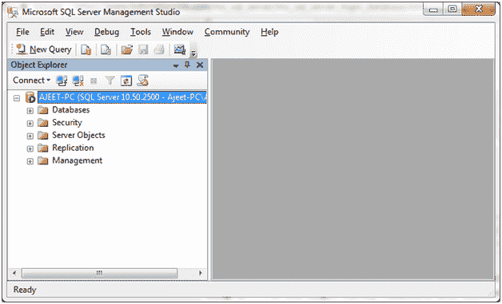
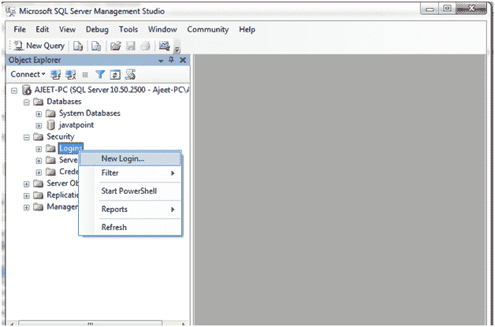
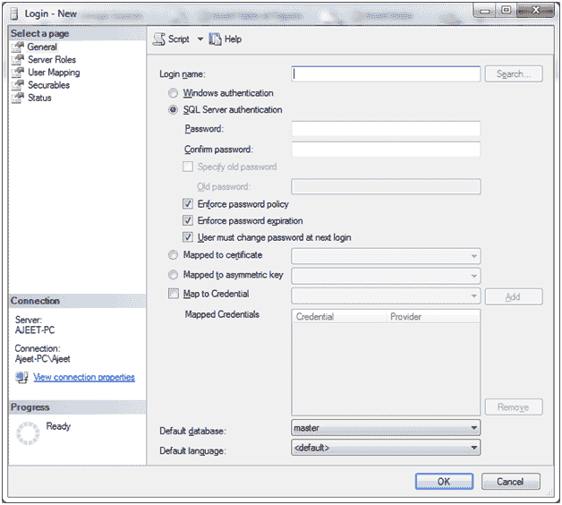

# SQL Server 登录数据库

> 原文：<https://www.javatpoint.com/sql-server-login-database>

SQL Server 登录数据库是一个简单的用于访问 SQL Server 的数据库。

* * *

## 什么是凭证？

凭据只是一个用户名和密码，您可以在登录到 Windows 甚至电子邮件帐户时提供用户名和密码。这个用户名和密码建立了凭证。

SQL Server 提供了四种登录类型:

*   基于 Windows 凭据的登录。
*   特定于 SQL Server 的登录名。
*   映射到证书的登录名。
*   映射到非对称密钥的登录名。

基于 Windows 凭据的登录便于您使用 Windows 用户名和密码登录到 SQL Server。如果要创建自己的凭据(用户名和密码)，可以创建特定于 SQL Server 的登录名。

要创建、更改或删除一个 SQL Server 登录，您可以采用两种方法之一:

*   使用 SQL Server 管理工作室。
*   使用 T-SQL 语句。

## 使用 SQL Server 管理工作室

打开 SQL Server 管理工作室

转到安全性:

 

开放安全。您将看到“登录”。右键单击登录，您将获得“新登录”？

它将打开一个新页面:

您可以在这里设置登录名和密码。