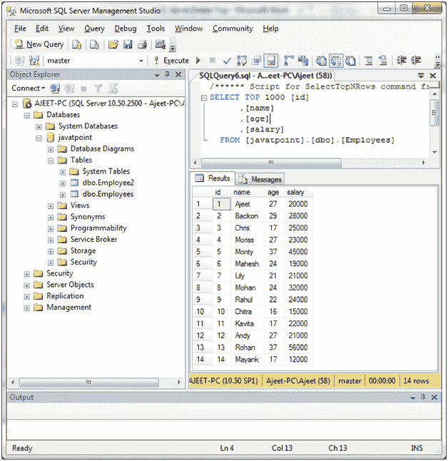
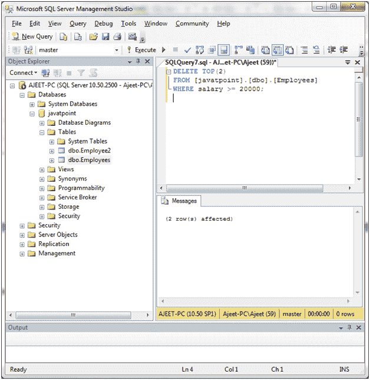
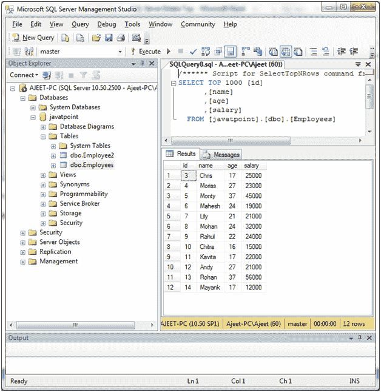
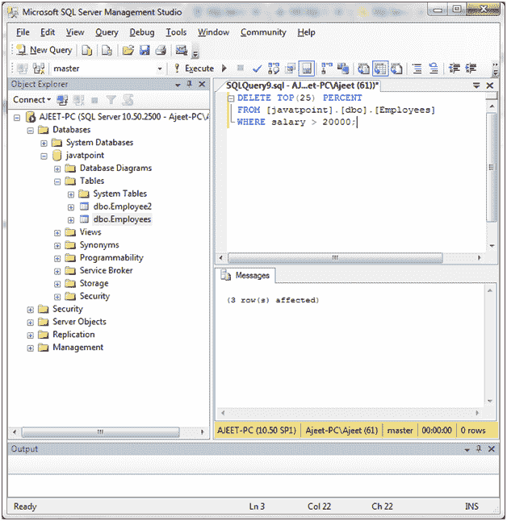
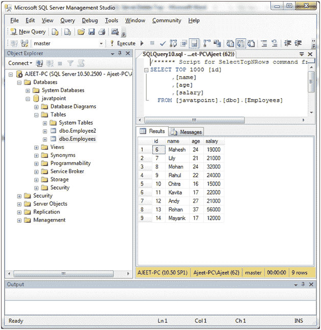

# SQL Server 删除顶级语句

> 原文：<https://www.javatpoint.com/sql-server-delete-top>

在 SQL Server 中，DELETE TOP 语句用于从表中删除记录，并根据固定值或百分比限制删除的记录数。

**语法:**

```

DELETE TOP (top_value) [ PERCENT ] 
FROM [database_name].[dbo].[table_name]
[WHERE conditions]; 

```

## 参数说明

**表:**指定要从中删除记录的表。

**所在条件:**可选。要删除记录必须满足的条件。

**TOP (top_value):** 用于根据 top_value 删除结果集中的前几行。例如，TOP(10)将删除符合删除标准的前 10 行。

**PERCENT:** 可选。它用于删除顶部行的百分比。例如，TOP(10%)PERCENT 将删除符合删除标准的前 10%的记录。

* * *

## 使用 TOP 关键字删除

TOP 关键字与 DELETE 语句一起用于删除表中指定的顶部行。

**示例:**

我们有一个“员工”表，包含以下数据。



从“员工”表中删除薪资大于或等于 20000 的前 2 行。

**语法:**

```

DELETE TOP(2)
FROM [javatpoint].[dbo].[Employees]
WHERE salary >= 20000;

```



可以看到有 2 行受到影响。现在看输出:

输出:



* * *

## 使用最高百分比关键字删除

TOP percent 关键字用于根据百分比删除行。

**示例:**

从薪资大于 20000 的表中删除前 25%的行。

```

DELETE TOP(25) PERCENT
FROM [javatpoint].[dbo].[Employees]
WHERE salary > 20000; 

```



可以看到有 3 行受到影响。3 正好是插入行数 12 的 25%。

输出:



* * *