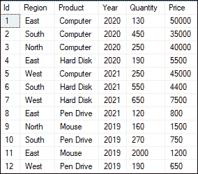
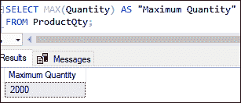
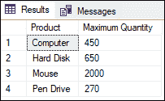
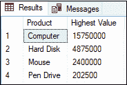
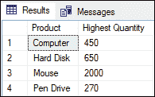

# SQL Server MAX()函数

> 原文：<https://www.javatpoint.com/sql-server-max-function>

SQL Server 中的 MAX()函数是一种聚合函数。用于获取指定列或表达式的一组值中的**最大值或最大值。它是 SQL Server 中最常用的内置函数。该函数接受单个参数，该参数可以是列或有效表达式，并返回单个结果来汇总输入数据集。它还可以与 WHERE 子句、GROUP BY 子句、ORDER BY 子句和 HAVING 子句一起工作，以获得过滤后的结果。**

### 句法

以下语法解释了 SQL Server 中的 MAX()函数:

```

SELECT MAX ( DISTINCT aggregate_expression)  
FROM table_name(s)  
[WHERE conditions];

```

功能参数解释如下:

**aggregate_expression:** 是表示从中返回最大值的列名的必需表达式。

**表名:**它表示我们要从中检索列的表的名称。可以指定多个表。

**WHERE 条件:**定义条件过滤列或表达式是一个可选子句。

**DISTINCT:** 返回表达式中最大的唯一值。但是，它不影响 MAX()函数，并且在不使用此关键字的情况下会产生相同的结果。

#### 注意:MAX()函数忽略空值。当没有找到行时，它返回空值。

### MAX()函数示例

借助各种示例，让我们了解最大值函数在 SQL Server 中的使用。假设我们的数据库有一个名为“ **ProductQty** ”的表，其中包含以下数据:



**示例 1:** 本示例使用 MAX()函数获取 ProductQty 表中已售出产品的最大数量:

```

SELECT MAX(Quantity) AS "Maximum Quantity" FROM ProductQty;

```

该语句显示了以下输出，其中我们看到了最大销售产品数量:



**示例 2:** 本示例使用带有 MAX()函数的 **WHERE** **子句**。该子句用于从表中筛选记录。当我们想要获得销量最高的产品名称时，它非常有用。请参见以下声明:

```

SELECT Product, Quantity, Price
FROM ProductQty
WHERE Quantity = (
SELECT MAX(Quantity) AS "Maximum Quantity" 
FROM ProductQty); 

```

这里，SQL Server 首先计算使用 MAX()函数的子查询，然后外部查询显示其数量等于子查询结果的产品名称。当我们执行该语句时，我们将看到所需的输出:


**示例 3:** 本示例使用带有 MAX()函数的 **GROUP BY 子句**。GROUP BY 子句从多行收集数据，并根据指定的列对它们进行分组。例如，我们可以使用下面的语句从每个产品组的 ProductQty 表中获取所有行中的最大数量。

```

SELECT Product, MAX(Quantity) AS "Maximum Quantity" 
FROM ProductQty
GROUP BY Product
ORDER BY Product;

```

执行该语句将显示每个产品的最大数量:



**示例 4:** 本示例使用带有 MAX()函数的 **HAVING 子句**。我们总是使用 HAVING 子句和 GROUP BY 子句来过滤分组的记录。例如，如果我们想获得大于 300 的已售出产品名称的最大数量，可以使用以下语句:

```

SELECT Product, MAX(Quantity) AS "Maximum Quantity" 
FROM ProductQty
GROUP BY Product
HAVING MAX(Quantity)>300;

```

执行该语句将返回以下输出:


**示例 5:** 本示例使用包含两列的 MAX()函数来获得最高的结果输出:

```

SELECT Product, MAX(Quantity * Price) AS "Highest Value" 
FROM ProductQty
GROUP BY Product; 

```

当我们执行该语句时，它将从产品数量表中返回每个产品的最高值(数量*价格):



**示例 6:** 本示例使用带有 MAX()函数的 **DISTINCT 和 OVER()** 子句。我们使用 DISTINCT 子句来获取唯一的数据，OVER 子句确定查询中的哪些行被应用到函数，函数以什么顺序计算它们，以及函数的计算应该在什么时候重新开始。

```

SELECT DISTINCT Product, 
MAX(Quantity) OVER (PARTITION BY Product) AS "Highest Quantity"  
FROM ProductQty; 

```

该语句返回以下输出:



**示例 7:** 本示例对字符数据使用 MAX()函数。假设我们已经考虑了系统数据库，并希望获得按字母顺序对姓氏进行排序的数据库名称。我们可以这样写:

```

SELECT MAX(name) AS DBNAME FROM sys.databases WHERE database_id<5;

```

结果如下:


### 结论

本文将解释 SQL Server 中 MAX()函数的完整概述。在这里，我们已经学习了如何在 WHERE、GROUP BY、HAVING 和 OVER 子句的帮助下从表中获取最高值。

* * *