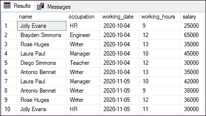
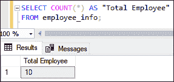
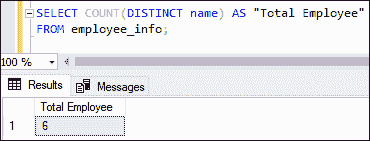
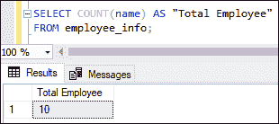
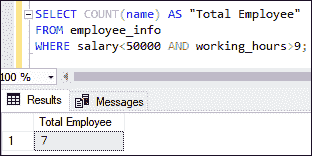
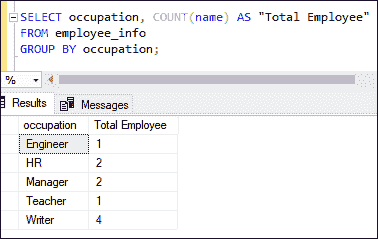
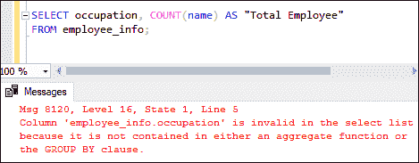
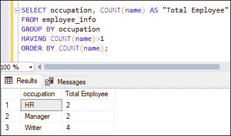

# SQL Server 计数()函数

> 原文：<https://www.javatpoint.com/sql-server-count-function>

SQL Server 中的 COUNT()函数是聚合函数**的一部分，用于计算表**中存在的总行数。当结果集没有任何行时，返回**空值**。它通常与 SELECT 语句一起使用，返回类型为 **INT** 。

COUNT()是一个内置函数，它接受一个可以是列或有效表达式的参数，并返回一个结果来汇总输入数据集。该函数不会忽略空值，因为它在计算查询结果时也会考虑它们。它还可以与 WHERE 子句、GROUP BY 子句、ORDER BY 子句和 HAVING 子句一起工作，以获得过滤后的结果。

### 句法

SQL Server 中 COUNT()函数的语法如下:

```

SELECT COUNT(expression)  
FROM table_name(s)  
[WHERE conditions];

```

该函数包含以下参数:

**表达式:**是表示列名的必选表达式，其非空值将被计数。

**表名:**表示我们要从中检索记录的表的名称。可以指定多个表。

**WHERE 条件:**定义一个应满足待选记录的条件是一个可选子句。

**SQL Server 允许我们以下面列出的三种形式使用计数函数:**

1.  **COUNT(*):** 它与 SELECT 语句一起使用，以获取结果集中存在的总行数。结果集可以包含非空、空和重复的行。
2.  **COUNT(ALL 表达式):**此函数用于获取表中存在的不包含空行的行的总数。
3.  **COUNT(DISTINCT 表达式):**此函数仅用于计算表中存在的唯一行数，不包含空值。

### 计数()函数示例

借助各种示例，让我们了解 COUNT()函数在 SQL Server 中是如何工作的。我们将以“**employee _ info”**表来实际演示 COUNT 函数。此表包含以下数据:



### 计数函数的基本示例

这个例子解释了 COUNT 函数的基本用法。它显示表中存在的总行数，包括 null、非 null 和重复。假设我们要计算给定表格中列出的员工总数。我们可以编写如下查询:

```

SELECT COUNT(*) AS "Total Employee" FROM employee_info;

```

执行查询将返回以下输出:



### 带有非重复子句的计数函数

DISTINCT 关键字**仅考虑表的唯一数据**。假设我们要计算 employee_info 表中列出的唯一员工总数。我们可以编写如下查询:

```

SELECT COUNT(DISTINCT name) AS "Total Employee" 
FROM employee_info; 

```

执行查询将返回以下输出，该输出仅显示表中唯一员工的数量:



另一个例子是使用 COUNT(表达式)函数计算 employee_info 表中非空值的总数:

```

SELECT COUNT(name) AS "Total Employee" 
FROM employee_info;

```

此语句将计算所有员工，因为没有找到空记录:



### 带 WHERE 子句的计数函数

WHERE 子句用于**过滤表的记录**。本示例将使用带有 COUNT()函数的 WHERE 子句返回工资低于 50000 且工作时间大于 9 的员工总数。

```

SELECT COUNT(name) AS "Total Employee" 
FROM employee_info
WHERE salary<50000 AND working_hours>9;

```

当我们执行查询时，我们看到七名员工的工资低于 5 万，工作时间大于 9:



### 带有分组依据子句的计数函数

GROUP BY 子句用于**将具有相同值**的行分组为汇总行。在聚合函数中，生成摘要报告非常有用。下面的查询将使用 COUNT()函数**来统计每个职业的员工总数:**

```

SELECT occupation, COUNT(name) AS "Total Employee" 
FROM employee_info
GROUP BY occupation;

```

执行查询将返回与每个职业相关联的员工人数:



如果我们试图在 SELECT 语句中组合**聚合和非聚合**列，我们将会得到一个错误。以下是错误消息:



### 带 ORDER BY 子句的计数函数

ORDER BY 子句允许我们以升序或降序显示表格。下面的示例将使用带有 ORDER BY 子句的 COUNT()函数，计算每个职业的员工总数，然后根据员工数量按升序对结果集进行排序:

```

SELECT occupation, COUNT(name) AS "Total Employee" 
FROM employee_info
GROUP BY occupation
ORDER BY COUNT(name);

```

执行该语句将按员工人数的升序显示结果:


### 带 HAVING 子句的计数函数

HAVING 子句用于**过滤分组的行**。我们必须在 HAVING 子句中使用 GROUP BY 子句。本示例将 HAVING 子句与 COUNT()函数结合使用。它统计每个职业的员工人数，然后检查合计数是否大于 1。如果这是真的，相应的记录将按照员工数量的升序返回:

```

SELECT occupation, COUNT(name) AS "Total Employee" 
FROM employee_info
GROUP BY occupation
HAVING COUNT(name)>1
ORDER BY COUNT(name);

```

执行该语句将返回每个职业中多于一个的员工数量:



### 带 OVER()的计数功能

OVER()子句确定查询中的哪些行应用于函数，函数对它们进行求值的顺序，以及函数的计算应该在什么时候重新开始。以下查询提供了 **employee_info** 表中每个职业的累计员工总数，并按升序组织输出:

```

SELECT DISTINCT occupation, 
COUNT(name) OVER (PARTITION BY occupation) AS "Total Employee"
FROM employee_info
ORDER BY "Total Employee";

```

执行查询将返回以下结果:


### COUNT()与 COUNT_BIG()函数有何不同？

SQL Server 中的 COUNT 和 COUNT_BIG 函数本质上做了同样的事情，即计算表中出现的项目数。但有时我们会为应用程序在它们之间做出选择。在这种情况下，我们可能更喜欢基于数据类型的应用程序。

COUNT()函数**将结果作为 INT** 返回，而 COUNT_BIG()函数**将结果作为 BIGINT 数据类型**返回。因此，如果我们有一个包含数百万条记录的表，并且我们需要获得这些记录的计数，那么 count()函数会给出一个错误，但是 COUNT_BIG()函数会显示这样的结果。

它们之间的另一个主要区别是在视图上创建索引时。COUNT()不允许在视图上创建聚集索引。但是，当我们使用 COUNT_BIG()函数时，我们可以在视图上创建聚集索引。

### 结论

本文将解释如何以及何时在 SQL Server 中使用 COUNT()函数的完整概述。我们在使用这个函数时必须小心，因为它只适用于数字数据类型。在这里，我们讨论了基于 COUNT 函数的几个用例的各种示例，例如如何使用 WHERE、GROUP BY、HAVING 和 OVER 子句获取表中出现的项目总数。

* * *