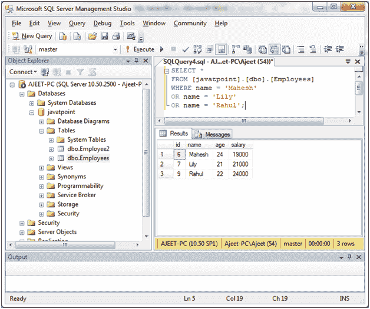
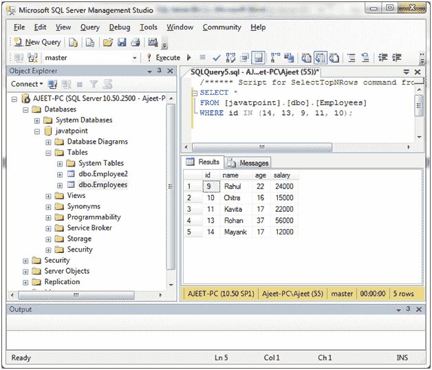
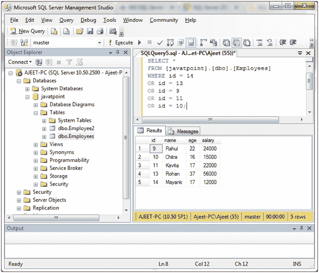
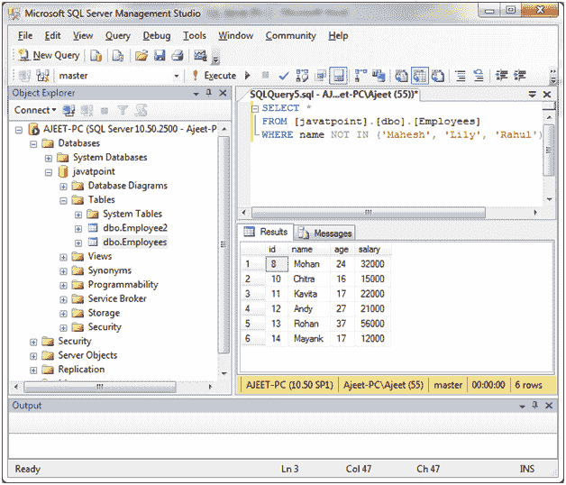

# SQL Server IN()运算符

> 原文：<https://www.javatpoint.com/sql-server-in-operator>

SQL Server IN 条件用于避免在 SELECT、INSERT、UPDATE 或 DELETE 语句中出现多个 OR 条件。

**语法**

```

expression IN (value1, value2, .... value_n); 

```

## 参数说明

**表达式:**指定要测试的值。

**值 1，值 2，..value_n:** 它指定要针对表达式进行测试的值。

#### 注意:SQL Server IN 条件也称为 SQL Server IN 运算符。

* * *

## 带字符串值的输入条件

使用输入条件比较字符串值的 SQL Server SELECT 语句:

```

SELECT *
FROM [javatpoint].[dbo].[Employees]
WHERE name IN ('Mahesh', 'Lily', 'Rahul'); 

```

输出:


**或**

```

SELECT *
FROM [javatpoint].[dbo].[Employees]
WHERE name = 'Mahesh'
OR name = 'Lily'
OR name = 'Rahul';

```

输出:



* * *

## 数值输入条件

使用输入条件比较数值的 SQL Server SELECT 语句:

```

SELECT *
FROM [javatpoint].[dbo].[Employees]
WHERE id IN (14, 13, 9, 11, 10); 

```

输出:



**或**

```

SELECT *
FROM [javatpoint].[dbo].[Employees]
WHERE id = 14
OR id = 13
OR id = 9
OR id = 11
OR id = 10; 

```

输出:



* * *

## 在使用非运算符的情况下

使用带非运算符的输入条件的 SQL Server SELECT 语句:

```

SELECT *
FROM [javatpoint].[dbo].[Employees]
WHERE name NOT IN ('Mahesh', 'Lily', 'Rahul'); 

```

输出:



**或**

```

SELECT *
FROM [javatpoint].[dbo].[Employees]
WHERE name <> 'Mahesh'
AND  name <> 'Lily'
AND name <> 'Rahul';

```

输出:

