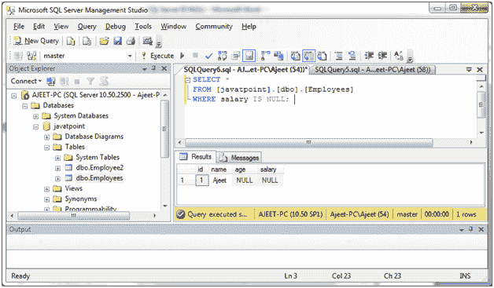
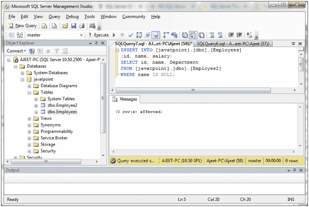
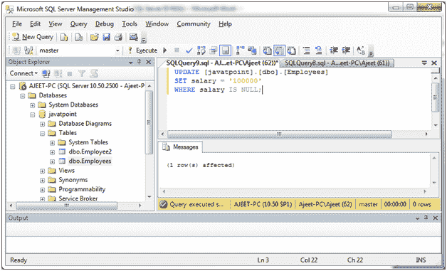
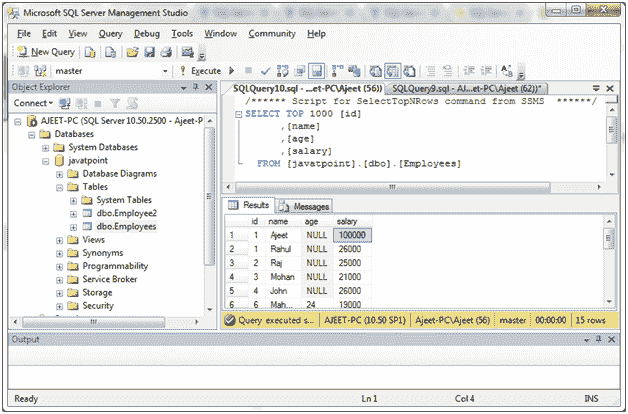
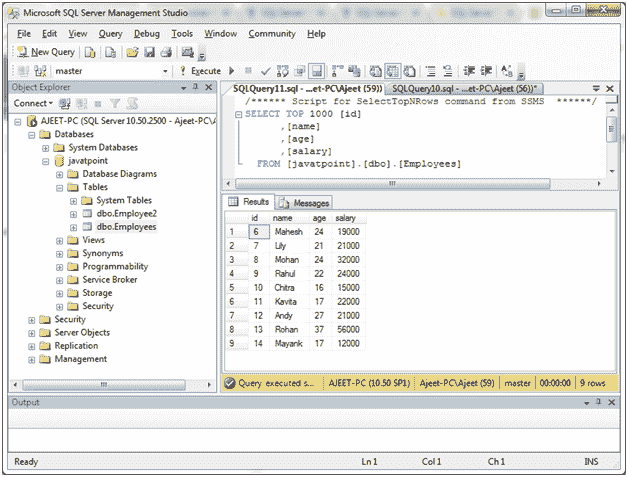

# SQL Server 为空条件(运算符)

> 原文：<https://www.javatpoint.com/sql-server-is-null-operator>

SQL Server 为空运算符用于测试空值。

**语法:**

```

expression IS NULL

```

## 参数说明

**表达式:**指定一个值是否为空。

#### 注意:

*   If the expression is null, the condition evaluates to true.

*   If the expression is not null, the condition evaluates to false.

* * *

## 带有选择语句的运算符为空

**示例:**

```

SELECT *
FROM [javatpoint].[dbo].[Employees]
WHERE salary IS NULL;

```

输出:



* * *

## 带有插入语句的运算符为空

**示例:**

```

INSERT INTO [javatpoint].[dbo].[Employees]
(id, name, salary)
SELECT id, name, Department
FROM [javatpoint].[dbo].[Employee2]
WHERE name IS NULL;

```

输出:



#### 注意:这将显示“受影响的 0 行”，因为“员工”表中的名称中没有空值。

* * *

## 更新语句为空运算符

**示例:**

更新“员工”表中员工的工资，如果工资为空，则设置为 100000。

```

UPDATE Employees
SET salary = '100000'
WHERE salary IS NULL; 

```

输出:



您可以使用 SELECT 查询来验证它:



* * *

## 带有删除语句的运算符为空

从“员工”表中删除年龄为空的员工。

**示例:**

```

DELETE FROM [javatpoint].[dbo].[Employees]
WHERE age IS NULL; 

```

输出:


您可以使用 SELECT 查询来验证它:



您可以看到在上表中年龄没有空值。